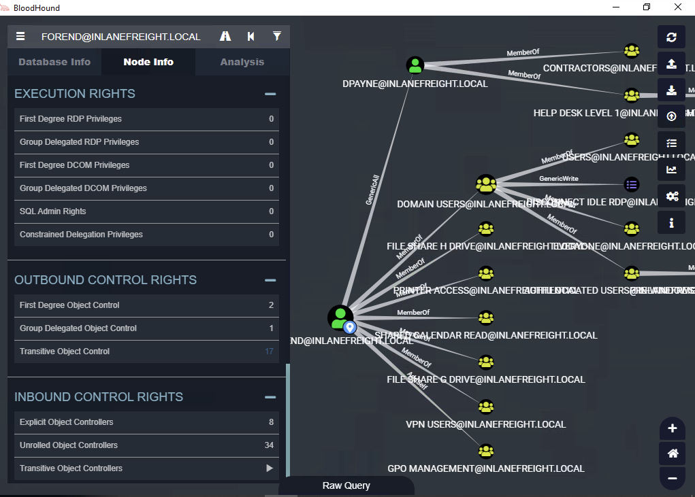

# ACL Enumeration
## Enumerating ACLs with PowerView
### Using Get-DomainObjectACL

```pwsh
PS C:\htb> Import-Module .\PowerView.ps1
PS C:\htb> $sid = Convert-NameToSid wley
PS C:\htb> Get-DomainObjectACL -Identity * | ? {$_.SecurityIdentifier -eq $sid}

ObjectDN               : CN=Dana Amundsen,OU=DevOps,OU=IT,OU=HQ-NYC,OU=Employees,OU=Corp,DC=INLANEFREIGHT,DC=LOCAL
ObjectSID              : S-1-5-21-3842939050-3880317879-2865463114-1176
ActiveDirectoryRights  : ExtendedRight
ObjectAceFlags         : ObjectAceTypePresent
ObjectAceType          : 00299570-246d-11d0-a768-00aa006e0529
InheritedObjectAceType : 00000000-0000-0000-0000-000000000000
BinaryLength           : 56
AceQualifier           : AccessAllowed
IsCallback             : False
OpaqueLength           : 0
AccessMask             : 256
SecurityIdentifier     : S-1-5-21-3842939050-3880317879-2865463114-1181
AceType                : AccessAllowedObject
AceFlags               : ContainerInherit
IsInherited            : False
InheritanceFlags       : ContainerInherit
PropagationFlags       : None
AuditFlags             : None
```

> Note that this command will take a while to run, especially in a large environment. It may take 1-2 minutes to get a result in our lab.

We could Google for the GUID value `00299570-246d-11d0-a768-00aa006e0529` and uncover this page showing that the user has the right to force change the other user's password.

> Note that if PowerView has already been imported, the cmdlet shown below will result in an error. Therefore, we may need to run it from a new PowerShell session.

### Performing a Reverse Search & Mapping to a GUID Value

```pwsh
PS C:\htb> $guid= "00299570-246d-11d0-a768-00aa006e0529"
PS C:\htb> Get-ADObject -SearchBase "CN=Extended-Rights,$((Get-ADRootDSE).ConfigurationNamingContext)" -Filter {ObjectClass -like 'ControlAccessRight'} -Properties * |Select Name,DisplayName,DistinguishedName,rightsGuid| ?{$_.rightsGuid -eq $guid} | fl

Name              : User-Force-Change-Password
DisplayName       : Reset Password
DistinguishedName : CN=User-Force-Change-Password,CN=Extended-Rights,CN=Configuration,DC=INLANEFREIGHT,DC=LOCAL
rightsGuid        : 00299570-246d-11d0-a768-00aa006e0529
```

### Using the -ResolveGUIDs Flag
Skip the above 2 commands and just use this:

```pwsh
PS C:\htb> Get-DomainObjectACL -ResolveGUIDs -Identity * | ? {$_.SecurityIdentifier -eq $sid} 

AceQualifier           : AccessAllowed
ObjectDN               : CN=Dana Amundsen,OU=DevOps,OU=IT,OU=HQ-NYC,OU=Employees,OU=Corp,DC=INLANEFREIGHT,DC=LOCAL
ActiveDirectoryRights  : ExtendedRight
ObjectAceType          : User-Force-Change-Password
ObjectSID              : S-1-5-21-3842939050-3880317879-2865463114-1176
InheritanceFlags       : ContainerInherit
BinaryLength           : 56
AceType                : AccessAllowedObject
ObjectAceFlags         : ObjectAceTypePresent
IsCallback             : False
PropagationFlags       : None
SecurityIdentifier     : S-1-5-21-3842939050-3880317879-2865463114-1181
AccessMask             : 256
AuditFlags             : None
IsInherited            : False
AceFlags               : ContainerInherit
InheritedObjectAceType : All
OpaqueLength           : 0
```

### Another way
#### Creating a List of Domain Users

```pwsh
PS C:\htb> Get-ADUser -Filter * | Select-Object -ExpandProperty SamAccountName > ad_users.txt
```

#### A Useful foreach Loop

```pwsh
PS C:\htb> foreach($line in [System.IO.File]::ReadLines("C:\Users\htb-student\Desktop\ad_users.txt")) {get-acl  "AD:\$(Get-ADUser $line)" | Select-Object Path -ExpandProperty Access | Where-Object {$_.IdentityReference -match 'INLANEFREIGHT\\wley'}}

Path                  : Microsoft.ActiveDirectory.Management.dll\ActiveDirectory:://RootDSE/CN=Dana 
                        Amundsen,OU=DevOps,OU=IT,OU=HQ-NYC,OU=Employees,OU=Corp,DC=INLANEFREIGHT,DC=LOCAL
ActiveDirectoryRights : ExtendedRight
InheritanceType       : All
ObjectType            : 00299570-246d-11d0-a768-00aa006e0529
InheritedObjectType   : 00000000-0000-0000-0000-000000000000
ObjectFlags           : ObjectAceTypePresent
AccessControlType     : Allow
IdentityReference     : INLANEFREIGHT\wley
IsInherited           : False
InheritanceFlags      : ContainerInherit
PropagationFlags      : None
```

### Further enumeration of Rights

```pwsh
PS C:\htb> $sid2 = Convert-NameToSid damundsen
PS C:\htb> Get-DomainObjectACL -ResolveGUIDs -Identity * | ? {$_.SecurityIdentifier -eq $sid2} -Verbose

AceType               : AccessAllowed
ObjectDN              : CN=Help Desk Level 1,OU=Security Groups,OU=Corp,DC=INLANEFREIGHT,DC=LOCAL
ActiveDirectoryRights : ListChildren, ReadProperty, GenericWrite
OpaqueLength          : 0
ObjectSID             : S-1-5-21-3842939050-3880317879-2865463114-4022
InheritanceFlags      : ContainerInherit
BinaryLength          : 36
IsInherited           : False
IsCallback            : False
PropagationFlags      : None
SecurityIdentifier    : S-1-5-21-3842939050-3880317879-2865463114-1176
AccessMask            : 131132
AuditFlags            : None
AceFlags              : ContainerInherit
AceQualifier          : AccessAllowed
```

Now we can see that our user `damundsen` has `GenericWrite` privileges over the `Help Desk Level 1` group. This means, among other things, that we can add any user (or ourselves) to this group and inherit any rights that this group has applied to it.

### Investigating the Help Desk Level 1 Group with Get-DomainGroup

Let's look and see if this group is nested into any other groups, remembering that nested group membership will mean that any users in group A will inherit all rights of any group that group A is nested into (a member of). A quick search shows us that the `Help Desk Level 1` group is nested into the `Information Technology` group, meaning that we can obtain any rights that the `Information Technology` group grants to its members if we just add ourselves to the `Help Desk Level 1` group where our user `damundsen` has `GenericWrite` privileges.

```pwsh
PS C:\htb> Get-DomainGroup -Identity "Help Desk Level 1" | select memberof

memberof                                                                      
--------                                                                      
CN=Information Technology,OU=Security Groups,OU=Corp,DC=INLANEFREIGHT,DC=LOCAL
```

### Investigating the Information Technology Group

```pwsh
PS C:\htb> $itgroupsid = Convert-NameToSid "Information Technology"
PS C:\htb> Get-DomainObjectACL -ResolveGUIDs -Identity * | ? {$_.SecurityIdentifier -eq $itgroupsid} -Verbose

AceType               : AccessAllowed
ObjectDN              : CN=Angela Dunn,OU=Server Admin,OU=IT,OU=HQ-NYC,OU=Employees,OU=Corp,DC=INLANEFREIGHT,DC=LOCAL
ActiveDirectoryRights : GenericAll
OpaqueLength          : 0
ObjectSID             : S-1-5-21-3842939050-3880317879-2865463114-1164
InheritanceFlags      : ContainerInherit
BinaryLength          : 36
IsInherited           : False
IsCallback            : False
PropagationFlags      : None
SecurityIdentifier    : S-1-5-21-3842939050-3880317879-2865463114-4016
AccessMask            : 983551
AuditFlags            : None
AceFlags              : ContainerInherit
AceQualifier          : AccessAllowed
```

### Looking for Interesting Access

```pwsh
PS C:\htb> $adunnsid = Convert-NameToSid adunn 
PS C:\htb> Get-DomainObjectACL -ResolveGUIDs -Identity * | ? {$_.SecurityIdentifier -eq $adunnsid} -Verbose

AceQualifier           : AccessAllowed
ObjectDN               : DC=INLANEFREIGHT,DC=LOCAL
ActiveDirectoryRights  : ExtendedRight
ObjectAceType          : DS-Replication-Get-Changes-In-Filtered-Set
ObjectSID              : S-1-5-21-3842939050-3880317879-2865463114
InheritanceFlags       : ContainerInherit
BinaryLength           : 56
AceType                : AccessAllowedObject
ObjectAceFlags         : ObjectAceTypePresent
IsCallback             : False
PropagationFlags       : None
SecurityIdentifier     : S-1-5-21-3842939050-3880317879-2865463114-1164
AccessMask             : 256
AuditFlags             : None
IsInherited            : False
AceFlags               : ContainerInherit
InheritedObjectAceType : All
OpaqueLength           : 0

AceQualifier           : AccessAllowed
ObjectDN               : DC=INLANEFREIGHT,DC=LOCAL
ActiveDirectoryRights  : ExtendedRight
ObjectAceType          : DS-Replication-Get-Changes
ObjectSID              : S-1-5-21-3842939050-3880317879-2865463114
InheritanceFlags       : ContainerInherit
BinaryLength           : 56
AceType                : AccessAllowedObject
ObjectAceFlags         : ObjectAceTypePresent
IsCallback             : False
PropagationFlags       : None
SecurityIdentifier     : S-1-5-21-3842939050-3880317879-2865463114-1164
AccessMask             : 256
AuditFlags             : None
IsInherited            : False
AceFlags               : ContainerInherit
InheritedObjectAceType : All
OpaqueLength           : 0

<SNIP>
```

The output above shows that our adunn user has `DS-Replication-Get-Changes` and `DS-Replication-Get-Changes-In-Filtered-Set` rights over the domain object. This means that this user can be leveraged to perform a `DCSync` attack. 

## Enumerating ACLs with BloodHound


## Questions
RDP to **10.129.43.171** (ACADEMY-EA-MS01), with user `htb-student` and password `Academy_student_AD!`
1. What is the rights GUID for User-Force-Change-Password? **Answer: 00299570-246d-11d0-a768-00aa006e0529**
2. What flag can we use with PowerView to show us the ObjectAceType in a human-readable format during our enumeration? **Answer: ResolveGUIDs**
3. What privileges does the user damundsen have over the Help Desk Level 1 group? **Answer: GenericWrite**
4. Using the skills learned in this section, enumerate the ActiveDirectoryRights that the user forend has over the user dpayne (Dagmar Payne). **Answer: GenericAll**
   - `PS C:\htb> .\SharpHound.exe -c All --zipfilename ILFREIGHT` → Run the SharpHound collector to gather domain informations to a zip file
   - Upload that zip file to Bloodhound and under Node info search for user `forend` and pick `OUTBOUND CONTROL RIGHTS > Transitive Object Control` to view forend - dpayne relationship:
        
   - Or we can use this section's skill of Get-DomainObjectACL:
        ```pwsh
        PS C:\Tools> Import-Module .\PowerView.ps1
        PS C:\Tools> $sid = Convert-NameToSid forend
        PS C:\Tools> Get-DomainObjectAcl -ResolveGUIDs -Identity * | ? {$_.SecurityIdentifier -eq $sid}
        AceType               : AccessAllowed
        ObjectDN              : CN=Dagmar Payne,OU=HelpDesk,OU=IT,OU=HQ-NYC,OU=Employees,OU=Corp,DC=INLANEFREIGHT,DC=LOCAL
        ActiveDirectoryRights : GenericAll
        OpaqueLength          : 0
        ObjectSID             : S-1-5-21-3842939050-3880317879-2865463114-1152
        InheritanceFlags      : ContainerInherit
        BinaryLength          : 36
        IsInherited           : False
        IsCallback            : False
        PropagationFlags      : None
        SecurityIdentifier    : S-1-5-21-3842939050-3880317879-2865463114-5614
        AccessMask            : 983551
        AuditFlags            : None
        AceFlags              : ContainerInherit
        AceQualifier          : AccessAllowed
        ```
5. What is the ObjectAceType of the first right that the forend user has over the GPO Management group? (two words in the format Word-Word) **Answer: Self-Membership**
   - Search for forend rights over GPO Management group with GUID resolution
        ```pwsh
        PS C:\Tools> Import-Module .\PowerView.ps1
        PS C:\Tools> $sid = Convert-NameToSid forend
        PS C:\Tools> Get-DomainObjectAcl -ResolveGUIDs -Identity "GPO Management" | ? {$_.SecurityIdentifier -eq $sid}


        AceQualifier           : AccessAllowed
        ObjectDN               : CN=GPO Management,OU=Security Groups,OU=Corp,DC=INLANEFREIGHT,DC=LOCAL
        ActiveDirectoryRights  : Self
        ObjectAceType          : Self-Membership
        ObjectSID              : S-1-5-21-3842939050-3880317879-2865463114-4046
        InheritanceFlags       : ContainerInherit
        BinaryLength           : 56
        AceType                : AccessAllowedObject
        ObjectAceFlags         : ObjectAceTypePresent
        IsCallback             : False
        PropagationFlags       : None
        SecurityIdentifier     : S-1-5-21-3842939050-3880317879-2865463114-5614
        AccessMask             : 8
        AuditFlags             : None
        IsInherited            : False
        AceFlags               : ContainerInherit
        InheritedObjectAceType : All
        OpaqueLength           : 0

        AceType               : AccessAllowed
        ObjectDN              : CN=GPO Management,OU=Security Groups,OU=Corp,DC=INLANEFREIGHT,DC=LOCAL
        ActiveDirectoryRights : ReadProperty, WriteProperty, GenericExecute
        OpaqueLength          : 0
        ObjectSID             : S-1-5-21-3842939050-3880317879-2865463114-4046
        InheritanceFlags      : ContainerInherit
        BinaryLength          : 36
        IsInherited           : False
        IsCallback            : False
        PropagationFlags      : None
        SecurityIdentifier    : S-1-5-21-3842939050-3880317879-2865463114-5614
        AccessMask            : 131124
        AuditFlags            : None
        AceFlags              : ContainerInherit
        AceQualifier          : AccessAllowed
        ```