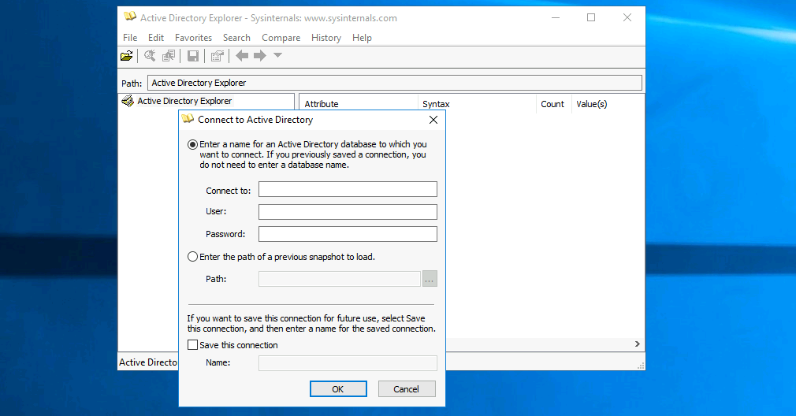
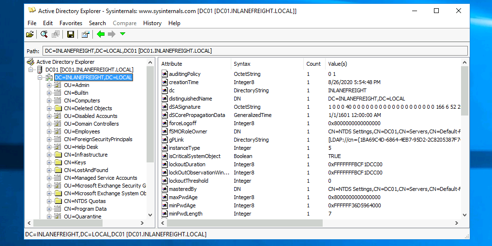
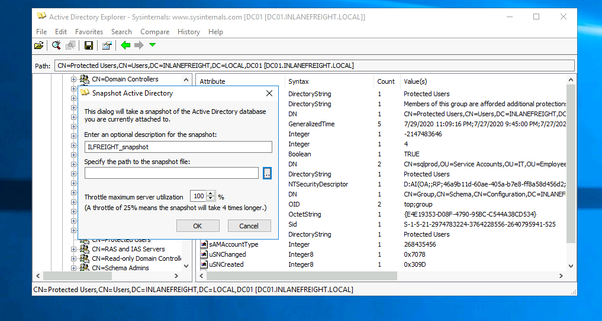

# Hardening Active Directory
## Protected Users Group
This group can be used to restrict what members of this privileged group can do in a domain. Adding users to Protected Users prevents user credentials from being abused if left in memory on a host.

```pwsh
PS C:\Users\htb-student> Get-ADGroup -Identity "Protected Users" -Properties Name,Description,Members


Description       : Members of this group are afforded additional protections against authentication security threats.
                    See http://go.microsoft.com/fwlink/?LinkId=298939 for more information.
DistinguishedName : CN=Protected Users,CN=Users,DC=INLANEFREIGHT,DC=LOCAL
GroupCategory     : Security
GroupScope        : Global
Members           : {CN=sqlprod,OU=Service Accounts,OU=IT,OU=Employees,DC=INLANEFREIGHT,DC=LOCAL, CN=sqldev,OU=Service
                    Accounts,OU=IT,OU=Employees,DC=INLANEFREIGHT,DC=LOCAL}
Name              : Protected Users
ObjectClass       : group
ObjectGUID        : e4e19353-d08f-4790-95bc-c544a38cd534
SamAccountName    : Protected Users
SID               : S-1-5-21-2974783224-3764228556-2640795941-525
```

The group provides the following Domain Controller and device protections:

- Group members can not be delegated with constrained or unconstrained delegation.
- CredSSP will not cache plaintext credentials in memory even if Allow delegating default credentials is set within Group Policy.
- Windows Digest will not cache the user's plaintext password, even if Windows Digest is enabled.
- Members cannot authenticate using NTLM authentication or use DES or RC4 keys.
- After acquiring a TGT, the user's long-term keys or plaintext credentials are not cached.
- Members cannot renew a TGT longer than the original 4-hour TTL.

> Note: The Protected Users group can cause unforeseen issues with authentication, which can easily result in account lockouts. An organization should never place all privileged users in this group without staged testing.

## Technology

- Run tools such as BloodHound, PingCastle, and Grouper periodically to identify AD misconfigurations.
- Ensure that administrators are not storing passwords in the AD account description field.
- Review SYSVOL for scripts containing passwords and other sensitive data.
- Avoid the use of "normal" service accounts, utilizing Group Managed (gMSA) and Managed Service Accounts (MSA) where ever possible to mitigate the risk of Kerberoasting.
- Disable Unconstrained Delegation wherever possible.
- Prevent direct access to Domain Controllers through the use of hardened jump hosts.
- Consider setting the ms-DS-MachineAccountQuota attribute to 0, which disallows users from adding machine accounts and can prevent several attacks such as the noPac attack and Resource-Based Constrained Delegation (RBCD)
- Disable the print spooler service wherever possible to prevent several attacks
- Disable NTLM authentication for Domain Controllers if possible
- Use Extended Protection for Authentication along with enabling Require SSL only to allow HTTPS connections for the Certificate Authority Web - Enrollment and Certificate Enrollment Web Service services
- Enable SMB signing and LDAP signing
- Take steps to prevent enumeration with tools like BloodHound
- Ideally, perform quarterly penetration tests/AD security assessments, but if budget constraints exist, these should be performed annually at the very least.
- Test backups for validity and review/practice disaster recovery plans.
- Enable the restriction of anonymous access and prevent null session enumeration by setting the RestrictNullSessAccess registry key to 1 to restrict null session access to unauthenticated users.

## Protections By Section

<table class="bg-neutral-800 text-primary w-full"><thead class="text-left rounded-t-lg"><tr class="border-t-neutral-600 first:border-t-0 border-t"><th class="bg-neutral-700 first:rounded-tl-lg last:rounded-tr-lg p-4"><strong class="font-bold">TTP</strong></th><th class="bg-neutral-700 first:rounded-tl-lg last:rounded-tr-lg p-4"><strong class="font-bold">MITRE Tag</strong></th><th class="bg-neutral-700 first:rounded-tl-lg last:rounded-tr-lg p-4"><strong class="font-bold">Description</strong></th></tr></thead><tbody class="font-mono text-sm"><tr class="border-t-neutral-600 first:border-t-0 border-t"><td class="p-4"><code class="bg-neutral-700 mb-6 text-blue-250 py-1 px-1.5">External Reconnaissance</code></td><td class="p-4"><code class="bg-neutral-700 mb-6 text-blue-250 py-1 px-1.5">T1589</code></td><td class="p-4">This portion of an attack is extremely hard to detect and defend against. An attacker does not have to interact with your enterprise environment directly, so it's impossible to tell when it is happening. What can be done is to monitor and control the data you release publically to the world. Job postings, documents (and the metadata left attached), and other open information sources like BGP and DNS records all reveal something about your enterprise. Taking care to <code class="bg-neutral-700 mb-6 text-blue-250 py-1 px-1.5">scrub</code> documents before release can ensure an attacker cannot glean user naming context from them as an example. The same can be said for not providing detailed information about tools and equipment utilized in your networks via job postings.</td></tr><tr class="border-t-neutral-600 first:border-t-0 border-t"><td class="p-4"><code class="bg-neutral-700 mb-6 text-blue-250 py-1 px-1.5">Internal Reconnaissance</code></td><td class="p-4"><code class="bg-neutral-700 mb-6 text-blue-250 py-1 px-1.5">T1595</code></td><td class="p-4">For reconnaissance of our internal networks, we have more options. This is often considered an active phase and, as such, will generate network traffic which we can monitor and place defenses based on what we see. <code class="bg-neutral-700 mb-6 text-blue-250 py-1 px-1.5">Monitoring network traffic</code> for any suspicious bursts of packets of a large volume from any one source or several sources can be indicative of scanning. A properly configured <code class="bg-neutral-700 mb-6 text-blue-250 py-1 px-1.5">Firewall</code> or <code class="bg-neutral-700 mb-6 text-blue-250 py-1 px-1.5">Network Intrusion Detection System</code> (<code class="bg-neutral-700 mb-6 text-blue-250 py-1 px-1.5">NIDS</code>) will spot these trends quickly and alert on the traffic. Depending on the tool or appliance, it may even be able to add a rule blocking traffic from said hosts proactively. The utilization of network monitoring coupled with a SIEM can be crucial to spotting reconnaissance. Properly tuning the Windows Firewall settings or your EDR of choice to not respond to ICMP traffic, among other types of traffic, can help deny an attacker any information they may glean from the results.</td></tr><tr class="border-t-neutral-600 first:border-t-0 border-t"><td class="p-4"><code class="bg-neutral-700 mb-6 text-blue-250 py-1 px-1.5">Poisoning</code></td><td class="p-4"><code class="bg-neutral-700 mb-6 text-blue-250 py-1 px-1.5">T1557</code></td><td class="p-4">Utilizing security options like <code class="bg-neutral-700 mb-6 text-blue-250 py-1 px-1.5">SMB message signing</code> and <code class="bg-neutral-700 mb-6 text-blue-250 py-1 px-1.5">encrypting traffic</code> with a strong encryption mechanism will go a long way to stopping poisoning &amp; man-in-the-middle attacks. SMB signing utilizes hashed authentication codes and verifies the identity of the sender and recipient of the packet. These actions will break relay attacks since the attacker is just spoofing traffic.</td></tr><tr class="border-t-neutral-600 first:border-t-0 border-t"><td class="p-4"><code class="bg-neutral-700 mb-6 text-blue-250 py-1 px-1.5">Password Spraying</code></td><td class="p-4"><code class="bg-neutral-700 mb-6 text-blue-250 py-1 px-1.5">T1110/003</code></td><td class="p-4">This action is perhaps the easiest to defend against and detect. Simple logging and monitoring can tip you off to password spraying attacks in your network. Watching your logs for multiple attempts to login by watching <code class="bg-neutral-700 mb-6 text-blue-250 py-1 px-1.5">Event IDs 4624</code> and <code class="bg-neutral-700 mb-6 text-blue-250 py-1 px-1.5">4648</code> for strings of invalid attempts can tip you off to password spraying or brute force attempts to access the host. Having strong password policies, an account lockout policy set, and utilizing two-factor or multi-factor authentication can all help prevent the success of a password spray attack. For a deeper look at the recommended policy settings, check out this <a href="https://www.netsec.news/summary-of-the-nist-password-recommendations-for-2021/" rel="nofollow" target="_blank" class="hover:underline text-green-400">article</a> and the <a href="https://pages.nist.gov/800-63-3/sp800-63b.html" rel="nofollow" target="_blank" class="hover:underline text-green-400">NIST</a> documentation.</td></tr><tr class="border-t-neutral-600 first:border-t-0 border-t"><td class="p-4"><code class="bg-neutral-700 mb-6 text-blue-250 py-1 px-1.5">Credentialed Enumeration</code></td><td class="p-4"><code class="bg-neutral-700 mb-6 text-blue-250 py-1 px-1.5">TA0006</code></td><td class="p-4">There is no real defense you can put in place to stop this method of attack. Once an attacker has valid credentials, they effectively can perform any action that the user is allowed to do. A vigilant defender can detect and put a stop to this, however. Monitoring for unusual activity such as issuing commands from the CLI when a user should not have a need to utilize it. Multiple RDP requests sent from host to host within the network or movement of files from various hosts can all help tip a defender off. If an attacker manages to acquire administrative privileges, this can become much more difficult, but there are network heuristics tools that can be put in place to analyze the network constantly for anomalous activity. Network segmentation can help a lot here.</td></tr><tr class="border-t-neutral-600 first:border-t-0 border-t"><td class="p-4"><code class="bg-neutral-700 mb-6 text-blue-250 py-1 px-1.5">LOTL</code></td><td class="p-4">N/A</td><td class="p-4">It can be hard to spot an attacker while they are utilizing the resources built-in to host operating systems. This is where having a <code class="bg-neutral-700 mb-6 text-blue-250 py-1 px-1.5">baseline of network traffic</code> and <code class="bg-neutral-700 mb-6 text-blue-250 py-1 px-1.5">user behavior</code> comes in handy. If your defenders understand what the day-to-day regular network activity looks like, you have a chance to spot the abnormal. Watching for command shells and utilizing a properly configured <code class="bg-neutral-700 mb-6 text-blue-250 py-1 px-1.5">Applocker policy</code> can help prevent the use of applications and tools users should not have access to or need.</td></tr><tr class="border-t-neutral-600 first:border-t-0 border-t"><td class="p-4"><code class="bg-neutral-700 mb-6 text-blue-250 py-1 px-1.5">Kerberoasting</code></td><td class="p-4"><code class="bg-neutral-700 mb-6 text-blue-250 py-1 px-1.5">T1558/003</code></td><td class="p-4">Kerberoasting as an attack technique is widely documented, and there are plenty of ways to spot it and defend against it. The number one way to protect against Kerberoasting is to <code class="bg-neutral-700 mb-6 text-blue-250 py-1 px-1.5">utilize a stronger encryption scheme than RC4</code> for Kerberos authentication mechanisms. Enforcing strong password policies can help prevent Kerberoasting attacks from being successful. <code class="bg-neutral-700 mb-6 text-blue-250 py-1 px-1.5">Utilizing Group Managed service accounts</code> is probably the best defense as this makes Kerberoasting no longer possible. Periodically <code class="bg-neutral-700 mb-6 text-blue-250 py-1 px-1.5">auditing</code> your users' account permissions for excessive group membership can be an effective way to spot issues.</td></tr></tbody></table>

## Creating an AD Snapshot with Active Directory Explorer
[AD Explorer](https://docs.microsoft.com/en-us/sysinternals/downloads/adexplorer) is part of the Sysinternal Suite and is described as:

"An advanced Active Directory (AD) viewer and editor. You can use AD Explorer to navigate an AD database easily, define favorite locations, view object properties, and attributes without opening dialog boxes, edit permissions, view an object's schema, and execute sophisticated searches that you can save and re-execute."

### Logging in with AD Explorer
We can log in with any valid domain user. 



### Browsing AD with AD Explorer
Once logged in, we can freely browse AD and view information about all objects.



### Creating a Snapshot of AD with AD Explorer
To take a snapshot of AD, go to File --> `Create Snapshot` and enter a name for the snapshot. Once it is complete, we can move it offline for further analysis.



## PingCastle
[PingCastle](https://www.pingcastle.com/documentation/) is a powerful tool that evaluates the security posture of an AD environment and provides us the results in several different maps and graphs. 

> Note: If you are having issues with starting the tool, please change the date of the system to a date before 31st of July 2023 using the Control Panel (Set the time and date).

### Running PingCastle
To run PingCastle, we can call the executable by typing `PingCastle.exe` into our CMD or PowerShell window or by clicking on the executable, and it will drop us into interactive mode, presenting us with a menu of options inside the `Terminal User Interface` (`TUI`).

```pwsh
|:.      PingCastle (Version 2.10.1.0     1/19/2022 8:12:02 AM)
|  #:.   Get Active Directory Security at 80% in 20% of the time
# @@  >  End of support: 7/31/2023
| @@@:
: .#                                 Vincent LE TOUX (contact@pingcastle.com)
  .:       twitter: @mysmartlogon                    https://www.pingcastle.com
What do you want to do?
=======================
Using interactive mode.
Do not forget that there are other command line switches like --help that you can use
  1-healthcheck-Score the risk of a domain
  2-conso      -Aggregate multiple reports into a single one
  3-carto      -Build a map of all interconnected domains
  4-scanner    -Perform specific security checks on workstations
  5-export     -Export users or computers
  6-advanced   -Open the advanced menu
  0-Exit
==============================
This is the main functionnality of PingCastle. In a matter of minutes, it produces a report which will give you an overview of your Active Directory security. This report can be generated on other domains by using the existing trust links.
```

### Scanner Options

```pwsh
|:.      PingCastle (Version 2.10.1.0     1/19/2022 8:12:02 AM)
|  #:.   Get Active Directory Security at 80% in 20% of the time
# @@  >  End of support: 7/31/2023
| @@@:
: .#                                 Vincent LE TOUX (contact@pingcastle.com)
  .:       twitter: @mysmartlogon                    https://www.pingcastle.com
Select a scanner
================
What scanner whould you like to run ?
WARNING: Checking a lot of workstations may raise security alerts.
  1-aclcheck                                                  9-oxidbindings
  2-antivirus                                                 a-remote
  3-computerversion                                           b-share
  4-foreignusers                                              c-smb
  5-laps_bitlocker                                            d-smb3querynetwork
  6-localadmin                                                e-spooler
  7-nullsession                                               f-startup
  8-nullsession-trust                                         g-zerologon
  0-Exit
==============================
Check authorization related to users or groups. Default to everyone, authenticated users and domain users
```

## Group3r
[Group3r](https://github.com/Group3r/Group3r) is a tool purpose-built to find vulnerabilities in Active Directory associated Group Policy. Group3r must be run from a domain-joined host with a domain user (it does not need to be an administrator), or in the context of a domain user (i.e., using `runas /netonly`).

```cmd
C:\htb> group3r.exe -f <filepath-name.log>
```


In the image above, you will see an example of a finding from Group3r. It will present it as a linked box to the policy setting, define the interesting portion and give us a reason for the finding.

## ADRecon
In an assessment where stealth is not required, it is also worth running a tool like ADRecon and analyzing the results, just in case all of our enumeration missed something minor that may be useful to us or worth pointing out to our client.

```pwsh
PS C:\htb> .\ADRecon.ps1

[*] ADRecon v1.1 by Prashant Mahajan (@prashant3535)
[*] Running on INLANEFREIGHT.LOCAL\MS01 - Member Server
[*] Commencing - 03/28/2022 09:24:58
[-] Domain
[-] Forest
[-] Trusts
[-] Sites
[-] Subnets
[-] SchemaHistory - May take some time
[-] Default Password Policy
[-] Fine Grained Password Policy - May need a Privileged Account
[-] Domain Controllers
[-] Users and SPNs - May take some time
[-] PasswordAttributes - Experimental
[-] Groups and Membership Changes - May take some time
[-] Group Memberships - May take some time
[-] OrganizationalUnits (OUs)
[-] GPOs
[-] gPLinks - Scope of Management (SOM)
[-] DNS Zones and Records
[-] Printers
[-] Computers and SPNs - May take some time
[-] LAPS - Needs Privileged Account
[-] BitLocker Recovery Keys - Needs Privileged Account
[-] GPOReport - May take some time
[*] Total Execution Time (mins): 11.05
[*] Output Directory: C:\Tools\ADRecon-Report-20220328092458
```

If you want output for Group Policy, you need to ensure the host you run from has the `GroupPolicy` PowerShell module installed. 