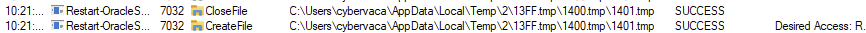
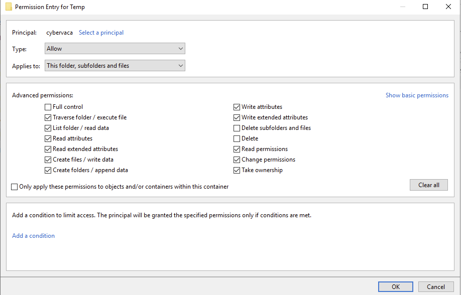
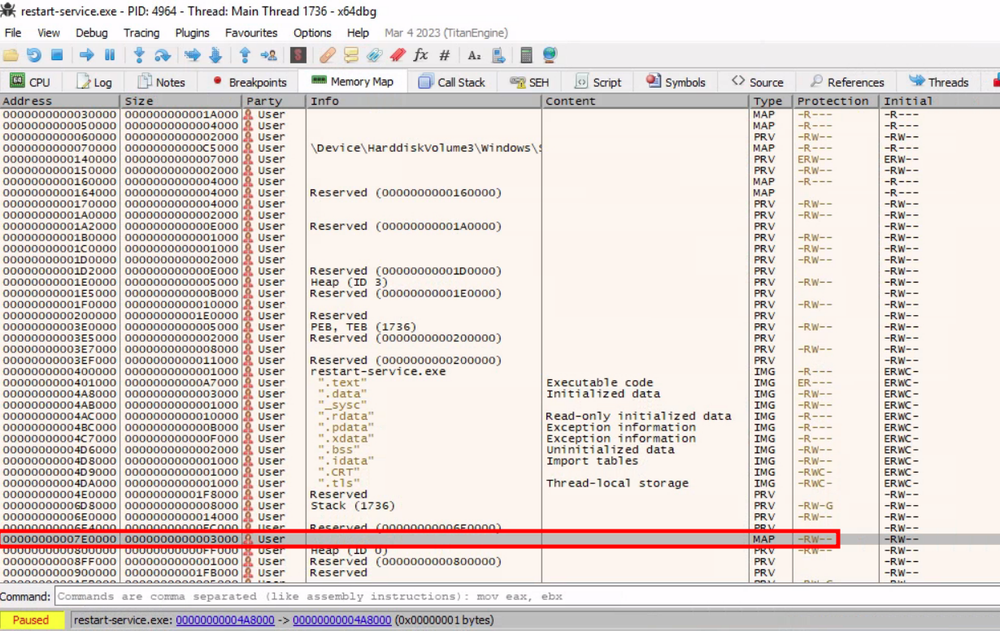
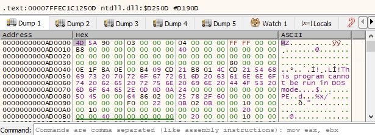

# Attacking Thick Client Applications
Thick client applications are the applications that are installed locally on our computers. Some characteristics of thick client applications are:

- Independent software.
- Working without internet access.
- Storing data locally.
- Less secure.
- Consuming more resources.
- More expensive.

## Penetration Testing Steps
### Information Gathering
The following tools will help us gather information:
- [CFF Explorer](https://ntcore.com/?page_id=388)
- [Detect It Easy](https://github.com/horsicq/Detect-It-Easy)
- [Process Monitor](https://learn.microsoft.com/en-us/sysinternals/downloads/procmon)
- [Strings](https://learn.microsoft.com/en-us/sysinternals/downloads/strings)

### Client Side attacks
Hardcoded credentials and other sensitive information can also be found in the application's source code, thus Static Analysis is a necessary step while testing the application. Using the proper tools, we can reverse-engineer and examine .NET and Java applications including EXE, DLL, JAR, CLASS, WAR, and other file formats.
- [Ghidra](https://www.ghidra-sre.org/)
- [IDA](https://hex-rays.com/ida-pro/)
- [OllyDbg](http://www.ollydbg.de/)
- [Radare2](https://www.radare.org/r/index.html)
- [dnSpy](https://github.com/dnSpy/dnSpy)
- [x64dbg](https://x64dbg.com/)
- [JADX](https://github.com/skylot/jadx)
- [Frida](https://frida.re/)

### Network Side Attacks
If the application is communicating with a local or remote server, network traffic analysis will help us capture sensitive information that might be transferred through HTTP/HTTPS or TCP/UDP connection, and give us a better understanding of how that application is working.
- [Wireshark](https://www.wireshark.org/)
- [tcpdump](https://www.tcpdump.org/)
- [TCPView](https://learn.microsoft.com/en-us/sysinternals/downloads/tcpview)
- [Burp Suite](https://portswigger.net/burp)

### Server Side Attacks
Server-side attacks in thick client applications are similar to web application attacks, and penetration testers should pay attention to the most common ones including most of the OWASP Top Ten.

## Questions
RDP to 10.129.228.115 (ACADEMY-ACA-PIVOTAPI), with user `cybervaca` and password `&aue%C)}6g-d{w`
1. Perform an analysis of C:\Apps\Restart-OracleService.exe and identify the credentials hidden within its source code. Submit the answer using the format username:password. **Answer: svc_oracle:#oracle_s3rV1c3!2010**
   - Use Procmon64 for monitoring the process (add filter for easy lookup `ProcessName containes Restart`) reveals that the executable indeed creates a temp file in `C:\Users\Matt\AppData\Local\Temp`
        
   - The files are deleted immediately after creation, so in order to capture those, we would need to disable the delete permissions for Temp folder. To do this, we right-click the folder `C:\Users\Matt\AppData\Local\Temp` and under `Properties` -> `Security` -> `Advanced` -> `cybervaca` -> `Disable inheritance` -> `Convert inherited permissions into explicit permissions on this object` -> `Edit` -> `Show advanced permissions`, we deselect the `Delete subfolders and files`, and `Delete` checkboxes.
        
   - Once the folder permissions have been applied we simply run again the `Restart-OracleService.exe` and check the `temp` folder. The file `AD7F.bat` is created under the `C:\Users\cybervaca\AppData\Local\Temp\2`. The names of the generated files are random every time the service is running. Listing the content of the `AD7F.bat` file reveals the following:
        ```
        @shift /0
        @echo off

        if %username% == matt goto correcto
        if %username% == frankytech goto correcto
        if %username% == ev4si0n goto correcto
        goto error

        :correcto
        echo TVqQAAMAAAAEAAAA//8AALgAAAAAAAAAQAAAAAAAAAAAAAAAAAAAAAAAAAAAAAAAAAAAAA > c:\programdata\oracle.txt
        echo AAAAAAAAAAgAAAAA4fug4AtAnNIbgBTM0hVGhpcyBwcm9ncmFtIGNhbm5vdCBiZSBydW4g >> c:\programdata\oracle.txt
        <SNIP>
        echo AAAAAAAAAAAAAAAAAAAAAAAAAAAAAAAAAAAAAAAAAAAAAAAAAAAAAA >> c:\programdata\oracle.txt

        echo $salida = $null; $fichero = (Get-Content C:\ProgramData\oracle.txt) ; foreach ($linea in $fichero) {$salida += $linea }; $salida = $salida.Replace(" ",""); [System.IO.File]::WriteAllBytes("c:\programdata\restart-service.exe", [System.Convert]::FromBase64String($salida)) > c:\programdata\monta.ps1
        powershell.exe -exec bypass -file c:\programdata\monta.ps1
        del c:\programdata\monta.ps1
        del c:\programdata\oracle.txt
        c:\programdata\restart-service.exe
        del c:\programdata\restart-service.exe
        ```
   - Inspecting the content of the file reveals that two files are being dropped by the batch file and being deleted before anyone can get access to the leftovers. We can try to retrieve the content of the 2 files, by modifying the batch script and removing the deletion:
        ```
        @shift /0
        @echo off

        echo TVqQAAMAAAAEAAAA//8AALgAAAAAAAAAQAAAAAAAAAAAAAAAAAAAAAAAAAAAAAAAAAAAAA > c:\programdata\oracle.txt
        echo AAAAAAAAAAgAAAAA4fug4AtAnNIbgBTM0hVGhpcyBwcm9ncmFtIGNhbm5vdCBiZSBydW4g >> c:\programdata\oracle.txt
        <SNIP>
        echo AAAAAAAAAAAAAAAAAAAAAAAAAAAAAAAAAAAAAAAAAAAAAAAAAAAAAA >> c:\programdata\oracle.txt

        echo $salida = $null; $fichero = (Get-Content C:\ProgramData\oracle.txt) ; foreach ($linea in $fichero) {$salida += $linea }; $salida = $salida.Replace(" ",""); [System.IO.File]::WriteAllBytes("c:\programdata\restart-service.exe", [System.Convert]::FromBase64String($salida)) > c:\programdata\monta.ps1
        ```
   - After executing the batch script by double-clicking on it, we wait a few minutes to spot the `oracle.txt` file which contains another file full of base64 lines, and the script `monta.ps1` which contains the following content, under the directory `c:\programdata\`. Listing the content of the file `monta.ps1` reveals the following code.
        ```cmd
        C:\>  cat C:\programdata\monta.ps1

        $salida = $null; $fichero = (Get-Content C:\ProgramData\oracle.txt) ; foreach ($linea in $fichero) {$salida += $linea }; $salida = $salida.Replace(" ",""); [System.IO.File]::WriteAllBytes("c:\programdata\restart-service.exe", [System.Convert]::FromBase64String($salida))
        ```
   - This script simply reads the contents of the `oracle.txt` file and decodes it to the `restart-service.exe` executable. Running this script gives us a final executable that we can further analyze. Open Powershell as Administrator and run it:
   - Now when executing restart-service.exe we are presented with the banner Restart Oracle created by HelpDesk back in 2010.
        ```
        C:\>  .\restart-service.exe

            ____            __             __     ____                  __
        / __ \___  _____/ /_____ ______/ /_   / __ \_________ ______/ /__
        / /_/ / _ \/ ___/ __/ __ `/ ___/ __/  / / / / ___/ __ `/ ___/ / _ \
        / _, _/  __(__  ) /_/ /_/ / /  / /_   / /_/ / /  / /_/ / /__/ /  __/
        /_/ |_|\___/____/\__/\__,_/_/   \__/   \____/_/   \__,_/\___/_/\___/

                                                        by @HelpDesk 2010

        ```
   - Let's start `x64dbg`, navigate to `Options` -> `Preferences`, and uncheck everything except `Exit Breakpoint`. By unchecking the other options, the debugging will start directly from the application's exit point, and we will avoid going through any dll files that are loaded before the app starts.
   - We can select `file` -> `open` and select the `restart-service.exe` to import it and start the debugging. Once imported, we right click inside the CPU view and `Follow in Memory Map`.
   - Checking the memory maps at this stage of the execution, of particular interest is the map with a size of `0000000000003000` with a type of `MAP` and protection set to `-RW--` (Memory-mapped files allow applications to access large files without having to read or write the entire file into memory at once. Instead, the file is mapped to a region of memory that the application can read and write as if it were a regular buffer in memory. This could be a place to potentially look for hardcoded credentials.):
        
   - If we double-click on it, we will see the magic bytes `MZ` in the ASCII column that indicates that the file is a DOS MZ executable.
        
   - Let's return to the Memory Map pane, then export the newly discovered mapped item from memory to a dump file by right-clicking on the address and selecting `Dump Memory to File`. Running `strings` on the exported file reveals some interesting information.
        ```pwsh
        C:\> C:\TOOLS\Strings\strings64.exe .\restart-service_00000000001E0000.bin -o deobfuscated.out

        <SNIP>
        "#M
        z\V
        ).NETFramework,Version=v4.0,Profile=Client
        FrameworkDisplayName
        .NET Framework 4 Client Profile
        <SNIP>
        ```
   - Reading the output reveals that the dump contains a `.NET` executable. We can use `De4Dot` to reverse `.NET` executables back to the source code by dragging the `restart-service_00000000001E0000.bin` onto the `de4dot` executable.
        ```
        C:\> C:\TOOLS\de4dot\de4dot.exe .\restart-service_00000000001E0000.bin  
        ```
   - Now, we can read the source code of the exported application by dragging and dropping `deobfuscated.out` onto the `DnSpy` executable.