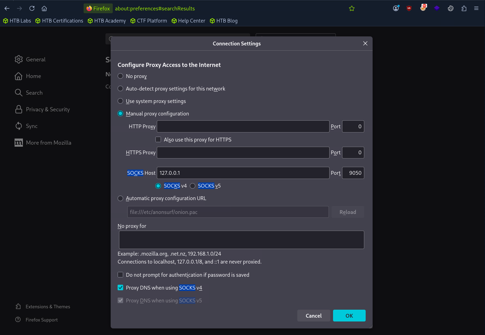

# Exploitation & Privilege Escalation
## Questions
1. Retrieve the contents of the SAM database on the DEV01 host. Submit the NT hash of the administrator user as your answer. **Answer:**
   - Port-forwarding with SSH and enable SOCKS4 proxy on the browser to login to 172.16.8.20 with this credential: `Administrator`:`D0tn31Nuk3R0ck$$@123`
        
   - 
2. Escalate privileges on the DEV01 host. Submit the contents of the flag.txt file on the Administrator Desktop. **Answer:**