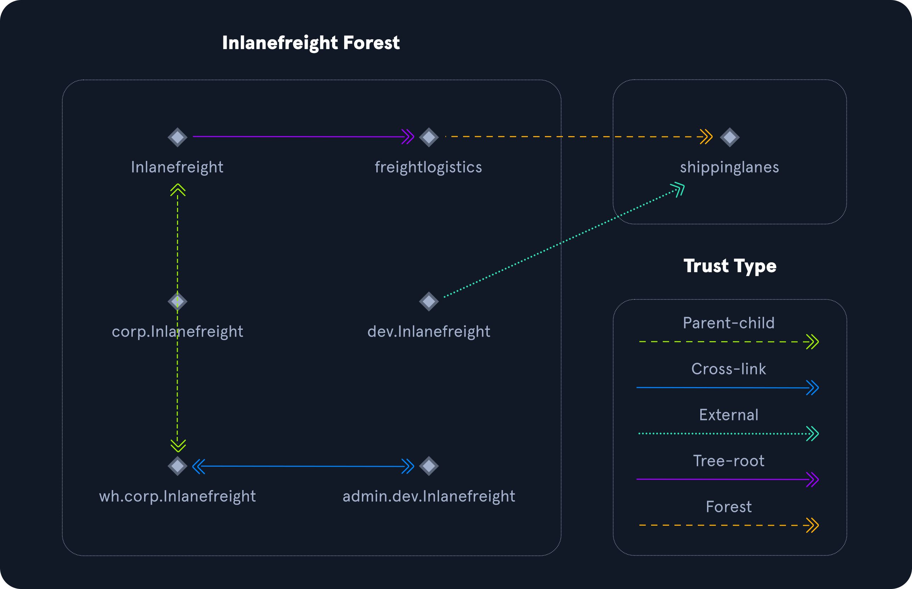

# Active Directory Functionality

<table class="bg-neutral-800 text-primary w-full mb-6 rounded-lg"><thead class="text-left rounded-t-lg"><tr class="border-t-neutral-600 first:border-t-0 border-t"><th class="bg-neutral-700 first:rounded-tl-lg last:rounded-tr-lg p-4"><strong class="font-bold">Roles</strong></th><th class="bg-neutral-700 first:rounded-tl-lg last:rounded-tr-lg p-4"><strong class="font-bold">Description</strong></th></tr></thead><tbody class="font-mono text-sm"><tr class="border-t-neutral-600 first:border-t-0 border-t"><td class="p-4"><code class="bg-neutral-700 mb-6 text-blue-250 py-1 px-1.5">Schema Master</code></td><td class="p-4">This role manages the read/write copy of the AD schema, which defines all attributes that can apply to an object in AD.</td></tr><tr class="border-t-neutral-600 first:border-t-0 border-t"><td class="p-4"><code class="bg-neutral-700 mb-6 text-blue-250 py-1 px-1.5">Domain Naming Master</code></td><td class="p-4">Manages domain names and ensures that two domains of the same name are not created in the same forest.</td></tr><tr class="border-t-neutral-600 first:border-t-0 border-t"><td class="p-4"><code class="bg-neutral-700 mb-6 text-blue-250 py-1 px-1.5">Relative ID (RID) Master</code></td><td class="p-4">The RID Master assigns blocks of RIDs to other DCs within the domain that can be used for new objects. The RID Master helps ensure that multiple objects are not assigned the same SID. Domain object SIDs are the domain SID combined with the RID number assigned to the object to make the unique SID.</td></tr><tr class="border-t-neutral-600 first:border-t-0 border-t"><td class="p-4"><code class="bg-neutral-700 mb-6 text-blue-250 py-1 px-1.5">PDC Emulator</code></td><td class="p-4">The host with this role would be the authoritative DC in the domain and respond to authentication requests, password changes, and manage Group Policy Objects (GPOs). The PDC Emulator also maintains time within the domain.</td></tr><tr class="border-t-neutral-600 first:border-t-0 border-t"><td class="p-4"><code class="bg-neutral-700 mb-6 text-blue-250 py-1 px-1.5">Infrastructure Master</code></td><td class="p-4">This role translates GUIDs, SIDs, and DNs between domains. This role is used in organizations with multiple domains in a single forest. The Infrastructure Master helps them to communicate. If this role is not functioning properly, Access Control Lists (ACLs) will show SIDs instead of fully resolved names.</td></tr></tbody></table>

## Domain and Forest Functional Levels

<table class="bg-neutral-800 text-primary w-full mb-6 rounded-lg"><thead class="text-left rounded-t-lg"><tr class="border-t-neutral-600 first:border-t-0 border-t"><th class="bg-neutral-700 first:rounded-tl-lg last:rounded-tr-lg p-4">Domain Functional Level</th><th class="bg-neutral-700 first:rounded-tl-lg last:rounded-tr-lg p-4">Features Available</th><th class="bg-neutral-700 first:rounded-tl-lg last:rounded-tr-lg p-4">Supported Domain Controller Operating Systems</th></tr></thead><tbody class="font-mono text-sm"><tr class="border-t-neutral-600 first:border-t-0 border-t"><td class="p-4">Windows 2000 native</td><td class="p-4">Universal groups for distribution and security groups, group nesting, group conversion (between security and distribution and security groups), SID history.</td><td class="p-4">Windows Server 2008 R2, Windows Server 2008, Windows Server 2003, Windows 2000</td></tr><tr class="border-t-neutral-600 first:border-t-0 border-t"><td class="p-4">Windows Server 2003</td><td class="p-4">Netdom.exe domain management tool, lastLogonTimestamp attribute introduced, well-known users and computers containers, constrained delegation, selective authentication.</td><td class="p-4">Windows Server 2012 R2, Windows Server 2012, Windows Server 2008 R2, Windows Server 2008, Windows Server 2003</td></tr><tr class="border-t-neutral-600 first:border-t-0 border-t"><td class="p-4">Windows Server 2008</td><td class="p-4">Distributed File System (DFS) replication support, Advanced Encryption Standard (AES 128 and AES 256) support for the Kerberos protocol, Fine-grained password policies</td><td class="p-4">Windows Server 2012 R2, Windows Server 2012, Windows Server 2008 R2, Windows Server 2008</td></tr><tr class="border-t-neutral-600 first:border-t-0 border-t"><td class="p-4">Windows Server 2008 R2</td><td class="p-4">Authentication mechanism assurance, Managed Service Accounts</td><td class="p-4">Windows Server 2012 R2, Windows Server 2012, Windows Server 2008 R2</td></tr><tr class="border-t-neutral-600 first:border-t-0 border-t"><td class="p-4">Windows Server 2012</td><td class="p-4">KDC support for claims, compound authentication, and Kerberos armoring</td><td class="p-4">Windows Server 2012 R2, Windows Server 2012</td></tr><tr class="border-t-neutral-600 first:border-t-0 border-t"><td class="p-4">Windows Server 2012 R2</td><td class="p-4">Extra protections for members of the Protected Users group, Authentication Policies, Authentication Policy Silos</td><td class="p-4">Windows Server 2012 R2</td></tr><tr class="border-t-neutral-600 first:border-t-0 border-t"><td class="p-4">Windows Server 2016</td><td class="p-4"><a href="https://docs.microsoft.com/en-us/windows/security/threat-protection/security-policy-settings/interactive-logon-require-smart-card" rel="nofollow" target="_blank" class="hover:underline text-green-400">Smart card required for interactive logon</a> new <a href="https://docs.microsoft.com/en-us/windows-server/security/kerberos/whats-new-in-kerberos-authentication" rel="nofollow" target="_blank" class="hover:underline text-green-400">Kerberos</a> features and new <a href="https://docs.microsoft.com/en-us/windows-server/security/credentials-protection-and-management/whats-new-in-credential-protection" rel="nofollow" target="_blank" class="hover:underline text-green-400">credential protection</a> features</td><td class="p-4">Windows Server 2019 and Windows Server 2016</td></tr></tbody></table>

Forest functional levels have introduced a few key capabilities over the years:

<table class="bg-neutral-800 text-primary w-full mb-6 rounded-lg"><thead class="text-left rounded-t-lg"><tr class="border-t-neutral-600 first:border-t-0 border-t"><th class="bg-neutral-700 first:rounded-tl-lg last:rounded-tr-lg p-4"><strong class="font-bold">Version</strong></th><th class="bg-neutral-700 first:rounded-tl-lg last:rounded-tr-lg p-4"><strong class="font-bold">Capabilities</strong></th></tr></thead><tbody class="font-mono text-sm"><tr class="border-t-neutral-600 first:border-t-0 border-t"><td class="p-4"><code class="bg-neutral-700 mb-6 text-blue-250 py-1 px-1.5">Windows Server 2003</code></td><td class="p-4">saw the introduction of the forest trust, domain renaming, read-only domain controllers (RODC), and more.</td></tr><tr class="border-t-neutral-600 first:border-t-0 border-t"><td class="p-4"><code class="bg-neutral-700 mb-6 text-blue-250 py-1 px-1.5">Windows Server 2008</code></td><td class="p-4">All new domains added to the forest default to the Server 2008 domain functional level. No additional new features.</td></tr><tr class="border-t-neutral-600 first:border-t-0 border-t"><td class="p-4"><code class="bg-neutral-700 mb-6 text-blue-250 py-1 px-1.5">Windows Server 2008 R2</code></td><td class="p-4">Active Directory Recycle Bin provides the ability to restore deleted objects when AD DS is running.</td></tr><tr class="border-t-neutral-600 first:border-t-0 border-t"><td class="p-4"><code class="bg-neutral-700 mb-6 text-blue-250 py-1 px-1.5">Windows Server 2012</code></td><td class="p-4">All new domains added to the forest default to the Server 2012 domain functional level. No additional new features.</td></tr><tr class="border-t-neutral-600 first:border-t-0 border-t"><td class="p-4"><code class="bg-neutral-700 mb-6 text-blue-250 py-1 px-1.5">Windows Server 2012 R2</code></td><td class="p-4">All new domains added to the forest default to the Server 2012 R2 domain functional level. No additional new features.</td></tr><tr class="border-t-neutral-600 first:border-t-0 border-t"><td class="p-4"><code class="bg-neutral-700 mb-6 text-blue-250 py-1 px-1.5">Windows Server 2016</code></td><td class="p-4"><a href="https://docs.microsoft.com/en-us/windows-server/identity/whats-new-active-directory-domain-services#privileged-access-management" rel="nofollow" target="_blank" class="hover:underline text-green-400">Privileged access management (PAM) using Microsoft Identity Manager (MIM).</a></td></tr></tbody></table>

## Trusts
A trust is used to establish `forest-forest` or `domain-domain` authentication, allowing users to access resources in (or administer) another domain outside of the domain their account resides in. A trust creates a link between the authentication systems of two domains.

There are several trust types.

<table class="bg-neutral-800 text-primary w-full mb-6 rounded-lg"><thead class="text-left rounded-t-lg"><tr class="border-t-neutral-600 first:border-t-0 border-t"><th class="bg-neutral-700 first:rounded-tl-lg last:rounded-tr-lg p-4"><strong class="font-bold">Trust Type</strong></th><th class="bg-neutral-700 first:rounded-tl-lg last:rounded-tr-lg p-4"><strong class="font-bold">Description</strong></th></tr></thead><tbody class="font-mono text-sm"><tr class="border-t-neutral-600 first:border-t-0 border-t"><td class="p-4"><code class="bg-neutral-700 mb-6 text-blue-250 py-1 px-1.5">Parent-child</code></td><td class="p-4">Domains within the same forest. The child domain has a two-way transitive trust with the parent domain.</td></tr><tr class="border-t-neutral-600 first:border-t-0 border-t"><td class="p-4"><code class="bg-neutral-700 mb-6 text-blue-250 py-1 px-1.5">Cross-link</code></td><td class="p-4">a trust between child domains to speed up authentication.</td></tr><tr class="border-t-neutral-600 first:border-t-0 border-t"><td class="p-4"><code class="bg-neutral-700 mb-6 text-blue-250 py-1 px-1.5">External</code></td><td class="p-4">A non-transitive trust between two separate domains in separate forests which are not already joined by a forest trust. This type of trust utilizes SID filtering.</td></tr><tr class="border-t-neutral-600 first:border-t-0 border-t"><td class="p-4"><code class="bg-neutral-700 mb-6 text-blue-250 py-1 px-1.5">Tree-root</code></td><td class="p-4">a two-way transitive trust between a forest root domain and a new tree root domain. They are created by design when you set up a new tree root domain within a forest.</td></tr><tr class="border-t-neutral-600 first:border-t-0 border-t"><td class="p-4"><code class="bg-neutral-700 mb-6 text-blue-250 py-1 px-1.5">Forest</code></td><td class="p-4">a transitive trust between two forest root domains.</td></tr></tbody></table>

## Trust Example

Trusts can be transitive or non-transitive.

- A transitive trust means that trust is extended to objects that the child domain trusts.
- In a non-transitive trust, only the child domain itself is trusted.

Trusts can be set up to be one-way or two-way (bidirectional).

- In bidirectional trusts, users from both trusting domains can access resources.
- In a one-way trust, only users in a trusted domain can access resources in a trusting domain, not vice-versa. The direction of trust is opposite to the direction of access.

Often, domain trusts are set up improperly and provide unintended attack paths. Also, trusts set up for ease of use may not be reviewed later for potential security implications.

## Questions 
1. What role maintains time for a domain? **Answer: PDC Emulator**
2. What domain functional level introduced Managed Service Accounts? **Answer: Windows Server 2008 R2**
3. What type of trust is a link between two child domains in a forest? **Answer: Cross-link**
4. What role ensures that objects in a domain are not assigned the same SID? (full name) **Answer: Relative ID Master**