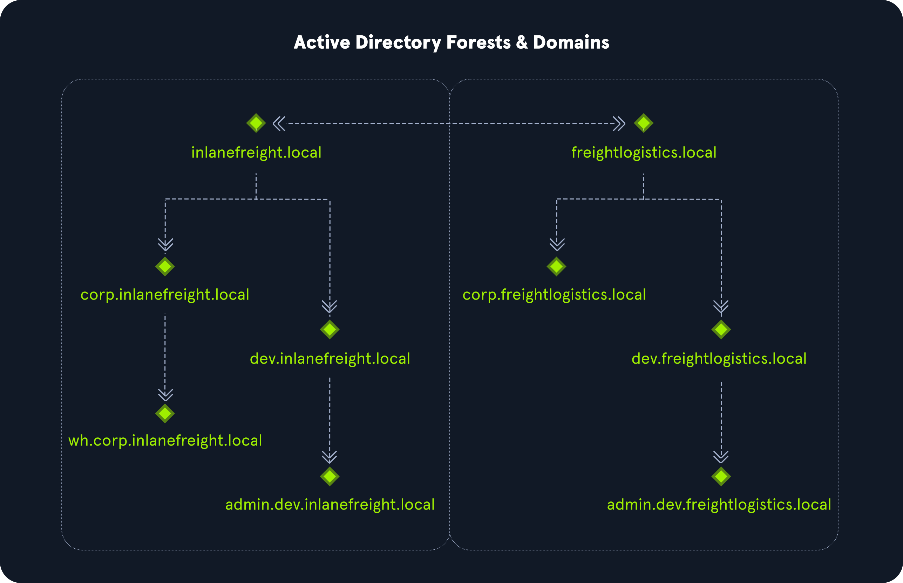

# Active Directory Structure
[Active Directory (AD)](https://docs.microsoft.com/en-us/windows-server/identity/ad-ds/get-started/virtual-dc/active-directory-domain-services-overview) is a directory service for Windows network environments. It is a distributed, hierarchical structure that allows for centralized management of an organization's resources, including users, computers, groups, network devices and file shares, group policies, servers and workstations, and trusts. AD provides authentication and authorization functions within a Windows domain environment. A directory service, such as [Active Directory Domain Services (AD DS)](https://docs.microsoft.com/en-us/windows-server/identity/ad-ds/get-started/virtual-dc/active-directory-domain-services-overview) gives an organization ways to store directory data and make it available to both standard users and administrators on the same network. AD DS stores information such as usernames and passwords and manages the rights needed for authorized users to access this information.

AD is essentially a large database accessible to all users within the domain, regardless of their privilege level. A basic AD user account with no added privileges can be used to enumerate the majority of objects contained within AD, including but not limited to:

<table class="bg-neutral-800 text-primary w-full mb-6 rounded-lg"><thead class="text-left rounded-t-lg"><tr class="border-t-neutral-600 first:border-t-0 border-t"><th class="bg-neutral-700 first:rounded-tl-lg last:rounded-tr-lg p-4"></th><th class="bg-neutral-700 first:rounded-tl-lg last:rounded-tr-lg p-4"></th></tr></thead><tbody class="font-mono text-sm"><tr class="border-t-neutral-600 first:border-t-0 border-t"><td class="p-4">Domain Computers</td><td class="p-4">Domain Users</td></tr><tr class="border-t-neutral-600 first:border-t-0 border-t"><td class="p-4">Domain Group Information</td><td class="p-4">Organizational Units (OUs)</td></tr><tr class="border-t-neutral-600 first:border-t-0 border-t"><td class="p-4">Default Domain Policy</td><td class="p-4">Functional Domain Levels</td></tr><tr class="border-t-neutral-600 first:border-t-0 border-t"><td class="p-4">Password Policy</td><td class="p-4">Group Policy Objects (GPOs)</td></tr><tr class="border-t-neutral-600 first:border-t-0 border-t"><td class="p-4">Domain Trusts</td><td class="p-4">Access Control Lists (ACLs)</td></tr></tbody></table>

Active Directory is arranged in a hierarchical tree structure, with a forest at the top containing one or more domains, which can themselves have nested subdomains. A forest is the security boundary within which all objects are under administrative control. A forest may contain multiple domains, and a domain may include further child or sub-domains. A domain is a structure within which contained objects (users, computers, and groups) are accessible. It has many built-in Organizational Units (OUs), such as `Domain Controllers`, `Users`, `Computers`, and new OUs can be created as required. OUs may contain objects and sub-OUs, allowing for the assignment of different group policies.

At a very (simplistic) high level, an AD structure may look as follows:

```sh
INLANEFREIGHT.LOCAL/
├── ADMIN.INLANEFREIGHT.LOCAL
│   ├── GPOs
│   └── OU
│       └── EMPLOYEES
│           ├── COMPUTERS
│           │   └── FILE01
│           ├── GROUPS
│           │   └── HQ Staff
│           └── USERS
│               └── barbara.jones
├── CORP.INLANEFREIGHT.LOCAL
└── DEV.INLANEFREIGHT.LOCAL
```

The graphic below shows two forests, `INLANEFREIGHT.LOCAL` and `FREIGHTLOGISTICS.LOCAL`. The two-way arrow represents a bidirectional trust between the two forests, meaning that users in `INLANEFREIGHT.LOCAL` can access resources in `FREIGHTLOGISTICS.LOCAL` and vice versa. We can also see multiple child domains under each root domain. In this example, we can see that the root domain trusts each of the child domains, but the child domains in forest A do not necessarily have trusts established with the child domains in forest B. This means that a user that is part of `admin.dev.freightlogistics.local` would NOT be able to authenticate to machines in the `wh.corp.inlanefreight.local` domain by default even though a bidirectional trust exists between the top-level `inlanefreight.local` and `freightlogistics.local` domains. To allow direct communication from admin.`dev.freightlogistics.local` and `wh.corp.inlanefreight.local`, another trust would need to be set up.



## Questions
1. What Active Directory structure can contain one or more domains? **Answer: forest**
2. True or False; It can be common to see multiple domains linked together by trust relationships? **Answer: true**
3. Active Directory provides authentication and <____> within a Windows domain environment. **Answer: authorization**