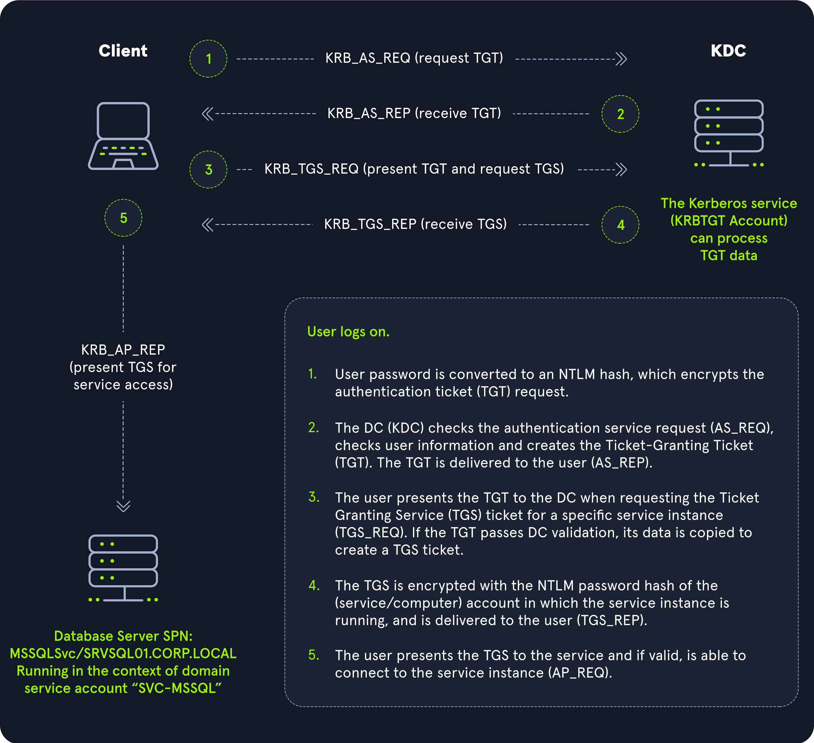
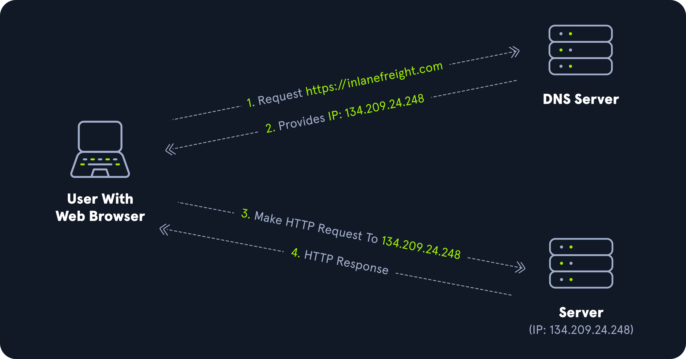
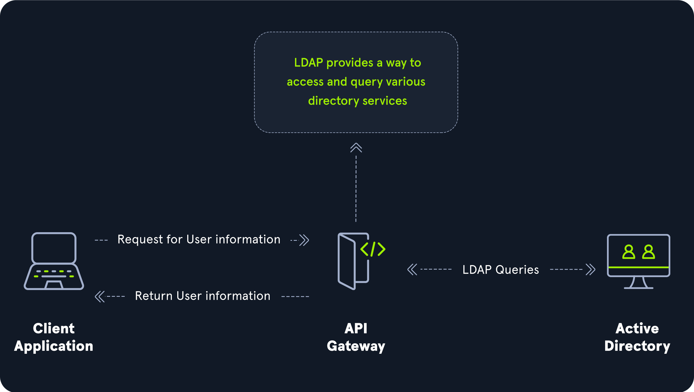

# Kerberos, DNS, LDAP, MSRPC
While Windows operating systems use a variety of protocols to communicate, Active Directory specifically requires [Lightweight Directory Access Protocol (LDAP)](https://en.wikipedia.org/wiki/Lightweight_Directory_Access_Protocol), Microsoft's version of [Kerberos](https://en.wikipedia.org/wiki/Kerberos_(protocol)), [DNS](https://en.wikipedia.org/wiki/Domain_Name_System) for authentication and communication, and MSRPC which is the Microsoft implementation of [Remote Procedure Call (RPC)](https://en.wikipedia.org/wiki/Remote_procedure_call), an interprocess communication technique used for client-server model-based applications.

## Kerberos
The Kerberos protocol uses port 88 (both TCP and UDP). When enumerating an Active Directory environment, we can often locate Domain Controllers by performing port scans looking for open port 88 using a tool such as Nmap.



## DNS
Active Directory Domain Services (AD DS) uses DNS to allow clients (workstations, servers, and other systems that communicate with the domain) to locate Domain Controllers and for Domain Controllers that host the directory service to communicate amongst themselves. Private internal networks use Active Directory DNS namespaces to facilitate communications between servers, clients, and peers. AD maintains a database of services running on the network in the form of service records (SRV). These service records allow clients in an AD environment to locate services that they need, such as a file server, printer, or Domain Controller.



When a client joins the network, it locates the Domain Controller by sending a query to the DNS service, retrieving an SRV record from the DNS database, and transmitting the Domain Controller's hostname to the client. The client then uses this hostname to obtain the IP address of the Domain Controller. DNS uses TCP and UDP port 53. UDP port 53 is the default, but it falls back to TCP when no longer able to communicate and DNS messages are larger than 512 bytes.

### Forward DNS Lookup

```pwsh
PS C:\htb> nslookup INLANEFREIGHT.LOCAL

Server:  172.16.6.5
Address:  172.16.6.5

Name:    INLANEFREIGHT.LOCAL
Address:  172.16.6.5
```

### Reverse DNS Lookup

```pwsh
PS C:\htb> nslookup 172.16.6.5

Server:  172.16.6.5
Address:  172.16.6.5

Name:    ACADEMY-EA-DC01.INLANEFREIGHT.LOCAL
Address:  172.16.6.5
```

### Finding IP Address of a Host

```pwsh
PS C:\htb> nslookup ACADEMY-EA-DC01

Server:   172.16.6.5
Address:  172.16.6.5

Name:    ACADEMY-EA-DC01.INLANEFREIGHT.LOCAL
Address:  172.16.6.5
```

## LDAP
Active Directory supports [Lightweight Directory Access Protocol (LDAP)](https://en.wikipedia.org/wiki/Lightweight_Directory_Access_Protocol) for directory lookups. LDAP is an open-source and cross-platform protocol used for authentication against various directory services (such as AD). LDAP uses port 389, and LDAP over SSL (LDAPS) communicates over port 636.

AD stores user account information and security information such as passwords and facilitates sharing this information with other devices on the network. LDAP is the language that applications use to communicate with other servers that provide directory services.

An LDAP session begins by first connecting to an LDAP server, also known as a Directory System Agent. The Domain Controller in AD actively listens for LDAP requests, such as security authentication requests.



### AD LDAP Authentication
LDAP is set up to authenticate credentials against AD using a "BIND" operation to set the authentication state for an LDAP session. There are two types of LDAP authentication.

1. Simple Authentication: This includes anonymous authentication, unauthenticated authentication, and username/password authentication. Simple authentication means that a username and password create a BIND request to authenticate to the LDAP server.
2. SASL Authentication: The Simple Authentication and Security Layer (SASL) framework uses other authentication services, such as Kerberos, to bind to the LDAP server and then uses this authentication service (Kerberos in this example) to authenticate to LDAP. The LDAP server uses the LDAP protocol to send an LDAP message to the authorization service, which initiates a series of challenge/response messages resulting in either successful or unsuccessful authentication. SASL can provide additional security due to the separation of authentication methods from application protocols.

LDAP authentication messages are sent in cleartext by default so anyone can sniff out LDAP messages on the internal network. It is recommended to use TLS encryption or similar to safeguard this information in transit.

## MSRPC
MSRPC is Microsoft's implementation of Remote Procedure Call (RPC), an interprocess communication technique used for client-server model-based applications. Windows systems use MSRPC to access systems in Active Directory using four key RPC interfaces.

<table class="bg-neutral-800 text-primary w-full mb-6 rounded-lg"><thead class="text-left rounded-t-lg"><tr class="border-t-neutral-600 first:border-t-0 border-t"><th class="bg-neutral-700 first:rounded-tl-lg last:rounded-tr-lg p-4">Interface Name</th><th class="bg-neutral-700 first:rounded-tl-lg last:rounded-tr-lg p-4">Description</th></tr></thead><tbody class="font-mono text-sm"><tr class="border-t-neutral-600 first:border-t-0 border-t"><td class="p-4"><code class="bg-neutral-700 mb-6 text-blue-250 py-1 px-1.5">lsarpc</code></td><td class="p-4">A set of RPC calls to the <a href="https://networkencyclopedia.com/local-security-authority-lsa/" rel="nofollow" target="_blank" class="hover:underline text-green-400">Local Security Authority (LSA)</a> system which manages the local security policy on a computer, controls the audit policy, and provides interactive authentication services. LSARPC is used to perform management on domain security policies.</td></tr><tr class="border-t-neutral-600 first:border-t-0 border-t"><td class="p-4"><code class="bg-neutral-700 mb-6 text-blue-250 py-1 px-1.5">netlogon</code></td><td class="p-4">Netlogon is a Windows process used to authenticate users and other services in the domain environment. It is a service that continuously runs in the background.</td></tr><tr class="border-t-neutral-600 first:border-t-0 border-t"><td class="p-4"><code class="bg-neutral-700 mb-6 text-blue-250 py-1 px-1.5">samr</code></td><td class="p-4">Remote SAM (samr) provides management functionality for the domain account database, storing information about users and groups. IT administrators use the protocol to manage users, groups, and computers by enabling admins to create, read, update, and delete information about security principles. Attackers (and pentesters) can use the samr protocol to perform reconnaissance about the internal domain using tools such as <a href="https://github.com/BloodHoundAD/" rel="nofollow" target="_blank" class="hover:underline text-green-400">BloodHound</a> to visually map out the AD network and create "attack paths" to illustrate visually how administrative access or full domain compromise could be achieved. Organizations can <a href="https://stealthbits.com/blog/making-internal-reconnaissance-harder-using-netcease-and-samri1o/" rel="nofollow" target="_blank" class="hover:underline text-green-400">protect</a> against this type of reconnaissance by changing a Windows registry key to only allow administrators to perform remote SAM queries since, by default, all authenticated domain users can make these queries to gather a considerable amount of information about the AD domain.</td></tr><tr class="border-t-neutral-600 first:border-t-0 border-t"><td class="p-4"><code class="bg-neutral-700 mb-6 text-blue-250 py-1 px-1.5">drsuapi</code></td><td class="p-4">drsuapi is the Microsoft API that implements the Directory Replication Service (DRS) Remote Protocol which is used to perform replication-related tasks across Domain Controllers in a multi-DC environment. Attackers can utilize drsuapi to <a href="https://attack.mitre.org/techniques/T1003/003/" rel="nofollow" target="_blank" class="hover:underline text-green-400">create a copy of the Active Directory domain database</a> (NTDS.dit) file to retrieve password hashes for all accounts in the domain, which can then be used to perform Pass-the-Hash attacks to access more systems or cracked offline using a tool such as Hashcat to obtain the cleartext password to log in to systems using remote management protocols such as Remote Desktop (RDP) and WinRM.</td></tr></tbody></table>

## Questions
1. What networking port does Kerberos use? **Answer: 88**
2. What protocol is utilized to translate names into IP addresses? (acronym) **Answer: DNS**
3. What protocol does RFC 4511 specify? (acronym) **Answer: LDAP**