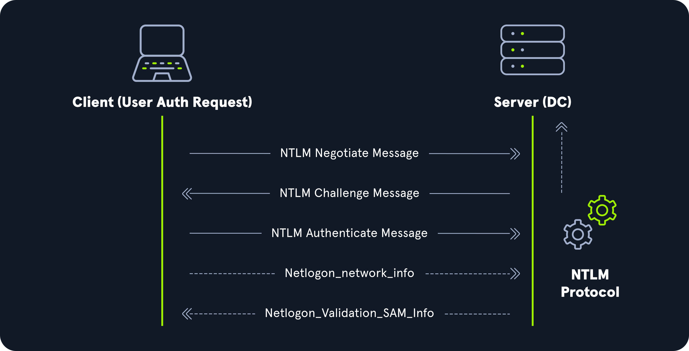

# NTLM Authentication
LM, NT, NTLMv1, and NTLMv2. LM and NT are hash algorithms used to store password credentials. NTLMv1 and NTLMv2 are authentication protocols built on top of these hashes. NTLMv1 can use either LM or NT hashes, while NTLMv2 exclusively uses NT hashes.

### Hash Protocol Comparison
<table class="bg-neutral-800 text-primary w-full mb-6 rounded-lg"><thead class="text-left rounded-t-lg"><tr class="border-t-neutral-600 first:border-t-0 border-t"><th class="bg-neutral-700 first:rounded-tl-lg last:rounded-tr-lg p-4"><strong class="font-bold">Hash/Protocol</strong></th><th class="bg-neutral-700 first:rounded-tl-lg last:rounded-tr-lg p-4"><strong class="font-bold">Cryptographic technique</strong></th><th class="bg-neutral-700 first:rounded-tl-lg last:rounded-tr-lg p-4"><strong class="font-bold">Mutual Authentication</strong></th><th class="bg-neutral-700 first:rounded-tl-lg last:rounded-tr-lg p-4"><strong class="font-bold">Message Type</strong></th><th class="bg-neutral-700 first:rounded-tl-lg last:rounded-tr-lg p-4"><strong class="font-bold">Trusted Third Party</strong></th></tr></thead><tbody class="font-mono text-sm"><tr class="border-t-neutral-600 first:border-t-0 border-t"><td class="p-4"><code class="bg-neutral-700 mb-6 text-blue-250 py-1 px-1.5">NTLM</code></td><td class="p-4">Symmetric key cryptography</td><td class="p-4">No</td><td class="p-4">Random number</td><td class="p-4">Domain Controller</td></tr><tr class="border-t-neutral-600 first:border-t-0 border-t"><td class="p-4"><code class="bg-neutral-700 mb-6 text-blue-250 py-1 px-1.5">NTLMv1</code></td><td class="p-4">Symmetric key cryptography</td><td class="p-4">No</td><td class="p-4">MD4 hash, random number</td><td class="p-4">Domain Controller</td></tr><tr class="border-t-neutral-600 first:border-t-0 border-t"><td class="p-4"><code class="bg-neutral-700 mb-6 text-blue-250 py-1 px-1.5">NTLMv2</code></td><td class="p-4">Symmetric key cryptography</td><td class="p-4">No</td><td class="p-4">MD4 hash, random number</td><td class="p-4">Domain Controller</td></tr><tr class="border-t-neutral-600 first:border-t-0 border-t"><td class="p-4"><code class="bg-neutral-700 mb-6 text-blue-250 py-1 px-1.5">Kerberos</code></td><td class="p-4">Symmetric key cryptography &amp; asymmetric cryptography</td><td class="p-4">Yes</td><td class="p-4">Encrypted ticket using DES, MD5</td><td class="p-4">Domain Controller/Key Distribution Center (KDC)</td></tr></tbody></table>

## LM
`LAN Manager` (LM or LANMAN) hashes are the oldest password storage mechanism used by the Windows operating system. If in use, they are stored in the SAM database on a Windows host and the NTDS.DIT database on a Domain Controller. Due to significant security weaknesses in the hashing algorithm used for LM hashes, it has been turned off by default since Windows Vista/Server 2008. Passwords using LM are limited to a maximum of `14` characters. Passwords are not case sensitive and are converted to uppercase before generating the hashed value, limiting the keyspace to a total of `69` characters making it relatively easy to crack these hashes using a tool such as Hashcat.

Before hashing, a 14 character password is first split into two seven-character chunks. If the password is less than fourteen characters, it will be padded with NULL characters to reach the correct value. Two DES keys are created from each chunk. These chunks are then encrypted using the string `KGS!@#$%`, creating two 8-byte ciphertext values. These two values are then concatenated together, resulting in an LM hash. This hashing algorithm means that an attacker only needs to brute force seven characters twice instead of the entire fourteen characters, making it fast to crack LM hashes on a system with one or more GPUs. If a password is seven characters or less, the second half of the LM hash will always be the same value and could even be determined visually without even needed tools such as Hashcat. The use of LM hashes can be disallowed using [Group Policy](https://docs.microsoft.com/en-us/windows/security/threat-protection/security-policy-settings/network-security-do-not-store-lan-manager-hash-value-on-next-password-change). An LM hash takes the form of `299bd128c1101fd6`.

> **Note:** Windows operating systems prior to Windows Vista and Windows Server 2008 (Windows NT4, Windows 2000, Windows 2003, Windows XP) stored both the LM hash and the NTLM hash of a user's password by default.

## NTHash (NTLM)
`NT LAN Manager` (NTLM) hashes are used on modern Windows systems. It is a challenge-response authentication protocol and uses three messages to authenticate: a client first sends a `NEGOTIATE_MESSAGE` to the server, whose response is a `CHALLENGE_MESSAGE` to verify the client's identity. Lastly, the client responds with an `AUTHENTICATE_MESSAGE`. These hashes are stored locally in the SAM database or the NTDS.DIT database file on a Domain Controller. The protocol has two hashed password values to choose from to perform authentication: the LM hash (as discussed above) and the NT hash, which is the MD4 hash of the little-endian UTF-16 value of the password (`MD4(UTF-16-LE(password))`).



Even though they are considerably stronger than LM hashes (supporting the entire Unicode character set of 65,536 characters), they can still be brute-forced offline relatively quickly using a tool such as Hashcat. NTLM is also vulnerable to the pass-the-hash attack, which means an attacker can authenticate to target systems without needing to know the cleartext value of the password.

An NT hash takes the form of `b4b9b02e6f09a9bd760f388b67351e2b`, which is the second half of the full NTLM hash. An NTLM hash looks like this:

```
Rachel:500:aad3c435b514a4eeaad3b935b51304fe:e46b9e548fa0d122de7f59fb6d48eaa2:::
```

Looking at the hash above, we can break the NTLM hash down into its individual parts:
- `Rachel` is the username
- `500` is the Relative Identifier (RID). 500 is the known RID for the administrator account
- `aad3c435b514a4eeaad3b935b51304fe` is the LM hash and, if LM hashes are disabled on the system, can not be used for anything
- `e46b9e548fa0d122de7f59fb6d48eaa2` is the NT hash. This hash can either be cracked offline to reveal the cleartext value (depending on the length/strength of the password) or used for a pass-the-hash attack. 

> **Note:** Neither LANMAN nor NTLM uses a salt.

## NTLMv1 (Net-NTLMv1)
The NTLM protocol performs a challenge/response between a server and client using the NT hash. NTLMv1 uses both the NT and the LM hash. The protocol is used for network authentication, and the Net-NTLMv1 hash itself is created from a challenge/response algorithm. The server sends the client an 8-byte random number (challenge), and the client returns a 24-byte response. These hashes can NOT be used for pass-the-hash attacks. The algorithm looks as follows:

### V1 Challenge & Response Algorithm

```
C = 8-byte server challenge, random
K1 | K2 | K3 = LM/NT-hash | 5-bytes-0
response = DES(K1,C) | DES(K2,C) | DES(K3,C)
```

### NTLMv1 Hash Example

```
u4-netntlm::kNS:338d08f8e26de93300000000000000000000000000000000:9526fb8c23a90751cdd619b6cea564742e1e4bf33006ba41:cb8086049ec4736c
```

## NTLMv2 (Net-NTLMv2)
The NTLMv2 protocol was first introduced in Windows NT 4.0 SP4 and was created as a stronger alternative to NTLMv1. It has been the default in Windows since Server 2000. It is hardened against certain spoofing attacks that NTLMv1 is susceptible to. NTLMv2 sends two responses to the 8-byte challenge received by the server. These responses contain a 16-byte HMAC-MD5 hash of the challenge, a randomly generated challenge from the client, and an HMAC-MD5 hash of the user's credentials. A second response is sent, using a variable-length client challenge including the current time, an 8-byte random value, and the domain name. The algorithm is as follows:

### V2 Challenge & Response Algorithm

```
SC = 8-byte server challenge, random
CC = 8-byte client challenge, random
CC* = (X, time, CC2, domain name)
v2-Hash = HMAC-MD5(NT-Hash, user name, domain name)
LMv2 = HMAC-MD5(v2-Hash, SC, CC)
NTv2 = HMAC-MD5(v2-Hash, SC, CC*)
response = LMv2 | CC | NTv2 | CC*
```

### NTLMv2 Hash Example

```
admin::N46iSNekpT:08ca45b7d7ea58ee:88dcbe4446168966a153a0064958dac6:5c7830315c7830310000000000000b45c67103d07d7b95acd12ffa11230e0000000052920b85f78d013c31cdb3b92f5d765c783030
```

## Domain Cached Credentials (MSCache2)
In an AD environment, the authentication methods mentioned in this section and the previous require the host we are trying to access to communicate with the "brains" of the network, the Domain Controller. Microsoft developed the [MS Cache v1 and v2](https://web.archive.org/web/20240121113925/https://webstersprodigy.net/2014/02/03/mscash-hash-primer-for-pentesters/) algorithm (also known as `Domain Cached Credentials` (DCC)) to solve the potential issue of a domain-joined host being unable to communicate with a domain controller (i.e., due to a network outage or other technical issue) and, hence, NTLM/Kerberos authentication not working to access the host in question. Hosts save the last `ten` hashes for any domain users that successfully log into the machine in the `HKEY_LOCAL_MACHINE\SECURITY\Cache` registry key. These hashes cannot be used in pass-the-hash attacks. Furthermore, the hash is very slow to crack with a tool such as Hashcat, even when using an extremely powerful GPU cracking rig, so attempts to crack these hashes typically need to be extremely targeted or rely on a very weak password in use. These hashes can be obtained by an attacker or pentester after gaining local admin access to a host and have the following format: `$DCC2$10240#bjones#e4e938d12fe5974dc42a90120bd9c90f`.

## Questions
1. What Hashing protocol is capable of symmetric and asymmetric cryptography? **Answer: Kerberos**
2. NTLM uses three messages to authenticate; Negotiate, Challenge, and <__>. What is the missing message? (fill in the blank) **Answer: Authenticate**
3. How many hashes does the Domain Cached Credentials mechanism save to a host by default? **Answer: 10**