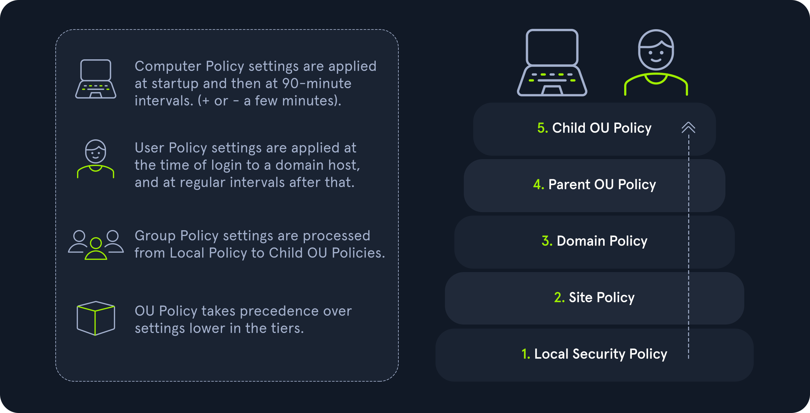
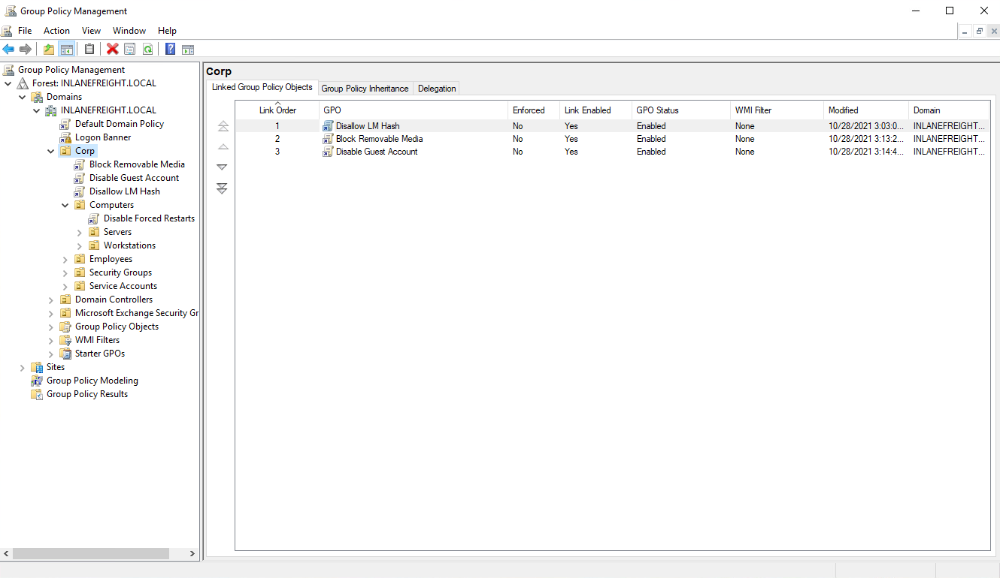
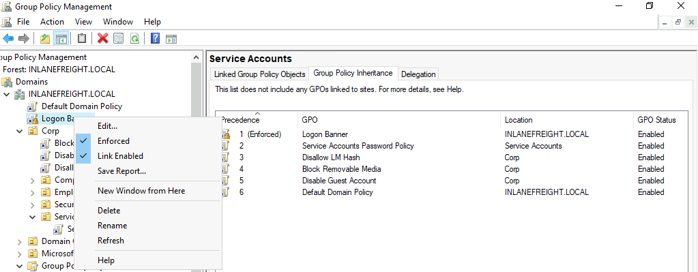
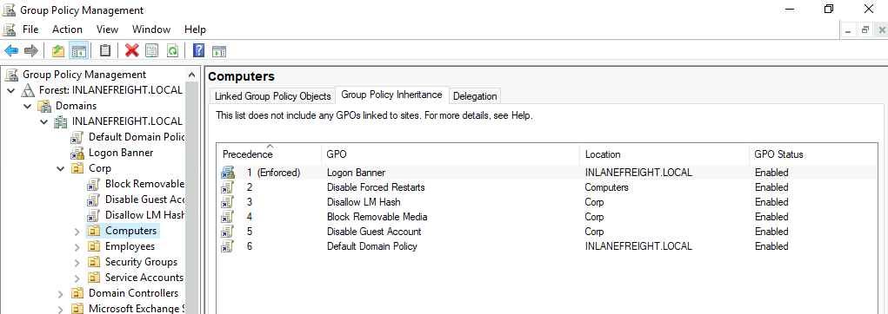
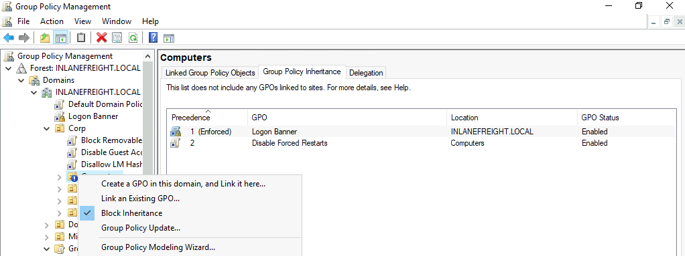

# Examining Group Policy
## Group Policy Objects (GPOs)
A [Group Policy Object (GPO)](https://docs.microsoft.com/en-us/previous-versions/windows/desktop/policy/group-policy-objects) is a virtual collection of policy settings that can be applied to `user(s)` or `computer(s)`. GPOs include policies such as screen lock timeout, disabling USB ports, enforcing a custom domain password policy, installing software, managing applications, customizing remote access settings, and much more. Every GPO has a unique name and is assigned a unique identifier (a GUID). They can be linked to a specific OU, domain, or site. A single GPO can be linked to multiple containers, and any container can have multiple GPOs applied to it. They can be applied to individual users, hosts, or groups by being applied directly to an OU. Every GPO contains one or more Group Policy settings that may apply at the local machine level or within the Active Directory context.

GPO settings are processed using the hierarchical structure of AD and are applied using the `Order of Precedence` rule as seen in the table below:

<table class="bg-neutral-800 text-primary w-full mb-6 rounded-lg"><thead class="text-left rounded-t-lg"><tr class="border-t-neutral-600 first:border-t-0 border-t"><th class="bg-neutral-700 first:rounded-tl-lg last:rounded-tr-lg p-4"><strong class="font-bold">Level</strong></th><th class="bg-neutral-700 first:rounded-tl-lg last:rounded-tr-lg p-4"><strong class="font-bold">Description</strong></th></tr></thead><tbody class="font-mono text-sm"><tr class="border-t-neutral-600 first:border-t-0 border-t"><td class="p-4"><code class="bg-neutral-700 mb-6 text-blue-250 py-1 px-1.5">Local Group Policy</code></td><td class="p-4">The policies are defined directly to the host locally outside the domain. Any setting here will be overwritten if a similar setting is defined at a higher level.</td></tr><tr class="border-t-neutral-600 first:border-t-0 border-t"><td class="p-4"><code class="bg-neutral-700 mb-6 text-blue-250 py-1 px-1.5">Site Policy</code></td><td class="p-4">Any policies specific to the Enterprise Site that the host resides in. Remember that enterprise environments can span large campuses and even across countries. So it stands to reason that a site might have its own policies to follow that could differentiate it from the rest of the organization. Access Control policies are a great example of this. Say a specific building or <code class="bg-neutral-700 mb-6 text-blue-250 py-1 px-1.5">site</code> performs secret or restricted research and requires a higher level of authorization for access to resources. You could specify those settings at the site level and ensure they are linked so as not to be overwritten by domain policy. This is also a great way to perform actions like printer and share mapping for users in specific sites.</td></tr><tr class="border-t-neutral-600 first:border-t-0 border-t"><td class="p-4"><code class="bg-neutral-700 mb-6 text-blue-250 py-1 px-1.5">Domain-wide Policy</code></td><td class="p-4">Any settings you wish to have applied across the domain as a whole. For example, setting the password policy complexity level, configuring a Desktop background for all users, and setting a Notice of Use and Consent to Monitor banner at the login screen.</td></tr><tr class="border-t-neutral-600 first:border-t-0 border-t"><td class="p-4"><code class="bg-neutral-700 mb-6 text-blue-250 py-1 px-1.5">Organizational Unit</code> (OU)</td><td class="p-4">These settings would affect users and computers who belong to specific OUs. You would want to place any unique settings here that are role-specific. For example, the mapping of a particular share drive that can only be accessed by HR, access to specific resources like printers, or the ability for IT admins to utilize PowerShell and command-prompt.</td></tr><tr class="border-t-neutral-600 first:border-t-0 border-t"><td class="p-4"><code class="bg-neutral-700 mb-6 text-blue-250 py-1 px-1.5">Any OU Policies nested within other OU's</code></td><td class="p-4">Settings at this level would reflect special permissions for objects within nested OUs. For example, providing Security Analysts a specific set of Applocker policy settings that differ from the standard IT Applocker settings.</td></tr></tbody></table>

We can manage Group Policy from the Group Policy Management Console (found under Administrative Tools in the Start Menu on a domain controller), custom applications, or using the PowerShell GroupPolicy module via command line. **The Default Domain Policy is the default GPO that is automatically created and linked to the domain**. It has the highest precedence of all GPOs and is applied by default to all users and computers. Generally, it is best practice to use this default GPO to manage default settings that will apply domain-wide. The Default Domain Controllers policy is also created automatically with a domain and sets baseline security and auditing settings for all domain controllers in a given domain. It can be customized as needed, like any GPO.

## GPO Order of Precedence
GPOs are processed from the top down when viewing them from a domain organizational standpoint. This means that a GPO linked directly to an OU containing user or computer objects is processed last. In other words, a GPO attached to a specific OU would have precedence over a GPO attached at the domain level because it will be processed last and could run the risk of overriding settings in a GPO higher up in the domain hierarchy. One more thing to keep track of with precedence is that a setting configured in Computer policy will always have a higher priority of the same setting applied to a user. 

### GPMC Hive Example

This image also shows an example of several GPOs being linked to the `Corp` OU. When more than one GPO is linked to an OU, they are processed based on the `Link Order`. The GPO with the lowest Link Order is processed last, or the GPO with link order 1 has the highest precedence, then 2, and 3, and so on. So in our example above, the `Disallow LM Hash` GPO will have precedence over the `Block Removable Media` and `Disable Guest Account` GPOs, meaning it will be processed last. 

It is possible to specify the `Enforced` option to enforce settings in a specific GPO. If this option is set, policy settings in GPOs linked to lower OUs `CANNOT` override the settings. If a GPO is set at the domain level with the `Enforced` option selected, the settings contained in that GPO will be applied to all OUs in the domain and cannot be overridden by lower-level OU policies. 

Below we can see an example of an `Enforced` GPO, where the `Logon Banner` GPO is taking precedence over GPOs linked to lower OUs and therefore will not be overridden.

### Enforced GPO Policy Precedence

Regardless of which GPO is set to enforced, if the `Default Domain Policy` GPO is enforced, it will take precedence over all GPOs at all levels.

### Default Domain Policy Override
It is also possible to set the `Block inheritance` option on an OU. If this is specified for a particular OU, then policies higher up (such as at the domain level) will NOT be applied to this OU. If both options are set, the `No Override` option has precedence over the `Block inheritance` option. 

If the `Block Inheritance` option is chosen, we can see that the 3 GPOs applied higher up to the `Corp` OU are no longer enforced on the `Computers` OU.

## Group Policy Refresh Frequency
When a new GPO is created, the settings are not automatically applied right away. Windows performs periodic Group Policy updates, which by default is done every 90 minutes with a randomized offset of +/- 30 minutes for users and computers. The period is only 5 minutes for domain controllers to update by default. When a new GPO is created and linked, it could take up to 2 hours (120 minutes) until the settings take effect. 

It is possible to change the default refresh interval within Group Policy itself. Furthermore, we can issue the command `gpupdate /force` to kick off the update process. This command will compare the GPOs currently applied on the machine against the domain controller and either modify or skip them depending on if they have changed since the last automatic update.

We can modify the refresh interval via Group Policy by clicking on `Computer Configuration --> Policies --> Administrative Templates --> System --> Group Policy` and selecting `Set Group Policy refresh interval for computers`.

## Questions 
1. Computer settings for Group Policies are gathered and applied at a <___> minute interval? (answer is a number, fill in the blank ) **Answer: 90**
2. True or False: A policy applied to a user at the domain level would be overwritten by a policy at the site level. **Answer: False**
3. What Group Policy Object is created when the domain is created? **Answer: Default Domain Policy**