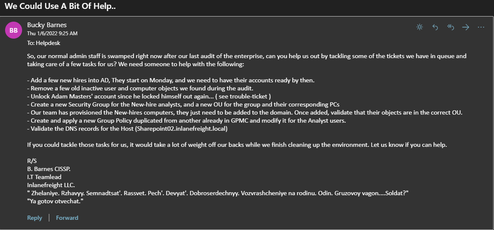
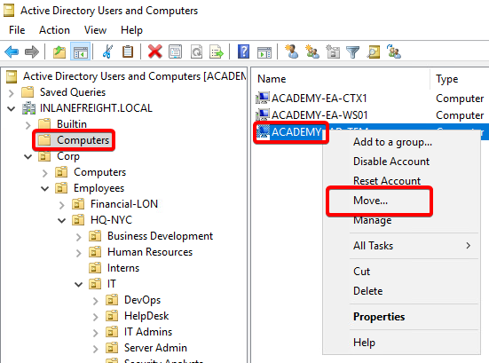
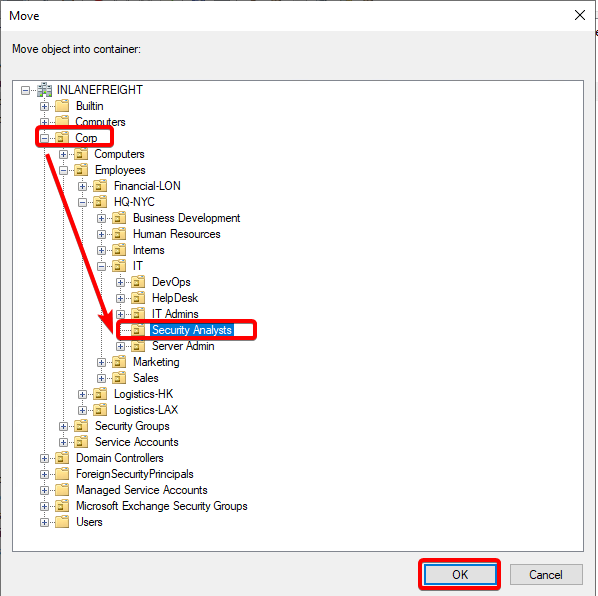
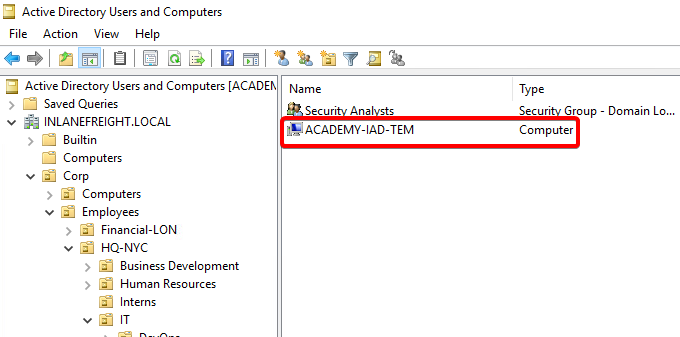

# AD Administration: Guided Lab Part II

## Tasks:
### Task 4 Add and Remove Computers To The Domain
Our new users will need computers to perform their daily duties. The helpdesk has just finished provisioning them and requires us to add them to the INLANEFREIGHT domain. Since these analyst positions are new, we will need to ensure that the hosts end up in the correct OU once they join the domain so that group policy can take effect properly.

The host we need to join to the INLANEFREIGHT domain is named: ACADEMY-IAD-W10 and has the following credentials for use to login and finish the provisioning process:

- User == `image`
- Password == `Academy_student_AD!`

Once you have access to the host, utilize your `htb-student_adm`: `Academy_student_DA!` account to join the host to the domain.

## Questions
DC at **10.129.32.249**, RDP to **10.129.32.248** (ACADEMY-IAD-WIN10),target with user `image` and password `Academy_student_AD!`
1. Once you have finished the tasks, type "COMPLETE" to move on. **Answer: COMPLETE**

### Task 4:
- `xfreerdp /v:10.129.32.248 /u:image /p:Academy_student_AD!` → RDP to the ACADEMY-IAD-WIN10 machine
- `PS C:\htb> Add-Computer -DomainName INLANEFREIGHT.LOCAL -Credential INLANEFREIGHT\HTB-student_adm -Restart` → Join computer to the INLANEFREIGHT.LOCAL domain 
- Restart the machine to take effect

- `xfreerdp /v:10.129.32.249 /u:htb-student_adm /p:Academy_student_AD!` → RDP to the ACADEMY-IAD-DC01 machine
- `PS C:\htb> Add-Computer -ComputerName ACADEMY-IAD-W10 -LocalCredential ACADEMY-IAD-W10\image -DomainName INLANEFREIGHT.LOCAL -Credential INLANEFREIGHT\htb-student_adm -Restart` → Add computer to the INLANEFREIGHT.LOCAL domain from the DC
- `PS C:\htb> Get-ADComputer -Identity "ACADEMY-IAD-W10" -Properties * | select CN,CanonicalName,IPv4Address` → Check OU membership of host, the CanonicalName property (seen above) will tell us the full path of the host by printing out the name in the format "Domain/OU/Name." We can use this to locate the host and validate where it is in our AD structure.
- When we added the computer to the domain, we did not stage an AD object for it in the OU we wanted the computer in beforehand, so we have to move it to the correct OU now. 
- 
- 
- 