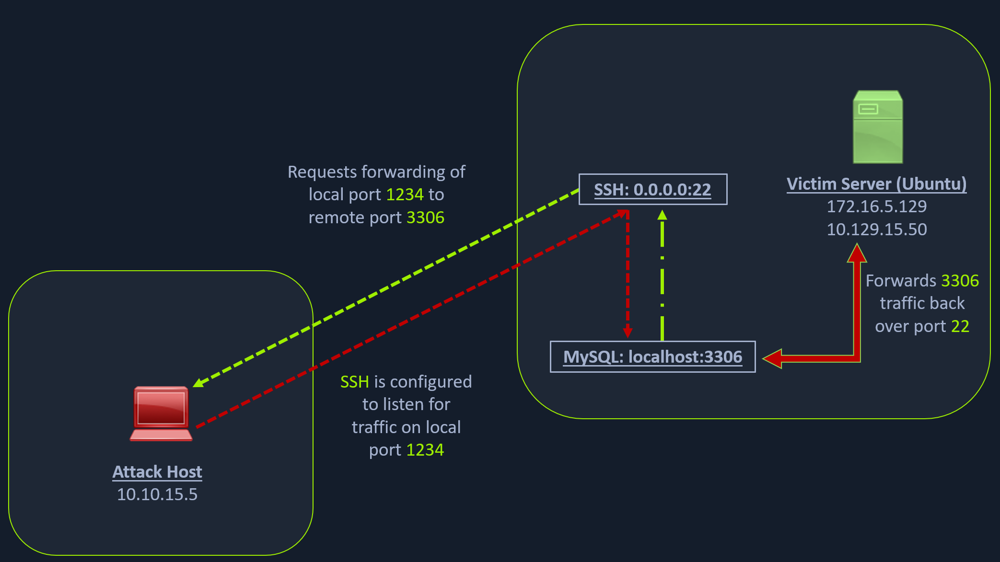
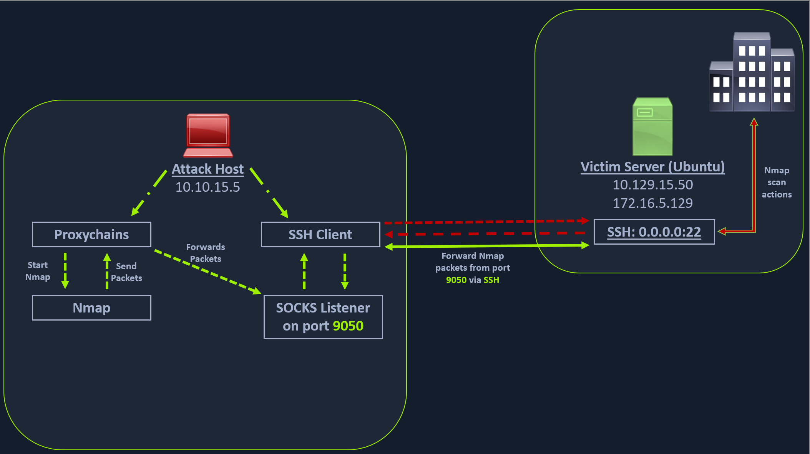

# Dynamic Port Forwarding with SSH and SOCKS Tunneling
## Port Forwarding in Context
**Port forwarding** is a technique that allows us to redirect a communication request from one port to another. Port forwarding uses TCP as the primary communication layer to provide interactive communication for the forwarded port. However, different application layer protocols such as SSH or even SOCKS (non-application layer) can be used to encapsulate the forwarded traffic. This can be effective in bypassing firewalls and using existing services on your compromised host to pivot to other networks.

## SSH Local Port Forwarding


### Scanning the Pivot Target

```sh
masterofblafu@htb[/htb]$ nmap -sT -p22,3306 10.129.202.64

Starting Nmap 7.92 ( https://nmap.org ) at 2022-02-24 12:12 EST
Nmap scan report for 10.129.202.64
Host is up (0.12s latency).

PORT     STATE  SERVICE
22/tcp   open   ssh
3306/tcp closed mysql

Nmap done: 1 IP address (1 host up) scanned in 0.68 seconds
```

### Executing the Local Port Forward

```sh
masterofblafu@htb[/htb]$ ssh -L 1234:localhost:3306 ubuntu@10.129.202.64

ubuntu@10.129.202.64's password: 
Welcome to Ubuntu 20.04.3 LTS (GNU/Linux 5.4.0-91-generic x86_64)

 * Documentation:  https://help.ubuntu.com
 * Management:     https://landscape.canonical.com
 * Support:        https://ubuntu.com/advantage

  System information as of Thu 24 Feb 2022 05:23:20 PM UTC

  System load:             0.0
  Usage of /:              28.4% of 13.72GB
  Memory usage:            34%
  Swap usage:              0%
  Processes:               175
  Users logged in:         1
  IPv4 address for ens192: 10.129.202.64
  IPv6 address for ens192: dead:beef::250:56ff:feb9:52eb
  IPv4 address for ens224: 172.16.5.129

 * Super-optimized for small spaces - read how we shrank the memory
   footprint of MicroK8s to make it the smallest full K8s around.

   https://ubuntu.com/blog/microk8s-memory-optimisation

66 updates can be applied immediately.
45 of these updates are standard security updates.
To see these additional updates run: apt list --upgradable
```

The `-L` command tells the SSH client to request the SSH server to forward all the data we send via the port **1234** to **localhost:3306** on the Ubuntu server. By doing this, we should be able to access the MySQL service locally on port 1234.

### Confirming Port Forward with Netstat

```sh
masterofblafu@htb[/htb]$ netstat -antp | grep 1234

(Not all processes could be identified, non-owned process info
 will not be shown, you would have to be root to see it all.)
tcp        0      0 127.0.0.1:1234          0.0.0.0:*               LISTEN      4034/ssh            
tcp6       0      0 ::1:1234                :::*                    LISTEN      4034/ssh
```

### Confirming Port Forward with Nmap

```sh
masterofblafu@htb[/htb]$ nmap -v -sV -p1234 localhost

Starting Nmap 7.92 ( https://nmap.org ) at 2022-02-24 12:18 EST
NSE: Loaded 45 scripts for scanning.
Initiating Ping Scan at 12:18
Scanning localhost (127.0.0.1) [2 ports]
Completed Ping Scan at 12:18, 0.01s elapsed (1 total hosts)
Initiating Connect Scan at 12:18
Scanning localhost (127.0.0.1) [1 port]
Discovered open port 1234/tcp on 127.0.0.1
Completed Connect Scan at 12:18, 0.01s elapsed (1 total ports)
Initiating Service scan at 12:18
Scanning 1 service on localhost (127.0.0.1)
Completed Service scan at 12:18, 0.12s elapsed (1 service on 1 host)
NSE: Script scanning 127.0.0.1.
Initiating NSE at 12:18
Completed NSE at 12:18, 0.01s elapsed
Initiating NSE at 12:18
Completed NSE at 12:18, 0.00s elapsed
Nmap scan report for localhost (127.0.0.1)
Host is up (0.0080s latency).
Other addresses for localhost (not scanned): ::1

PORT     STATE SERVICE VERSION
1234/tcp open  mysql   MySQL 8.0.28-0ubuntu0.20.04.3

Read data files from: /usr/bin/../share/nmap
Service detection performed. Please report any incorrect results at https://nmap.org/submit/ .
Nmap done: 1 IP address (1 host up) scanned in 1.18 seconds
```

### Forwarding Multiple Ports

```sh
masterofblafu@htb[/htb]$ ssh -L 1234:localhost:3306 -L 8080:localhost:80 ubuntu@10.129.202.64
```

## Dynamic Port Forwarding
Unlike the previous scenario where we knew which port to access, in many scenarios, we don't know which services lie on the other side of the network. We cannot perform a nmap scan directly from our attack host because it does not have routes to the target network. To do this, we will have to perform **dynamic port forwarding** and **pivot** our network packets via the Ubuntu server. We can do this by starting a **SOCKS listener** on our local host (personal attack host or Pwnbox) and then configure SSH to forward that traffic via SSH to the target network after connecting to the target host.

This is called **SSH tunneling over SOCKS proxy**. **SOCKS** stands for **Socket Secure**, a protocol that helps communicate with servers where you have firewall restrictions in place. Unlike most cases where you would initiate a connection to connect to a service, in the case of SOCKS, the initial traffic is generated by a SOCKS client, which connects to the SOCKS server controlled by the user (here is the attack host) who wants to access a service on the client-side. Once the connection is established, network traffic can be routed through the SOCKS server on behalf of the connected client.

One more benefit of using SOCKS proxy for pivoting and forwarding data is that SOCKS proxies can pivot via creating a route to an external server from **NAT networks**. SOCKS proxies are currently of two types: **SOCKS4** and **SOCKS5**. **SOCKS4** doesn't provide any authentication and UDP support, whereas **SOCKS5** does provide that. 



### Enabling Dynamic Port Forwarding with SSH

```sh
masterofblafu@htb[/htb]$ ssh -D 9050 ubuntu@10.129.202.64
```

The `-D` argument requests the SSH server to enable dynamic port forwarding. Once we have this enabled, we will require a tool that can route any tool's packets over the port `9050`. We can do this using the tool `proxychains`, which is capable of redirecting TCP connections through **TOR**, **SOCKS**, and **HTTP/HTTPS** proxy servers and also allows us to chain multiple proxy servers together. Using proxychains, we can hide the IP address of the requesting host as well since the receiving host will only see the IP of the pivot host. 

### Checking /etc/proxychains.conf
To inform proxychains that we must use port 9050, we must modify the proxychains configuration file located at /etc/proxychains.conf. We can add socks4 127.0.0.1 9050 to the last line if it is not already there.

```sh
masterofblafu@htb[/htb]$ tail -4 /etc/proxychains.conf

# meanwile
# defaults set to "tor"
socks4  127.0.0.1 9050
```

### Using Nmap with Proxychains
Now when you start Nmap with proxychains using the below command, it will route all the packets of Nmap to the local port 9050, where our SSH client is listening, which will forward all the packets over SSH to the 172.16.5.0/23 network.

```sh
masterofblafu@htb[/htb]$ proxychains nmap -v -sn 172.16.5.1-200

ProxyChains-3.1 (http://proxychains.sf.net)

Starting Nmap 7.92 ( https://nmap.org ) at 2022-02-24 12:30 EST
Initiating Ping Scan at 12:30
Scanning 10 hosts [2 ports/host]
|S-chain|-<>-127.0.0.1:9050-<><>-172.16.5.2:80-<--timeout
|S-chain|-<>-127.0.0.1:9050-<><>-172.16.5.5:80-<><>-OK
|S-chain|-<>-127.0.0.1:9050-<><>-172.16.5.6:80-<--timeout
RTTVAR has grown to over 2.3 seconds, decreasing to 2.0

<SNIP>
```

This part of packing all your Nmap data using proxychains and forwarding it to a remote server is called **SOCKS tunneling.** One more important note to remember here is that we can only perform a **full TCP connect scan** over proxychains. The reason for this is that proxychains cannot understand partial packets. If you send partial packets like half connect scans, it will return incorrect results. We also need to make sure we are aware of the fact that host-alive checks may not work against Windows targets because the Windows Defender firewall blocks ICMP requests (traditional pings) by default.

### Enumerating the Windows Target through Proxychains

```sh
masterofblafu@htb[/htb]$ proxychains nmap -v -Pn -sT 172.16.5.19

ProxyChains-3.1 (http://proxychains.sf.net)
Host discovery disabled (-Pn). All addresses will be marked 'up' and scan times may be slower.
Starting Nmap 7.92 ( https://nmap.org ) at 2022-02-24 12:33 EST
Initiating Parallel DNS resolution of 1 host. at 12:33
Completed Parallel DNS resolution of 1 host. at 12:33, 0.15s elapsed
Initiating Connect Scan at 12:33
Scanning 172.16.5.19 [1000 ports]
|S-chain|-<>-127.0.0.1:9050-<><>-172.16.5.19:1720-<--timeout
|S-chain|-<>-127.0.0.1:9050-<><>-172.16.5.19-<--timeout
|S-chain|-<>-127.0.0.1:9050-<><>-172.16.5.19:587-<--timeout
|S-chain|-<>-127.0.0.1:9050-<><>-172.16.5.19:445-<><>-OK
Discovered open port 445/tcp on 172.16.5.19
|S-chain|-<>-127.0.0.1:9050-<><>-172.16.5.19:8080-<--timeout
|S-chain|-<>-127.0.0.1:9050-<><>-172.16.5.19:23-<--timeout
|S-chain|-<>-127.0.0.1:9050-<><>-172.16.5.19:135-<><>-OK
Discovered open port 135/tcp on 172.16.5.19
|S-chain|-<>-127.0.0.1:9050-<><>-172.16.5.19:110-<--timeout
|S-chain|-<>-127.0.0.1:9050-<><>-172.16.5.19:21-<--timeout
|S-chain|-<>-127.0.0.1:9050-<><>-172.16.5.19:554-<--timeout
|S-chain|-<>-127.0.0.1:9050-<><>-1172.16.5.19:25-<--timeout
|S-chain|-<>-127.0.0.1:9050-<><>-172.16.5.19:5900-<--timeout
|S-chain|-<>-127.0.0.1:9050-<><>-172.16.5.19:1025-<--timeout
|S-chain|-<>-127.0.0.1:9050-<><>-172.16.5.19:143-<--timeout
|S-chain|-<>-127.0.0.1:9050-<><>-172.16.5.19:199-<--timeout
|S-chain|-<>-127.0.0.1:9050-<><>-172.16.5.19:993-<--timeout
|S-chain|-<>-127.0.0.1:9050-<><>-172.16.5.19:995-<--timeout
|S-chain|-<>-127.0.0.1:9050-<><>-172.16.5.19:3389-<><>-OK
Discovered open port 3389/tcp on 172.16.5.19
|S-chain|-<>-127.0.0.1:9050-<><>-172.16.5.19:443-<--timeout
|S-chain|-<>-127.0.0.1:9050-<><>-172.16.5.19:80-<--timeout
|S-chain|-<>-127.0.0.1:9050-<><>-172.16.5.19:113-<--timeout
|S-chain|-<>-127.0.0.1:9050-<><>-172.16.5.19:8888-<--timeout
|S-chain|-<>-127.0.0.1:9050-<><>-172.16.5.19:139-<><>-OK
Discovered open port 139/tcp on 172.16.5.19
```

### Using Metasploit with Proxychains
We can also open Metasploit using proxychains and send all associated traffic through the proxy we have established.

```sh
masterofblafu@htb[/htb]$ proxychains msfconsole

ProxyChains-3.1 (http://proxychains.sf.net)
                                                  

     .~+P``````-o+:.                                      -o+:.
.+oooyysyyssyyssyddh++os-`````                        ```````````````          `
+++++++++++++++++++++++sydhyoyso/:.````...`...-///::+ohhyosyyosyy/+om++:ooo///o
++++///////~~~~///////++++++++++++++++ooyysoyysosso+++++++++++++++++++///oossosy
--.`                 .-.-...-////+++++++++++++++////////~~//////++++++++++++///
                                `...............`              `...-/////...`


                                  .::::::::::-.                     .::::::-
                                .hmMMMMMMMMMMNddds\...//M\\.../hddddmMMMMMMNo
                                 :Nm-/NMMMMMMMMMMMMM$$NMMMMm&&MMMMMMMMMMMMMMy
                                 .sm/`-yMMMMMMMMMMMM$$MMMMMN&&MMMMMMMMMMMMMh`
                                  -Nd`  :MMMMMMMMMMM$$MMMMMN&&MMMMMMMMMMMMh`
                                   -Nh` .yMMMMMMMMMM$$MMMMMN&&MMMMMMMMMMMm/
    `oo/``-hd:  ``                 .sNd  :MMMMMMMMMM$$MMMMMN&&MMMMMMMMMMm/
      .yNmMMh//+syysso-``````       -mh` :MMMMMMMMMM$$MMMMMN&&MMMMMMMMMMd
    .shMMMMN//dmNMMMMMMMMMMMMs`     `:```-o++++oooo+:/ooooo+:+o+++oooo++/
    `///omh//dMMMMMMMMMMMMMMMN/:::::/+ooso--/ydh//+s+/ossssso:--syN///os:
          /MMMMMMMMMMMMMMMMMMd.     `/++-.-yy/...osydh/-+oo:-`o//...oyodh+
          -hMMmssddd+:dMMmNMMh.     `.-=mmk.//^^^\\.^^`:++:^^o://^^^\\`::
          .sMMmo.    -dMd--:mN/`           ||--X--||          ||--X--||
........../yddy/:...+hmo-...hdd:............\\=v=//............\\=v=//.........
================================================================================
=====================+--------------------------------+=========================
=====================| Session one died of dysentery. |=========================
=====================+--------------------------------+=========================
================================================================================

                     Press ENTER to size up the situation

%%%%%%%%%%%%%%%%%%%%%%%%%%%%%%%%%%%%%%%%%%%%%%%%%%%%%%%%%%%%%%%%%%%%%%%%%%%%%%%%
%%%%%%%%%%%%%%%%%%%%%%%%%%%%% Date: April 25, 1848 %%%%%%%%%%%%%%%%%%%%%%%%%%%%%
%%%%%%%%%%%%%%%%%%%%%%%%%% Weather: It's always cool in the lab %%%%%%%%%%%%%%%%
%%%%%%%%%%%%%%%%%%%%%%%%%%% Health: Overweight %%%%%%%%%%%%%%%%%%%%%%%%%%%%%%%%%
%%%%%%%%%%%%%%%%%%%%%%%%% Caffeine: 12975 mg %%%%%%%%%%%%%%%%%%%%%%%%%%%%%%%%%%%
%%%%%%%%%%%%%%%%%%%%%%%%%%% Hacked: All the things %%%%%%%%%%%%%%%%%%%%%%%%%%%%%
%%%%%%%%%%%%%%%%%%%%%%%%%%%%%%%%%%%%%%%%%%%%%%%%%%%%%%%%%%%%%%%%%%%%%%%%%%%%%%%%

                        Press SPACE BAR to continue


       =[ metasploit v6.1.27-dev                          ]
+ -- --=[ 2196 exploits - 1162 auxiliary - 400 post       ]
+ -- --=[ 596 payloads - 45 encoders - 10 nops            ]
+ -- --=[ 9 evasion                                       ]

Metasploit tip: Adapter names can be used for IP params 
set LHOST eth0

msf6 >
```

### Using xfreerdp with Proxychains

```sh
masterofblafu@htb[/htb]$ proxychains xfreerdp /v:172.16.5.19 /u:victor /p:pass@123

ProxyChains-3.1 (http://proxychains.sf.net)
[13:02:42:481] [4829:4830] [INFO][com.freerdp.core] - freerdp_connect:freerdp_set_last_error_ex resetting error state
[13:02:42:482] [4829:4830] [INFO][com.freerdp.client.common.cmdline] - loading channelEx rdpdr
[13:02:42:482] [4829:4830] [INFO][com.freerdp.client.common.cmdline] - loading channelEx rdpsnd
[13:02:42:482] [4829:4830] [INFO][com.freerdp.client.common.cmdline] - loading channelEx cliprdr
```

The xfreerdp command will require an RDP certificate to be accepted before successfully establishing the session. After accepting it, we should have an RDP session, pivoting via the Ubuntu server.

## Questions
SSH to **10.129.2.168** (ACADEMY-PIVOTING-LINUXPIV), with user `ubuntu` and password `HTB_@cademy_stdnt!`
1. You have successfully captured credentials to an external facing Web Server. Connect to the target and list the network interfaces. How many network interfaces does the target web server have? (Including the loopback interface) **Answer: 3**
   - SSH into the target and check network interfaces:
        ```sh
        $ ssh ubuntu@10.129.2.168
        ubuntu@WEB01:~$ ip a
        1: lo: <LOOPBACK,UP,LOWER_UP> mtu 65536 qdisc noqueue state UNKNOWN group default qlen 1000
            link/loopback 00:00:00:00:00:00 brd 00:00:00:00:00:00
            inet 127.0.0.1/8 scope host lo
            valid_lft forever preferred_lft forever
            inet6 ::1/128 scope host 
            valid_lft forever preferred_lft forever
        2: ens192: <BROADCAST,MULTICAST,UP,LOWER_UP> mtu 1500 qdisc mq state UP group default qlen 1000
            link/ether 00:50:56:b0:c8:70 brd ff:ff:ff:ff:ff:ff
            inet 10.129.2.168/16 brd 10.129.255.255 scope global dynamic ens192
            valid_lft 3421sec preferred_lft 3421sec
            inet6 dead:beef::250:56ff:feb0:c870/64 scope global dynamic mngtmpaddr 
            valid_lft 86400sec preferred_lft 14400sec
            inet6 fe80::250:56ff:feb0:c870/64 scope link 
            valid_lft forever preferred_lft forever
        3: ens224: <BROADCAST,MULTICAST,UP,LOWER_UP> mtu 1500 qdisc mq state UP group default qlen 1000
            link/ether 00:50:56:b0:4e:0f brd ff:ff:ff:ff:ff:ff
            inet 172.16.5.129/23 brd 172.16.5.255 scope global ens224
            valid_lft forever preferred_lft forever
            inet6 fe80::250:56ff:feb0:4e0f/64 scope link 
            valid_lft forever preferred_lft forever
        ```
2. Apply the concepts taught in this section to pivot to the internal network and use RDP (credentials: victor:pass@123) to take control of the Windows target on 172.16.5.19. Submit the contents of Flag.txt located on the Desktop. **Answer: N1c3Piv0t**