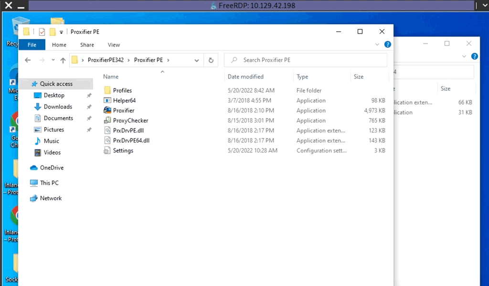

# RDP and SOCKS Tunneling via SOCKSOverRDP
There are often times during an assessment when we may be limited to a Windows network and may not be able to use SSH for pivoting. We would have to use tools available for Windows operating systems in these cases. [SocksOverRDP](https://github.com/nccgroup/SocksOverRDP) is an example of a tool that uses `Dynamic Virtual Channels` (`DVC`) from the Remote Desktop Service feature of Windows. DVC is responsible for tunneling packets over the RDP connection. Some examples of usage of this feature would be clipboard data transfer and audio sharing. However, this feature can also be used to tunnel arbitrary packets over the network. We can use `SocksOverRDP` to tunnel our custom packets and then proxy through it. We will use the tool [Proxifier](https://www.proxifier.com/) as our proxy server.

We can start by downloading the appropriate binaries to our attack host to perform this attack. We will need:
- [SocksOverRDP x64 Binaries](https://github.com/nccgroup/SocksOverRDP/releases)
- [Proxifier Portable Binary](https://www.proxifier.com/download/#win-tab) (We can look for `ProxifierPE.zip`)

We can then connect to the target using xfreerdp and copy the SocksOverRDPx64.zip file to the target. 

## Loading SocksOverRDP.dll using regsvr32.exe
From the Windows target, we will then need to load the SocksOverRDP.dll using regsvr32.exe (**Remember to run cmd as Administrator**).

```cmd
C:\Users\htb-student\Desktop\SocksOverRDP-x64> regsvr32.exe SocksOverRDP-Plugin.dll
```

Now we can connect to 172.16.5.19 over RDP using `mstsc.exe`, and we should receive a prompt that the SocksOverRDP plugin is enabled, and it will listen on `127.0.0.1:1080`. We can use the credentials `victor:pass@123` to connect to 172.16.5.19.

We will need to transfer SocksOverRDPx64.zip or just the SocksOverRDP-Server.exe to 172.16.5.19. We can then start SocksOverRDP-Server.exe with Admin privileges.

### Confirming the SOCKS Listener is Started
When we go back to our foothold target and check with Netstat, we should see our SOCKS listener started on 127.0.0.1:1080.

```cmd
C:\Users\htb-student\Desktop\SocksOverRDP-x64> netstat -antb | findstr 1080

  TCP    127.0.0.1:1080         0.0.0.0:0              LISTENING
```

### Configuring Proxifier
After starting our listener, we can transfer Proxifier portable to the Windows 10 target (on the 10.129.x.x network), and configure it to forward all our packets to 127.0.0.1:1080. Proxifier will route traffic through the given host and port. 



With Proxifier configured and running, we can start mstsc.exe, and it will use Proxifier to pivot all our traffic via 127.0.0.1:1080, which will tunnel it over RDP to 172.16.5.19, which will then route it to 172.16.6.155 using SocksOverRDP-server.exe.

### RDP Performance Considerations
When interacting with our RDP sessions on an engagement, we may find ourselves contending with slow performance in a given session, especially if we are managing multiple RDP sessions simultaneously. If this is the case, we can access the `Experience` tab in mstsc.exe and set `Performance` to `Modem`.

## Questions
RDP to **10.129.7.185** with user `htb-student` and password `HTB_@cademy_stdnt!`
1. Use the concepts taught in this section to pivot to the Windows server at 172.16.6.155 (jason:WellConnected123!). Submit the contents of Flag.txt on Jason's Desktop. **Answer: H0pping@roundwithRDP!**
   - Some how the traffic routing through the Proxifier does not reach 172.16.6.155
   - Alternate way is to RDP into 10.129.7.185 and then manually RDP to 172.16.6.155 using `PIVOT-SERVER\jason` account and read the flag.