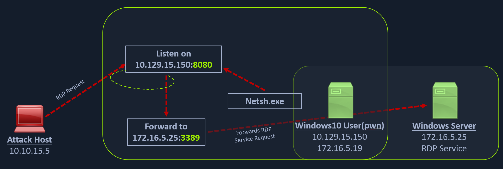

# Port Forwarding with Windows Netsh
[Netsh](https://docs.microsoft.com/en-us/windows-server/networking/technologies/netsh/netsh-contexts) is a Windows command-line tool that can help with the network configuration of a particular Windows system. Here are just some of the networking related tasks we can use Netsh for:

- Finding routes
- Viewing the firewall configuration
- Adding proxies
- Creating port forwarding rules

Let's take an example of the below scenario where our compromised host is a Windows 10-based IT admin's workstation (`10.129.15.150`, `172.16.5.19`).



## Using Netsh.exe to Port Forward
We can use netsh.exe to forward all data received on a specific port (say 8080) to a remote host on a remote port. This can be performed using the below command.

```cmd
C:\Windows\system32> netsh.exe interface portproxy add v4tov4 listenport=8080 listenaddress=10.129.15.150 connectport=3389 connectaddress=172.16.5.25
```

## Verifying Port Forward

```cmd
C:\Windows\system32> netsh.exe interface portproxy show v4tov4

Listen on ipv4:             Connect to ipv4:

Address         Port        Address         Port
--------------- ----------  --------------- ----------
10.129.15.150   8080        172.16.5.25     3389
```

## Connecting to the Internal Host through the Port Forward
After configuring the `portproxy` on our Windows-based pivot host, we will try to connect to the `8080` port of this host from our attack host using xfreerdp. Once a request is sent from our attack host, the Windows host will route our traffic according to the proxy settings configured by `netsh.exe`.

## Questions
RDP to **10.129.42.198** (ACADEMY-PIVOTING-WIN10PIV), with user `htb-student` and password `HTB_@cademy_stdnt!`
1. Using the concepts covered in this section, take control of the DC (172.16.5.19) using xfreerdp by pivoting through the Windows 10 target host. Submit the approved contact's name found inside the "VendorContacts.txt" file located in the "Approved Vendors" folder on Victor's desktop (victor's credentials: victor:pass@123) . (Format: 1 space, not case-sensitive) **Answer: Jim Flipflop**
   - `$ xfreerdp /v:10.129.5.221 /u:htb-student /p:HTB_@cademy_stdnt!` → Remote to the pivot host
   - On the pivot host, forward port `10.129.5.221:8080` to `172.16.5.19:3389` (use an elevated cmd session):
        ```cmd
        C:\Windows\system32>netsh.exe interface portproxy add v4tov4 listenport=8080 listenaddress=10.129.5.221 connectport=3389 connectaddress=172.16.5.19


        C:\Windows\system32>netsh.exe interface portproxy show v4tov4

        Listen on ipv4:             Connect to ipv4:

        Address         Port        Address         Port
        --------------- ----------  --------------- ----------
        10.129.5.221    8080        172.16.5.19     3389
        ```
   - `$ xfreerdp /v:10.129.5.221:8080 /u:victor /p:pass@123` → Remote to the DC through the pivot host and read the flag at `C:\Users\victor\Desktop\Approved Vendors\VendorContacts`