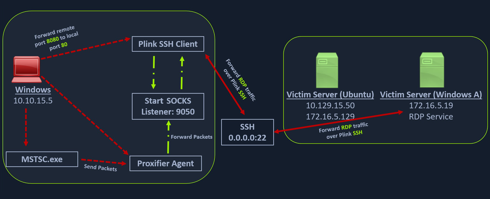

# SSH for Windows: plink.exe
Plink, short for PuTTY Link, is a Windows command-line SSH tool that comes as a part of the PuTTY package when installed. Similar to SSH, Plink can also be used to create dynamic port forwards and SOCKS proxies. 

## Getting To Know Plink



### Using plink.exe
The Windows attack host starts a plink.exe process with the below command-line arguments to start a dynamic port forward over the Ubuntu server. This starts an SSH session between the Windows attack host and the Ubuntu server, and then plink starts listening on port 9050.

```cmd
plink -ssh -D 9050 ubuntu@10.129.15.50
```

Another Windows-based tool called [Proxifier](https://www.proxifier.com/) can be used to start a SOCKS tunnel via the SSH session we created. Proxifier is a Windows tool that creates a tunneled network for desktop client applications and allows it to operate through a SOCKS or HTTPS proxy and allows for proxy chaining. It is possible to create a profile where we can provide the configuration for our SOCKS server started by Plink on port 9050.

After configuring the SOCKS server for `127.0.0.1` and port 9050, we can directly start `mstsc.exe` to start an RDP session with a Windows target that allows RDP connections.

Traffic flow:

```
[mstsc.exe] → [Proxifier] → [Plink SOCKS] → [SSH Tunnel] → [Ubuntu Pivot] → [Windows Target RDP]
Windows RDP     Proxy        Local :9050     Encrypted      SSH Server      172.16.5.19:3389
Client          Client                       Connection
```

## Questions
1. Attempt to use Plink from a Windows-based attack host. Set up a proxy connection and RDP to the Windows target (172.16.5.19) with "victor:pass@123" on the internal network. When finished, submit "I tried Plink" as the answer. **Answer: I tried Plink**
   - Establish plink tunnel:
        ```cmd
        # Create SOCKS tunnel through Ubuntu pivot
        plink -ssh -D 9050 ubuntu@10.129.202.64

        # Enter password when prompted
        ubuntu@10.129.202.64's password: HTB_@cademy_stdnt!
        ```
   - Configure Proxifier:
        ```
        1. Open Proxifier
        2. Profile → Proxy Servers → Add
            - Address: 127.0.0.1
            - Port: 9050
            - Type: SOCKS4
        3. Profile → Proxification Rules → Add
            - Applications: mstsc.exe
            - Target Hosts: 172.16.5.19
            - Action: Proxy 127.0.0.1:9050
        ```
   - RDP connection:
        ```cmd
        # Launch Remote Desktop
        mstsc.exe

        # Connection details:
        Computer: 172.16.5.19
        User name: victor
        Password: pass@123
        ```