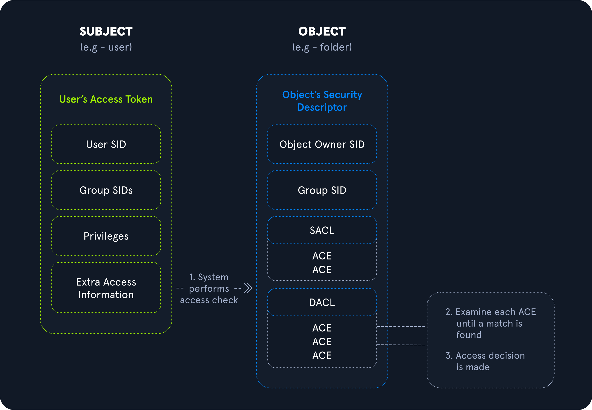

# Windows Privileges Overview
Privileges in Windows are rights that an account can be granted to perform a variety of operations on the local system such as managing services, loading drivers, shutting down the system, debugging an application, and more.

## Windows Authorization Process
Security principals are anything that can be authenticated by the Windows operating system, including user and computer accounts, processes that run in the security context or another user/computer account, or the security groups that these accounts belong to. Every single security principal is identified by a unique [Security Identifier (SID)](https://docs.microsoft.com/en-us/troubleshoot/windows-server/identity/security-identifiers-in-windows). When a security principal is created, it is assigned a SID which remains assigned to that principal for its lifetime.

During the Windows authorization and access control process, he user's access token (including their user SID, SIDs for any groups they are members of, privilege list, and other access information) is compared against [Access Control Entries (ACEs)](https://docs.microsoft.com/en-us/windows/win32/secauthz/access-control-entries) within the object's [security descriptor](https://docs.microsoft.com/en-us/windows/win32/secauthz/security-descriptors) (which contains security information about a securable object such as access rights (discussed below) granted to users or groups). Once this comparison is complete, a decision is made to either grant or deny access. 

## Rights and Privileges in Windows
Windows contains many groups that grant their members powerful rights and privileges. Many of these can be abused to escalate privileges on both a standalone Windows host and within an Active Directory domain environment. 

Some of these groups are listed below.

<table class="bg-neutral-800 text-primary w-full"><thead class="text-left rounded-t-lg"><tr class="border-t-neutral-600 first:border-t-0 border-t"><th class="bg-neutral-700 first:rounded-tl-lg last:rounded-tr-lg p-4"><strong class="font-bold">Group</strong></th><th class="bg-neutral-700 first:rounded-tl-lg last:rounded-tr-lg p-4"><strong class="font-bold">Description</strong></th></tr></thead><tbody class="font-mono text-sm"><tr class="border-t-neutral-600 first:border-t-0 border-t"><td class="p-4">Default Administrators</td><td class="p-4">Domain Admins and Enterprise Admins are "super" groups.</td></tr><tr class="border-t-neutral-600 first:border-t-0 border-t"><td class="p-4">Server Operators</td><td class="p-4">Members can modify services, access SMB shares, and backup files.</td></tr><tr class="border-t-neutral-600 first:border-t-0 border-t"><td class="p-4">Backup Operators</td><td class="p-4">Members are allowed to log onto DCs locally and should be considered Domain Admins. They can make shadow copies of the SAM/NTDS database, read the registry remotely, and access the file system on the DC via SMB. This group is sometimes added to the local Backup Operators group on non-DCs.</td></tr><tr class="border-t-neutral-600 first:border-t-0 border-t"><td class="p-4">Print Operators</td><td class="p-4">Members can log on to DCs locally and "trick" Windows into loading a malicious driver.</td></tr><tr class="border-t-neutral-600 first:border-t-0 border-t"><td class="p-4">Hyper-V Administrators</td><td class="p-4">If there are virtual DCs, any virtualization admins, such as members of Hyper-V Administrators, should be considered Domain Admins.</td></tr><tr class="border-t-neutral-600 first:border-t-0 border-t"><td class="p-4">Account Operators</td><td class="p-4">Members can modify non-protected accounts and groups in the domain.</td></tr><tr class="border-t-neutral-600 first:border-t-0 border-t"><td class="p-4">Remote Desktop Users</td><td class="p-4">Members are not given any useful permissions by default but are often granted additional rights such as <code dir="ltr" class="bg-neutral-700 mb-6 text-blue-250 py-1 px-1.5">Allow Login Through Remote Desktop Services</code> and can move laterally using the RDP protocol.</td></tr><tr class="border-t-neutral-600 first:border-t-0 border-t"><td class="p-4">Remote Management Users</td><td class="p-4">Members can log on to DCs with PSRemoting (This group is sometimes added to the local remote management group on non-DCs).</td></tr><tr class="border-t-neutral-600 first:border-t-0 border-t"><td class="p-4">Group Policy Creator Owners</td><td class="p-4">Members can create new GPOs but would need to be delegated additional permissions to link GPOs to a container such as a domain or OU.</td></tr><tr class="border-t-neutral-600 first:border-t-0 border-t"><td class="p-4">Schema Admins</td><td class="p-4">Members can modify the Active Directory schema structure and backdoor any to-be-created Group/GPO by adding a compromised account to the default object ACL.</td></tr><tr class="border-t-neutral-600 first:border-t-0 border-t"><td class="p-4">DNS Admins</td><td class="p-4">Members can load a DLL on a DC, but do not have the necessary permissions to restart the DNS server. They can load a malicious DLL and wait for a reboot as a persistence mechanism. Loading a DLL will often result in the service crashing. A more reliable way to exploit this group is to <a href="https://web.archive.org/web/20231115070425/https://cube0x0.github.io/Pocing-Beyond-DA/" rel="nofollow" target="_blank" class="hover:underline text-green-400">create a WPAD record</a>.</td></tr></tbody></table>

## User Rights Assignment
Depending on group membership, and other factors such as privileges assigned via domain and local Group Policy, users can have various rights assigned to their account.

<table class="bg-neutral-800 text-primary w-full"><thead class="text-left rounded-t-lg"><tr class="border-t-neutral-600 first:border-t-0 border-t"><th class="bg-neutral-700 first:rounded-tl-lg last:rounded-tr-lg p-4">Setting <a href="https://docs.microsoft.com/en-us/windows/win32/secauthz/privilege-constants" rel="nofollow" target="_blank" class="hover:underline text-green-400">Constant</a></th><th class="bg-neutral-700 first:rounded-tl-lg last:rounded-tr-lg p-4">Setting Name</th><th class="bg-neutral-700 first:rounded-tl-lg last:rounded-tr-lg p-4">Standard Assignment</th><th class="bg-neutral-700 first:rounded-tl-lg last:rounded-tr-lg p-4">Description</th></tr></thead><tbody class="font-mono text-sm"><tr class="border-t-neutral-600 first:border-t-0 border-t"><td class="p-4">SeNetworkLogonRight</td><td class="p-4"><a href="https://docs.microsoft.com/en-us/windows/security/threat-protection/security-policy-settings/access-this-computer-from-the-network" rel="nofollow" target="_blank" class="hover:underline text-green-400">Access this computer from the network</a></td><td class="p-4">Administrators, Authenticated Users</td><td class="p-4">Determines which users can connect to the device from the network. This is required by network protocols such as SMB, NetBIOS, CIFS, and COM+.</td></tr><tr class="border-t-neutral-600 first:border-t-0 border-t"><td class="p-4">SeRemoteInteractiveLogonRight</td><td class="p-4"><a href="https://docs.microsoft.com/en-us/windows/security/threat-protection/security-policy-settings/allow-log-on-through-remote-desktop-services" rel="nofollow" target="_blank" class="hover:underline text-green-400">Allow log on through Remote Desktop Services</a></td><td class="p-4">Administrators, Remote Desktop Users</td><td class="p-4">This policy setting determines which users or groups can access the login screen of a remote device through a Remote Desktop Services connection. A user can establish a Remote Desktop Services connection to a particular server but not be able to log on to the console of that same server.</td></tr><tr class="border-t-neutral-600 first:border-t-0 border-t"><td class="p-4">SeBackupPrivilege</td><td class="p-4"><a href="https://docs.microsoft.com/en-us/windows/security/threat-protection/security-policy-settings/back-up-files-and-directories" rel="nofollow" target="_blank" class="hover:underline text-green-400">Back up files and directories</a></td><td class="p-4">Administrators</td><td class="p-4">This user right determines which users can bypass file and directory, registry, and other persistent object permissions for the purposes of backing up the system.</td></tr><tr class="border-t-neutral-600 first:border-t-0 border-t"><td class="p-4">SeSecurityPrivilege</td><td class="p-4"><a href="https://docs.microsoft.com/en-us/windows/security/threat-protection/security-policy-settings/manage-auditing-and-security-log" rel="nofollow" target="_blank" class="hover:underline text-green-400">Manage auditing and security log</a></td><td class="p-4">Administrators</td><td class="p-4">This policy setting determines which users can specify object access audit options for individual resources such as files, Active Directory objects, and registry keys. These objects specify their system access control lists (SACL). A user assigned this user right can also view and clear the Security log in Event Viewer.</td></tr><tr class="border-t-neutral-600 first:border-t-0 border-t"><td class="p-4">SeTakeOwnershipPrivilege</td><td class="p-4"><a href="https://docs.microsoft.com/en-us/windows/security/threat-protection/security-policy-settings/take-ownership-of-files-or-other-objects" rel="nofollow" target="_blank" class="hover:underline text-green-400">Take ownership of files or other objects</a></td><td class="p-4">Administrators</td><td class="p-4">This policy setting determines which users can take ownership of any securable object in the device, including Active Directory objects, NTFS files and folders, printers, registry keys, services, processes, and threads.</td></tr><tr class="border-t-neutral-600 first:border-t-0 border-t"><td class="p-4">SeDebugPrivilege</td><td class="p-4"><a href="https://docs.microsoft.com/en-us/windows/security/threat-protection/security-policy-settings/debug-programs" rel="nofollow" target="_blank" class="hover:underline text-green-400">Debug programs</a></td><td class="p-4">Administrators</td><td class="p-4">This policy setting determines which users can attach to or open any process, even a process they do not own. Developers who are debugging their applications do not need this user right. Developers who are debugging new system components need this user right. This user right provides access to sensitive and critical operating system components.</td></tr><tr class="border-t-neutral-600 first:border-t-0 border-t"><td class="p-4">SeImpersonatePrivilege</td><td class="p-4"><a href="https://docs.microsoft.com/en-us/windows/security/threat-protection/security-policy-settings/impersonate-a-client-after-authentication" rel="nofollow" target="_blank" class="hover:underline text-green-400">Impersonate a client after authentication</a></td><td class="p-4">Administrators, Local Service, Network Service, Service</td><td class="p-4">This policy setting determines which programs are allowed to impersonate a user or another specified account and act on behalf of the user.</td></tr><tr class="border-t-neutral-600 first:border-t-0 border-t"><td class="p-4">SeLoadDriverPrivilege</td><td class="p-4"><a href="https://docs.microsoft.com/en-us/windows/security/threat-protection/security-policy-settings/load-and-unload-device-drivers" rel="nofollow" target="_blank" class="hover:underline text-green-400">Load and unload device drivers</a></td><td class="p-4">Administrators</td><td class="p-4">This policy setting determines which users can dynamically load and unload device drivers. This user right is not required if a signed driver for the new hardware already exists in the driver.cab file on the device. Device drivers run as highly privileged code.</td></tr><tr class="border-t-neutral-600 first:border-t-0 border-t"><td class="p-4">SeRestorePrivilege</td><td class="p-4"><a href="https://docs.microsoft.com/en-us/windows/security/threat-protection/security-policy-settings/restore-files-and-directories" rel="nofollow" target="_blank" class="hover:underline text-green-400">Restore files and directories</a></td><td class="p-4">Administrators</td><td class="p-4">This security setting determines which users can bypass file, directory, registry, and other persistent object permissions when they restore backed up files and directories. It determines which users can set valid security principals as the owner of an object.</td></tr><tr class="border-t-neutral-600 first:border-t-0 border-t"><td class="p-4">SeTcbPrivilege</td><td class="p-4"><a href="https://learn.microsoft.com/en-us/previous-versions/windows/it-pro/windows-10/security/threat-protection/security-policy-settings/act-as-part-of-the-operating-system" rel="nofollow" target="_blank" class="hover:underline text-green-400">Act as part of the operating system</a></td><td class="p-4">Administrators, Local Service, Network Service, Service</td><td class="p-4">This security setting determines whether a process can assume the identity of any user and, through this, obtain access to resources that the targeted user is permitted to access (impersonation). This may be assigned to antivirus or backup tools that need the ability to access all system files for scans or backups. This privilege should be reserved for service accounts requiring this access for legitimate activities.</td></tr></tbody></table>

Typing the command `whoami /priv` will give you a listing of all user rights assigned to your current user. **Some rights are only available to administrative users and can only be listed/leveraged when running an elevated cmd or PowerShell session.**